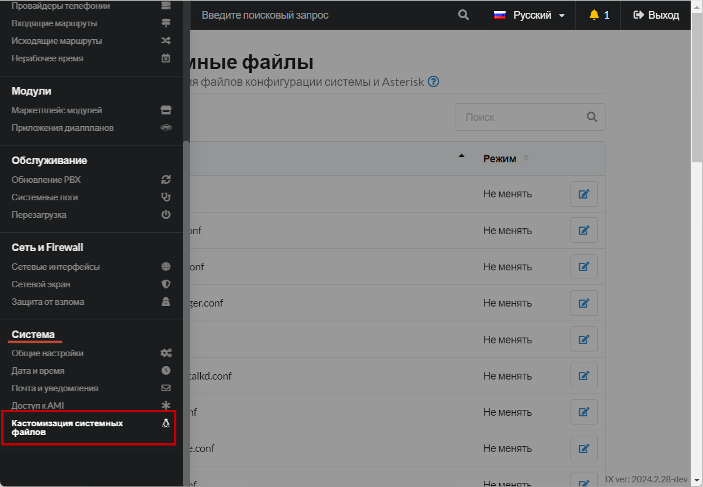
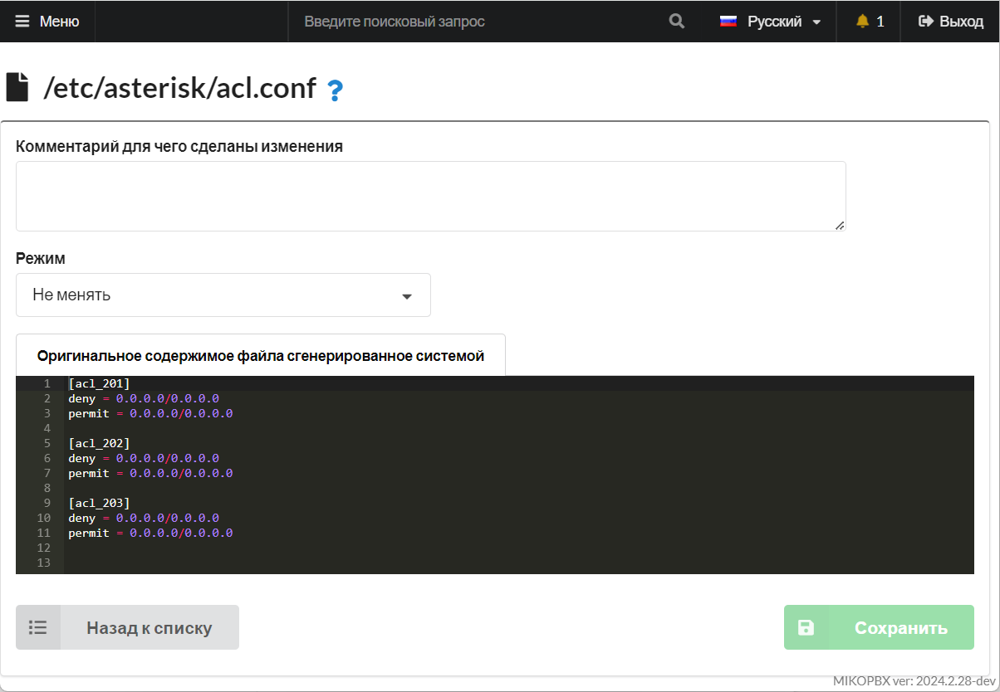

# Кастомизация системных файлов

Раздел кастомизации системных файлов находится в **Система -> Кастомизация системных файлов**:

<figure><figcaption></figcaption></figure>

Данный раздел позволяет производить кастомизацию системных файлов конфигурации системы и Asterisk. Мы рекомендуем использовать возможности данного раздела только **опытным** администраторам Asterisk. В MikoPBX есть возможность из web-интерфейса изменять следующие конфигурационные файлы:

| **Наименование файла** | Описание                                                                                                                                                                                                                                                                                                                                                                                                                                                                                                                                       |
| ---------------------- | ---------------------------------------------------------------------------------------------------------------------------------------------------------------------------------------------------------------------------------------------------------------------------------------------------------------------------------------------------------------------------------------------------------------------------------------------------------------------------------------------------------------------------------------------- |
| asterisk.conf          | <p><strong>Общие</strong> (глобальные) настройки Asterisk.<br>В файле конфигурации asterisk.conf Вы определяете следующее:<br><br>-Местоположение, права доступа и владельца сокета, которые используется для подключения удаленной консоли управления сервером.<br><br>Местоположение различных директорий, используемых сервером Asterisk для определения местоположения файлов конфигурации, библиотек, скриптов и место, где будут создаваться лог фалы.<br><br>Параметры командной строки запуска сервера, используемые по умолчанию.</p> |
| cel.conf               | Лог событий канала. В отличии от CDR, сохраняет все события имевшие место в канале.                                                                                                                                                                                                                                                                                                                                                                                                                                                            |
| extensions.conf        | План набора (**dialplan**) Asterisk. В нем определяется обработка и маршрутизация входящих и исходящих вызовов. Этот файл управляет поведением всех соединений, проходящих через Вашу АТС.                                                                                                                                                                                                                                                                                                                                                     |
| features.conf          | В файле назначаются пользовательские коды и опции абонентских функций Asterisk, такие как: перевод вызова (transfer); перехват вызова (pickup); запись по требованию (record on demand); таймауты набора и переадресации (digit timeout); паркинг (park) и др.                                                                                                                                                                                                                                                                                 |
| http.conf              | Встроенный http сервер Asterisk                                                                                                                                                                                                                                                                                                                                                                                                                                                                                                                |
| iax.conf               | В файле Вы описываете ваши соединения по протоколу IAX.                                                                                                                                                                                                                                                                                                                                                                                                                                                                                        |
| indications.conf       | Национализация тональных сигналов                                                                                                                                                                                                                                                                                                                                                                                                                                                                                                              |
| logger.conf            | Настройка логов Asterisk. В данном файле настраивается логирование событий Asterisk в файлы, консоль и syslog linux. Для применения настроек выполните команду «**logger reload**» в консоли (CLI) Asterisk.                                                                                                                                                                                                                                                                                                                                   |
| manager.conf           | Настройка интерфейса AMI (Asterisk Manager Interface)                                                                                                                                                                                                                                                                                                                                                                                                                                                                                          |
| modules.conf           | Параметры загрузки модулей Asterisk.                                                                                                                                                                                                                                                                                                                                                                                                                                                                                                           |
| musiconhold.conf       | Параметры музыки на удержание в IVR                                                                                                                                                                                                                                                                                                                                                                                                                                                                                                            |
| queues.conf            | Очередь входящих вызовов Asterisk. Подробное описание стратегии вызовов. Penalty, timeout, member и все доступные параметры.                                                                                                                                                                                                                                                                                                                                                                                                                   |
| rtp.conf               | Глобальные настройки RTP - медиа-портов и протокола                                                                                                                                                                                                                                                                                                                                                                                                                                                                                            |
| sip.conf               | Файл отвечает за настройку внутренних и внешних каналов SIP в Asterisk.                                                                                                                                                                                                                                                                                                                                                                                                                                                                        |
| voicemail.conf         | Настройки уведомлений по E-mail                                                                                                                                                                                                                                                                                                                                                                                                                                                                                                                |
| jail.local             | Настройки Fail2ban                                                                                                                                                                                                                                                                                                                                                                                                                                                                                                                             |
| msmtp.conf             | Настройки SMTP-клиента                                                                                                                                                                                                                                                                                                                                                                                                                                                                                                                         |

Для редактирования конфигурационного файла воспользуйтесь кнопкой:  .png>)

Перед Вами будет открыта форма редактирования конфигурационного файла:

<figure><figcaption></figcaption></figure>

Выберите один из четырех возможных вариантов редактирования:

* «**Не менять**» - не позволяет вносить изменения в файл, только чтение файла.
* «**Добавлять в конец файла**» - в конец выбранного конфигурационного файла будут добавлены (**рекомендуемый**).
* «**Заменять полностью**» - все Ваши изменения переопределят конфигурационный файл.
* Режим "**Script"** в кастомизации системных файлов MikoPBX позволяет администраторам добавлять пользовательские скрипты или команды непосредственно в конфигурационные файлы. Этот режим подходит для опытных пользователей, которым необходимо выполнять определенные действия, автоматизировать задачи или изменять поведение системы динамически, что увеличивает гибкость настройки АТС. Использовать его следует с осторожностью, чтобы избежать сбоев в работе системы.

### sip.conf <a href="#sipconf" id="sipconf"></a>

Добавить параметры к существующей секции возможно используя конструкцию (+):

```php
[general](+)
allowtransfer=yes
```

Описать новую секцию можно в произвольной форме, единственное, не следует допускать повторения имен секций: Пример:

```php
[user2_pingtel]
type=friend
username=user2_pingtel
secret=blah
host=dynamic
qualify=1000 ; Рассматриваем клиента как неработающего,
; если ответ от него идет более 1 сек.
callgroup=1,3-4 ; Клиент является членом групп вызовов: 1, 3 и 4
pickupgroup=1,3-4 ; Мы можем совершать "pick-up" вызовов, нажатием *8,
; для вызовов из групп 1, 3 и 4
defaultip=192.168.0.60
disallow=all
allow=ulaw
allow=alaw
allow=g729
```

### extensions.conf <a href="#extensionsconf" id="extensionsconf"></a>


**Дорабатывайте dialplan с осторожностью - есть большая вероятность нарушить работу АТС!**


Существует возможность перехватить выполнения dialplan. Для этого необходимо описать custom контексты. На текущий момент можно перехватить выполнения в следующих контекстах:

* **internal-originate-custom** - контекст используется при звонках из панели телефонии для 1С
* **\<ID-ПРОВАЙДЕРА>-incoming-custom** - контекст предназначен для обработки **входящих** вызовов через провайдера
* **\<ID-ПРОВАЙДЕРА>-outgoing-custom** - контекст предназначен для обработки **исходящих** вызовов через провайдера
* **all\_peers-custom** - контекст используется при прямом исходящем звонке с телефона
* **outgoing-custom** - контекст используется при наборе внешнего номера, ДО выбора исходящего маршрута
* **add-trim-prefix-clid-custom** - этот контекст используется при обработке входящих вызовов, лучшим образом подходит для нормализации входящего номера телефона, добавить / отсечь префикс
* **internal-users-custom** - в этом контексте обрабатываются вызовы на внутренние номера
* **public-direct-dial-custom** - контекст обработки входящих вызовов БЕЗ авторизации

Пример контекста:

```php
[outgoing-custom]
exten => _X!,1,NoOp(--- hangup - ${CHANNEL} ---)
	same => n,return
```

**Обязательно** следует в конце вызывать метод «**return**».


Некоторые примеры использования custom-контекстов:

* [Звонок через определённого провайдера](../../faq/outbound-routing/a-call-through-a-specific-provider.md)
* <mark style="color:red;">Настройка исходящего AOH для сотрудника</mark>

