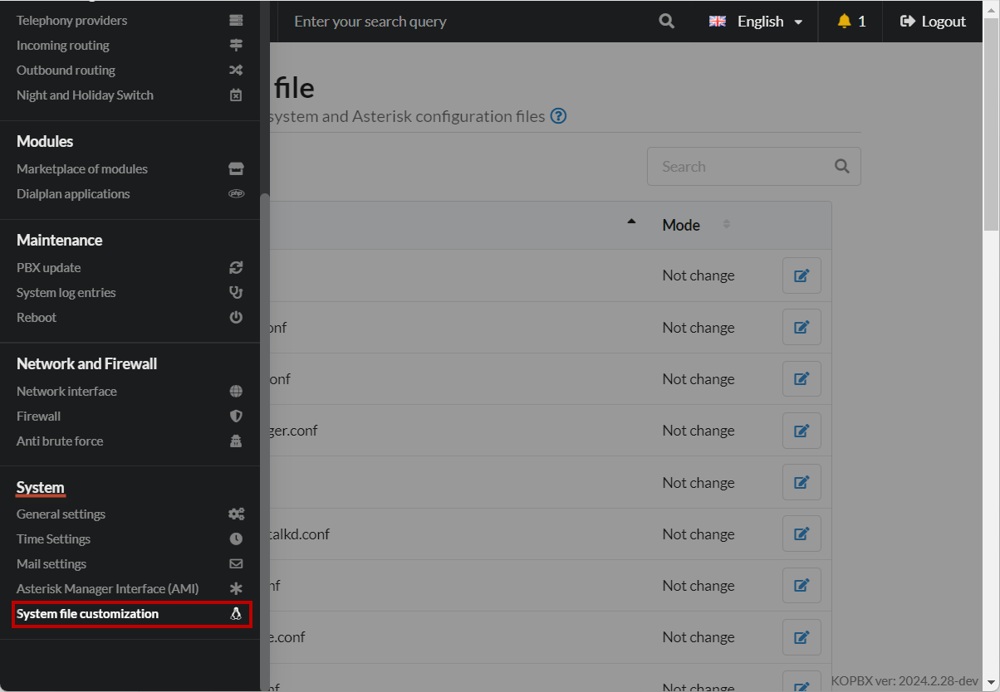
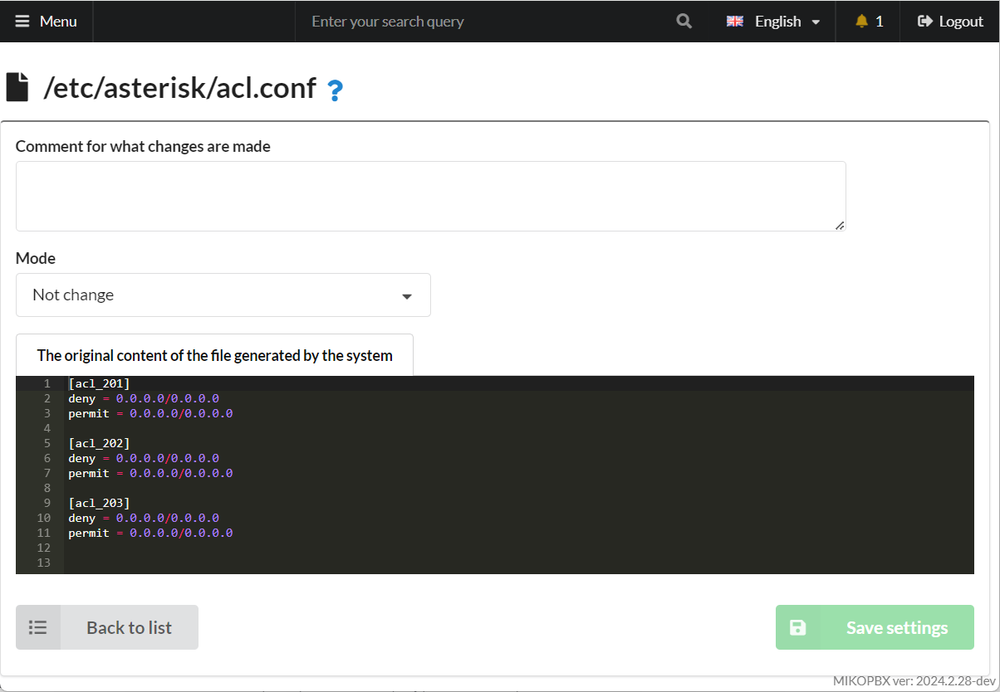

# System files customisation

The system file customization section can be found under **System -> System file customization**:

<figure><figcaption><p>System file customization section</p></figcaption></figure>

This section allows for customization of system and Asterisk configuration files. We recommend using this section only for **experienced** Asterisk administrators. MikoPBX provides the ability to modify the following configuration files via the web interface:

| **File Name**    | Description                                                                                                                                                                                                                                                                                                                                                                                                                                                                                |
| ---------------- | ------------------------------------------------------------------------------------------------------------------------------------------------------------------------------------------------------------------------------------------------------------------------------------------------------------------------------------------------------------------------------------------------------------------------------------------------------------------------------------------ |
| asterisk.conf    | <p><strong>General</strong> (global) settings of Asterisk.<br>In the asterisk.conf configuration file, you define the following:<br><br>- The location, permissions, and owner of the socket used to connect the remote management console to the server.<br><br>The location of various directories used by the Asterisk server to determine where configuration files, libraries, scripts, and logs will be created.<br><br>Default command-line parameters for starting the server.</p> |
| cel.conf         | Channel Event Logging. Unlike CDR, it logs all events that occur in the channel.                                                                                                                                                                                                                                                                                                                                                                                                           |
| extensions.conf  | The Asterisk **dialplan**. It defines how incoming and outgoing calls are handled and routed. This file controls the behavior of all connections passing through your PBX.                                                                                                                                                                                                                                                                                                                 |
| features.conf    | The file defines custom codes and options for Asterisk functions like call transfer, call pickup, on-demand recording, digit timeout, call parking, etc.                                                                                                                                                                                                                                                                                                                                   |
| http.conf        | Built-in Asterisk HTTP server configuration.                                                                                                                                                                                                                                                                                                                                                                                                                                               |
| iax.conf         | Describes your IAX protocol connections.                                                                                                                                                                                                                                                                                                                                                                                                                                                   |
| indications.conf | Nationalization of tonal signals.                                                                                                                                                                                                                                                                                                                                                                                                                                                          |
| logger.conf      | Asterisk logging configuration. This file configures logging of Asterisk events to files, console, and Linux syslog. To apply settings, run the command "**logger reload**" in the Asterisk console (CLI).                                                                                                                                                                                                                                                                                 |
| manager.conf     | AMI (Asterisk Manager Interface) configuration.                                                                                                                                                                                                                                                                                                                                                                                                                                            |
| modules.conf     | Asterisk module loading parameters.                                                                                                                                                                                                                                                                                                                                                                                                                                                        |
| musiconhold.conf | Music-on-hold settings in IVR.                                                                                                                                                                                                                                                                                                                                                                                                                                                             |
| queues.conf      | Asterisk queue settings. Detailed description of call strategies, penalty, timeout, member, and other available parameters.                                                                                                                                                                                                                                                                                                                                                                |
| rtp.conf         | Global RTP settings – media ports and protocol.                                                                                                                                                                                                                                                                                                                                                                                                                                            |
| sip.conf         | Configures internal and external SIP channels in Asterisk.                                                                                                                                                                                                                                                                                                                                                                                                                                 |
| voicemail.conf   | Email notification settings.                                                                                                                                                                                                                                                                                                                                                                                                                                                               |
| jail.local       | Fail2ban settings.                                                                                                                                                                                                                                                                                                                                                                                                                                                                         |
| msmtp.conf       | SMTP client settings.                                                                                                                                                                                                                                                                                                                                                                                                                                                                      |

To edit a configuration file, use the button:  .png>)

You will be presented with the configuration file editing form:

<figure><figcaption></figcaption></figure>

Choose one of four editing options:

* "**Not change**" - prevents modifications, read-only mode.
* "**Add to end of file**" - appends content to the end of the selected configuration file (**recommended**).
* "**To replace all**" - your changes will completely overwrite the configuration file.
* **"Script"** mode in MikoPBX system file customization allows administrators to add custom scripts or commands directly into the configuration files. This mode is ideal for advanced users who need to execute specific actions, automate tasks, or modify system behavior dynamically, enhancing the flexibility of the PBX configuration. It should be used with caution to avoid system disruptions.

### Customizing System Files with Scripts <a href="#customizing-system-files-with-scripts" id="customizing-system-files-with-scripts"></a>

In some cases, more complex modifications to system files are required than simply adding text to the end of a configuration file. For instance, you may need to redistribute PJSIP account parameters while retaining the ability to configure the system through the web interface.

We've introduced a new approach to customization, where you can describe a Bash script that will execute each time the system generates a configuration file. This way, integrators can make precise changes to configuration files without developing additional modules.

For example, you can modify the **pjsip.conf** file and change the _max\_contacts_ parameter for all internal numbers, except one.

<figure><figcaption><p>File customization with "Scripts"</p></figcaption></figure>

### sip.conf <a href="#sipconf" id="sipconf"></a>

You can add parameters to an existing section using the (+) syntax:

```php
[user2_pingtel]
type=friend
username=user2_pingtel
secret=blah
host=dynamic
qualify=1000 ; Consider the client unreachable if response time exceeds 1 sec.
callgroup=1,3-4 ; The client is a member of call groups: 1, 3, and 4.
pickupgroup=1,3-4 ; We can "pick up" calls using *8 for calls in groups 1, 3, and 4.
defaultip=192.168.0.60
disallow=all
allow=ulaw
allow=alaw
allow=g729
```

### extensions.conf <a href="#extensionsconf" id="extensionsconf"></a>


**Modify the dialplan with caution – there is a high chance of disrupting the PBX!**


It is possible to intercept the execution of the dialplan by defining custom contexts. Currently, you can intercept executions in the following contexts:

* **internal-originate-custom** - used for calls originating from the telephony panel for 1C.
* **\<PROVIDER-ID>-incoming-custom** - used for handling **incoming** calls from the provider.
* **\<PROVIDER-ID>-outgoing-custom** - used for handling **outgoing** calls via the provider.
* **all\_peers-custom** - used for direct outgoing calls from a phone.
* **outgoing-custom** - used when dialing an external number, **before** selecting an outbound route.
* **add-trim-prefix-clid-custom** - used for handling incoming calls, best suited for normalizing incoming phone numbers by adding/removing a prefix.
* **internal-users-custom** - used for handling calls to internal extensions.
* **public-direct-dial-custom** - used for handling incoming calls **without authentication**.

Example context:

```php
[outgoing-custom]
exten => _X!,1,NoOp(--- hangup - ${CHANNEL} ---)
    same => n,return
```

**Make sure** to call the method "**return**" at the end.


Some examples of using custom contexts:

* [Call through a specific provider](../../faq/outbound-routing/making-calls-through-a-specific-provider.md)
* <mark style="color:red;">Configuring outbound AOH for an employee</mark>

