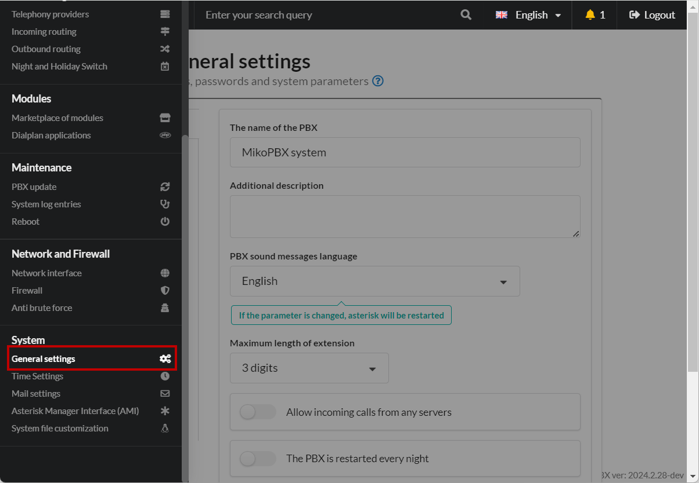
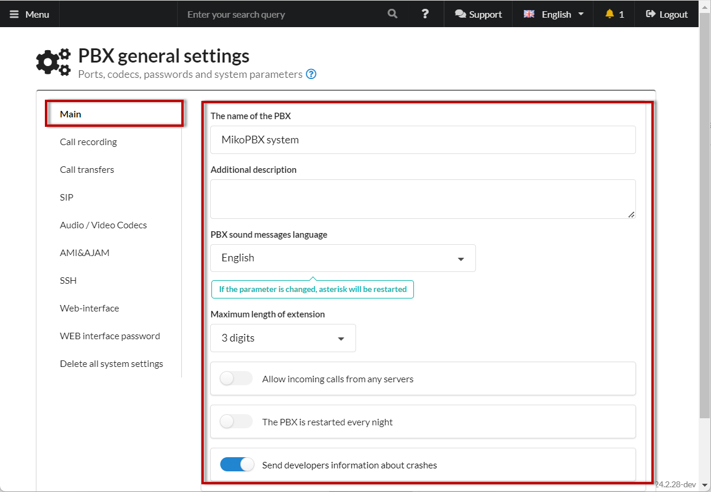
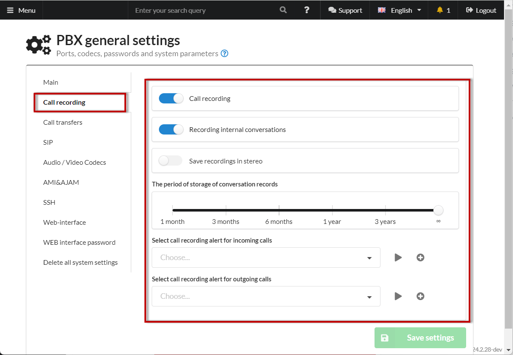
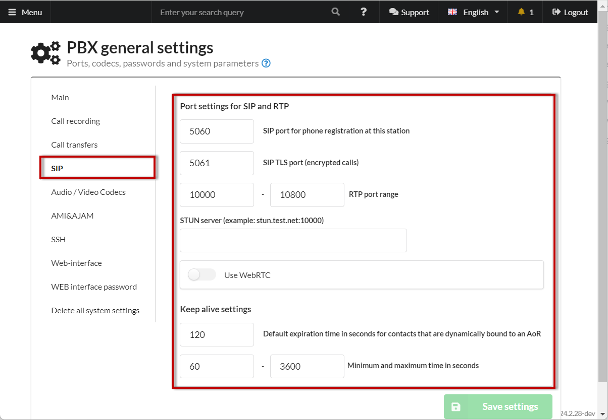
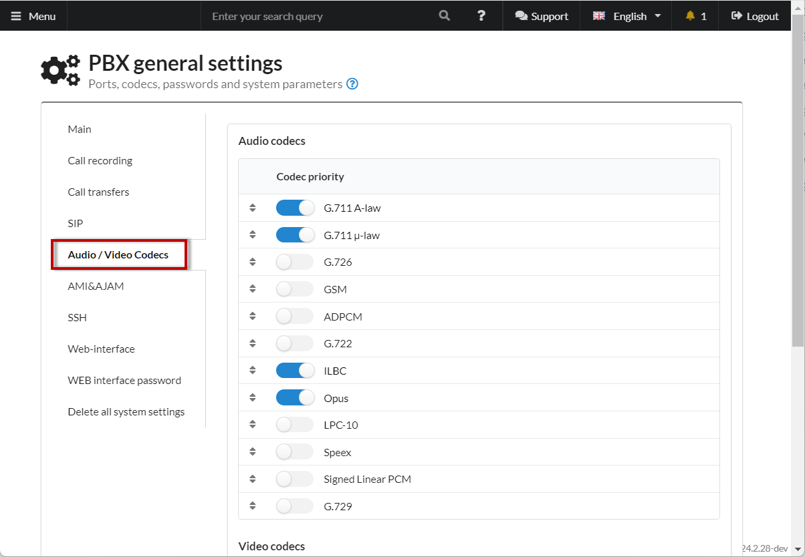
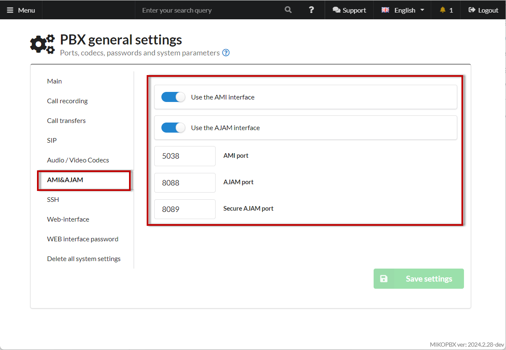
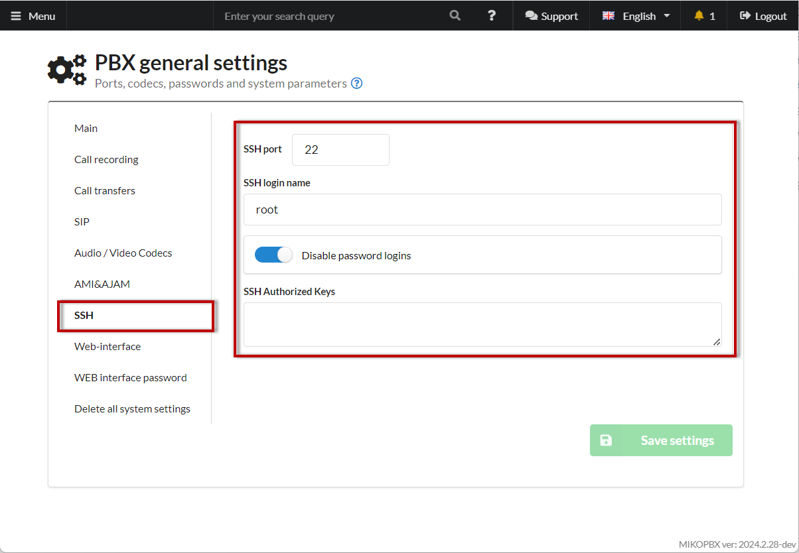
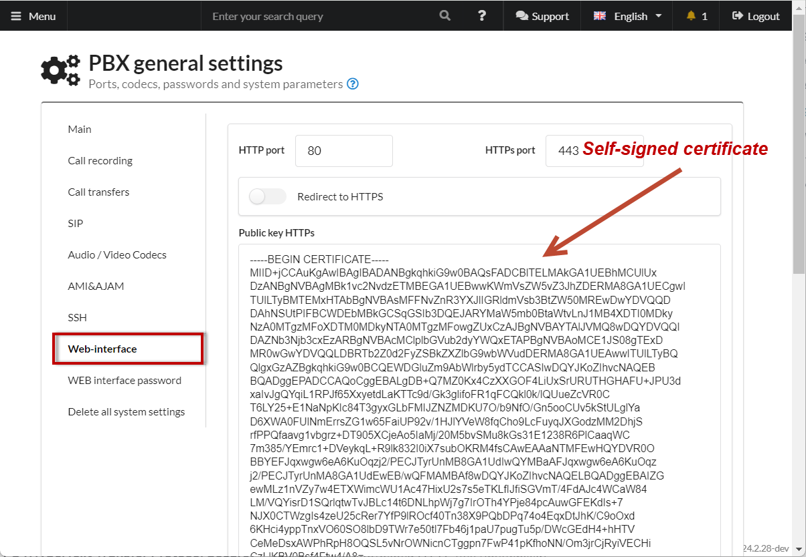
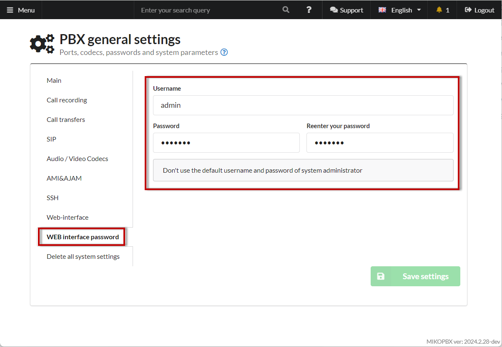
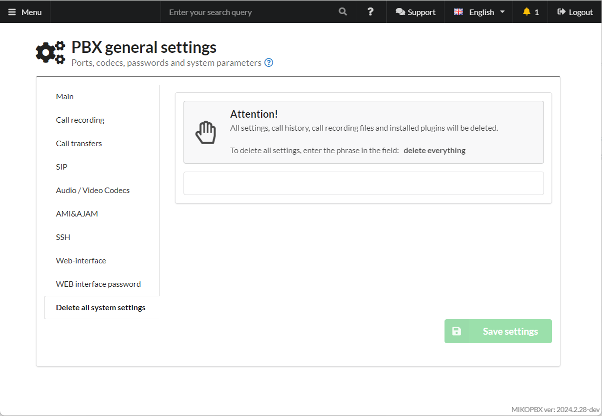

# General settings

This section configures the main system parameters. It is recommended to set these parameters immediately after installing the PBX.

<figure><figcaption><p>General settings</p></figcaption></figure>

## Main Settings <a href="#osnovnye" id="osnovnye"></a>

* **The name of the PBX** - will be displayed on the MikoPBX home page.
* **Additional Description** - visible only to system administrators.
* **PBX sound messages language** - specify the language for voice notifications.
* **Maximum lenght of extension** - **maximum** length of the internal number (for employees).
* **Maximum Timeout Between Digits When Entering Extension**.
* **Allow incoming calls from any servers**
* **The PBX is restarted every night** - restart Asterisk every night.
* **Send developers information about crashes** - when an error occurs, its description will be sent to the developers (requires internet access).

<figure><figcaption><p>Main Settings</p></figcaption></figure>

## Call Recording <a href="#zapis_razgovorov" id="zapis_razgovorov"></a>

* **Call Recording** - enables/disables call recording.
* **Recording internal conversations** - enables/disables internal call recording.
* **Save recordings in stereo** changes the recording mode from **mono** to **stereo**. The recording stream will be split into incoming and outgoing channels and merged into a stereo file.

There is a slider that allows you to choose how long call recordings will be stored.

You can also select an audio file for call recording notifications.

<figure><figcaption><p>Call recording </p></figcaption></figure>

Phone calls are saved in **mp3** format. Here is an example of the final call recording file information:

```php
Input File     : 'mikopbx-1554098285.0_M1gEr1pgrt.mp3'
Channels       : 1
Sample Rate    : 8000
Precision      : 16-bit
Duration       : 00:00:17.64 = 141120 samples ~ 1323 CDDA sectors
File Size      : 70.6k
Bit Rate       : 32.0k
Sample Encoding: MPEG audio (layer I, II or III)
```


Approximately, **1 hour** of conversation takes up **14MB** of disk space.


## Call Transfers <a href="#perevody_vyzovov" id="perevody_vyzovov"></a>

<figure><figcaption></figcaption></figure>

#### Call Park Number <a href="#parkovka_uderzhanie" id="parkovka_uderzhanie"></a>

**Call parking** is a variant of "holding" a customer on the line. It is useful when you need to temporarily disconnect to clarify information. During parking, the customer will hear music.

MikoPBX supports two methods of parking customer calls:

1. To park a customer call, enter **\*2**. The customer's call will be put on hold by MikoPBX, and you will be informed of the parked call slot number. Any employee can pick up the call by dialing the parked call slot number from their phone.
2. In the **Call Transfers** section, assign a **Car Park Number**. When the customer's call is transferred to the parking number, **MikoPBX** will park the call, and you will be informed of the parked call slot number. Any employee can pick up the call by dialing the parked call slot number.

You can set the range of parked call slot numbers in the **Call Transfers** section: **Start Parking Slot** and **End Parking Slot**.

#### Call Transfers <a href="#perevody_vyzovov1" id="perevody_vyzovov1"></a>

MikoPBX offers two types of transfers: **Attended** and **Unattended** (blind).

* With an **attended transfer**, you can speak to the person before transferring the call. The caller will be on hold during this time. Once the person handling the transfer hangs up, the transfer is completed successfully.
* An **unattended transfer** occurs when you transfer the call without first speaking to your colleague. For example, when you receive a second incoming call while already on the phone, you can transfer the new call to a colleague without interrupting your current call.


* By default, the combination for an attended transfer is two pound signs (##).
* By default, the combination for an unattended transfer is two asterisks (\*\*).


#### Timeouts <a href="#tajmauty" id="tajmauty"></a>

The return time for a call if there is no answer after an unattended (blind) transfer is **45 seconds**.

#### Call Pickup <a href="#perexvat_pickup" id="perexvat_pickup"></a>

If your colleague's phone is ringing, you can intercept the call by dialing **\*8**.\
If you don't know your colleague's number, simply dial **\*8**.

## SIP <a href="#sip" id="sip"></a>

<figure><figcaption><p>Sip settings</p></figcaption></figure>

**Session Initiation Protocol (SIP)** is the signaling protocol used by most VoIP phones. You can change the SIP port (default is port 5060) to enhance security. Additionally, some SIP providers require additional parameters, such as **Registration Periods** (the time before the registration expires). Some firewalls close ports after a period of inactivity, which may require shortening the SIP provider's registration timeout. Another reason might be the need for different **registration timeouts** for certain SIP providers. The default values are:

* **SIPMiniExpiry** - minimum registration duration in seconds, default is **60 seconds**.
* **SIPMaxExpiry** - maximum registration duration in seconds, default is **3600 seconds**.

In real-time, the **Transport Protocol (RTP)** defines the standard format for transmitting audio and video over IP networks. **By default**, RTP uses port ranges between **10000 and 10200**. Some routers and firewalls may require the port range to be adjusted. Another reason to adjust the port range is the number of simultaneous calls. Each call uses two RTP ports. This means if there are 200 ports, only 100 simultaneous calls are possible. If your phone system needs to handle more calls at once, you should expand the port range.

* **STUN Server** Address - helps with PBX operation behind NAT, especially when using WebRTC.
* **Use WebRTC** - additional settings will be configured for WebRTC connections. For example, for extension 201, an additional endpoint will be created, accessible via WebRTC using the URL\
  **`sip:201-WS@IP_PBX`**

## Audio/Video Codecs <a href="#audio_video_kodeki" id="audio_video_kodeki"></a>

Configuration of allowed codecs for the PBX.

<figure><figcaption><p>Audio / Video Codecs Section</p></figcaption></figure>

## AMI & AJAM <a href="#ami_ajam" id="ami_ajam"></a>

<figure><figcaption><p>AMI&#x26;AJAM Section</p></figcaption></figure>

**Asterisk Manager Interface (AMI)** is a powerful and convenient API for Asterisk, allowing external programs to control the system. AMI allows external programs to connect to Asterisk via the TCP protocol, execute commands, read results, and receive notifications of real-time events. AMI is often used for integration with business processes and CRM (Customer Relationship Management) systems. AMI listens for connections on a network port (default **TCP port 5038**). Once a client program connects and authenticates, Asterisk responds to requests and sends notifications about changes in subsystem states.

**Asynchronous Javascript Asterisk Manager (AJAM)** is a new technology that allows web browsers or other HTTP-capable applications to directly interact with the Asterisk Manager (AMI) interface via HTTP/HTTPS. By default, port **8088** is used.

## SSH <a href="#ssh" id="ssh"></a>

<figure><figcaption><p>SSH settings </p></figcaption></figure>

**SSH** or **Secure Shell** is an encrypted protocol commonly used for interacting with and remotely managing servers. The SSH server can authenticate users using various algorithms. The most popular method is **password authentication**. It's simple but not very secure. Passwords are transmitted over a secure channel, but they may not be strong enough to resist brute-force attempts. The computing power of modern systems, combined with special scripts, makes brute-forcing very easy.


Default SSH client authorization in MikoPBX:

* Login - **root**
* Password - **admin** (we recommend changing this immediately)


A more secure and reliable authentication method is **SSH keys**. Each key pair consists of a public and private key. The private key is stored on the client side and should not be accessible to anyone else. If the private key is leaked, the attacker will be able to log in to the server unless additional password authentication is set up.


We highly recommend disabling password authentication. To do this, enable the "Disable password authorization" option.


The public key is used to encrypt messages, which can only be decrypted with the private key. This property is used for authentication with key pairs. The public key is uploaded to the remote server where access is needed. It should be added to the special file `~/.ssh/authorized_keys`.

When the client tries to authenticate with this key, the server sends a message encrypted with the public key. If the client can decrypt it and return the correct response, authentication is successful.


How to create an SSH key for authorization and add it to the server? Read more [here](https://firstvds.ru/technology/dobavit-ssh-klyuch).


You can save the **public** SSH key on the PBX in the **SSH Authorized Keys** field. If you have multiple public keys, you can paste them one after the other, separated by a blank line.

## Web Interface <a href="#web-interfejs" id="web-interfejs"></a>

<figure><figcaption></figcaption></figure>

In this subsection, you can increase security by changing the HTTP port (default is port 80) or activating HTTPS mode.

**HTTPS (HyperText Transfer Protocol Secure)** is an extension of HTTP that supports encryption for enhanced security. HTTPS data is transmitted over cryptographic protocols such as SSL or TLS. Unlike HTTP, which uses TCP port 80, HTTPS uses TCP port 443 by default.

* **Redirect to HTTPS** - when attempting to open the web interface via HTTP, the user will be redirected to HTTPS.

When the system starts, the PBX generates its own certificate for HTTPS operation - this is a "self-signed" certificate, not verified by a public "registrar," but it still allows HTTPS operation and encrypts traffic between the PBX and the browser.

## Web Interface Password <a href="#parol_administratora" id="parol_administratora"></a>

<figure><figcaption><p>WEB interface password settings</p></figcaption></figure>

In this subsection, you need to change the WEB interface Login and Password.


Default MikoPBX authorization:

* Login - admin
* Password - admin


## Delete all system settings <a href="#udalenie_nastroek" id="udalenie_nastroek"></a>

<figure><figcaption></figcaption></figure>
