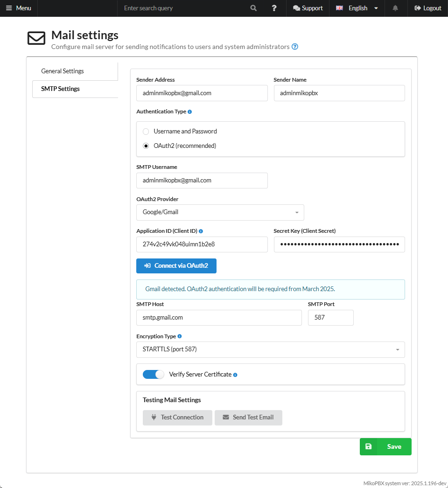

# Mail Settings (New)

The **"Mail and Notifications"** section in MikoPBX allows you to configure sending system notifications via email. Here, administrators specify SMTP server parameters, define events for notifications such as voicemail or system errors, and edit email templates. This section helps keep users and administrators informed about important events in a timely manner, ensuring effective system monitoring.

<figure><figcaption>
<strong>"Mail and notifications"</strong> section in MikoPBX
</figcaption></figure>

## General Settings

<figure><figcaption>
General mail settings
</figcaption></figure>

* **Enable Notifications** - enables/disables **all email notifications**, including voicemail.
* **Send missed call notifications** - enables/disables missed call notifications.
* **Common Email for Missed Call Notifications** - a shared email address for sending notifications about missed external calls (if an employee has no email specified, this shared address is used).
* **Send voicemail notifications** - enables/disables voicemail notifications.
* **Common Email for Voicemail Messages -** a shared email address for sending voicemail notifications (priority: 1. Employee's personal email; 2. The email specified in this field).
* **Send login notifications** - enables/disables system login notifications.
* **Send system notifications** - enables/disables sending of system notifications.
* **System Administrator Email** - the address to which system notifications will be sent.

## SMTP Settings

<figure><figcaption>
General SMTP Settings
</figcaption></figure>

* **Sender Address, Sender Name** - emails will be sent on behalf of this address and name.
* **Authentication Type:**
  * **Username and Password** - classic authentication method when connecting to an SMTP server, using a **mailbox address (login)** and **password**. All parameters (server, port, encryption, login, and password) are entered and stored manually.
  * **OAuth2** - an authentication method in which you **do not store or transmit your mailbox password**. Instead, the application obtains a **temporary access token** from the mail provider (Microsoft 365/Outlook, Google Workspace/Gmail, etc.) and uses it when sending emails via SMTP.

#### **Login and Password Authentication**

<figure><figcaption>
SMTP Settings. Username and Password Authentication Type
</figcaption></figure>

* **SMTP Username**, **SMTP password** - authorization credentials.
* **SMTP Host -** mail server address.
* **SMTP Port** - mail server port.
* Encryption type:
  * **No encryption (port 25)** - classic SMTP connection without channel protection.
  * **STARTTLS (port 587)** - the recommended and most common method for sending mail. The connection starts without encryption, after which the client and server negotiate a transition to a secure channel.
  * **SSL/TLS (port 465)** - SMTP connection with encryption **from the very beginning of the connection**. The channel is secured immediately after the TCP connection is established, without a switching phase.
* **Verify server certificate** - a security setting that determines whether the client will **verify the authenticity of the SMTP server's SSL/TLS certificate** when establishing a secure connection (STARTTLS or SSL/TLS).

#### **OAuth2 Authentication**

<figure><figcaption>
SMTP Settings.OAuth2 Authentication Type
</figcaption></figure>

* **SMTP Username -** authorization credentials.
* **OAuth2 Provider** - the mail service through which OAuth authentication is performed (e.g., Microsoft/Outlook, Google/Gmail).
* **Application ID (Client ID)** - the unique identifier of the application created in the control panel of the selected OAuth provider. Used so the provider knows **which application** is requesting access to the mailbox.
* **Secret Key (Client Secret)** - the confidential application key issued by the OAuth provider. Used together with the Client ID to verify the authenticity of the application when obtaining and refreshing access tokens. Must be kept secret and not shared with third parties.
* **SMTP Host** - mail server address.
* **SMTP Port** - mail server port.
* Encryption type:
  * **No encryption (port 25)** — classic SMTP connection without channel protection.
  * **STARTTLS (port 587)** — the recommended and most common method for sending mail. The connection starts without encryption, after which the client and server negotiate a transition to a secure channel.
  * **SSL/TLS (port 465)** — SMTP connection with encryption **from the very beginning of the connection**. The channel is secured immediately after the TCP connection is established, without a switching phase.
* **Verify Server Certificate** - a security setting that determines whether the client will **verify the authenticity of the SMTP server's SSL/TLS certificate** when establishing a secure connection (STARTTLS or SSL/TLS).

#### How to connect?

Our documentation includes several connection examples for each authentication type. Below you can find links to these instructions.

* Login and password authentication:


[proton.md](proton.md)


* OAuth2 authentication:


[gmail-oauth2.md](gmail-oauth2.md)



[microsoft-oauth2.md](microsoft-oauth2.md)

