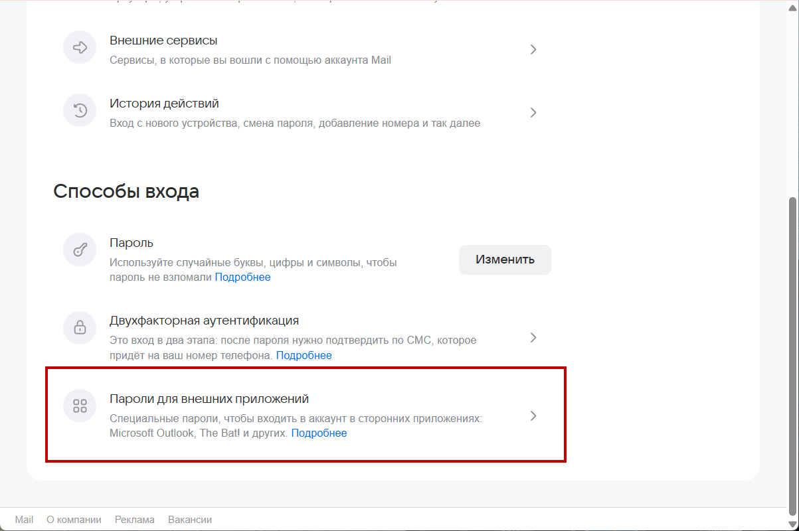
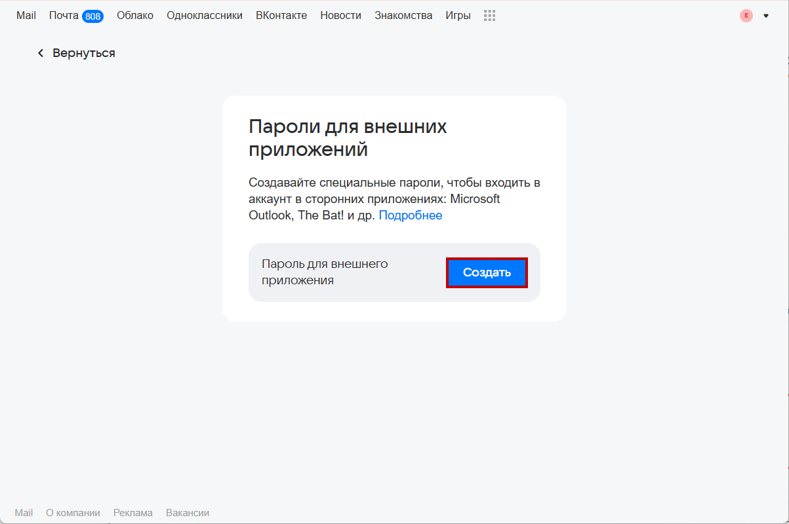
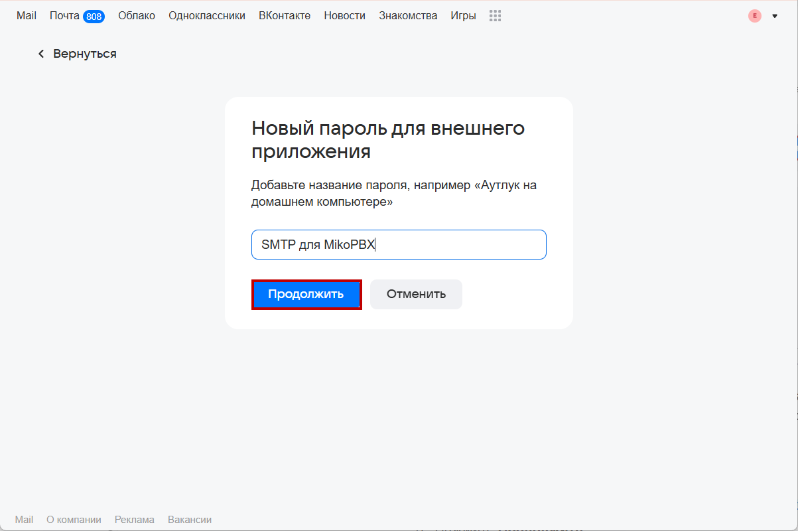
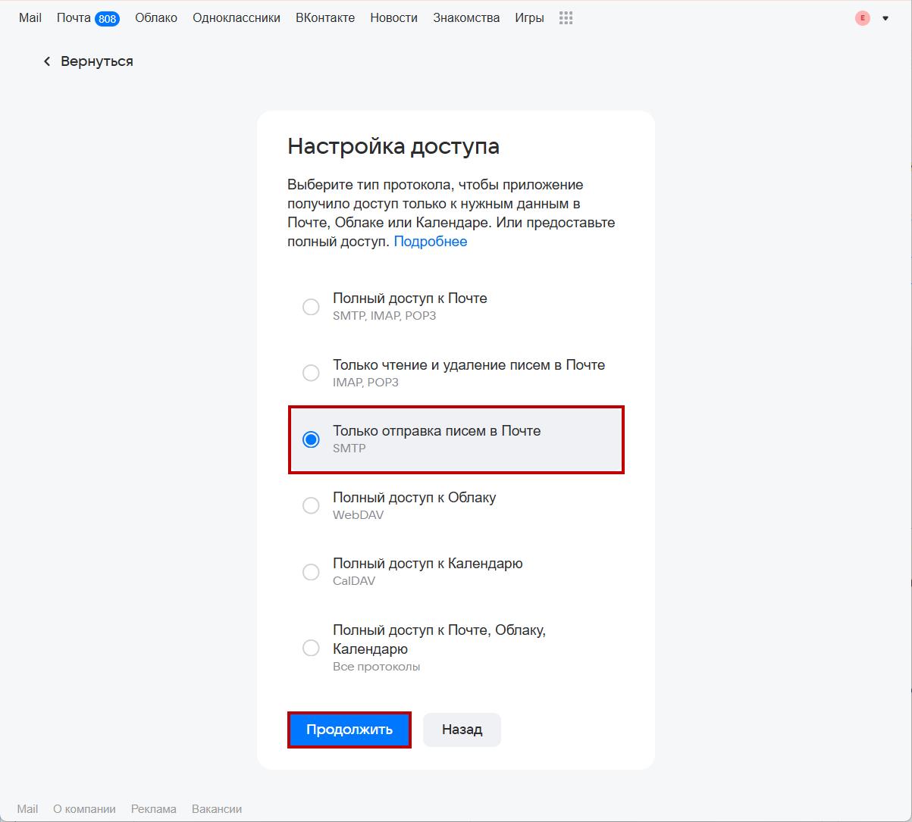
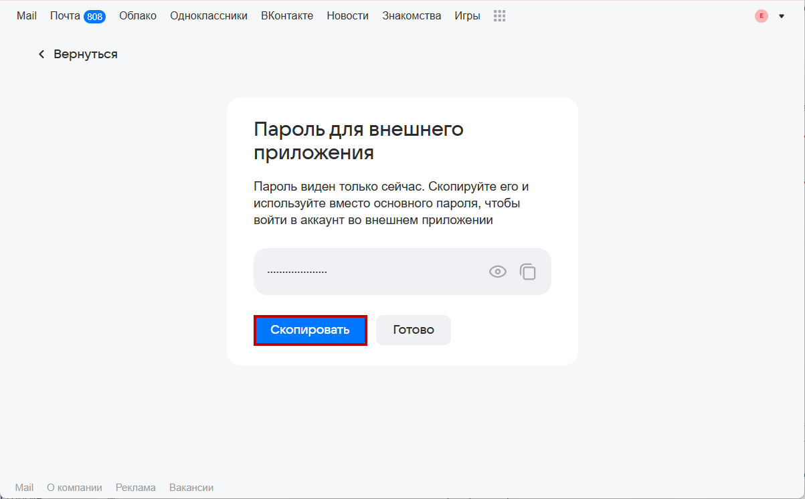
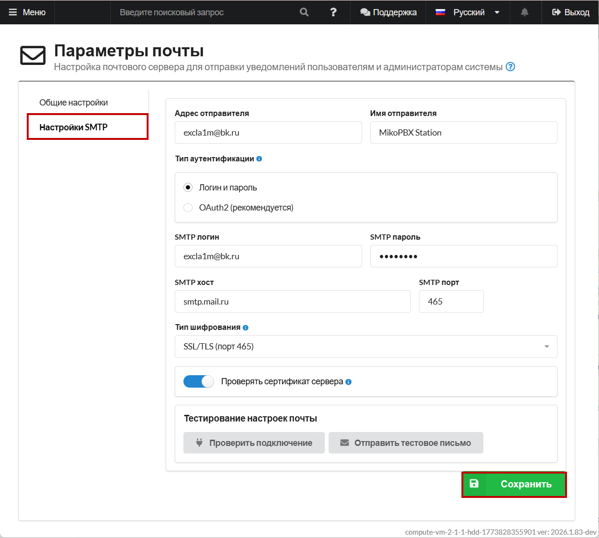
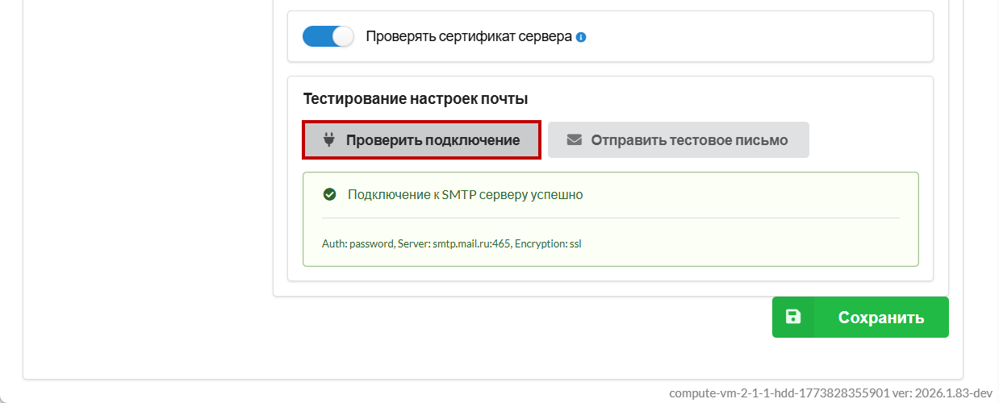

# Настройка Mail.ru (Логин, Пароль)

### Создания пароля для входа

Необходимо создать специальный пароль для входа в почтовую программу. С обычным паролем от почты войти не получится. Чтобы создать такой пароль, к почте должен быть привязан телефон. Перейдите в [Контакты и адреса](https://id.mail.ru/contacts) и проверьте, привязан ли он. Если нет — привяжите.

1. Откройте [почту](https://e.mail.ru/inbox). В левом нижнем углу перейдите в "**Настройки"** → "**Все настройки"** → "**Безопасность**" → "[**Пароли для внешних приложений**](https://account.mail.ru/user/2-step-auth/passwords/)."

<figure><figcaption>
Раздел "Пароли для внешних приложений" в настройках почты Mail.ru
</figcaption></figure>

2. Нажмите **Создать**.

<figure><figcaption>
Кнопка "Создать" для создания нового пароля
</figcaption></figure>

3. На следующей странице добавьте название для создаваемого пароля - это поможет для его идентификации в будущем. В нашем примере - "**SMTP для MikoPBX**".

Нажмите **Продолжить**.

<figure><figcaption>
Создание пароля. Добавление названия
</figcaption></figure>

4. Выберите тип протокола - "**Только отправка писем в Почте**".

Нажмите **Продолжить**.

<figure><figcaption>
Создание пароля. Выбор типа протокола
</figcaption></figure>

5. Скопируйте пароль и введите его, когда будете входить с почтой Mail в почтовую программу.


Пароль будет отображен только один раз! В случае утери необходимо создать новый, повторив все шаги с самого начала.


<figure><figcaption>
Созданный пароль для внешнего приложения
</figcaption></figure>

#### Подключение в MikoPBX 

1. Перейдите в раздел "**Система**" -> "**Почта и уведомления**".

<figure><figcaption>
Раздел "Система" -> "Почта и уведомления".
</figcaption></figure>

2. Перейдите в "**Настройки SMTP**". Заполните все необходимые параметры:

* Адрес отправителя - Ваш адрес электронной почты.
* Имя отправителя - имя от которого отправляется почта.
* Тип аутунтификации - "Логин и пароль".
* SMTP логин - Ваш адрес электронной почты.
* SMTP пароль - созданный пароль для внешнего приложения.
* **SMTP хост** - `smtp.mail.ru`
* **SMTP порт** - 465.
* Тип шифрования - SSL/TLS (порт 465).

Нажмите "**Сохранить**".

<figure><figcaption>
Параметры почты для подключения mail.ru SMTP
</figcaption></figure>

Нажмите "**Проверить подключение**". Вы увидите следующее окно, подтверждающее правильность введенных данных:

<figure><figcaption>
Успешное подключение mail.ru
</figcaption></figure>
