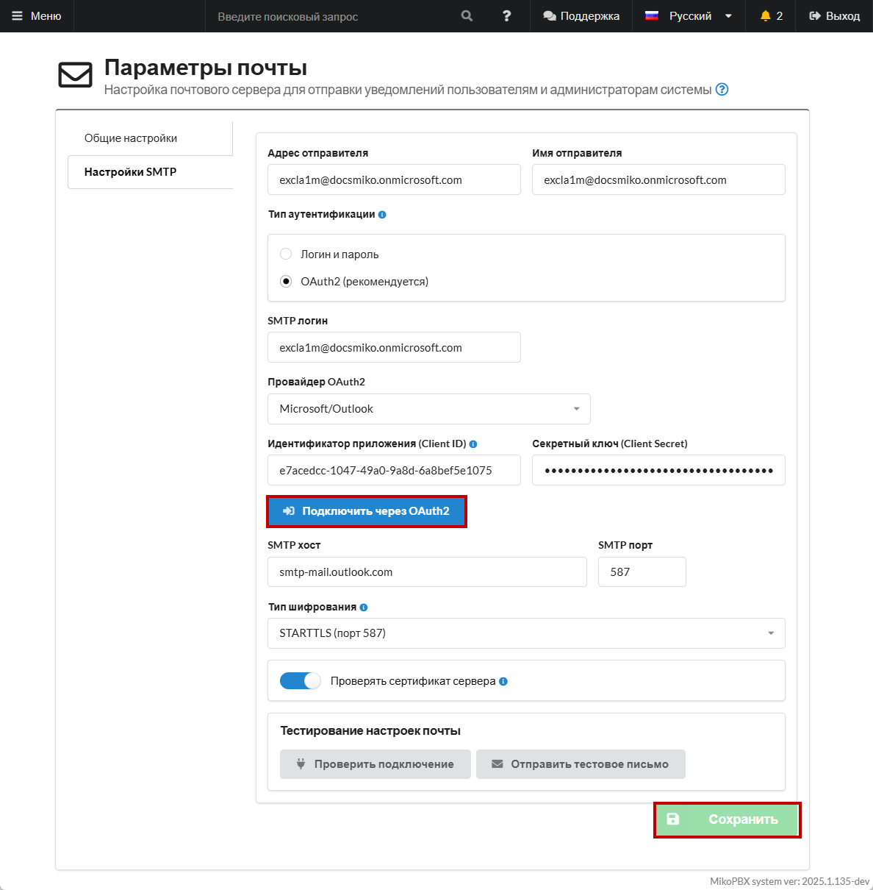
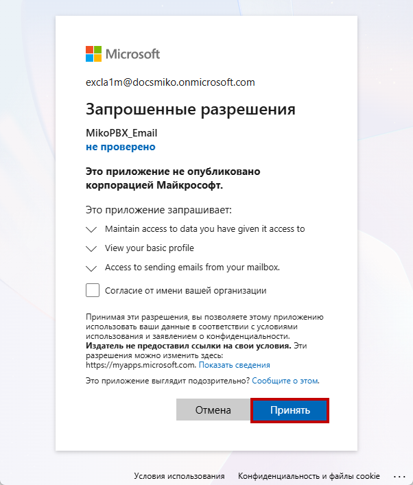
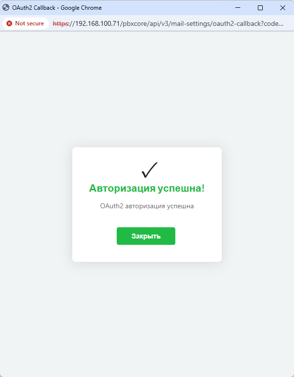

# Настройка Microsoft Outlook (oAuth2)

## Настройки внутри Microsoft Entra

### Регистрация приложения

1. Войдите в [центр администрирования Microsoft Entra.](https://entra.microsoft.com/)

<figure><figcaption><p>Главная страница центра администрирования Microsoft Entra</p></figcaption></figure>

2. Перейдите в раздел "**Entra ID**" -> "**App registrations**". Далее нажмите "**New registration**" для регистрации нового приложения.

<figure><figcaption><p>Регистрация нового приложения</p></figcaption></figure>

3. Выберите следующие параметры для Вашего приложения:

* **Name** - укажите название для Вашего приложения.
* **Supported account types** - выберите параметр "**Accounts in any organizational directory (Any Microsoft Entra ID tenant - Multitenant**)".

<figure><figcaption><p>Параметры приложения</p></figcaption></figure>

4. Укажите Redirect URl:

* **Select a platform** - выберите "**Web**".
* **URl**:

```
https://192.168.100.71/pbxcore/api/v3/mail-settings/oauth2-callback
```

Замените 192.168.100.71 на адрес Вашей MikoPBX.

Далее нажмите "**Register**".

<figure><figcaption><p>Параметры Redirect URl</p></figcaption></figure>

5. Будет созданно приложения. Сохраните client ID, в будущем он понадобится для настройки внутри веб-интерфейса MikoPBX.

<figure><figcaption><p>Главная страница созданного приложения</p></figcaption></figure>

### Выдача разрешений и создание Client secret

1. Из главной страницы приложения перейдите в "**Manage**" -> "**API permissions**".

<figure><figcaption><p>Раздел "API permissions"</p></figcaption></figure>

2. Нажмите "**Add a permission**".

<figure><figcaption><p>Добавление разрешения</p></figcaption></figure>

3. В разделе "**Microsoft Graph**" выберите "**Delegated Permissions**". В поиске введите "**SMTP**". Поставьте галочку напротив "**SMTP.Send**".

<figure><figcaption><p>Выдача разрешения "SMTP.Send"</p></figcaption></figure>

4. Так же в поиске введите "**offline**". Поставьте галочку напротив "**offline\_access**".

Нажмите "**Add permissions**".

<figure><figcaption><p>Выдача разрешения "offline_access"</p></figcaption></figure>

5. Далее перейдите в раздел "**Certificates & secrets**" -> "**Client secrets**". Нажмите "**New client secret**".

<figure><figcaption><p>Создание нового Secret ID</p></figcaption></figure>

6. Задайте необходимые параметры:

* **Description** - произвольное описание.
* **Expires** - срок на который Вы выпускаете этот client secret. Он понадобится нам для аутентификации приложения в MikoPBX.&#x20;


После истечения срока, созданный client secret перестанет функционировать и необходимо будет повторить процесс создания нового ключа и подключения к MikoPBX.



После создания, значение Client Secret будет показано всего один раз. Не забудьте скопировать его в Web-интерфейс MikoPBX.


Нажмите "**Add**".

<figure><figcaption><p>Параметры для создания нового client secret</p></figcaption></figure>

9. Скопируйте "**Value"** (**не SecretID!**). Он понадобится для настройки в веб-интерфейсе MikoPBX.

<figure><figcaption><p>Копирование Value созданного ранее Client secret</p></figcaption></figure>

### Выдача разрешений пользователю

Для корректной работы приложения, Вам необходимо выдать разрешение на использования SMTP протокола для пользователя, чью почту Вы авторизовываете в ходе текущей насройки. Для этого выполните следующие шаги:

1. Перейдите в центр администрирования организации ([ссылка](https://admin.microsoft.com/)).

<figure><figcaption><p>Главная страница Microsoft Admin Center</p></figcaption></figure>

2. Перейдите в раздел "**Users**" -> "**Active Users**". Нажмите на имя пользователя, под учетной записью которого произодится создание приложения.

<figure><figcaption><p>Раздел "Active Users" в Microsoft Admin Center</p></figcaption></figure>

3. В учетной записи, перейдите в раздел "**Mail**" и выберите "**Manage email apps**".

<figure><figcaption><p>Раздел "Mail" в учетной записи пользователя</p></figcaption></figure>

4. Убедитесь, что "**Authenticated SMTP**" разрешен. Сохраните изменения, нажав "**Save changes**".

<figure><figcaption><p>Разрешение Authenticated SMTP для выбранного пользователя</p></figcaption></figure>

## Настройки внутри MikoPBX

1. Перейдите в Web-интерфейс MikoPBX. Далее "**Система**" -> "**Почта и уведомления**" -> "**Настройки SMTP**".

Заполните все необходимые данные:

* **Адрес отправителя, Имя отправителя** - Ваша почта и от какого имени будут отправляться письма.
* **Тип аутентификации** - OAuth2.
* **SMTP логин** - Ваша почта.
* **Провайдер OAuth2** - Microsoft/Outlook.
* **Идентификатор приложения (Client ID), Секретный ключ (Client Secret)** - данные из Microsoft Entra.

Все остальные настройки оставьте по умолчанию. Более подробное описание Вы можете найти в главное статье о параметрах почты ([ссылка](https://docs.mikopbx.com/mikopbx/manual/system/mail-settings-1)).

После этого нажмите "**Сохранить**"!

<figure><figcaption><p>Настройки SMTP в Web-интерфейсе MikoPBX</p></figcaption></figure>

2. Нажмите "**Подключить через OAuth2**". Войдите в Ваш аккаунт Microsoft. Далее подтвердите выдачу всех запрошенных разрешений.

<figure><figcaption><p>Выдача запрошенных разрешений</p></figcaption></figure>

При успешной авторизации Вы увидите соответствующее окно.

<figure><figcaption><p>Успешная OAuth2 авторизация (Microsoft/Outlook)</p></figcaption></figure>
