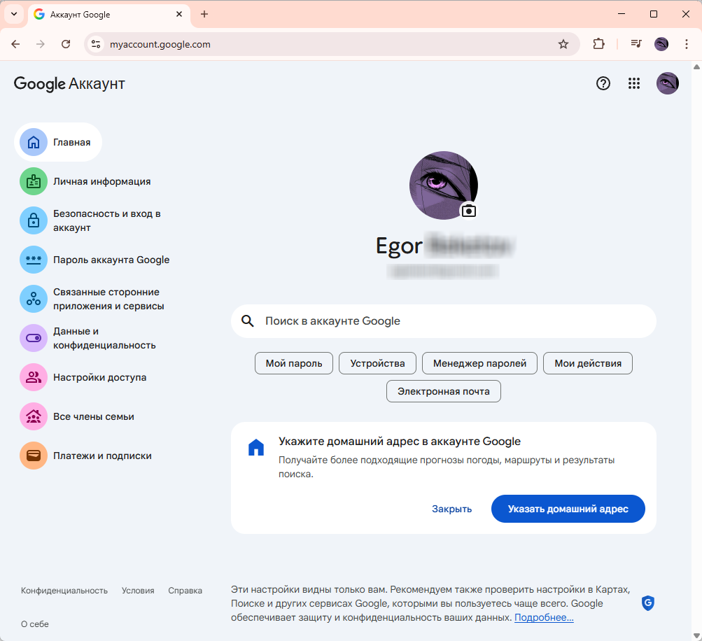
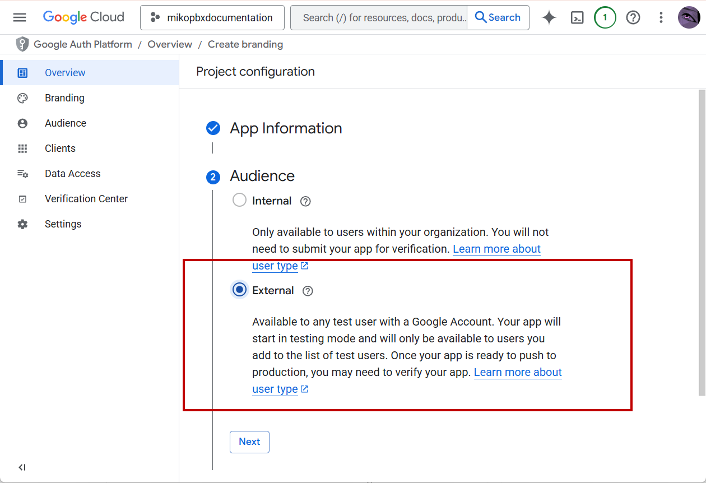
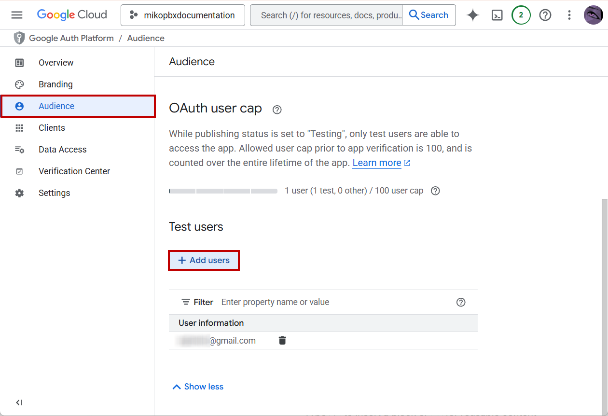
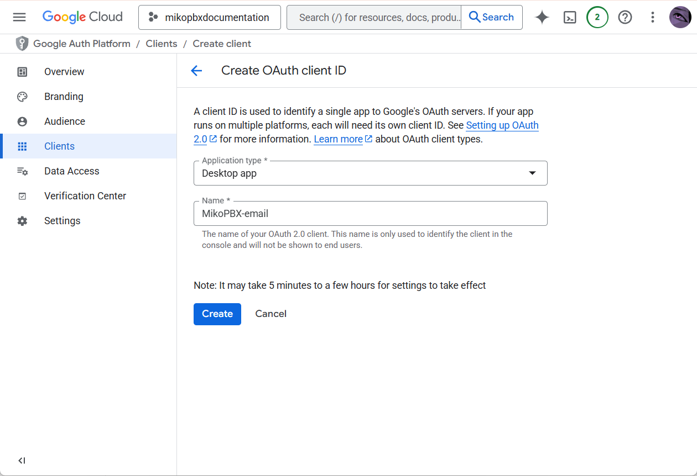
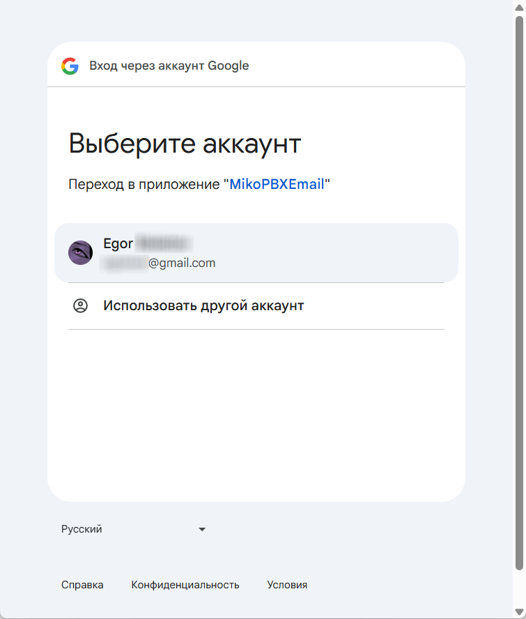
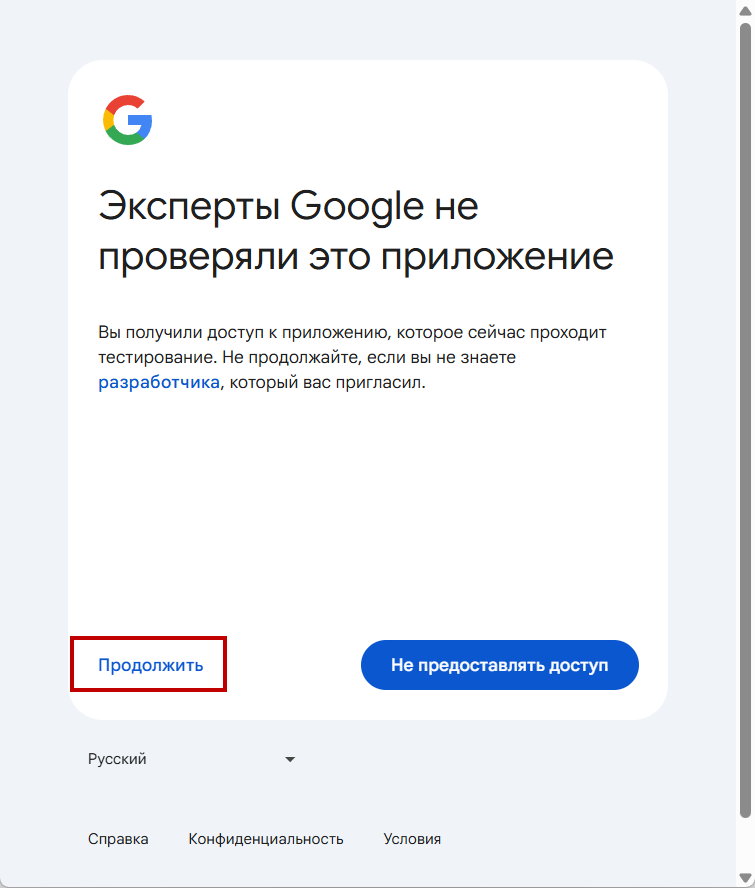
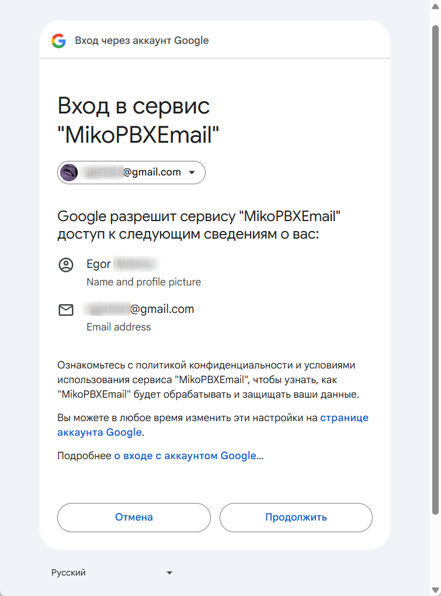

# Настройка Gmail (oAuth2)

### Настройки аккаунта Google

1. Перед началом настройки, необходимо поменять некоторые параметры аккаунта Google. Для этого перейдите на страницу управления ([ссылка](https://myaccount.google.com/)).

<figure><figcaption>
Страница упрвления аккаунтом Google
</figcaption></figure>

2. Перейдите в раздел "Безопасность и вход в аккаунт". Убедитесь, что у Вас настроена двухэтапная аутентификация.&#x20;

<figure><figcaption>
Настройка двухэтапной аутентификации
</figcaption></figure>

3. Перейдите в консоль Google Cloud, в раздел "**APIs & Services**" ([ссылка](https://console.cloud.google.com/apis/dashboard)). Создайте проект под текущую задачу.

<figure><figcaption>
Раздел "APIs &#x26; Services" в Google Cloud
</figcaption></figure>

4. Перейдите в библиотеку APIs (раздел "**Library**").

<figure><figcaption>
Раздел "Library" в APIs &#x26; services
</figcaption></figure>

5. Введите в поиске: "gmail api". Перейдите в карточку Gmail API.

<figure><figcaption>
Gmail API в библиотеке Google Cloud
</figcaption></figure>

6. Нажмите "**Enable**" для подключения.

<figure><figcaption>
Подключение API
</figcaption></figure>

7. Перейдите на главную страницу **APIs & Services**. Далее "**OAuth consent screen**".

<figure><figcaption>
Раздел "OAuth consent screen" в APIs &#x26; Services
</figcaption></figure>

8. Создайте проект (нажмите "**Get started**"). Заполните произвольное название и Вашу почту. В качестве Audience выберите "**External**". Нажмите "**Create**" для завершения.

<figure><figcaption>
Параметр "Audience" в создании проекта
</figcaption></figure>

9. Далее перейдите в раздел "Audience". Под разделом "Test users" добавьте Ваш email.

<figure><figcaption>
Добавление Test user
</figcaption></figure>

10. Вернитесь  на главную страницу **APIs & Services.** Далее в раздел "**Credentials**". Нажмите "**Create credentials**". Выберите "OAuth client ID" для создания.

<figure><figcaption>
Создание нового OAuth client ID
</figcaption></figure>

11. В качестве Application type, выберите "**Desktop app**". Далее введите произвольное название. Нажмите "**Create**".

<figure><figcaption>
Создание нового OAuth client ID
</figcaption></figure>

12. Будет создан OAuth client. Сохраните ClientID и Client secret себе в заметки. В будущем эти данные понадобятся для подключения.

<figure><figcaption>
Успешно созданный клиент
</figcaption></figure>

### Настройки в MikoPBX

1. Перейдите в раздел "**Система**" -> "**Почта и уведомления**":

<figure><figcaption>
Раздел "Почта и уведомления" в MikoPBX
</figcaption></figure>

2. Далее, "Настройки SMTP". Заполните следующие параметры:

* **Адрес отправителя, Имя отправителя** - Ваша почта и от какого имени будут отправляться письма.
* **Тип аутентификации** - OAuth2.
* **SMTP логин** - Ваша почта.
* **Провайдер OAuth2** - Google/Gmail.
* **Идентификатор приложения (Client ID), Секретный ключ (Client Secret)** - данные, которые сохранены из Google Cloud (12 пункт из прошлого раздела в этой инструкции).

Все остальные настройки оставьте по умолчанию. Более подробное описание Вы можете найти в главное статье о параметрах почты ([ссылка](./)).

<figure><figcaption>
Параметры почты для подключения Gmail
</figcaption></figure>

3. Нажмите на синюю кнопку "**Подключить через OAuth2**". Далее выберите Ваш аккаунт Gmail.

<figure><figcaption>
Выбор аккаунта Google
</figcaption></figure>

4. Далее нажмите "**Продолжить**".

<figure><figcaption>
Продолжение с предупреждением
</figcaption></figure>

5. Снова нажмите продолжить

<figure><figcaption>
Продолжение настройки
</figcaption></figure>

6. Выдайте разрешение&#x20;
