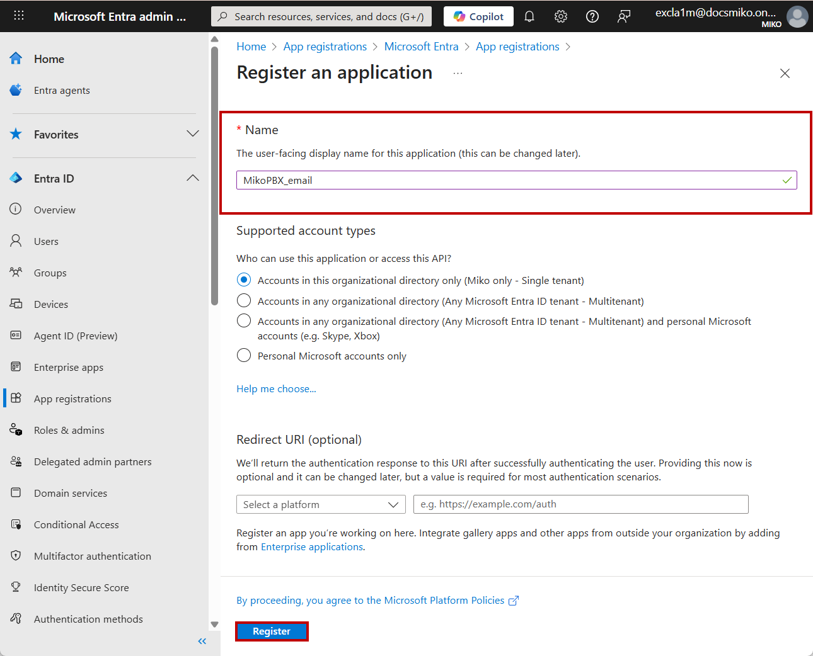
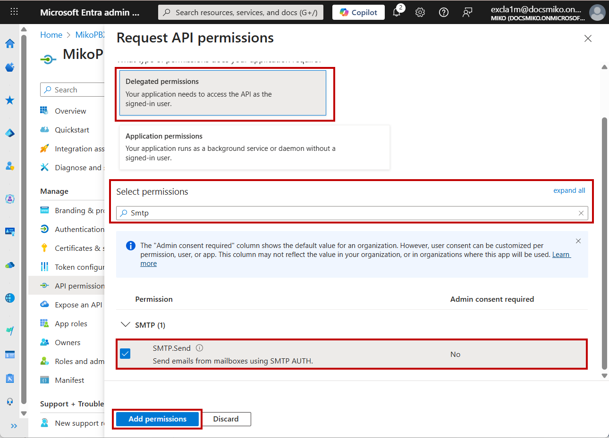
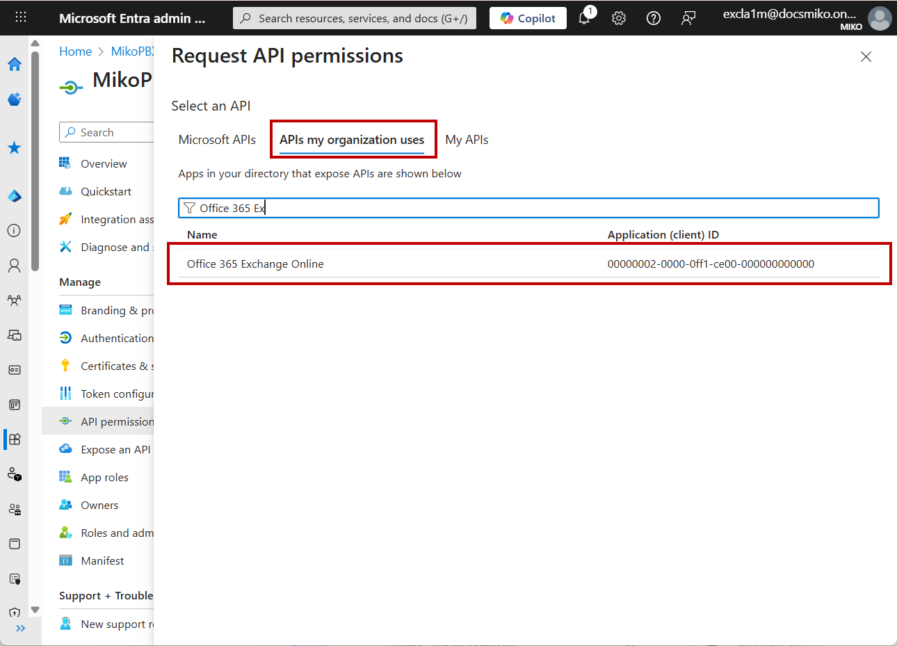
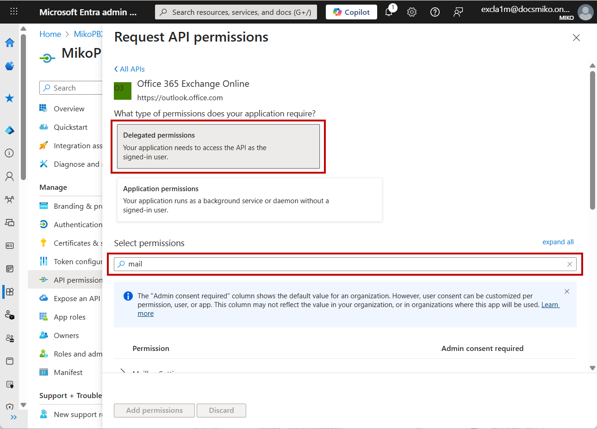
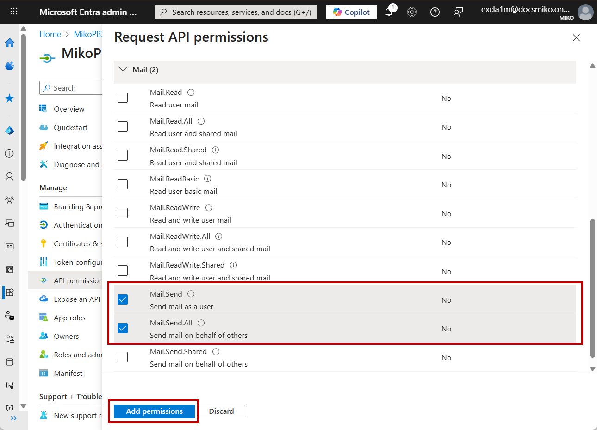
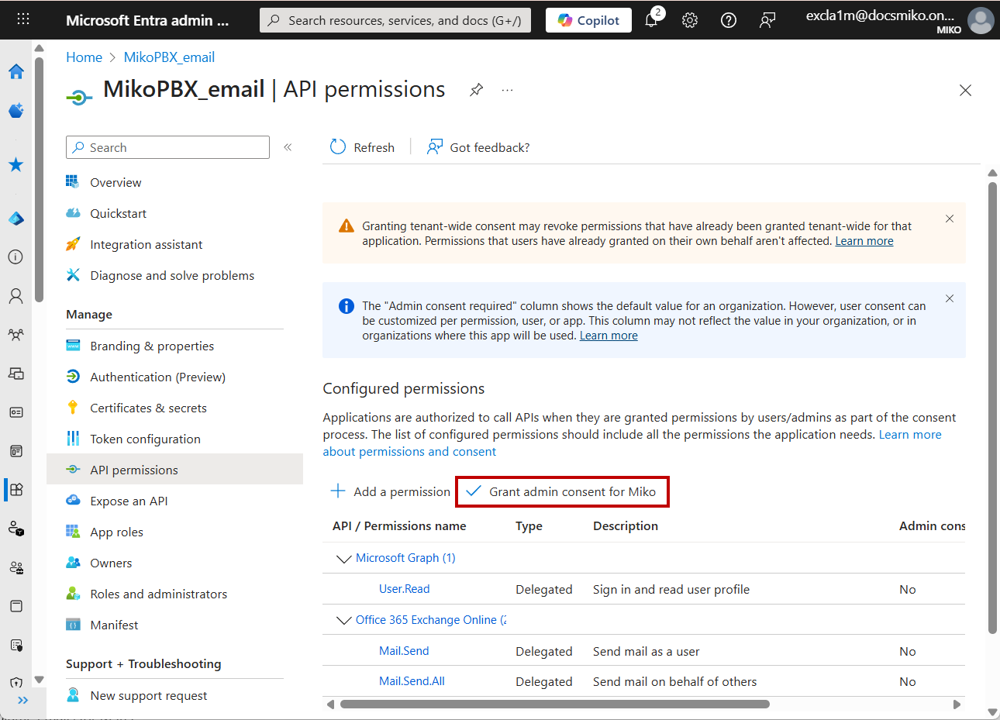

# Настройка Microsoft Outlook (oAuth2)

## Настройки внутри Microsoft Entra

### Регистрация приложения

1. Войдите в [центр администрирования Microsoft Entra.](https://entra.microsoft.com/)

<figure><figcaption>
Главная страница центра администрирования Microsoft Entra
</figcaption></figure>

2. Перейдите в раздел "Entra ID" -> "App registrations". Далее нажмите "New registration" для регистрации нового приложения.

<figure><figcaption>
Регистрация нового приложения
</figcaption></figure>

3. Выберите следующие параметры для Вашего приложения:

* Name - укажите название для Вашего приложения.
* Supported account types - выберите параметр "Accounts in this organizational directory only (Miko only - Single tenant)" для подключения Вашей корпоративной почты созданной в Microsoft Entra (onmicrosoft.com).

Нажмите "**Register**".

<figure><figcaption>
Параметры приложения
</figcaption></figure>

4. Будет созданно приложения. Сохраните client ID, в будущем он понадобится для настройки внутри веб-интерфейса MikoPBX.

<figure><figcaption>
Главная страница созданного приложения
</figcaption></figure>

### Выдача разрешений и создание secret ID

1. Из главной страницы приложения перейдите в "**Manage**" -> "**API permissions**".

<figure><figcaption>
Раздел "API permissions"
</figcaption></figure>

2. Нажмите "**Add a permission**".

<figure><figcaption>
Добавление разрешения
</figcaption></figure>

3. В разделе "**Microsoft Graph**" выберите "**Delegated Permissions**". В поиске введите "**SMTP**". Поставьте галочку напротив "**SMTP.Send**".

Нажмите "**Add permissions**".

<figure><figcaption>
Разрешение "SMTP.Send"
</figcaption></figure>

3. Перейдите в раздел "**APIs my organization uses**". В поиске наберите "Office 365 Exchange Online", нажмите на соответствующее API.

<figure><figcaption>
API "Office 365 Exchange Online"
</figcaption></figure>

4. Выберите "**Delegated permissions**", в поиске наберите "**mail**".

<figure><figcaption>
Поиск разрешений
</figcaption></figure>

5. Пролистайте вниз, в разделе "Mail" выберите:

* **Mail.Send**
* **Mail.Send.All**

Нажмите **"Add permissions".**

<figure><figcaption>
Выдача разрешений
</figcaption></figure>

6. Нажмите "Grant admin consent for ...".

<figure><figcaption>
Выдача разрешений
</figcaption></figure>

7. Далее перейдите в раздел
