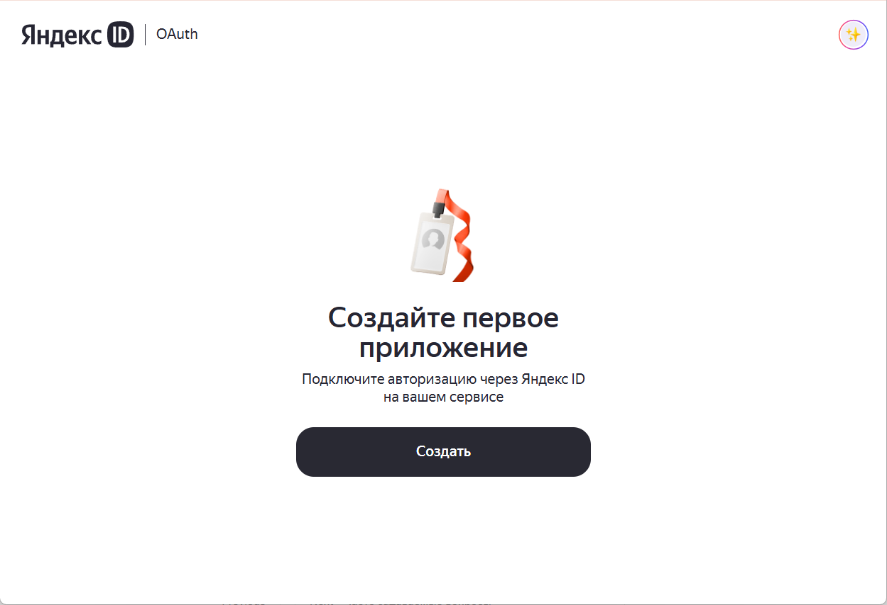
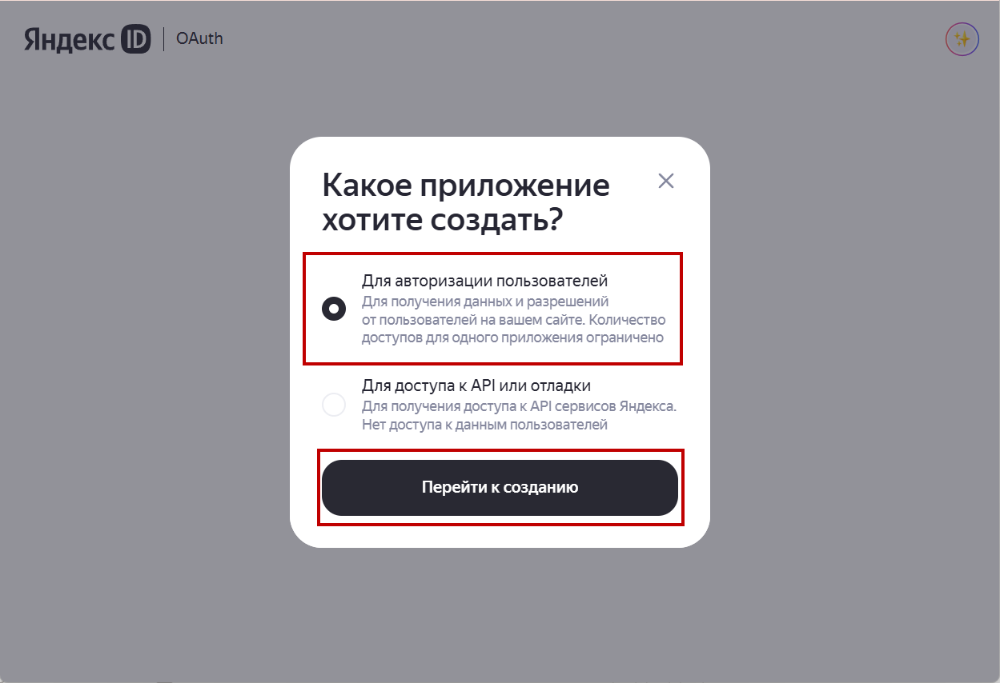
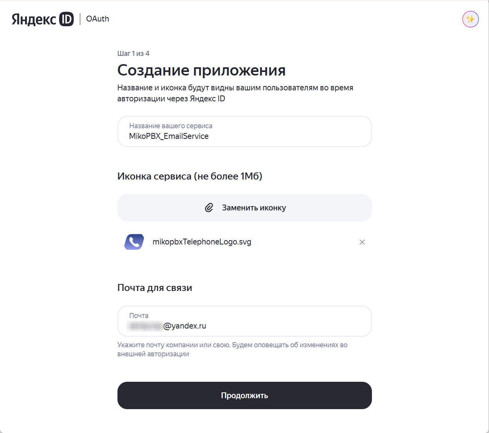

# Настройка Yandex Mail (oAuth2)

## Создание приложения в Yandex

1. Авторизуйтесь в Ваш аккаунт Яндекс и далее перейдите на [страницу создания приложения](https://oauth.yandex.ru/client/new/). Нажмите "**Создать**".

<figure><figcaption>
Главная страница приложений Яндекс ID | OAuth
</figcaption></figure>

2. В диалоговом окне выберите опцию "**Для атворизации пользователей**". Нажмите "**Перейти к созданию**".

<figure><figcaption>
Выбор типа приложения в YandexID | OAuth
</figcaption></figure>

3. Далее заполните необходимую информацию:

* **Название** - произвольное.
* **Иконка сервиса** - произвольное изображение.
* **Почта для связи** - почта на которую будут приходить уведомления об авторизации.

Нажмите "**Продолжить**".

<figure><figcaption>
Параметры приложения #1
</figcaption></figure>

4. Далее выберите в качестве платформы "".

