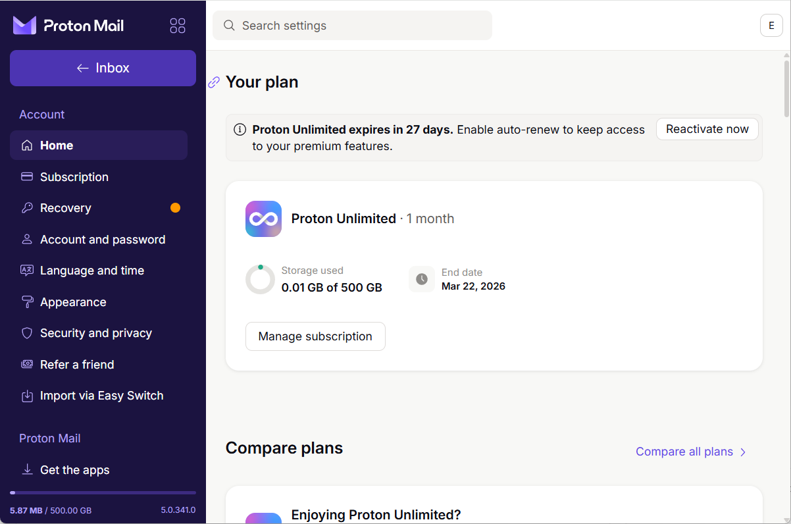
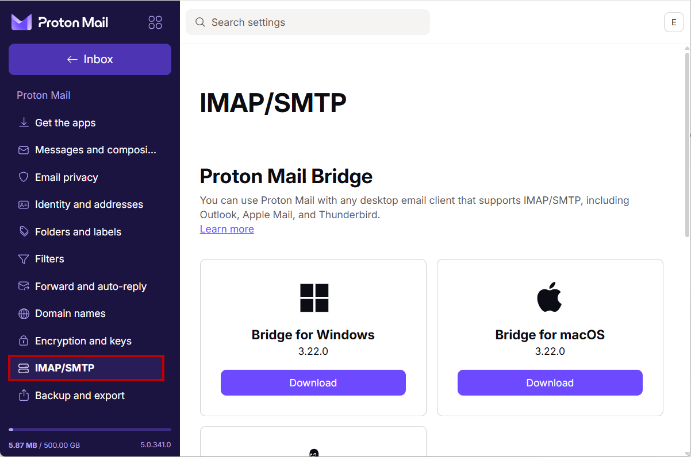
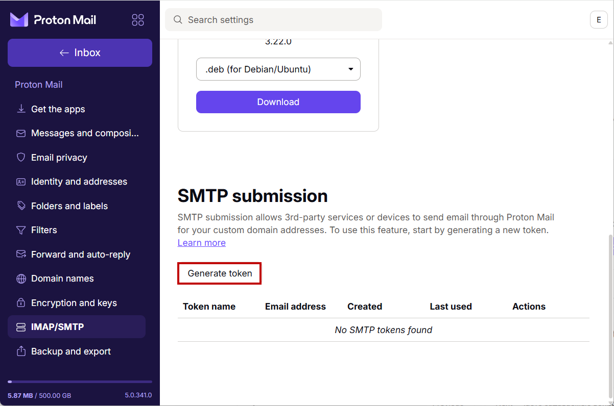
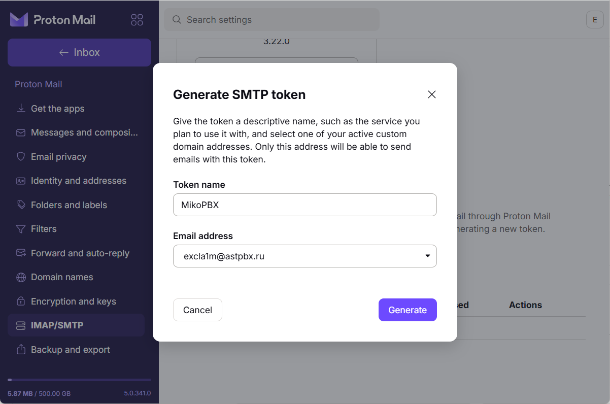
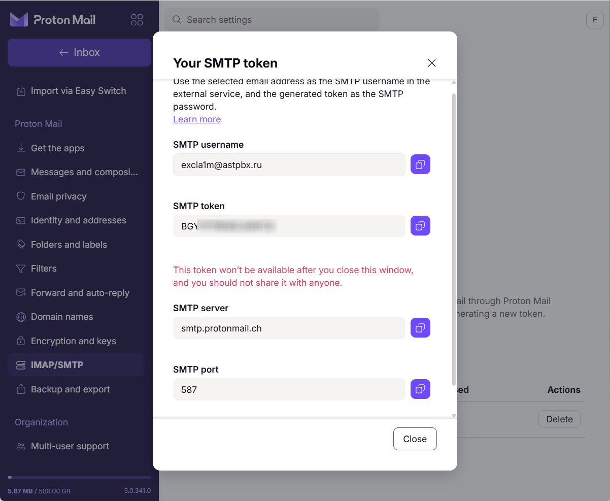
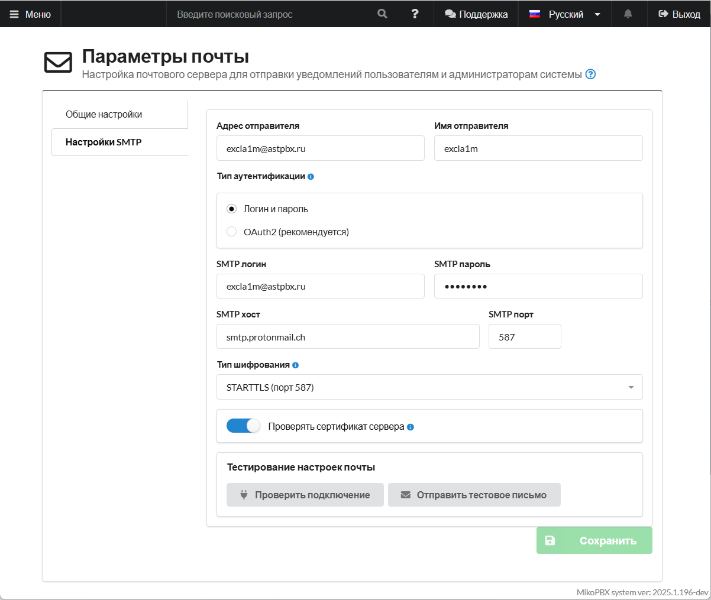
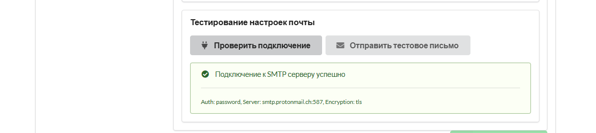

# Настройка Proton (Логин, Пароль)

### Генерация SMTP токена

1. Для начала, перейдите в настройки своего аккаунта Proton ([ссылка](https://account.proton.me/u/1/mail/dashboard)).

<figure><figcaption>
Настройки учетной записи Proton
</figcaption></figure>

2. Далее перейдите в раздел "**Proton Mail**" -> "**IMAP/SMTP**".&#x20;

<figure><figcaption>
Раздел "IMAP/SMTP"
</figcaption></figure>

3. Далее пролистайте до секции "**SMTP submission**". Нажмите "**Generate token**".

<figure><figcaption>
Кнопка для создания нового токена "Generate token"
</figcaption></figure>

4. Введите произовольное название в поле "Token name" - MikoPBX в нашем случае, так же выберите Email address для которого Вы создаете токен.

<figure><figcaption>
Создание нового SMTP токена
</figcaption></figure>

Будет создан токен. **Его параметры будут показаны один раз и когда Вы закроете окно, станут недоступны. Сохраните их, мы будем использовать их для дальнейшей настройки.**

<figure><figcaption>
Параметры созданного токена
</figcaption></figure>

### Подключение в MikoPBX

1. Перейдите в раздел "**Система**" -> "**Почта и уведомления**".

<figure><figcaption>
Раздел "Система" -> "Почта и уведомления".
</figcaption></figure>

2. Перейдите в "**Настройки SMTP**". Заполните все необходимые параметры:

* Адрес отправителя - Ваш адрес электронной почты, под которым Вы генерировали токен.
* Имя отправителя - имя от которого отправляется почта.
* Тип аутунтификации - "Логин и пароль".
* SMTP логин - SMTP Username из окна с данными токена.
* SMTP пароль - SMTP token из окна с данными токена.
* **SMTP хост** - **`smtp.protonmail.ch`**
* **SMTP порт** - 587.
* Тип шифрования - STARTLS (порт 587).

Нажмите "**Сохранить**".

<figure><figcaption>
Параметры почты в MikoPBX
</figcaption></figure>

Нажмите "**Проверить подключение**". Вы увидите следующее окно, подтверждающее правильность введенных данных:

<figure><figcaption>
Успешное подключение
</figcaption></figure>
