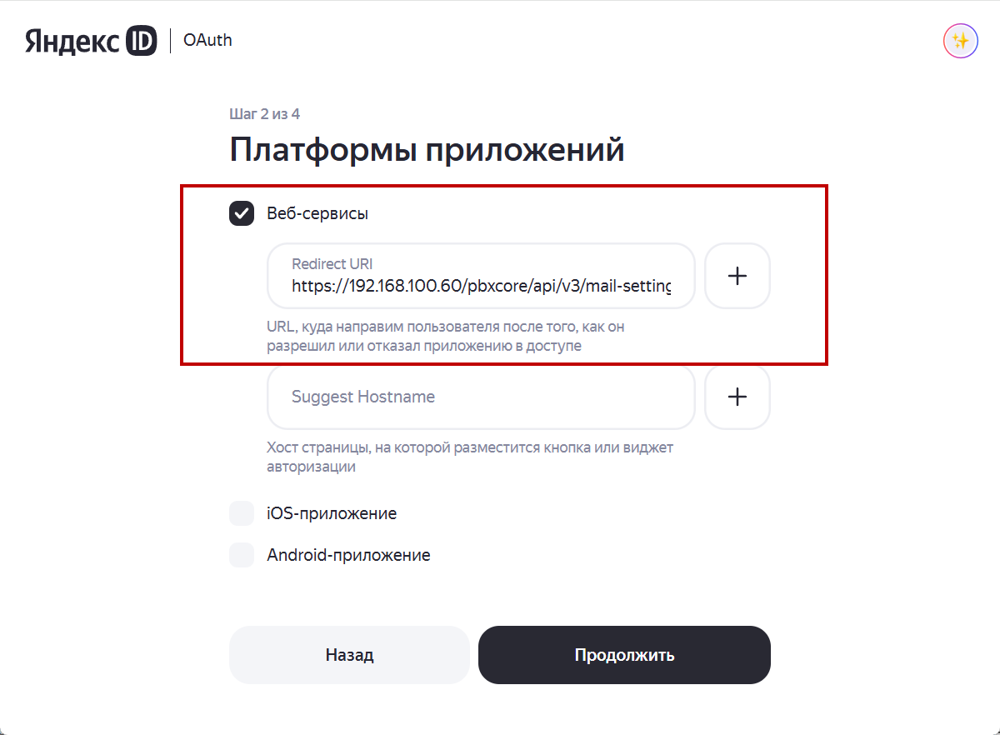
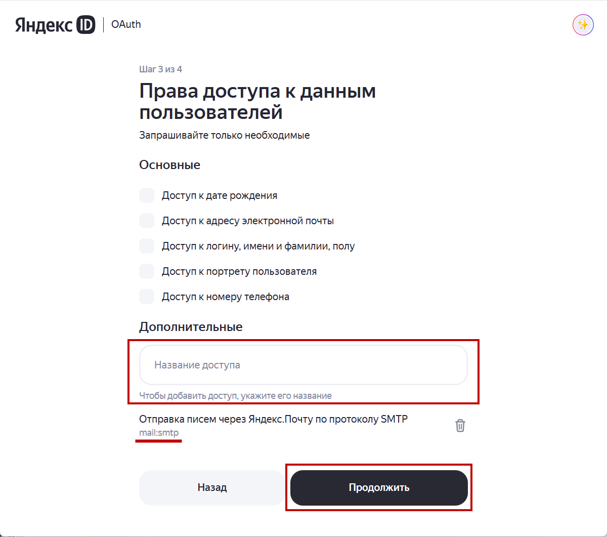
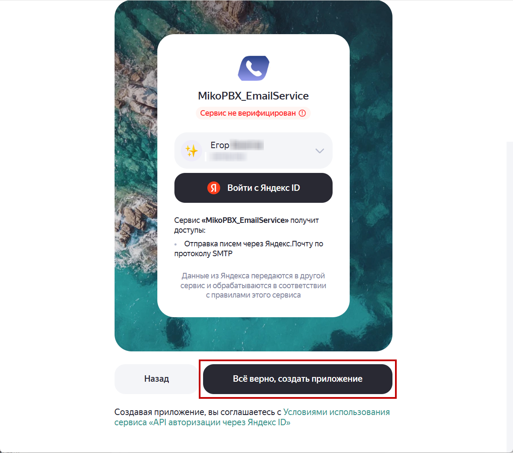
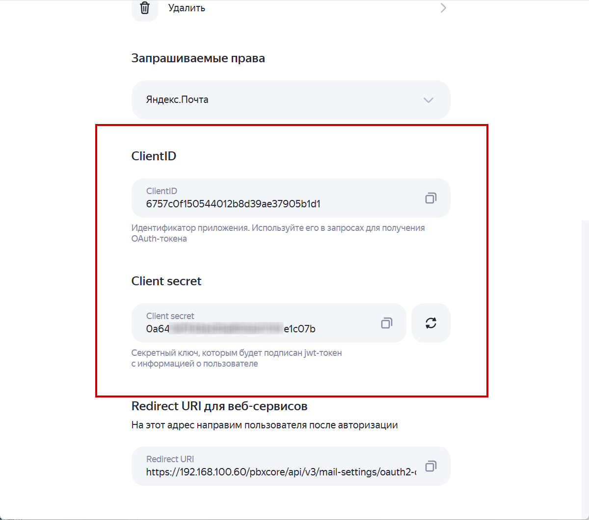
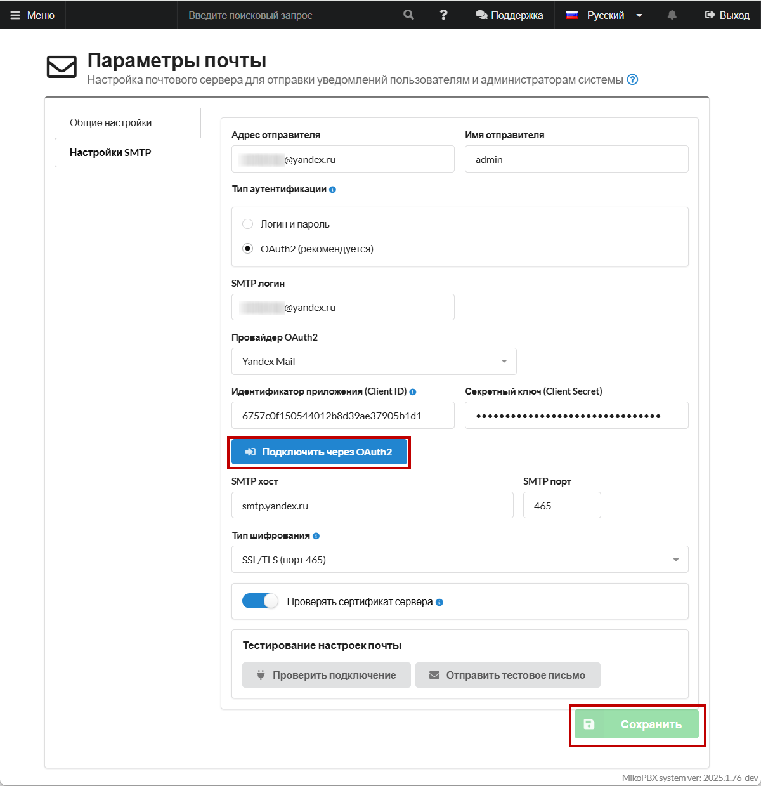
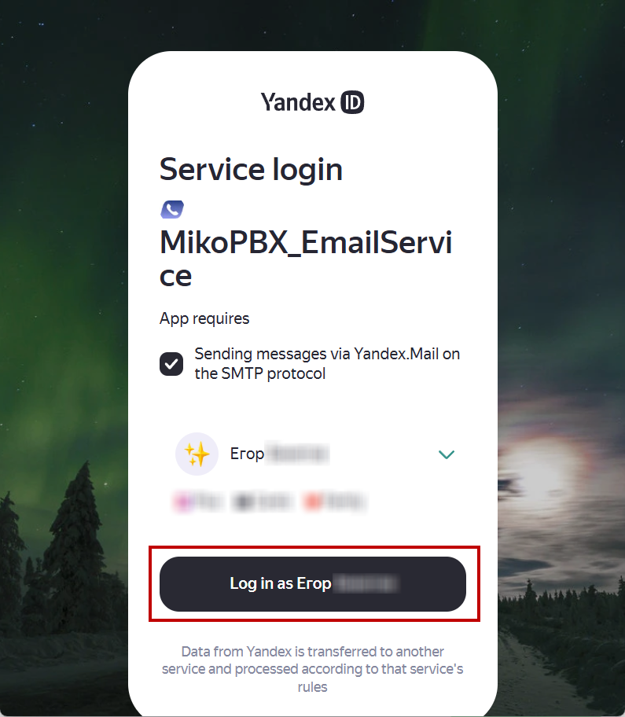
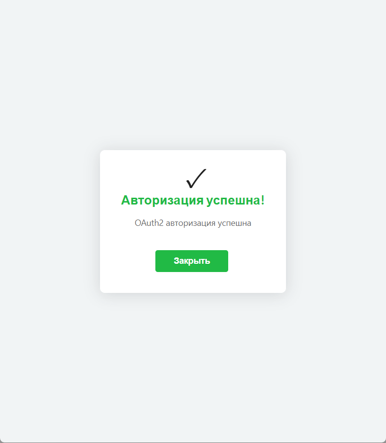

# Настройка Yandex Mail (oAuth2)

### Создание приложения в Yandex

1. Авторизуйтесь в Ваш аккаунт Яндекс и далее перейдите на [страницу создания приложения](https://oauth.yandex.ru/client/new/). Нажмите "**Создать**".

<figure><figcaption><p>Главная страница приложений Яндекс ID | OAuth</p></figcaption></figure>

2. В диалоговом окне выберите опцию "**Для атворизации пользователей**". Нажмите "**Перейти к созданию**".

<figure><figcaption><p>Выбор типа приложения в YandexID | OAuth</p></figcaption></figure>

3. Далее заполните необходимую информацию:

* **Название** - произвольное.
* **Иконка сервиса** - произвольное изображение.
* **Почта для связи** - почта на которую будут приходить уведомления об авторизации.

Нажмите "**Продолжить**".

<figure><figcaption><p>Параметры приложения #1</p></figcaption></figure>

4. Далее выберите в качестве платформы "**Веб-сервисы**". В поле "**Redirect URl**" вставьте следующую ссылку:

```
https://192.168.100.60/pbxcore/api/v3/mail-settings/oauth2-callback
```

Замените 192.168.100.60 на ip-адрес Вашей станции.&#x20;

Нажмите "**Продолжить**".

<figure><figcaption><p>Параметры приложения. Refirect URl</p></figcaption></figure>

5. Далее на странице "**Права доступа к данным пользователей**" в разделе "**Дополнительные**" впишите "**smtp**" и выберите доступ "**Отправка писем через Яндекс.Почту по протоколу SMTP**".

<figure><figcaption><p>Выдача необходимого разрешения</p></figcaption></figure>

6. На следующей странице нажмите "**Всё верно, создать приложение**".

<figure><figcaption><p>Подтверждение создания приложения</p></figcaption></figure>

После создания приложения будет выведены ClientID и Client Secret. Далее они понадобятся нам для настройки внутри web-интерфейса MikoPBX.

<figure><figcaption><p>ClientID и Client Secret</p></figcaption></figure>

### Настройки внутри MikoPBX

1. Перейдите в Web-интерфейс MikoPBX. Далее "**Система**" -> "**Почта и уведомления**" -> "**Настройки SMTP**".

Заполните все необходимые данные:

* **Адрес отправителя, Имя отправителя** - Ваша почта и от какого имени будут отправляться письма.
* **Тип аутентификации** - OAuth2.
* **SMTP логин** - Ваша почта.
* **Провайдер OAuth2** - Yandex Mail.
* **Идентификатор приложения (Client ID), Секретный ключ (Client Secret)** - данные из Yandex (6 пункт из прошлого раздела в этой инструкции).

Все остальные настройки оставьте по умолчанию. Более подробное описание Вы можете найти в главное статье о параметрах почты ([ссылка](https://docs.mikopbx.com/mikopbx/manual/system/mail-settings-1)).

После этого нажмите "**Сохранить**"!

<figure><figcaption><p>Настройки SMTP в Web-интерфейсе MikoPBX</p></figcaption></figure>

2. Нажмите "**Подключить через OAuth2**". Войдите в Ваш аккаунт Яндекс. После авторизации, нажмите "**Log in as...**".

<figure><figcaption><p>Раздел "Service login". Авторизация в приложении.</p></figcaption></figure>

3. При успешной авторизации Вы увидите соответствующее окно.

<figure><figcaption><p>Успешная авторизация</p></figcaption></figure>
