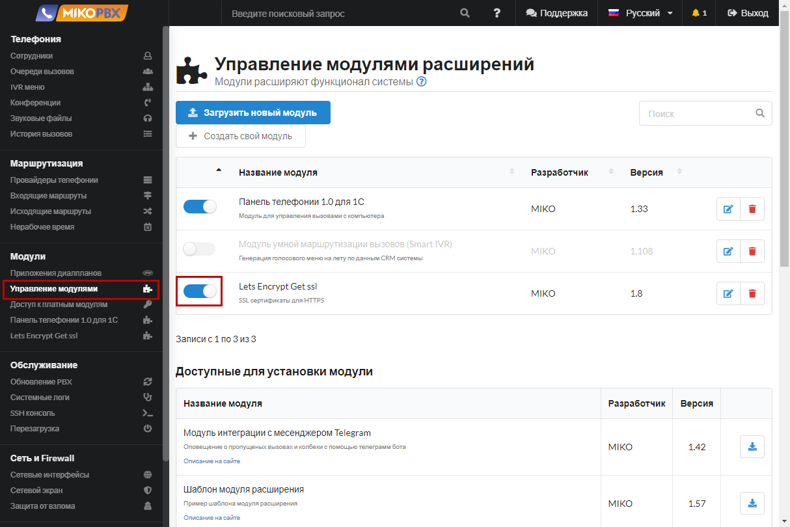

# Mail settings

## Connecting to the SMTP server

To receive notifications about missed calls and voicemail messages by email, you need to configure the SMTP client. **SMTP (Simple Mail Transfer Protocol)** is used to send e-mail over the Internet. SMTP clients interact with an SMTP server that sends email.

<figure><figcaption></figcaption></figure>

* **SMTP host** - address of the mail server
* **SMTP port** - the port of the mail server
* **SMTP login, SMTP password** - authorization parameters&#x20;
* **Sender's address** - Emails will be sent on behalf of this address Email of the system administrator - all system notifications will be sent to this email address, for example, about the lack of disk space. When changing and saving the settings, a test email will be sent to this address&#x20;
* **Use TLS** - activates the use of encryption when connecting to the server, to connect via SSL, you need to add a protocol description to the server address&#x20;
* **Validate server certificate** - in some cases it is necessary to disable it when using self-signed certificates&#x20;
* **Use mail motifications** - allows you to enable/disable all email alerts, including voice mail


If the server supports a secure connection only over **SSL**, then you can explicitly specify the protocol in the "**SMTP host**" field, for example

```
ssl://smtp.gmail.com
```



Setting up notifications for mail services:

* [Gmail](setting-up-e-mail-notifications-for-the-gmail-mail-service.md)


## Missed Notifications

<figure><figcaption></figcaption></figure>

* **Email for missed notifications** - by default, missed notifications are sent to the email specified in the employee card. If the call cannot be matched with an employee or email is not specified, the call will be sent to this "shared" address
* **The subject, text, and footer** of the letter may contain parameters in the form of PARAMETER\_NAME

List of available "parameters":

* **NOTIFICATION\_MISSEDCAUSE** - currently always takes the value "NOANSWER", i.e. a missed call
* **NOTIFICATION\_CALLERID** - who was the call from
* **NOTIFICATION\_TO** - who was the call to
* **NOTIFICATION\_DURATION** - duration in seconds&#x20;
* **NOTIFICATION\_DATE** - date of the call

## Voice mail

It is possible to set up an address and a template for a voicemail notification:

<figure><figcaption></figcaption></figure>

* Voice mail will be sent to **each** employee who missed the call (if the email is specified in his card).&#x20;
* Voicemail will always be sent to the "**Email address to receive all voice mail records**"
* &#x20;It is possible to listen to the voicemail recording from the [**PBX call history**](../../telephony/extensions.md)

The following "parameters" can be used in the **subject, body and footer** of the email:

* **VM\_DATE** - date and time&#x20;
* **VM\_CALLERID** - caller's callerid, consists of name and num, example **"Alex Magnet" <101>**&#x20;
* **VM\_DUR** - message duration
* **VM\_CALLER\_NAME** - caller's name (taken from VM\_CALLERID)&#x20;
* **VM\_CALLER\_NUM** - caller's phone number (taken from VM\_CALLERID)

To specify a parameter, you need to use a construction of the form **PARAMETER\_NAME**.&#x20;

Click **Save** to complete the setup.
