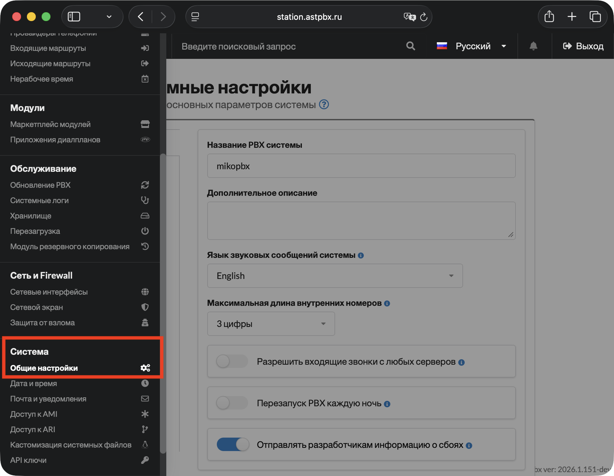
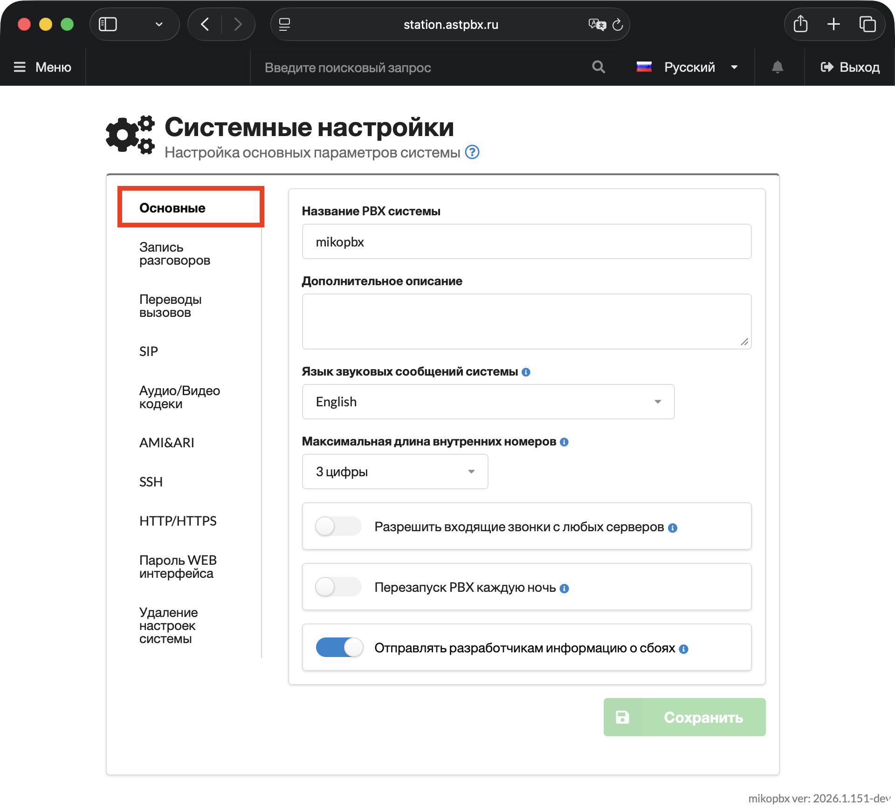
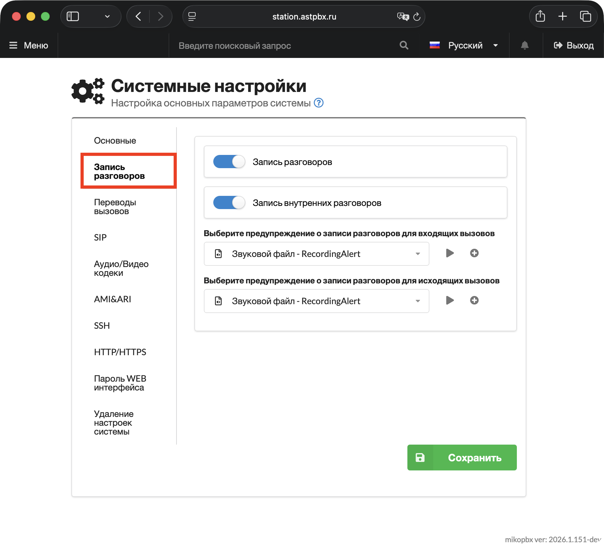

# Общие настройки (New) - IN DEV

В этом разделе настраиваются основные параметры системы. Рекомендуется выполнить эти настройки сразу после установки АТС.

<figure><figcaption><p>Раздел "Система" -> "Общие настройки" в веб-интерфейсе MikoPBX</p></figcaption></figure>

### Основные

* **Название PBX системы** — отображается на главной странице MikoPBX.
* **Дополнительное описание** — видно только администраторам системы.
* **Язык звуковых сообщений системы** — язык голосовых оповещений.
* **Максимальная длина внутренних номеров** — максимальная длина внутреннего номера сотрудника.
* **Разрешить входящие звонки с любых серверов** - разрешает принимать SIP звонки от неавторизованных устройств и серверов без регистрации.


Включение этой опции может создать угрозу безопасности. Убедитесь, что ваша сеть надежно защищена и используются правила фильтрации!


* **Перезапуск PBX каждую ночь** — автоматический рестарт Asterisk в ночное время (в 01:00 ночи по системному времени).
* **Отправлять разработчикам информацию о сбоях** — при возникновении ошибки её описание отправляется разработчикам (требуется доступ в интернет).

Нажмите "**Сохранить**".

<figure><figcaption><p>Вкладка "Основные" в системных настройках</p></figcaption></figure>

### Запись разговоров

* **Запись разговоров** — включить или отключить запись всех разговоров.
* **Запись внутренних разговоров** — включить или отключить запись звонков между сотрудниками.

Ниже можно выбрать звуковые файлы, которые будут использоваться в качестве предупреждения о записи разговора (для входящих и исходящих звонков могут быть выбраны разные звуковые файлы).&#x20;

<figure><figcaption><p>Вкладка "Запись разговоров" в системных настройках</p></figcaption></figure>


Ориентировочно, **1 час** разговора занимает **14 МБ** места на диске.


Звонки сохраняются в формате **mp3**. Пример информации об итоговом файле записи:

```
Input File     : 'mikopbx-1554098285.0_M1gEr1pgrt.mp3'
Channels       : 1
Sample Rate    : 8000
Precision      : 16-bit
Duration       : 00:00:17.64 = 141120 samples ~ 1323 CDDA sectors
File Size      : 70.6k
Bit Rate       : 32.0k
Sample Encoding: MPEG audio (layer I, II or III)
```

### Переводы вызовов

#### Парковка (удержание)

**Парковка** — способ временно поставить клиента на удержание, пока вы уточняете информацию. Во время ожидания клиенту воспроизводится мелодия.

В MikoPBX доступны два способа парковки:

1. Введите **\*2** во время разговора — вызов будет поставлен на удержание, а вам сообщат номер парковочного слота. Любой сотрудник может забрать вызов, набрав этот номер.
2. В настройках задайте **номер для парковки** — при переадресации вызова на этот номер MikoPBX поставит звонок на удержание и сообщит номер слота. Вызов также может забрать любой сотрудник.

Диапазон парковочных слотов задаётся параметрами **Начальный парковочный слот** и **Конечный парковочный слот**.

#### Переводы вызовов

MikoPBX поддерживает два вида переводов:

* **Условный перевод** — вы можете предварительно поговорить с коллегой, прежде чем переключить на него вызов. Клиент в это время находится на удержании. Перевод завершается после того, как вы кладёте трубку.
* **Безусловный (слепой) перевод** — вызов переводится сразу, без предварительного разговора с коллегой. Удобно, когда поступает второй звонок, а вы уже заняты — вызов можно мгновенно перевести на свободного сотрудника.


По умолчанию:

* Комбинация для **условного** перевода — **##**
* Комбинация для **безусловного** перевода — **\*\***


#### Таймауты

Если после безусловного (слепого) перевода никто не ответил, вызов вернётся обратно через **45 секунд**.

#### Перехват вызова (Pickup)

Если звонит телефон коллеги, вы можете перехватить вызов:

* **\*8<НомерКоллеги>** — перехватить вызов конкретного сотрудника.
* **\*8** — перехватить любой входящий вызов, если номер коллеги неизвестен.

### SIP

**Session Initiation Protocol (SIP)** — сигнальный протокол, используемый большинством VoIP-телефонов.

**Основные параметры:**

* **SIP-порт** — по умолчанию **5060**. Изменение порта может повысить безопасность системы.
* **SIPMiniExpiry** — минимальная продолжительность регистрации, по умолчанию **60 секунд**.
* **SIPMaxExpiry** — максимальная продолжительность регистрации, по умолчанию **3600 секунд**.

Некоторые брандмауэры закрывают порты после периода неактивности — в таких случаях стоит уменьшить таймаут регистрации.

**RTP (Real-time Transport Protocol)** определяет стандартный формат передачи аудио и видео по IP-сетям. По умолчанию используется диапазон портов **10000–10200**. Каждый активный вызов использует два RTP-порта, то есть при 200 портах возможно не более 100 одновременных звонков. Если нагрузка выше — расширьте диапазон.

**Дополнительные параметры:**

* **Адрес STUN сервера** — помогает при работе АТС за NAT, в том числе при использовании WebRTC.
* **Префикс Auth Username** — по умолчанию имя пользователя для авторизации совпадает с внутренним номером (например, `101`). При указании префикса `MIKO` поле `username` останется `101`, а `AuthUsername` станет `101MIKO`. Это существенно усложняет подбор пароля к SIP-аккаунту.
* **Использовать WebRTC** — включает дополнительные настройки для работы с WebRTC. Для каждого внутреннего номера будет создан дополнительный endpoint, доступный по адресу `sip:201-WS@IP_PBX`.

### Аудио/видео кодеки

В этом разделе настраиваются разрешённые аудио- и видеокодеки для всей АТС.

### AMI & AJAM

**Asterisk Manager Interface (AMI)** — программный интерфейс (API) Asterisk для управления системой из внешних приложений. Через AMI внешние программы подключаются к Asterisk по TCP, отправляют команды, получают результаты и события в реальном времени. AMI часто используется для интеграции с CRM и другими бизнес-системами. По умолчанию AMI принимает подключения на **TCP-порт 5038**.

**Asynchronous Javascript Asterisk Manager (AJAM)** — технология, позволяющая веб-браузерам и HTTP-приложениям обращаться к AMI через HTTP/HTTPS. По умолчанию используется порт **8088**.

### SSH

**SSH (Secure Shell)** — зашифрованный протокол для удалённого управления сервером.


Авторизация по SSH в MikoPBX по умолчанию:

* Логин: **root**
* Пароль: **admin** — рекомендуется сразу изменить.


Аутентификация по паролю проста в настройке, но уязвима к перебору. Более надёжный способ — **SSH-ключи**.

Каждая пара ключей состоит из открытого и закрытого ключа. Открытый ключ загружается на сервер в файл `~/.ssh/authorized_keys`. При подключении сервер отправляет сообщение, зашифрованное открытым ключом — если клиент может его расшифровать закрытым ключом, аутентификация считается пройденной.


Настоятельно рекомендуем отключить аутентификацию по паролю — активируйте опцию **«Отключить авторизацию по паролю»**.



Как создать SSH-ключ и добавить его на сервер — читайте [здесь](https://firstvds.ru/technology/dobavit-ssh-klyuch).


* **SSH Authorized Keys** — вставьте сюда публичный SSH-ключ. Если ключей несколько, вставьте их подряд, разделив пустой строкой.
* **SSH Public RSA Key** — публичный SSH-ключ текущей АТС. Его можно скопировать в поле `SSH Authorized Keys` на другой станции, чтобы подключаться к ней без дополнительной авторизации.

### Web-интерфейс

Для повышения безопасности можно изменить HTTP-порт (по умолчанию **80**) или активировать режим HTTPS.

**HTTPS** шифрует трафик между браузером и АТС с помощью протоколов SSL/TLS. По умолчанию используется TCP-порт **443**.

* **Редирект на HTTPS** — при открытии веб-интерфейса по HTTP пользователь будет автоматически перенаправлен на HTTPS.

При первом запуске АТС самостоятельно генерирует самоподписанный сертификат для работы по HTTPS. Он не заверен публичным регистратором, но обеспечивает шифрование трафика. Для получения доверенного сертификата воспользуйтесь модулем Let's Encrypt.

### Пароль web-интерфейса

В этом разделе можно изменить логин и пароль для входа в web-интерфейс.


Авторизация в MikoPBX по умолчанию:

* Логин: **admin**
* Пароль: **admin**


### Удаление настроек системы
