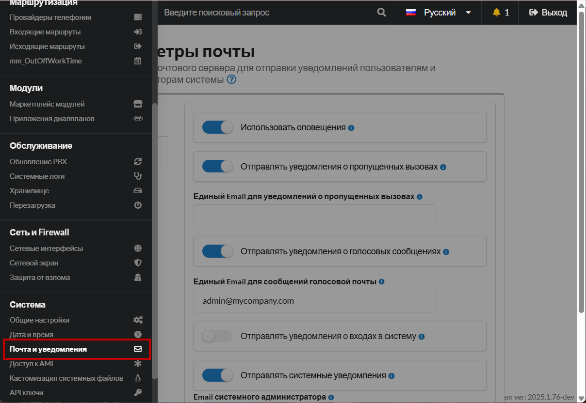
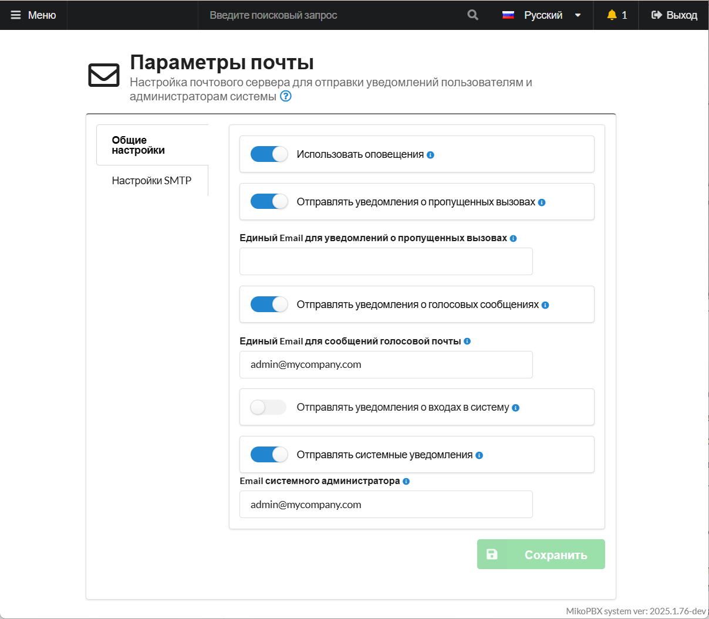
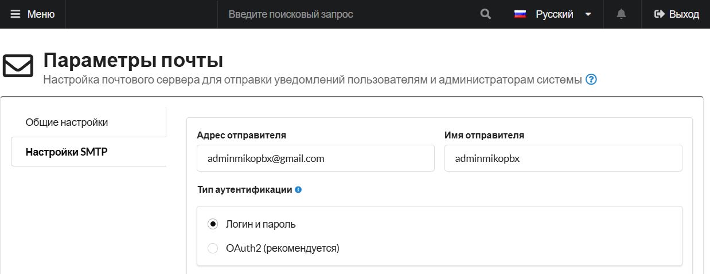

# Почта и уведомления (new)

Раздел **«Почта и уведомления»** в MikoPBX позволяет настроить отправку системных уведомлений через электронную почту. Здесь администраторы указывают параметры SMTP-сервера, определяют события для уведомлений, такие как голосовые сообщения или системные ошибки, и редактируют шаблоны писем. Этот раздел помогает своевременно информировать пользователей и администраторов о важных событиях, обеспечивая эффективный контроль за работой системы.

<figure><figcaption>
Раздел "<strong>Почта и уведомления</strong>" в MikoPBX
</figcaption></figure>

### Общие настройки

<figure><figcaption>
Общие настройки почты
</figcaption></figure>

* **Использовать оповещения** - позволяет включить/отключить **все оповещения на email**, включая голосовую почту.
* Отправлять уведомления о пропущенных вызовах - позволяет включить/отключить уведомления о пропущенных вызовах.
* **Единый Email для уведомлений о пропущенных вызовах** - общий адрес электронной почты для отправки уведомлений о пропущенных внешних вызовах (если у сотрудника не указан email, используется этот общий адрес).
* **Отправлять уведомления о голосовых сообщениях** - позволяет включить/отключить уведомления о голосовых сообщениях.
* **Единый Email для уведомлений о голосовых сообщениях** - общий адрес  электронной почты для отправки уведомлений о голосовых сообщениях (приоритет: 1. Личный email сотрудника; 2. Указанный email в этом поле)
* **Отправлять уведомления о входах в систему** - позволяет включить/отключить уведомления о входах в систему.
* **Отправлять системные уведомления** - позволяет включить/отключить отправку системных уведомлений.
* **Email системного администратора** - адрес, на который будут отправляться системные уведомления.

### Настройки SMTP

<figure><figcaption>
Настройки SMTP. Часть 1
</figcaption></figure>

* **Адрес отправителя, Имя отправителя** - от имени этого адреса  и имени будут отправляться электронные письма.
* **Тип аутентификации:**
  * **Логин и пароль -** классический тип аутентификации при подключении к SMTP-серверу, при котором используется **адрес почтового ящика (логин)** и **пароль** от него. Все параметры (сервер, порт, шифрование, логин и пароль) вводятся и хранятся вручную
  * **OAuth2 -** способ аутентификации, при котором Вы **не храните и не передаёте пароль от почтового ящика**. Вместо этого приложение получает **временный токен доступа** у почтового провайдера (Microsoft 365/Outlook, Google Workspace/Gmail и т.д.) и использует его при отправке писем через SMTP.

#### Аунтефикация по логину и паролю

<figure><figcaption>
Настройки SMTP. Часть 2
</figcaption></figure>

* **SMTP логин**, **SMTP пароль** - параметры авторизации.
* **SMTP хост** - адрес почтового сервера.
* **SMTP порт** - порт почтового сервера.
* Тип шифрования:
  * **Без шифрования (порт 25)** - классический способ подключения к SMTP без защиты канала.
  * **STARTTLS (порт 587)** - рекомендованный и наиболее распространённый способ отправки почты. Соединение начинается без шифрования, после чего клиент и сервер согласовывают переход на защищённый канал.
  * **SSL/TLC (порт 465)** - подключение к SMTP с шифрованием **с самого начала соединения**. Канал защищён сразу после установки TCP-соединения, без этапа переключения.
* **Проверять сертификат сервера** - настройка безопасности, которая определяет, будет ли клиент **проверять подлинность SSL/TLS-сертификата SMTP-сервера** при установке защищённого соединения (STARTTLS или SSL/TLS).

#### Аунтефикация с OAuth2

