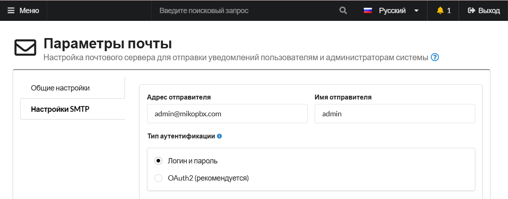

# Почта и уведомления (new)

Раздел **«Почта и уведомления»** в MikoPBX позволяет настроить отправку системных уведомлений через электронную почту. Здесь администраторы указывают параметры SMTP-сервера, определяют события для уведомлений, такие как голосовые сообщения или системные ошибки, и редактируют шаблоны писем. Этот раздел помогает своевременно информировать пользователей и администраторов о важных событиях, обеспечивая эффективный контроль за работой системы.

<figure><figcaption>
Раздел "<strong>Почта и уведомления</strong>" в MikoPBX
</figcaption></figure>

### Общие настройки

<figure><figcaption>
Общие настройки почты
</figcaption></figure>

* **Использовать оповещения** - позволяет включить/отключить **все оповещения на email**, включая голосовую почту.
* Отправлять уведомления о пропущенных вызовах - позволяет включить/отключить уведомления о пропущенных вызовах.
* **Единый Email для уведомлений о пропущенных вызовах** - общий адрес электронной почты для отправки уведомлений о пропущенных внешних вызовах (если у сотрудника не указан email, используется этот общий адрес).
* **Отправлять уведомления о голосовых сообщениях** - позволяет включить/отключить уведомления о голосовых сообщениях.
* **Единый Email для уведомлений о голосовых сообщениях** - общий адрес  электронной почты для отправки уведомлений о голосовых сообщениях (приоритет: 1. Личный email сотрудника; 2. Указанный email в этом поле)
* **Отправлять уведомления о входах в систему** - позволяет включить/отключить уведомления о входах в систему.
* **Отправлять системные уведомления** - позволяет включить/отключить отправку системных уведомлений.
* **Email системного администратора** - адрес, на который будут отправляться системные уведомления.

### Настройки SMTP

<figure><figcaption>
Настройки SMTP. Часть 1
</figcaption></figure>

