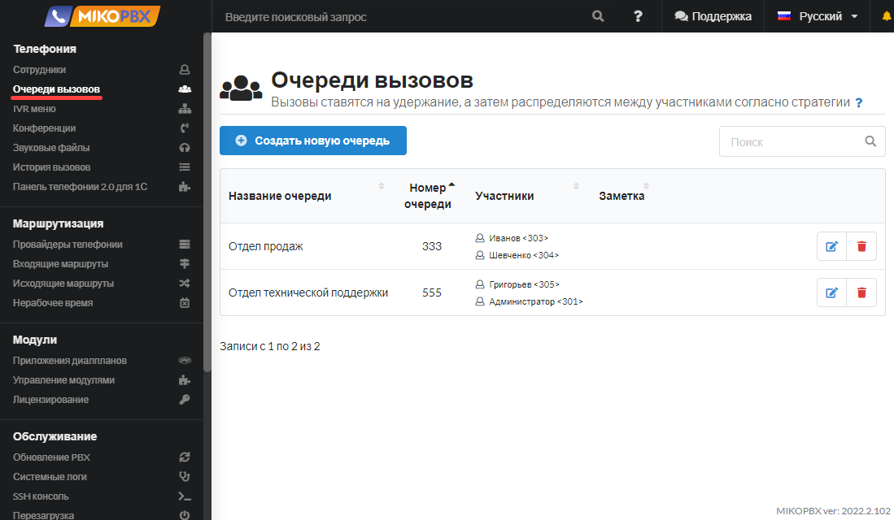
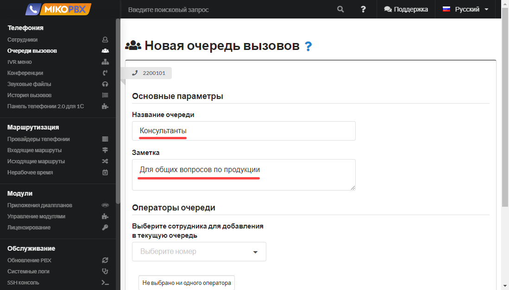
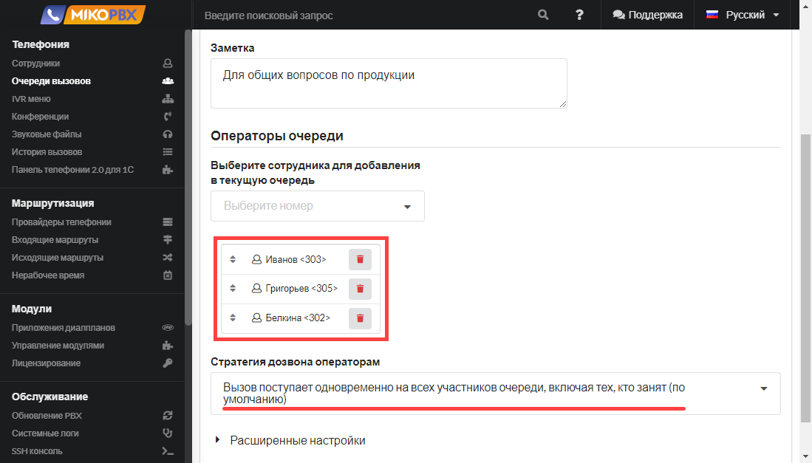
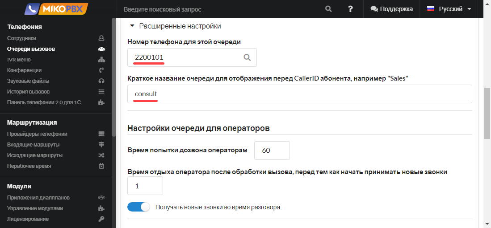
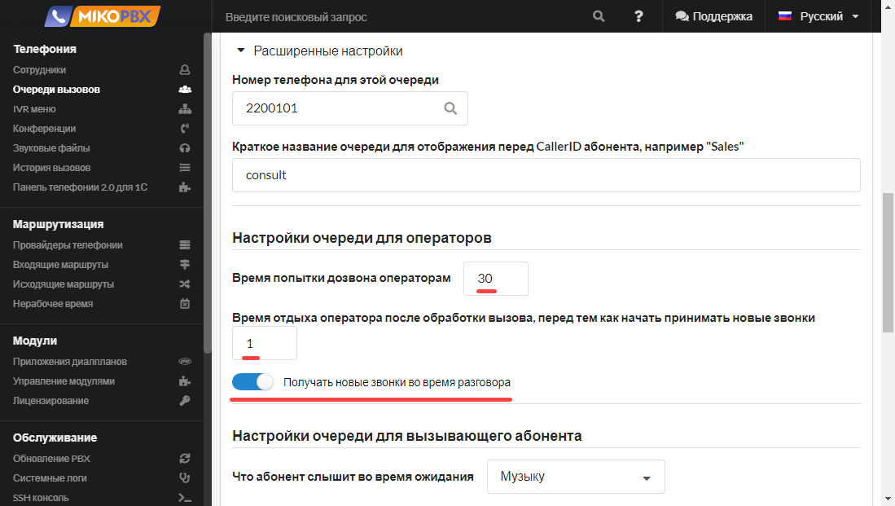
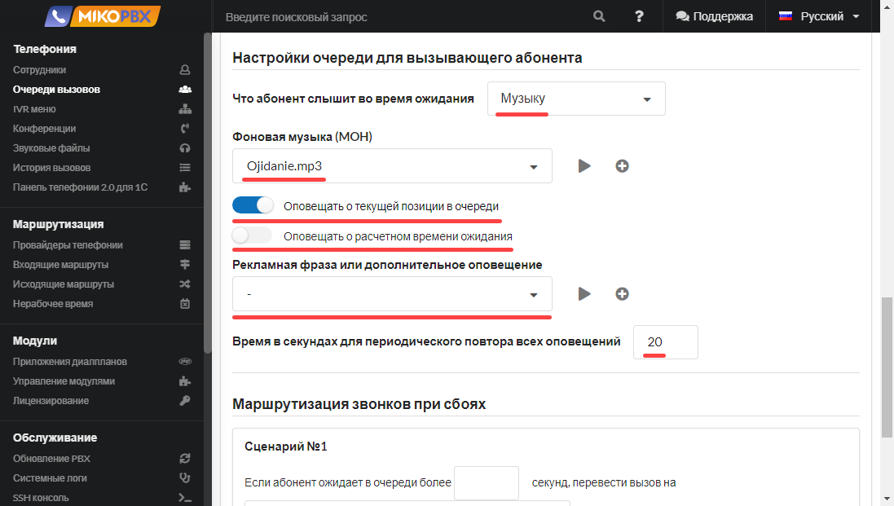
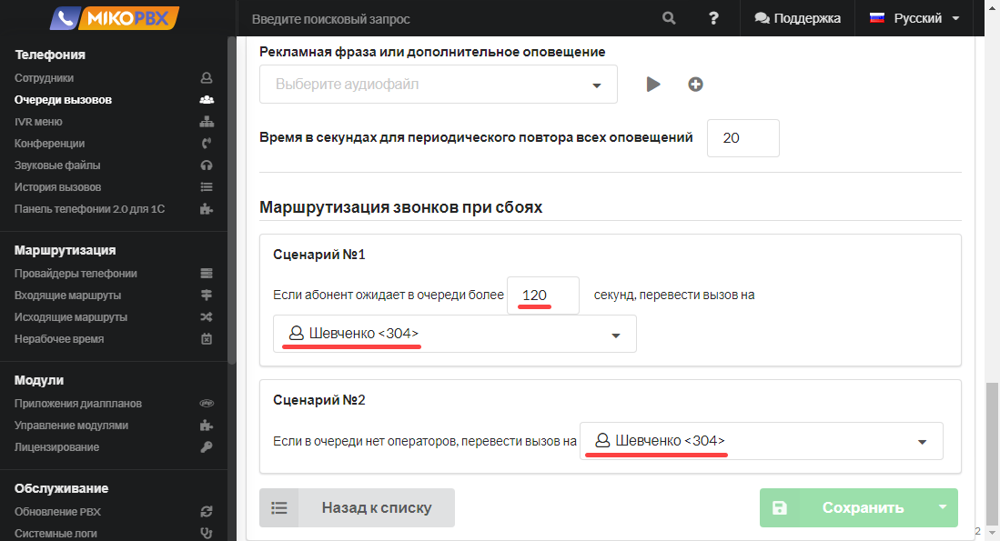

# Очереди вызовов

Очереди позволяют:

1. Распределять телефонные звонки между группой сотрудников (агентов): Вы можете создать очередь вызовов и добавить в нее несколько сотрудников. Когда поступает звонок, система автоматически направляет его к доступному сотруднику в очереди, обеспечивая более равномерное распределение нагрузки и повышая эффективность обработки вызовов.
2. Удерживать клиента на линии, если все сотрудники заняты: Если все сотрудники в очереди заняты обработкой других вызовов, клиент будет удерживаться на линии, пока не освободится один из сотрудников. Это помогает избежать потери вызовов и обеспечивает более качественное обслуживание клиентов.
3. Оповещать клиента о позиции в очереди и приблизительном времени ожидания: При нахождении клиента в очереди система может предоставлять информацию о его текущей позиции в очереди и ориентировочное время ожидания. Это помогает удержать клиента в курсе ситуации и улучшает его опыт общения.
4. Передавать на телефон сотрудника имя очереди, вместе с номером клиента: Когда сотрудник принимает вызов из очереди, на его телефоне отображается не только номер клиента, но и имя соответствующей очереди. Это помогает сотруднику более эффективно обрабатывать вызовы и предоставлять персонализированное обслуживание.

Для настройки очередей вызовов в MikoPBX следует перейти в раздел "**Телефония**" и выбрать "**Очереди вызовов**". Здесь вы сможете создать и настроить свои очереди в соответствии с требованиями вашего бизнеса и потребностями обслуживания клиентов.

<figure><figcaption></figcaption></figure>


**Длительность вызова на очередь по умолчанию равна 300 секундам**. После истечения этого времени вызов будет завершен. Для обхода этого ограничения следует настроить **Сценарий 1** (см. далее инструкции **Маршрутизация звонков при сбоях**).


## Основные параметры 

Для добавления новой очереди выполните действие **Создать новую очередь.**

<figure><figcaption></figcaption></figure>

* Укажите **Название очереди** - при настройке маршрутизации вы будете ориентироваться на него.
* Заполните описание в поле **Заметка** - оно будет доступно в списке очередей.

<figure><figcaption></figcaption></figure>

## Операторы очереди

В разделе **Операторы очереди** можно добавить произвольное число сотрудников (агентов очереди) и указать **стратегию** распределения вызовов.

<figure><figcaption></figcaption></figure>

Варианты **стратегии**:

* Вызываются **все доступные участники** до тех пор, пока кто-то из них не ответит на вызов (по умолчанию);
* Вызывается **первый свободный участник**, который **дольше всех не вызывался** из этой очереди;
* Вызывается **первый свободный участник**, который **обработал наименьшее количество** вызовов из данной очереди;
* Случайным образом вызывается **не занятый участник**, обрабатывающий очередь;
* **Циклическое распределение** с памятью. Запоминается последний участник, ответивший на вызов;
* Вызов поступает **на каждого участника очереди по порядку.**

## **Расширенные настройки**

В этом разделе можно дополнительно указать:

* **Номер телефона для этой очереди -** по этому номеру можно позвонить на очередь с любого внутреннего номера сотрудника. Также на этот номер можно перевести вызов.
* **Краткое название очереди** - для отображения перед **CallerID** абонента на телефонном аппарате, например **consult.**

<figure><figcaption></figcaption></figure>

### Настройки очереди для операторов 

<figure><figcaption></figcaption></figure>

* **Время попытки дозвона агенту** - время в секундах, в течение которого вызов будет идти на одного агента очереди. По завершении этого времени вызов агенту сохраняется в историю звонков как пропущенный. По завершении времени попытки дозвона до одного агента вызов направится на следующего агента согласно выбранной стратегии.
* **Время отдыха агента после обработки вызова, перед тем как начать принимать новые звонки** - время в секундах, которое отсчитывается с момента завершения разговора агентом очереди до момента поступления нового телефонного звонка агенту.
* **Получать новые звонки во время разговора** - переключатель включает / отключает возможность принятия новых звонков во время текущего разговора.

### Настройки очереди для вызывающего абонента 

<figure><figcaption></figcaption></figure>

* **Что абонент слышит во время ожидания** - во время ожидания ответа на свой звонок клиент может слышать музыку на удержании или сигнал вызова.
* **Фоновая музыка (MOH)** - можно указать уникальный звуковой файл для воспроизведения клиенту во время ожидания, к примеру рекламные материалы.
* **Оповещать о текущей позиции в очереди** - если все операторы (агенты очереди) заняты, то включив этот переключатель, можно оповестить клиента о его позиции в очереди. Если активирована опция **Дополнительный звуковой анонс**, то этот анонс дополнит информацию о позиции.
* **Оповещать о расчетном времени ожидания** - если все операторы (агенты очереди) заняты, то включив этот переключатель, можно оповестить клиента о примерном времени ожидания ответа на вызов. Если активирована опция **Дополнительный звуковой анонс**, то этот анонс дополнит информацию о расчетном времени.
* **Дополнительный звуковой анонс** - звуковое сообщение проигрывается только если все участники очереди заняты.
* **Время в секундах для периодического повтора всех оповещений** - описывает c каким интервалом произносить оповещение о позиции в очереди, времени ожидания и анонс.&#x20;

### Маршрутизация звонков при сбоях 

<figure><figcaption></figcaption></figure>

* **Сценарий 1** - в данном сценарии можно настроить максимально допустимое время ожидания клиента в очереди. Если в течение заданного времени никто из агентов очереди не смог ответить клиенту, то можно задать номер, на который будет в дальнейшем перенаправлен вызов.
* **Сценарий 2** - если в очереди нет агентов (то есть в данный момент ни один агент не зарегистрирован на АТС), то можно указать номер, на который будет переведен вызов клиента.


В данных сценариях в качестве номера переадресации можно выбрать не только внутренний номер, а также конференцию, очередь, IVR, приложение диалплана служебный номер.&#x20;



**Длительность вызова на очередь по умолчанию равна 300 секундам.** Если необходим больший интервал, то задайте в **Сценарий 1,** большую длительность и укажите резервный номер.


