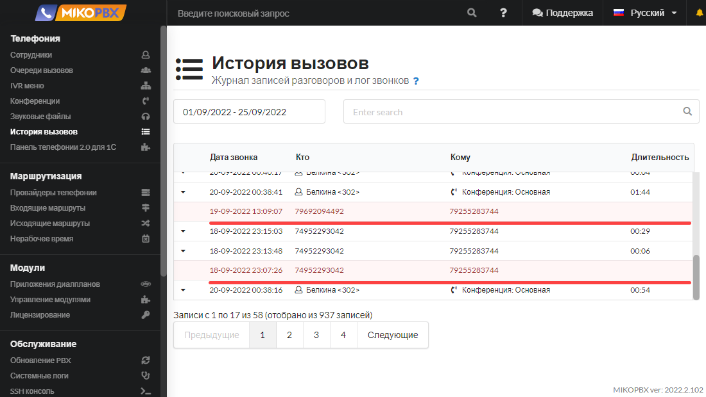
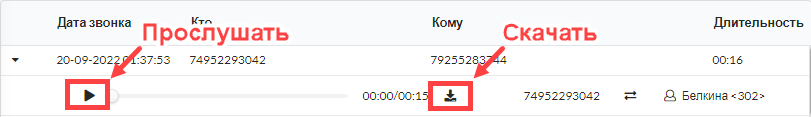
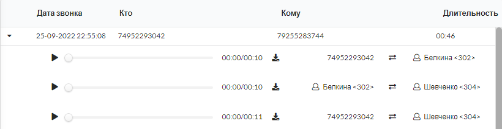
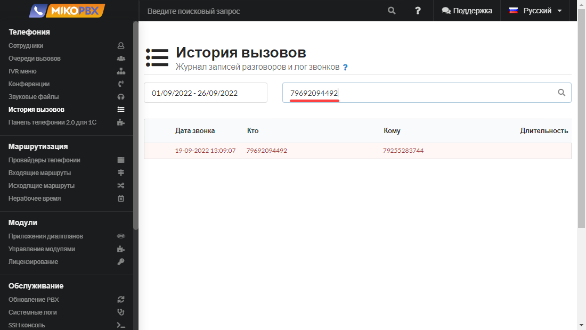
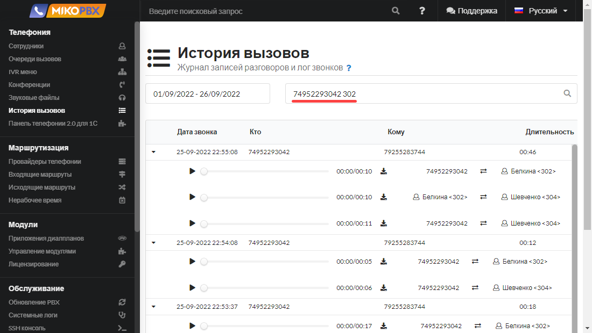
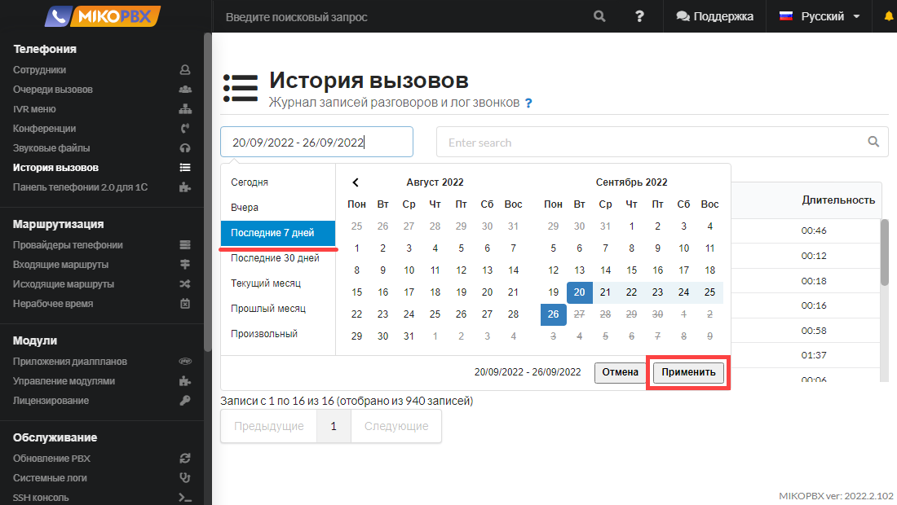
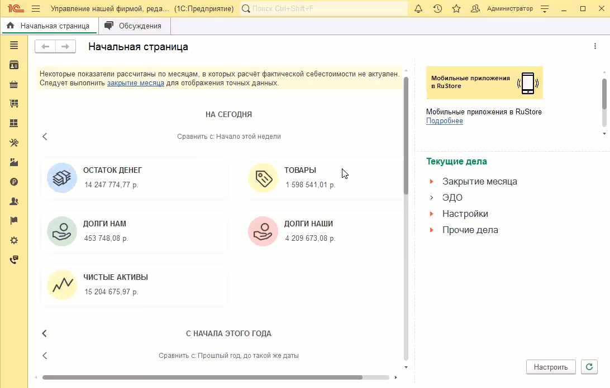

# История вызовов

История вызовов в MikoPBX — это журнал, который сохраняет информацию о всех входящих и исходящих звонках через систему. Она предоставляет детальные данные о каждом вызове, включая время, длительность, номера участников и статус, что позволяет анализировать коммуникации и оптимизировать работу телефонной сети компании. Располагается в разделе "**Телефония" -> "История вызовов"**.

<figure><figcaption>
Раздел "<strong>История вызовов</strong>"
</figcaption></figure>

## Чем она полезна

История вызовов в MikoPBX позволяет:

* Отобразить **все** вызовы;
* Отобразить вызовы **по отбору;**
* Визуально отобразить **пропущенные вызовы** из общего списка звонков;
* Скачать/прослушать запись разговора.

Каждый элемент списка содержит информацию о:

* номере телефона звонящего абонента (**Кто**);
* номере телефона, на который звонили (**Кому**);
* дате и времени свершения звонка (**Дата звонка**);
* длительности разговора (**Длительность**) - время голосового приветствия не учитывается.

Вызовы, отмеченные <mark style="color:red;">красным цветом</mark>, являются **пропущенными**. Длительность разговора для пропущенных вызовов равна нулю, такие вызовы невозможно прослушать.

<figure><figcaption>
Помеченные пропущенные вызовы в журнале
</figcaption></figure>

Для каждой записи истории звонков доступна возможность прослушивания и скачивания записи разговоров. При скачивании можно выбрать формат **WebM (Opus)**, **MP3**, **WAV** или **OGG (Opus)**.

<figure><figcaption>
Прослушивание и скачивание вызовов
</figcaption></figure>

Каждая строка вызова содержит полную информацию об участниках разговора.

<figure><figcaption>
Расширенная история вызова
</figcaption></figure>

На скриншоте выше отображено следующее:

1. Вызов поступил на номер 79255283744;
2. На вызов ответила Белкина;
3. Белкина осуществила консультативный перевод на Шевченко;
4. Шевченко продолжила разговор с клиентом.

## Отборы 


Для применения отбора нужно после ввода в поле значения нажать **Enter**.


В строке поиска истории вызовов можно реализовать следующие отборы:

1\) Отбор по **номеру** телефона

В строке поиска можно ввести как внутренний номер сотрудника, так и номер клиента (внешний).

<figure><figcaption>
Отбор по номеру телефона
</figcaption></figure>

2\) Отбор по **конкретному полю**

В строке поиска можно указать префикс, чтобы искать только по нужному полю:

* `src:74952293042` - искать по номеру звонящего;
* `dst:302` - искать по номеру назначения;
* `did:74952293042` - искать по DID-номеру;
* `linkedid:mikopbx-...` - искать по уникальному идентификатору звонка.

Если префикс не указан, MikoPBX выполняет общий поиск по номеру звонящего, номеру назначения, DID и имени сотрудника.

<figure><figcaption>
Поиск по номеру или отдельному полю истории вызовов
</figcaption></figure>

3\) Отбор по **дате**

При открытии истории звонков MikoPBX выбирает период по последним записям журнала. Установите нужный вам период и нажмите **Применить**.

<figure><figcaption>
Отбор по дате вызова
</figcaption></figure>

4\) Отбор по **linkedid**

**linkedid** - уникальный идентификатор звонка. Данным отбором удобно пользоваться, если необходимо найти вызов, исходя из данных [журнала звонков 1С](https://docs.telefon1c.ru/user-guides/journal/calls-and-records/). \
Для применения этого отбора:\
1\. Откройте журнал звонков 1С;\
2\. Выделите нужную строку;\
3\. Нажмите Подробнее во встроенном плеере (или вызвав контекстное меню на данной строке);\
4\. Скопируйте поле **Идентификатор**;\
5\. Вставьте это значение в строку поиска истории вызовов MikoPBX в формате `linkedid:значение` и нажмите **Enter**.

<figure><figcaption>
Отбор по linkedid
</figcaption></figure>
