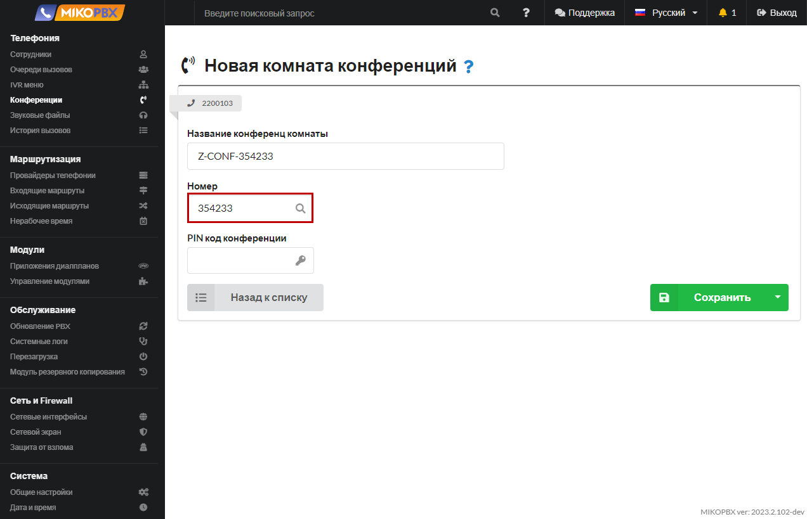

# Call queues

Queues allow you to:

1. Distribute phone calls among a group of employees (agents): You can create a call queue and add multiple employees to it. When a call comes in, the system automatically routes it to an available employee in the queue, ensuring a more even distribution of workload and increasing call handling efficiency.
2. Hold the customer on the line when all employees are busy: If all employees in the queue are occupied with other calls, the customer will be placed on hold until one of the employees becomes available. This helps avoid call abandonment and ensures better customer service.
3. Notify the customer of their position in the queue and approximate wait time: While the customer is in the queue, the system can provide information about their current position in the queue and an estimated wait time. This helps keep the customer informed and improves their waiting experience.
4. Display the queue name along with the customer's number on the employee's phone: When an employee answers a call from the queue, their phone displays not only the customer's number but also the name of the corresponding queue. This helps the employee handle calls more effectively and provide personalized service.

To configure call queues in MikoPBX, go to the "**Telephony**" section and select "**Call Queue**." Here, you can create and customize your queues according to your business requirements and customer service needs.

<figure><figcaption>
"Call queue" section
</figcaption></figure>


If **Scenario 1** has no backup destination selected, the queue has no overall waiting timeout: the call remains in the queue until an agent answers or the caller hangs up. To limit the waiting time, set the duration in **Scenario 1** and choose the destination for redirecting the call.


## Main settings

To add a new queue, perform the "Add a new call queue" action

<figure><figcaption>
"Add a new call queue" button
</figcaption></figure>

In the queue creation form or dialog, you will find the following fields:

* **Queue Name**: Enter a name for the queue. This name will be used for reference when setting up call routing rules.&#x20;
* **Note**: Provide a brief description or note about the queue. This information will be visible in the queue list, allowing you to provide additional details or instructions.

<figure><figcaption>
New call queue parameters
</figcaption></figure>

## Queue Agents

In the **Queue Agents** section, you can add an arbitrary number of employees (queue agents) and specify a call distribution **strategy**.

<figure><figcaption>
Queue agents section
</figcaption></figure>

Here are the options for queue strategy:

* _Ring All_: Calls are distributed to all agents at the same time until someone answers the call (default behavior).
* _Linear_: Calls are sent to agents one by one in the order configured in the **Queue Agents** list. After the **Time attempt call to agents** interval expires, the call is sent to the next agent.
* _Linear Progressive_: The first agent starts ringing immediately. After each **Time attempt call to agents** interval, the next agent is added while the previous agents continue ringing. Make sure the timeout in **Scenario 1** is long enough for all required agents to be added.
* _Least Recent_: The call is routed to the agent who has been idle for the longest time within the queue.
* _Fewest Calls_: The call is routed to the agent who has handled the fewest answered calls within the queue.
* _Random_: A random available agent within the queue is selected to receive the call.
* _Memory Hunt_: The system remembers the last agent who answered a call and starts the next distribution from the following agent.


After saving the queue, MikoPBX regenerates and reloads the queue configuration automatically. A manual Asterisk restart is not required when changing the strategy.


## **Advanced Settings**

<figure><figcaption>
Advanced settings button
</figcaption></figure>

In this section, you can provide additional information:

* **Phone number for this queue** - you can call the queue using this number from any internal employee extension. Calls can also be transferred to this number.
* **Short name for the queue** - for display before the CallerID on the telephone device of the subscriber, for example, "consult."

<figure><figcaption></figcaption></figure>

### Queue settings for agents

<figure><figcaption></figcaption></figure>

* **Time attempt call to agents**  - the duration in seconds for which a call will ring on an individual agent's phone. After this time elapses, the call to the agent will be logged as a missed call in the call history. Once the ring time is over, the call will be routed to the next available agent based on the selected strategy.
* **The rest time of the agent after the processing of the call, before starting to accept new calls** - the duration in seconds that is counted from the moment an agent finishes a call from the queue until they are ready to receive new calls. This period allows agents to update notes, complete necessary tasks, or take a short break before being assigned another call.
* **Receive New Calls During A Call** - this toggle switch enables or disables the ability to receive new calls while the agent is already on a call. When enabled, agents can handle multiple calls simultaneously.

### Queue settings for the caller

<figure><figcaption>
Queue settings for the caller
</figcaption></figure>

* **What the caller hears while waiting** - During the wait for their call to be answered, the caller can hear either hold music or a ringing tone.
* **Background Music** (MOH) - You can specify a unique audio file to be played to the caller during the wait, such as promotional materials.
* **Notify about current queue position** - If all operators (queue agents) are occupied, enabling this toggle switch allows you to notify the caller about their position in the queue. If the Additional Audio Announcement option is activated, this announcement will supplement the information about the position.
* **Notify about estimated hold time** - If all operators (queue agents) are occupied, enabling this toggle switch allows you to inform the caller about the approximate wait time for a call to be answered. If the Additional Audio Announcement option is activated, this announcement will supplement the information about the estimated wait time.
* **Additional notification** - A sound message is played only if all participants in the queue are occupied.
* **Time in seconds to repeat all alerts periodically** - Describes the interval at which to announce the queue position, wait time, and announcement.

### Call routing in case of failures

<figure><figcaption>
Call routing in case of failures
</figcaption></figure>

* **The script #1** - In this scenario, you can configure the maximum allowable wait time for a client in the queue. If none of the queue agents can answer the client within the specified time, the call will be redirected to the selected number. If no redirect destination is selected, the overall queue timeout is not applied.
* **The script #2** - If there are no agents available in the queue (meaning no agents are currently logged into the phone system), you can specify a number to which the client's call will be transferred.


In these scenarios, as a redirection number, you can choose not only an internal extension but also options such as a conference, queue, IVR (Interactive Voice Response), or a special number within the dial plan application. These options provide flexibility in directing the call to different destinations based on your specific requirements or business needs.



In **Scenario 1**, specify both the waiting time and the redirect destination. If only the time is filled in without a backup destination, MikoPBX does not pass the overall timeout to the queue application so that the call is not ended without a route to continue.

