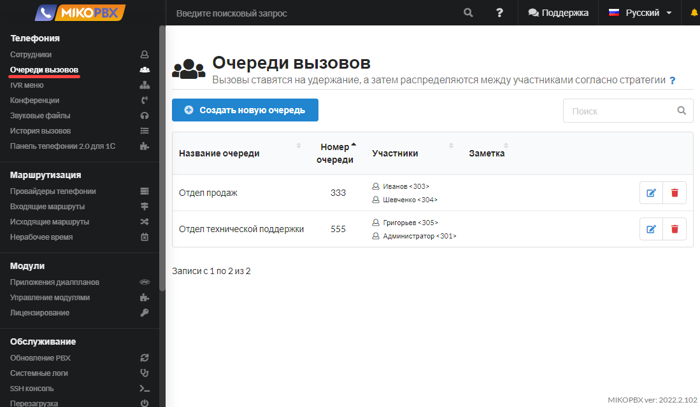
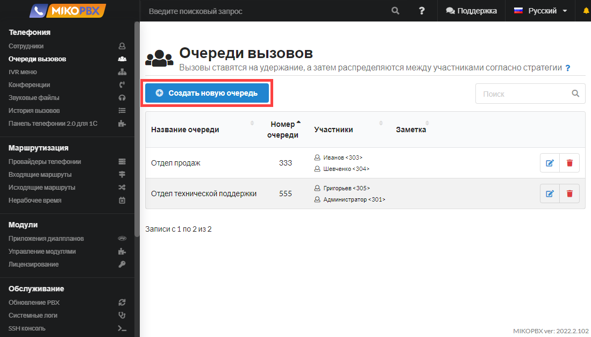
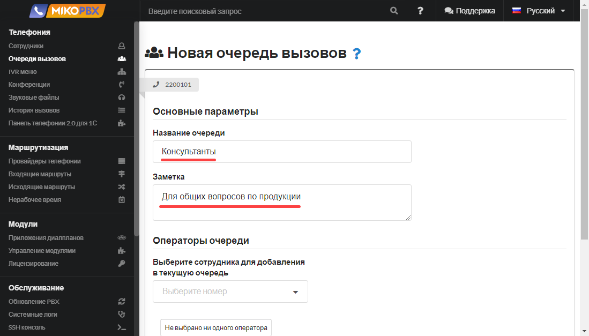
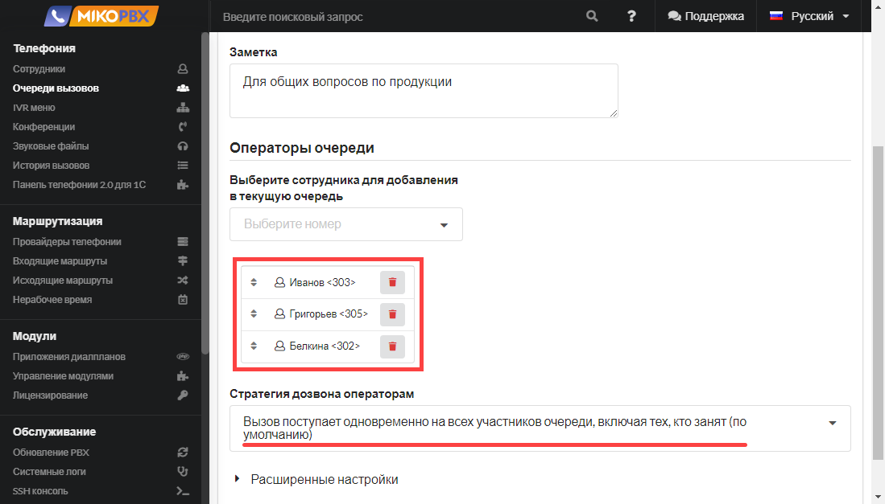
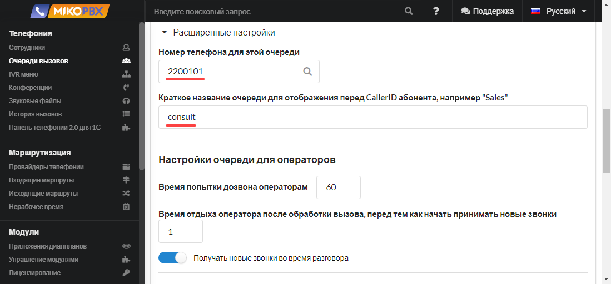
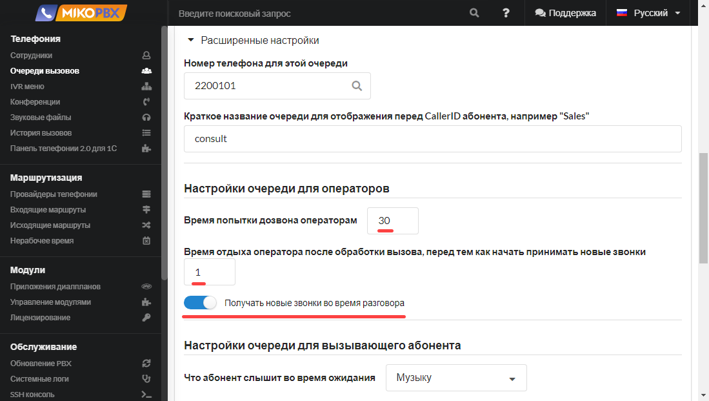
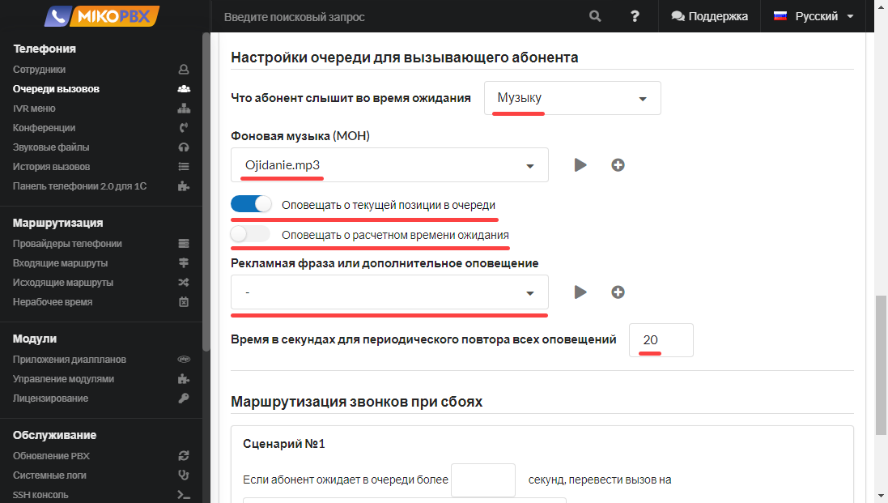
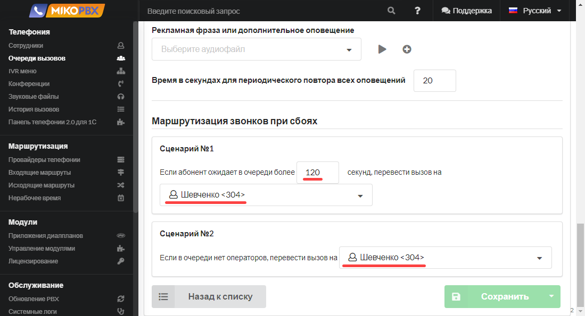

# Очереди вызовов

Очереди позволяют:

1. Распределять телефонные звонки между группой сотрудников (агентов): Вы можете создать очередь вызовов и добавить в нее несколько сотрудников. Когда поступает звонок, система автоматически направляет его к доступному сотруднику в очереди, обеспечивая более равномерное распределение нагрузки и повышая эффективность обработки вызовов.
2. Удерживать клиента на линии, если все сотрудники заняты: Если все сотрудники в очереди заняты обработкой других вызовов, клиент будет удерживаться на линии, пока не освободится один из сотрудников. Это помогает избежать потери вызовов и обеспечивает более качественное обслуживание клиентов.
3. Оповещать клиента о позиции в очереди и приблизительном времени ожидания: При нахождении клиента в очереди система может предоставлять информацию о его текущей позиции в очереди и ориентировочное время ожидания. Это помогает удержать клиента в курсе ситуации и улучшает его опыт общения.
4. Передавать на телефон сотрудника имя очереди, вместе с номером клиента: Когда сотрудник принимает вызов из очереди, на его телефоне отображается не только номер клиента, но и имя соответствующей очереди. Это помогает сотруднику более эффективно обрабатывать вызовы и предоставлять персонализированное обслуживание.

Для настройки очередей вызовов в MikoPBX следует перейти в раздел "**Телефония**" и выбрать "**Очереди вызовов**". Здесь вы сможете создать и настроить свои очереди в соответствии с требованиями вашего бизнеса и потребностями обслуживания клиентов.

<figure><figcaption>
Раздел "<strong>Очереди вызовов</strong>"
</figcaption></figure>


**Длительность вызова на очередь по умолчанию равна 300 секундам**. После истечения этого времени вызов будет завершен. Для обхода этого ограничения следует настроить **Сценарий 1** (см. далее инструкции **Маршрутизация звонков при сбоях**).


## Основные параметры 

Для добавления новой очереди выполните действие **Создать новую очередь.**

<figure><figcaption>
Элемент "<strong>Создать новую очередь</strong>"
</figcaption></figure>

* Укажите **Название очереди** - при настройке маршрутизации вы будете ориентироваться на него.
* Заполните описание в поле **Заметка** - оно будет доступно в списке очередей.

<figure><figcaption>
Параметры для новой очереди вызовов
</figcaption></figure>

## Стратегия и операторы очереди

В разделе **Операторы очереди** можно добавить произвольное число сотрудников (агентов очереди) и указать **стратегию** распределения вызовов.

<figure><figcaption>
Раздел "<strong>Операторы очереди</strong>"
</figcaption></figure>

### Вызов на любого свободного

"**Вызов поступает на любого свободного участника очереди кроме участника, обработавшего последний вызов**" - эта стратегия также именуется как "rrmemory" - Round Robin Memory.  &#x20;

АТС помнит, кому был направлен последний вызов, и следующий вызов отправляется следующему оператору в списке.

Порядок списка сотрудников можно определить в разделе "`Операторы очереди`", перетаскиванием можно переместить оператора вверх или вниз.&#x20;

**Пример**:

Если у вас описаны: Оператор1, Оператор2, Оператор3, и последний вызов был направлен Оператор2, то следующий вызов пойдёт Оператор3, потом Оператор1, и т.д. — в цикле, не с начала, а с "места остановки".

"`Время попытки дозвона операторам`" - для данной стратегии параметр определяет длительность попытки звонка оператору. Если оператор не ответил, то АТС пытается звонить следующему доступному согласно условиям стратегии.&#x20;

### Вызов одновременно на всех

**Вызов поступает одновременно на всех участников очереди, включая тех, кто занят** (по умолчанию) - также эта стратегия именуется как "`ringall`"

АТС будет инициировать вызов всем оператором очереди одновременно. Следует учитывать, что скорость поступления вызову оператору зависит от сети предприятия. \
\
**Пример**:

Если в очереди определены операторы&#x20;

* `Оператор с внутренним номером`, подключен стационарный IP телефон в локальной сети - вызов поступит мнгновенно
* `Оператор с внутренним номером`, подключен софтфон на смартфон через LTE - вызов поступит с задержкой
* `Оператор с мобильным номером` - вызов поступит с значительной задержкой 5-8 секунд

Задержка поступления вызова связана с особенностями внешних сетей (относительно предприятия), но начало вызова происходит одновременно.&#x20;

"`Время попытки дозвона операторам`" - спустя это время вызов всем операторам завершится и инициируется новый вызов.&#x20;

### Вызов на того, кто дольше не принимал вызовы

**Вызов поступает на участника очереди, который дольше всех не принимал звонки** - также эта стратегия именуется как "leastrecent"

Каждый новый вызов направляется оператору, который дольше всех не принимал вызовов, анализируется только последний отвеченный вызов.

Пример:

* `101` — последний вызов: `10:00`
* `102` — последний вызов: `10:05`
* `103` — последний вызов: `09:50`← самый старый

Как "`Время попытки дозвона операторам`" = `20` влияет на вызов:

1. АТС набирает номер 103 (он дольше всех не принимал вызов).
2. Проходит 20 секунд → оператор не ответил.
3. АТС считает, что агент недоступен, и НЕ обновляет время последнего вызова (вызов не был принят!)
4. Очередь выбирает снова 103 (он дольше всех не принимал вызов).

⚠️ Ключевой момент: если агент не ответил — он всё ещё считается "не занятым", и может быть выбран снова в ближайшем будущем, потому что его "время последнего вызова" не обновилось.

Счетчик отвеченных вызовов сбрасывается при перегрузке АТС. &#x20;

### Вызов на того, кто меньше отвечал на вызовы

**Вызов поступает на участника очереди, который обработал меньше всего звонков** - также эта стратегия именуется как "fewestcalls"

Каждый новый вызов направляется оператору, который меньше всех принимал вызовов, анализируется только количество отвеченных вызов.

Пример:

* `101` — всего вызов: `1` ← меньше всего вызовов
* `102` — всего вызов: `5`
* `103` — всего вызов: `3`\

Счетчик отвеченных вызовов сбрасывается при перегрузке АТС.&#x20;

Как "`Время попытки дозвона операторам`" = `20` влияет на вызов:

1. АТС выбирает 101 (меньше всех обработал вызов).
2. Проходит 20 секунд → оператор не ответил.
3. АТС считает, что агент недоступен, и НЕ обновляет количество вызовов (вызов не был принят!),
4. Очередь выбирает снова 101 (меньше всех обработал вызов).

⚠️ Ключевой момент: если агент не ответил — он всё ещё считается "не занятым", и может быть выбран снова в ближайшем будущем, потому что его "количество отвеченных вызовов" не обновилось.

### Вызов на любого свободного

**Вызов поступает на любого свободного участника очереди - т**акже эта стратегия именуется как "`random`" - вызов случайного оператора.&#x20;

"`Время попытки дозвона операторам`" - спустя это время вызов оператору завершится и инициируется вызов на следующего произвольного сотрудника

### Вызов поступает на каждого участника очереди по порядку

Также эта стратегия именуется как  "`linear`".&#x20;

Пример операторов:

* 101 ← вызов всегда будет поступать сперва на этого сотрудника
* 102 - спустя "Время попытки дозвона операторам" вызов оператору завершится и инициируется вызов на следующего&#x20;
* 103


В asterisk есть ограничение: "Changing to the linear strategy currently requires asterisk to be restarted"

После изменения стратегии в это значение потребуется перегрузка asterisk.&#x20;

Можно в консоли [SSH](../../faq/troubleshooting/connecting-to-a-pbx-using-ssh/) выполнить команду:

`asterisk -rx'core restart now'`

это действие завершит все активные телефонные звонки и сбросит счетчики очередей.&#x20;


## **Расширенные настройки**

В этом разделе можно дополнительно указать:

* **Номер телефона для этой очереди -** по этому номеру можно позвонить на очередь с любого внутреннего номера сотрудника. Также на этот номер можно перевести вызов.
* **Краткое название очереди** - для отображения перед **CallerID** абонента на телефонном аппарате, например **consult.**

<figure><figcaption>
Расширенные настройки очереди
</figcaption></figure>

### Настройки очереди для операторов 

<figure><figcaption>
Раздел "<strong>Настройки очереди для операторов</strong>"
</figcaption></figure>

* **Время попытки дозвона агенту** - время в секундах, в течение которого вызов будет идти на одного агента очереди. По завершении этого времени вызов агенту сохраняется в историю звонков как пропущенный. По завершении времени попытки дозвона до одного агента вызов направится на следующего агента согласно выбранной стратегии.
* **Время отдыха агента после обработки вызова, перед тем как начать принимать новые звонки** - время в секундах, которое отсчитывается с момента завершения разговора агентом очереди до момента поступления нового телефонного звонка агенту.
* **Получать новые звонки во время разговора** - переключатель включает / отключает возможность принятия новых звонков во время текущего разговора.

### Настройки очереди для вызывающего абонента 

<figure><figcaption>
НАстройки очереди для вызывающего абонента
</figcaption></figure>

* **Что абонент слышит во время ожидания** - во время ожидания ответа на свой звонок клиент может слышать музыку на удержании или сигнал вызова.
* **Фоновая музыка (MOH)** - можно указать уникальный звуковой файл для воспроизведения клиенту во время ожидания, к примеру рекламные материалы.
* **Оповещать о текущей позиции в очереди** - если все операторы (агенты очереди) заняты, то включив этот переключатель, можно оповестить клиента о его позиции в очереди. Если активирована опция **Дополнительный звуковой анонс**, то этот анонс дополнит информацию о позиции.
* **Оповещать о расчетном времени ожидания** - если все операторы (агенты очереди) заняты, то включив этот переключатель, можно оповестить клиента о примерном времени ожидания ответа на вызов. Если активирована опция **Дополнительный звуковой анонс**, то этот анонс дополнит информацию о расчетном времени.
* **Дополнительный звуковой анонс** - звуковое сообщение проигрывается только если все участники очереди заняты.
* **Время в секундах для периодического повтора всех оповещений** - описывает c каким интервалом произносить оповещение о позиции в очереди, времени ожидания и анонс.&#x20;

### Маршрутизация звонков при сбоях 

<figure><figcaption>
Раздел "Маршрутизация звонков при сбоях"
</figcaption></figure>

* **Сценарий 1** - в данном сценарии можно настроить максимально допустимое время ожидания клиента в очереди. Если в течение заданного времени никто из агентов очереди не смог ответить клиенту, то можно задать номер, на который будет в дальнейшем перенаправлен вызов.
* **Сценарий 2** - если в очереди нет агентов (то есть в данный момент ни один агент не зарегистрирован на АТС), то можно указать номер, на который будет переведен вызов клиента.


В данных сценариях в качестве номера переадресации можно выбрать не только внутренний номер, а также конференцию, очередь, IVR, приложение диалплана служебный номер.&#x20;



**Длительность вызова на очередь по умолчанию равна 300 секундам.** Если необходим больший интервал, то задайте в **Сценарий 1,** большую длительность и укажите резервный номер.

