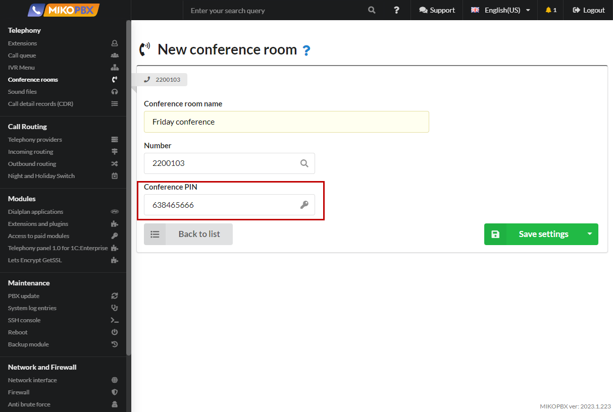

# Conference rooms

Conference calling is used for conducting group discussions, meetings, or negotiations in cases where participants are unable to meet in person. It is also used when a particular matter needs to be discussed with multiple participants simultaneously.

## Create conference rooms

The list of conference rooms is located in the **Telephony** -> **Conferences section**.

To create a new conference room, click the "**Add conference**".

<figure><figcaption></figcaption></figure>

You must specify the name of the conference and its internal number, by calling which you can enter this conference

<figure><figcaption></figcaption></figure>

To prevent unauthorized access to the conference by employees for whom the discussion is not intended, you can secure the conference room with a password. To do this, fill in the "**Conference Pin**" field. Only digits can be entered in this field, with a minimum requirement of at least one digit.

<figure><figcaption></figcaption></figure>

In this case, to join the conference, employees will need to enter the PIN code after dialing the **conference PIN**.

## Characteristics of conference calling include:

* Communication is conducted solely through voice (no other means of information transmission besides speech are provided).
* All participants can speak and hear each other simultaneously, ensuring duplex communication.
* Participants use telephones (hardware or software) for communication.

## Usage:&#x20;

* Each participant dials the conference number. The first participant hears hold music until at least one more participant joins the conference. An employee can transfer their caller into the conference by using specific key combinations on their phone. Transfers can be made to both internal and external numbers. The key combination for transfers is set in the **System** -> **General Settings** -> **Call Transfers section.**&#x20;
* Example: An employee dials the combination **\*\*1111** (the combination for unconditional transfer), and their caller joins the conference as its first participant. The call is completed for the transferring employee, and to join the conference, they dial the conference number **1111**.


The maximum number of conference participants is not limited.

