# Сотрудники

Сотрудники в MikoPBX - это индивидуальные пользователи системы, которым назначены внутренние номера для совершения и приема звонков. Они имеют персональные учетные записи, позволяющие настроить права доступа, переадресацию вызовов и другие персональные настройки в системе.

## Список сотрудников <a href="#spisok_sotrudnikov" id="spisok_sotrudnikov"></a>

В разделе **Сотрудники** представлен список внутренних учетных записей сотрудников. Слева от сотрудника отображается статус авторизованного устройства. Если устройство успешно авторизовано под данной внутренней учетной записью, то кружок отображается зеленым цветом, иначе серым.

<figure>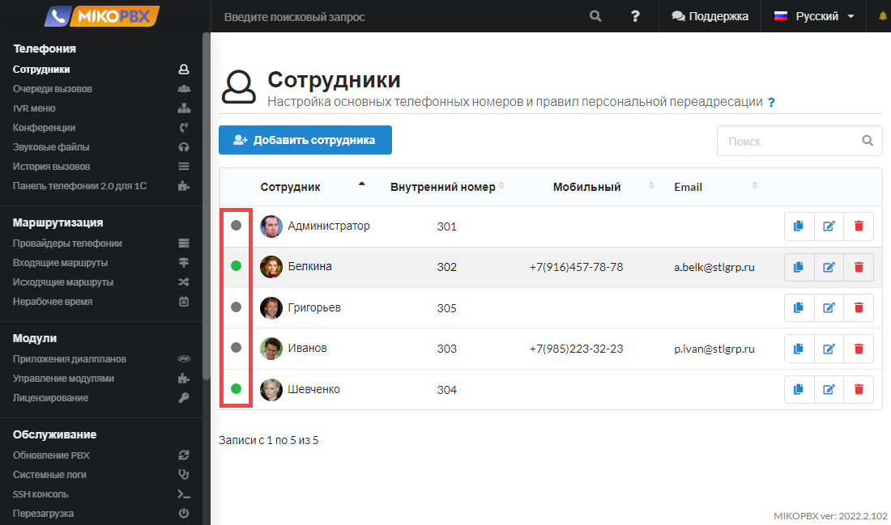<figcaption><p>Статусы сотрудников</p></figcaption></figure>

В строке поиска можно найти необходимый контакт. Поиск можно осуществлять по имени сотрудника, внутреннему номеру, мобильному номеру, адресу электронной почты.

<figure>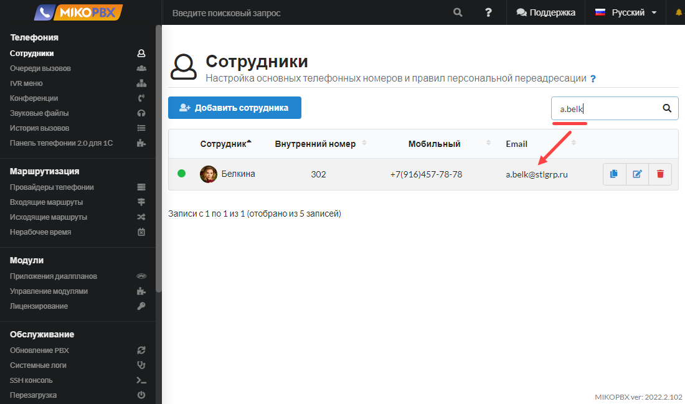<figcaption><p>Поиск сотрудника по электронной почте</p></figcaption></figure>

На форме также есть возможность сортировки списка сотрудников по имени, внутреннему номеру, мобильному номеру, адресу электронной почты. Имеются кнопки копирования пароля для SIP учетной записи в буфер обмена, редактирования учетной записи и её удаления.

<figure>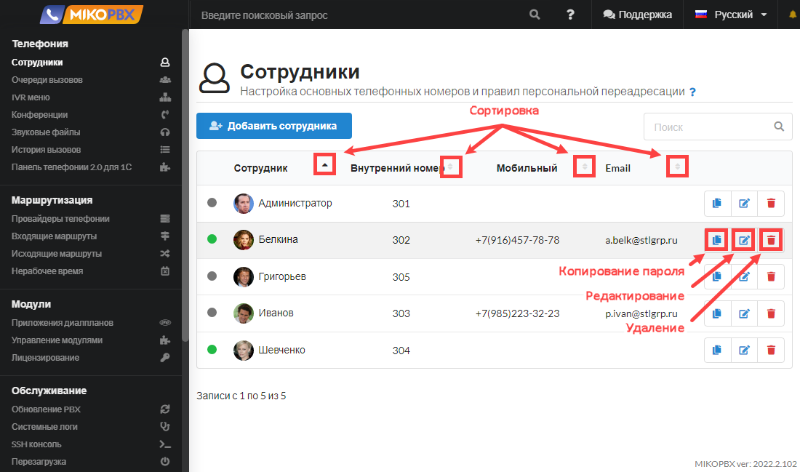<figcaption><p>Сортировка сотрудников и функции в главном меню</p></figcaption></figure>

## Добавление сотрудника <a href="#dobavlenie_sotrudnika" id="dobavlenie_sotrudnika"></a>


Существует два способа добавления сотрудников:&#x20;

1\) Поштучное добавление с вводом данных в Web-интерфейсе.

2\) Импорт нескольких сотрудников из CSV файла.&#x20;


### Поштучное добавление сотрудников

Для добавления нового сотрудника необходимо нажать кнопку **Добавить сотрудника**.

<figure>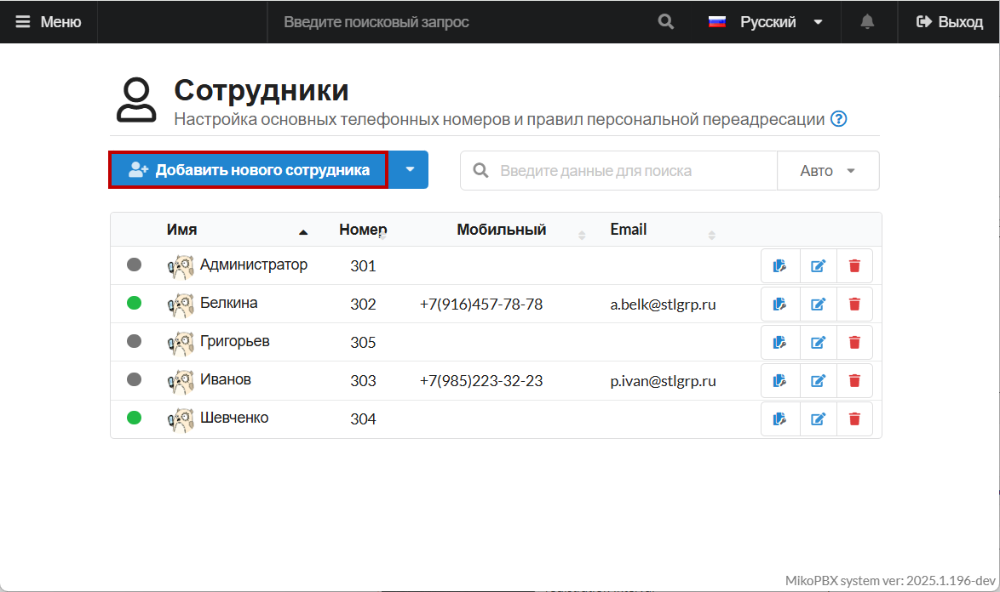<figcaption><p>Элемент "<strong>Добавить нового сотрудника</strong>"</p></figcaption></figure>

### Импорт и экспорт сотрудников из CSV файла <a href="#import_i_eksport_csv" id="import_i_eksport_csv"></a>

Существует возможность экспорта и импорта сотрудников для удобства настройки. Для этого, нажмите для стрелочку справа от кнопки "Добавить нового сотрудника".

Доступны 3 опции:

1. Импорт из CSV - загрузить сотрудников из CSV файла в MikoPBX.
2. Экспорт в CSV - загрузить сотрудников в CSV файл из MikoPBX (сотрудники не будут удалены со станции).
3. Скачать шаблон - загрузить шаблон CSV таблицы для заполнения и дальнейшего импорта в MikoPBX.

<figure>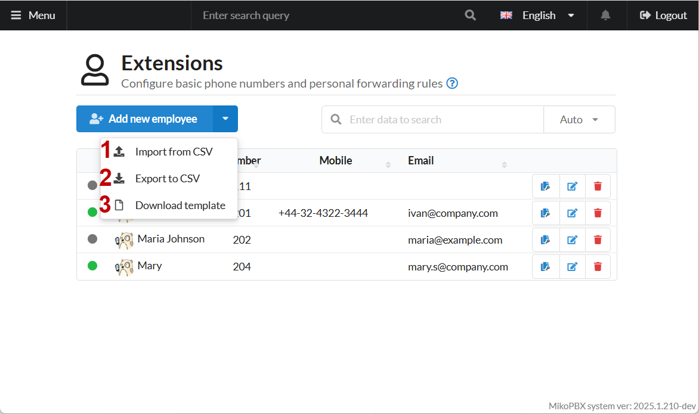<figcaption><p>Возможности для группового импорта/экспорта сотрудников</p></figcaption></figure>

#### Импорт <a href="#import_csv" id="import_csv"></a>

Нажмите на "**Выбрать CSV файл**" и выберите ранее оформленный файл с данными в таблице. Рекомендуется использовать шаблоны из вкладки "**Шаблон**".

<figure>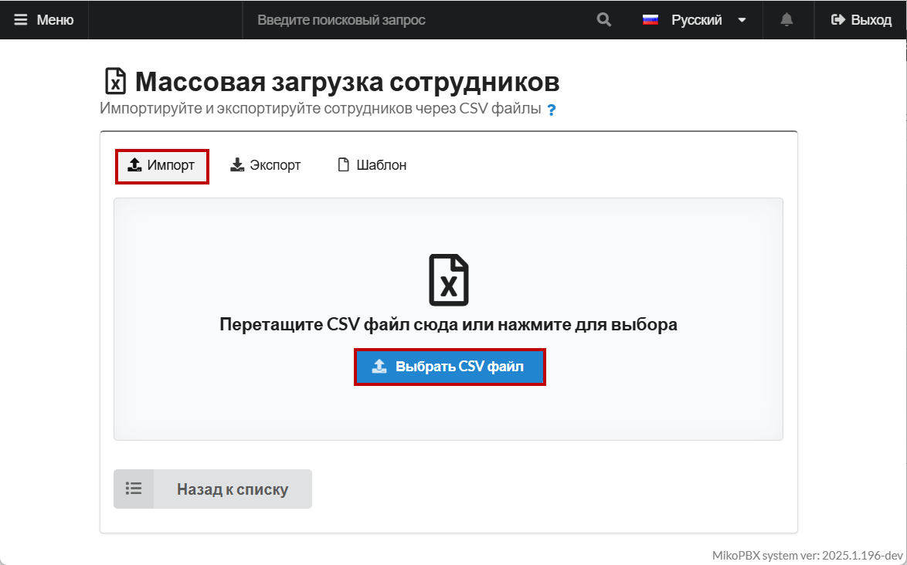<figcaption><p>Раздел "Импорт"</p></figcaption></figure>

После выбора файла, будет отображена информация по всем обнаруженным пользователям в таблице. Выберите стратегию обработки дубликатов и нажмите "Подтвердить импорт" для начала процесса.

<figure><figcaption><p>Параметры импорта сотрудников</p></figcaption></figure>

После окончания процесса, Вы увидите статус создания сотрудников, а так же уведомление об окончании импорта.&#x20;

Нажмите "Назад к списку" для возвращения к списку сотрудников.

<figure>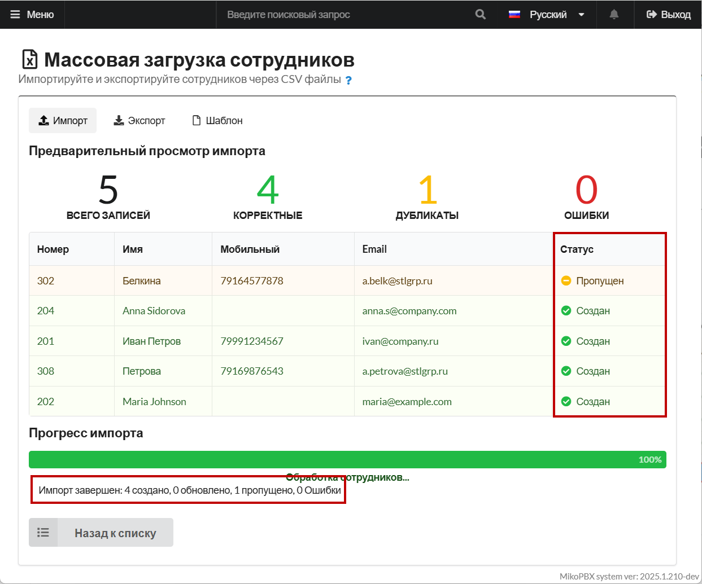<figcaption><p>Успешный импорт сотрудников</p></figcaption></figure>

#### Экспорт <a href="#eksport_csv" id="eksport_csv"></a>

Существует возможность экспорта CSV файла со всеми данными текущих сотрудников. Есть несколько форматов экспорта:

**Минимальный:**

* number - Внутренний номер (обязательное)
* user\_username - ФИО сотрудника (обязательное)
* user\_email - Email адрес
* mobile\_number - Мобильный номер
* sip\_secret - Пароль SIP (если не указать будет сгенерирован)
* fwd\_ringlength - Время звонка (секунды) до переадресации
* fwd\_forwarding - Номер переадресации если не ответил

**Стандартный:**

* Все параметры из Минимального.
* mobile\_dialstring - Номер для набора мобильного
* sip\_dtmfmode - DTMF режим (auto/rfc4733/info/inband/auto\_info)
* sip\_transport - Транспорт (udp/tcp/tls), по умолчанию udp,tcp
* sip\_enableRecording - Запись разговоров (true/false)
* fwd\_forwardingonbusy - Номер переадресации если занят
* fwd\_forwardingonunavailable - Номер переадресации если недоступен

**Полный:**

* Все параметры из Минимального и Стандартного.
* user\_avatar - URL фотографии
* sip\_acceptMultipleCalls - Принимать несколько вызовов одновременно (true/false)
* sip\_manualattributes - Дополнительные SIP параметры

Так же Вы можете указать диапазон внутренних номеров сотрудников, которых необходимо экспортировать (раздел "**Фильтр по диапазону номеров**").

Нажмите "Экспортировать сотрудников". Файл будет загружен на Ваше устройство.

<figure>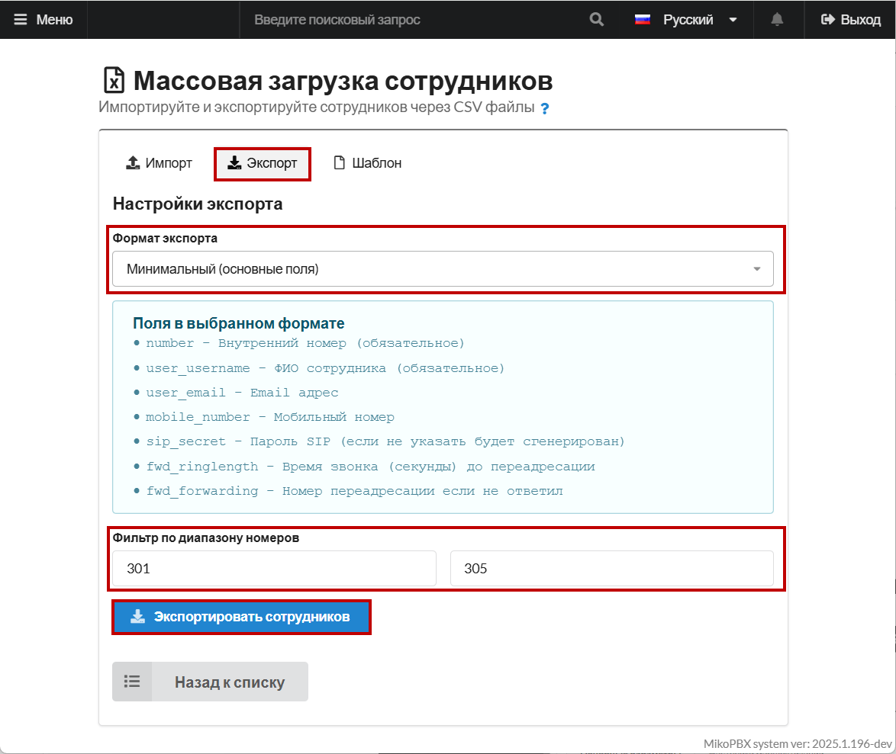<figcaption><p>Раздел "Экспорт"</p></figcaption></figure>

#### Шаблон <a href="#shablon_csv" id="shablon_csv"></a>

На этой вкладке Вы можете скачать шаблон пустого файла с указанными "столбцами" для заполнения и дальнейшего импорта в MikoPBX.&#x20;

Выберите формат шаблона (подробнее в разделе "[Экспорт](extensions.md#eksport_csv)"), нажмите "**Скачать CSV шаблон**".

<figure>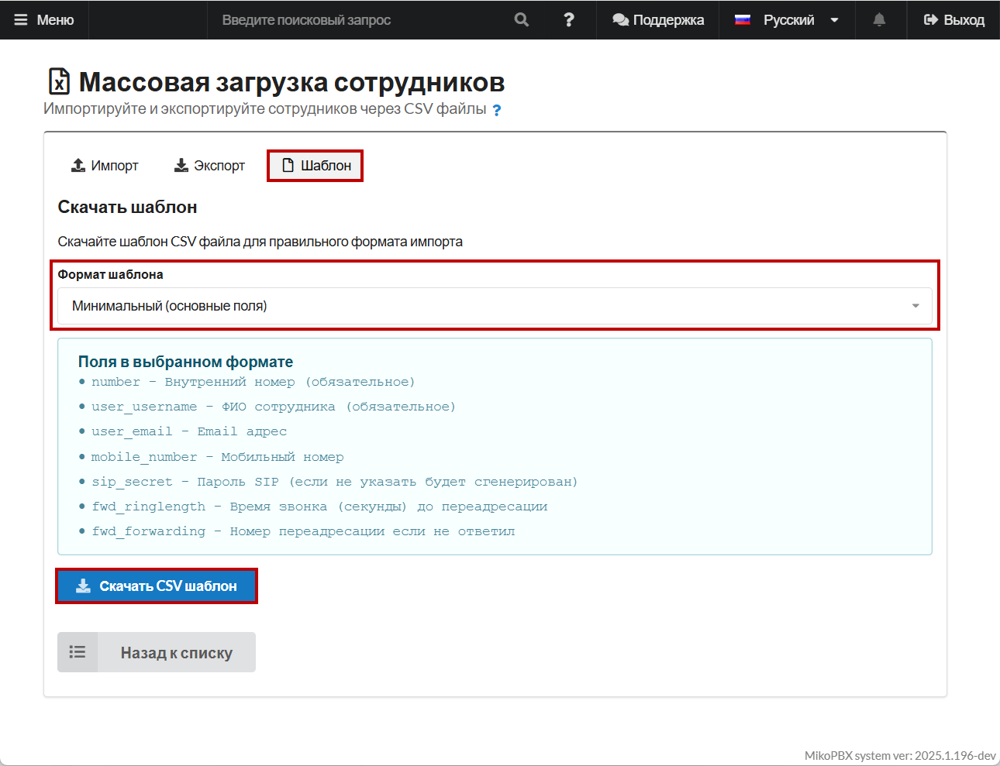<figcaption><p>Раздел "Шаблон"</p></figcaption></figure>

## Основные параметры учетной записи <a href="#osnovnye_parametry" id="osnovnye_parametry"></a>

<figure><figcaption><p>Вкладка параметров учетной записи сотрудника</p></figcaption></figure>

На вкладке **Основные параметры** задаются общие настройки внутренней учетной записи сотрудника:

* **ФИО пользователя** - допускается использование кириллицы. Это значение будет использоваться при подстановке CALLERID(name) абонента, будет отображаться в соответствующем поле экрана телефона.
* **Внутренний номер** - он же используется в качестве **Логин** при подключении телефона.
* **Мобильный номер** - используется для дополнительной маршрутизации.
* **Адрес электронной почты** - используется для email оповещений.
* **Пароль для SIP**&#x20;


Установите **сложные пароли** на учетные записи (**пароль для SIP**)! Пароль должен удовлетворять следующим требованиям:

* длина пароля должна быть длиннее восьми символов;
* пароль должен содержать буквы ВЕРХНЕГО и нижнего регистра;
* пароль должен содержать цифры и специальные знаки: «**-**», «**\_**», «**\[]**», «**{}**», «**@**», «**;**».


## Расширенные параметры учетной записи <a href="#rasshirennye_nastrojki" id="rasshirennye_nastrojki"></a>

Открываются путем нажатия на раскрывающийся список **Расширенные настройки**.

<figure>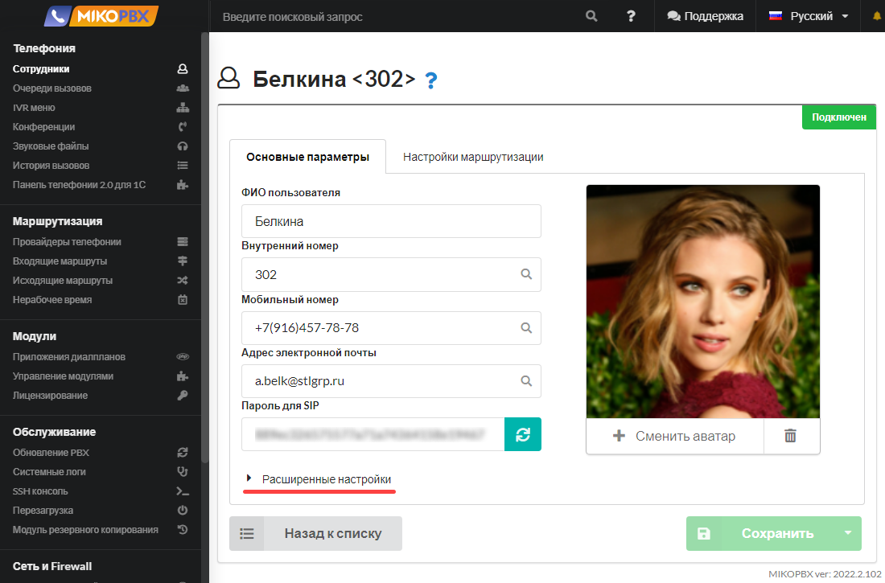<figcaption><p>Вкладка расширенных настроек учетной записи</p></figcaption></figure>

#### **Переопределение строки набора**

<figure>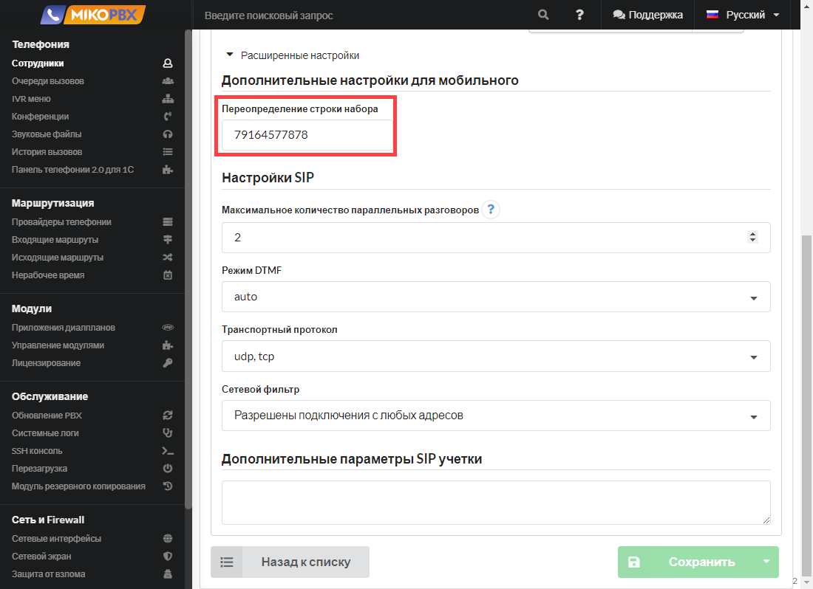<figcaption></figcaption></figure>

В поле **Переопределение строки набора** введите правило набора мобильного номера для Вашего провайдера.\
Например, в основных настройках номер мобильного телефона указан в формате _**8**_&#x39;164577878, согласно правилам исходящей маршрутизации для провайдера звонок возможен только на номера, начинающиеся с **7**.\
Следовательно в поле **Переопределение строки набора** следует указать номер **7**9164577878.

#### **Принимать несколько вызовов одновременно**

<figure>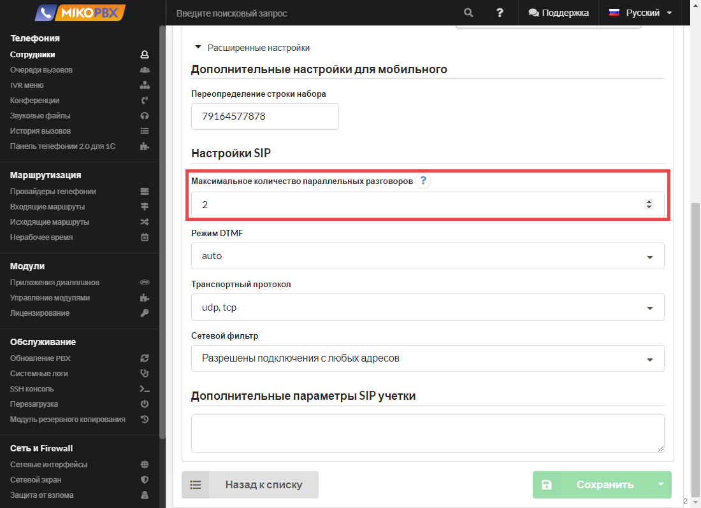<figcaption></figcaption></figure>

Переключатель определяет поведение, когда сотруднику поступает новый вызов во время текущего разговора.

* Если настройка выключена, сотрудник считается занятым уже при первом активном разговоре. Второй вызов пойдет по правилам переадресации по занятости.
* Если настройка включена, телефон сотрудника может получить второй вызов в режиме ожидания вызова (call waiting). Сотрудник сможет принять его, удержать текущий разговор или отклонить новый вызов.

Если нужно задать порог в три и более одновременных вызова, используйте поле **Дополнительные атрибуты PJSIP**, например:


```
[endpoint]
device_state_busy_at = 3
```


#### **Режим DTMF**

<figure>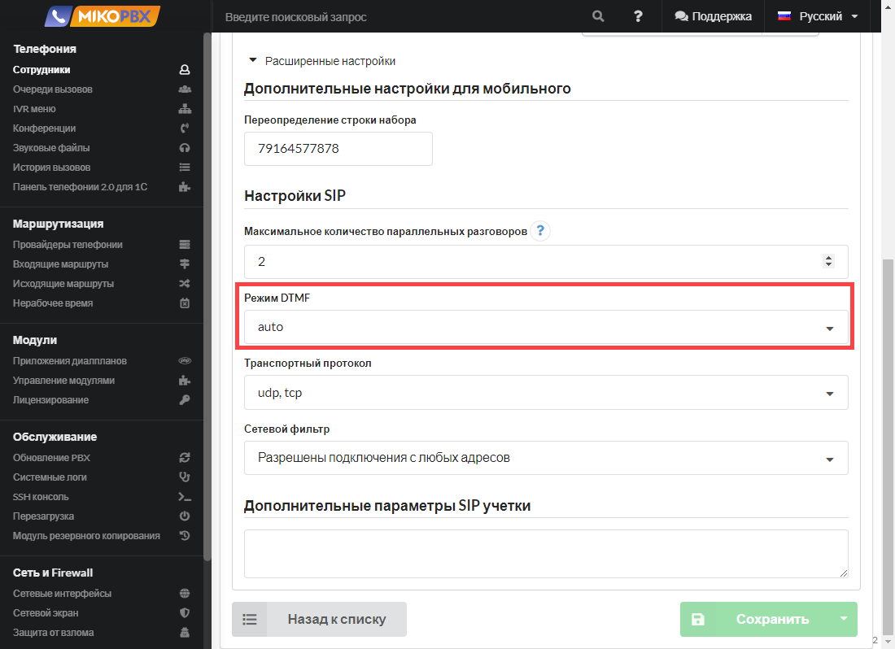<figcaption></figcaption></figure>

Настройка определяет, как DTMF-сигналы передаются через SIP.

#### Транспортный протокол

<figure>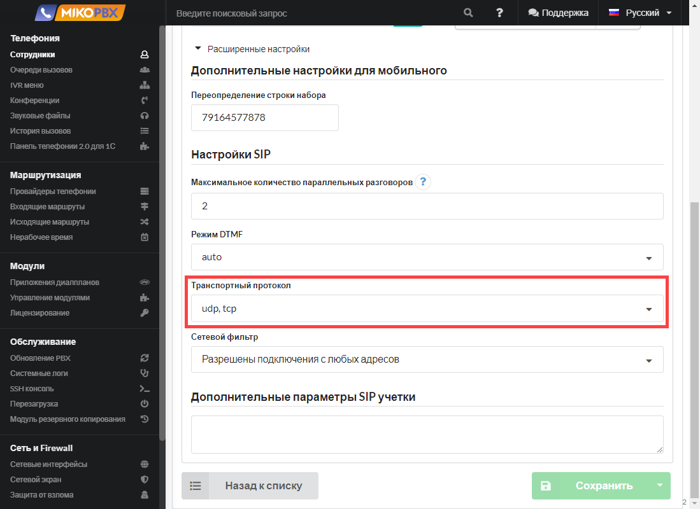<figcaption></figcaption></figure>

Позволяет указать используемый транспортный протокол для данной учетной записи.

#### **Сетевой фильтр**

<figure>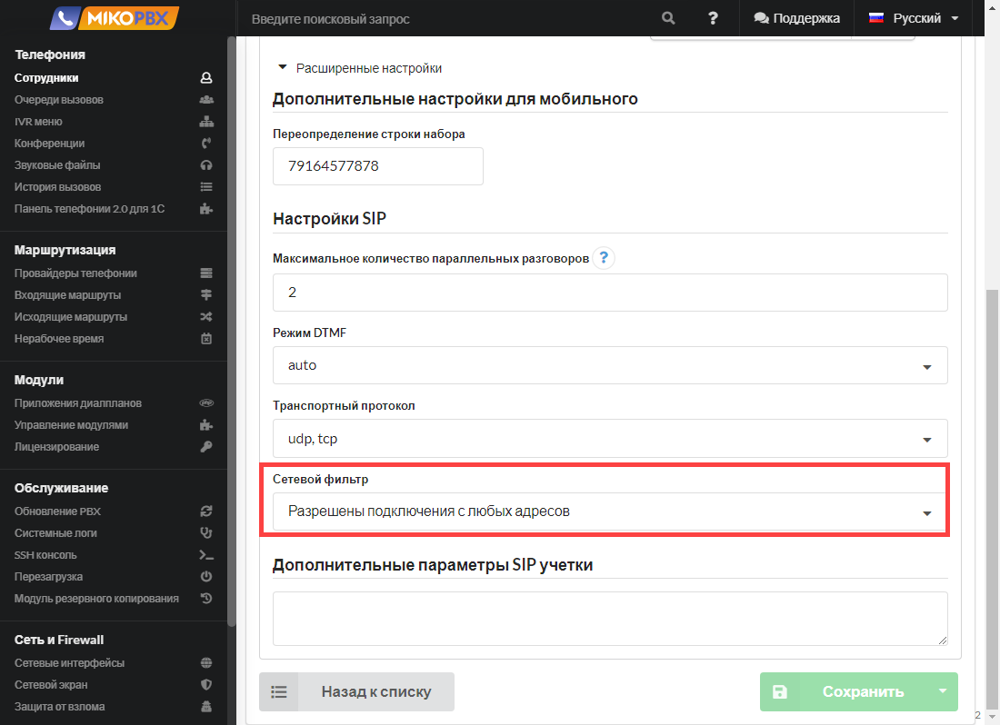<figcaption></figcaption></figure>

Подсеть, которая описана в разделе **Cетевой экран.** Указывает на разрешенную подсеть для этой учетной записи. Подключение из прочих подсетей будет вызывать ошибку авторизации.

**Дополнительные атрибуты PJSIP**

<figure>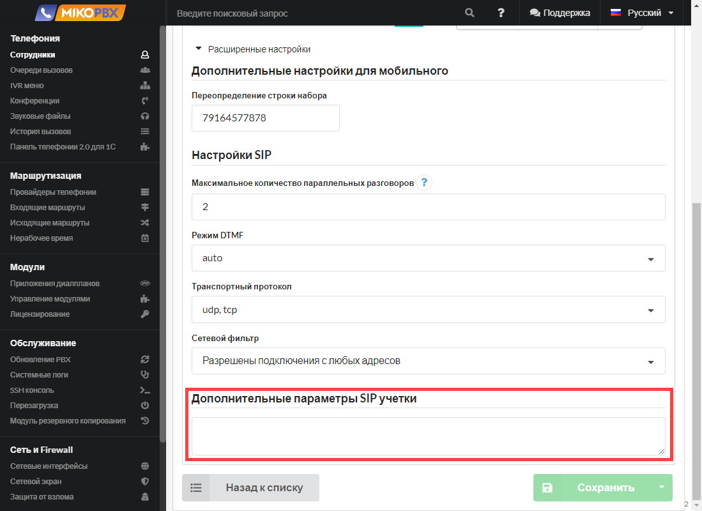<figcaption></figcaption></figure>

Данное поле служит для изменения или переопределения параметров PJSIP, которые MikoPBX генерирует для Asterisk.

Переопределять можно практически все параметры. К примеру при использовании **chan\_pjsip** SIP аккаунт сотрудника описывается следующими секциями:


```
[***]
type = aor
max_contacts = 10
; ----

[***]
type = auth
; ----

[***]
type = endpoint
context = all_peers
; ----

[acl_***] 
deny = 0.0.0.0/0.0.0.0
permit = 0.0.0.0/0.0.0.0
; ----
```


Для переопределения полей в секциях следует заполнить поле **Дополнительные параметры** следующим образом:


```
[acl]
; описываем параметры доступа из различных подсетей [acl_***]

[auth]
; описываем параметры авторизации для исходящих звонков

[aor]
; Правка секции AOR для endpoint

[endpoint]
; Правка параметров endpoint
```


## Настройки маршрутизации

<figure>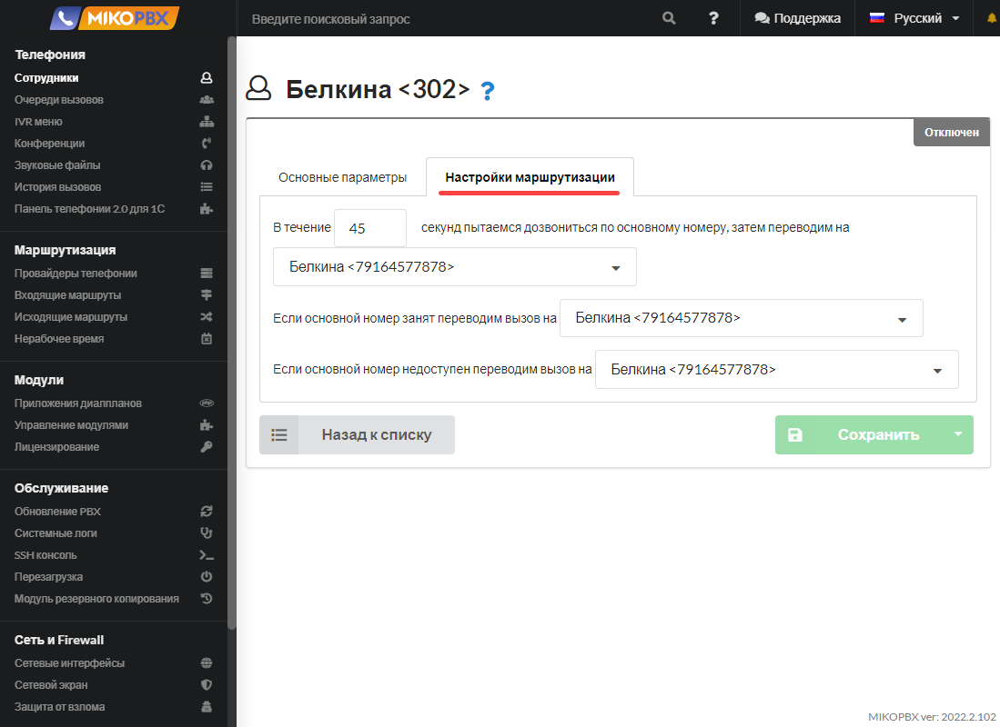<figcaption><p>Раздел "<strong>Настройки маршрутизации</strong>"</p></figcaption></figure>

На данной вкладке вы можете настроить правила переадресации вызовов в случае, если сотрудник не может ответить на звонок, занят или недоступен.

**Период времени** в секундах определяет, сколько времени будет продолжаться попытка вызова на **внутреннюю** учетную запись сотрудника. Если в течение этого времени сотрудник не сможет ответить на вызов, вы можете указать на какой номер следует направить вызов дальше. По умолчанию, вызов будет переадресован на мобильный номер сотрудника.

Кроме того, вы можете указать номера, на которые следует направить вызов в случае занятости и недоступности сотрудника. Таким образом, если сотрудник занят или недоступен, вызов будет переадресован на указанные номера.

Вы можете настроить эти параметры в соответствии с вашими предпочтениями и требованиями.

### **Документации по подключению софтфонов**


[softphones](../../faq/softphones/)


### **Документации по подключению IP-телефонов**


[ip-telefones](../../faq/ip-telefones/)

