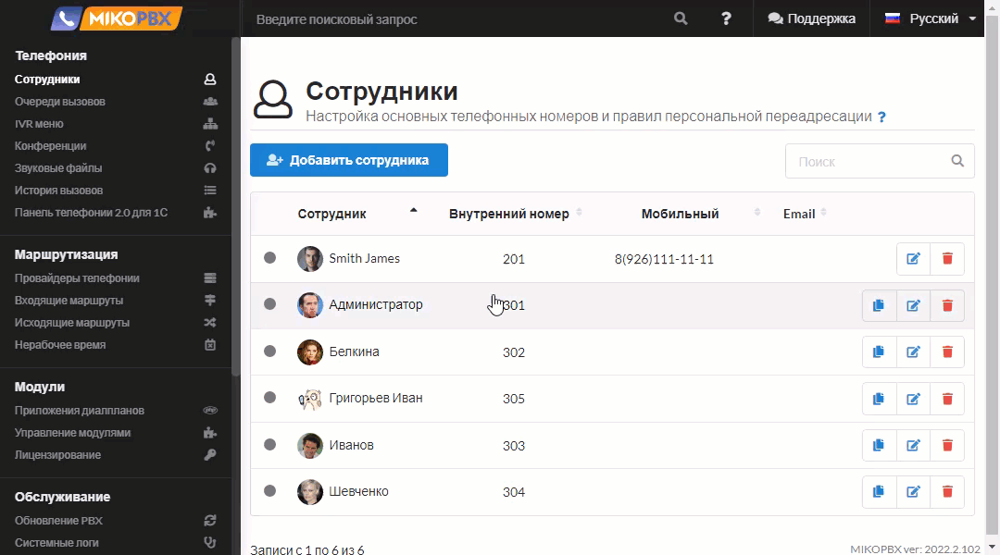
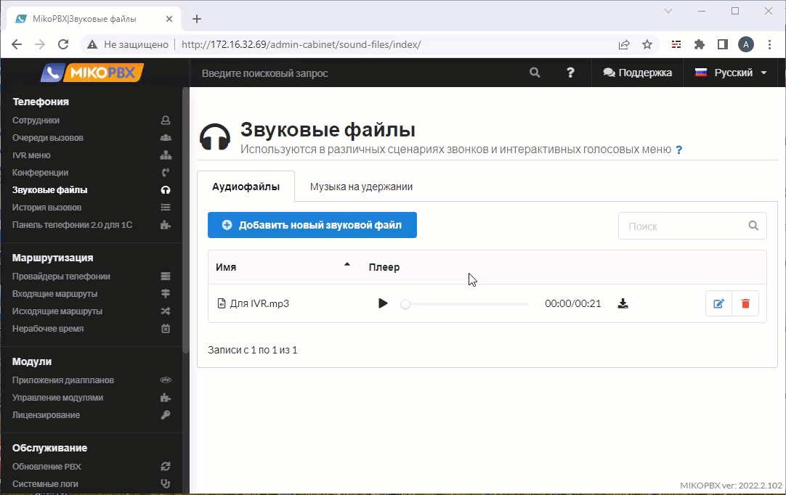
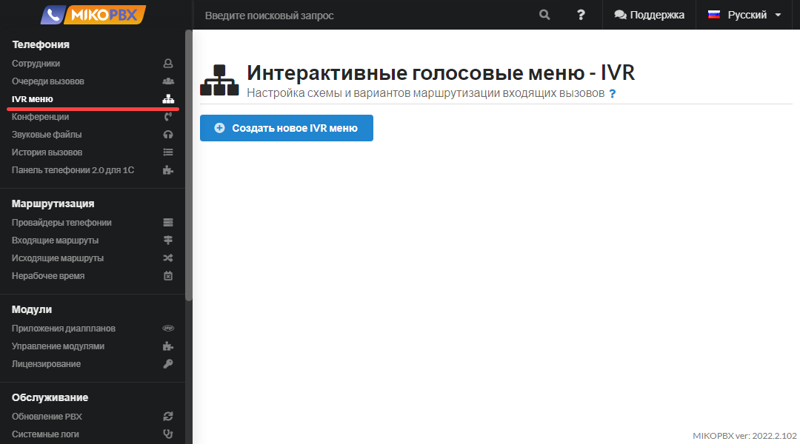
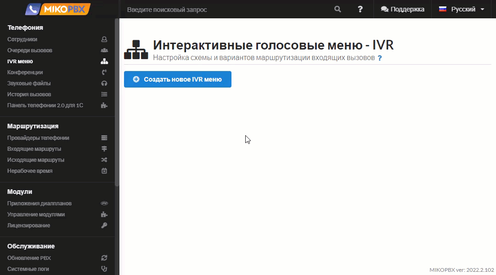
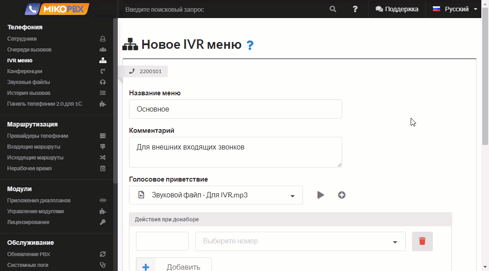
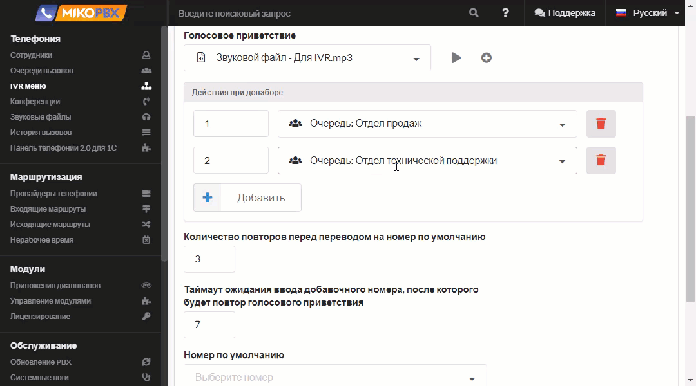

# IVR меню

IVR меню в MikoPBX — это интерактивное голосовое меню, которое позволяет звонящим взаимодействовать с телефонной системой с помощью тонового набора (DTMF). Оно автоматически направляет вызовы к нужным отделам или сотрудникам, улучшая эффективность обработки звонков и повышая качество обслуживания клиентов.

## Предварительная настройка 

Перед созданием IVR меню необходимо загрузить звуковые файлы, которые будут проигрываться клиенту при звонке в Вашу компанию. Звуковые файлы добавляются в разделе **Телефония** → **Звуковые файлы**

Также есть возможность записать файл с помощью микрофона, если с АТС соединиться по **https**.

## Создание IVR-меню 

Перейдите в **Телефония** → **IVR меню**.

Нажмите **Создать новое IVR меню**. Задайте наименование IVR меню, номер и при необходимости комментарий. Выберите звуковой файл, который вы загрузили на предыдущем этапе.

Настройте **Действия при донаборе.** В первой колонке укажите цифру или комбинацию цифр, которую набирает абонент, а во второй выберите номер, куда будет направлен вызов.

Задайте **Количество повторов перед переводом на номер по умолчанию.**

Установите **Таймаут ожидания ввода добавочного номера** (значение в секундах), после которого будет повтор голосового приветствия.

**Номер по умолчанию** необходим для случая, если клиент не ввел добавочный номер (к примеру не было технической возможности).

Включите переключатель **Разрешить набор любого внутреннего номера** при необходимости.

Введите номер IVR меню, позвонив на который, можно на это IVR попасть.

Нажмите **Сохранить**.

## Описание принципа работы IVR 

* При звонке на голосовое меню (**Номер IVR меню**) начинает проигрываться звуковой файл **Голосовое приветствие**.
* Во время проигрывания голосового меню можно выбирать пункты меню или набирать внутренний номер сотрудника. За донабор внутренних номеров отвечает флаг **Разрешить донабор любого внутреннего номера**. Он разрешает набор внутренних номеров сотрудников с SIP-аккаунтом; переходы на очереди, IVR, конференции и другие направления настраиваются отдельными действиями при донаборе.
* После проигрывания голосового меню происходит ожидание в течение значения **Таймаут ожидания ввода добавочного номера** для набора добавочного.\
  _Общее время для набора номера = длительность звукового файла + таймаут ожидания ввода добавочного номера_.
* Если _общее время для набора номера истекло_, происходит повторное голосовое оповещение и ожидание в течение _таймаута_, то есть следующая попытка IVR.&#x20;
* Если пользователь некорректно набирает номер или вообще ничего не набирает, то также происходит повторное голосовое оповещение и ожидание в течение _таймаута_ - следующая попытка IVR.
* Максимальное количество попыток задается в параметре **Количество повторов, перед переводом на номер по умолчанию.**
* Как только попытки превысят указанное значение, происходит переадресация на **Номер по умолчанию**.
