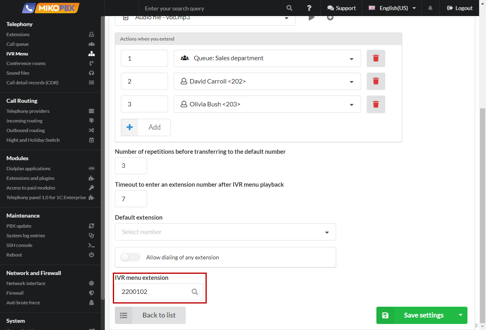

# IVR Menu

An IVR menu includes options for routing incoming calls using an interactive voice menu. It allows callers to navigate through a series of menu prompts using their telephone keypad (DTMF). Each option in the menu can be associated with a specific action or routing destination, such as transferring the call to a particular department, providing self-service options, or connecting the caller to a specific extension or queue. The IVR menu enhances the caller's experience by offering a self-service mechanism and streamlining call routing based on their selections.

## Pre-configuration

Before creating an IVR menu, it is necessary to upload audio files that will be played to callers when they contact your company. The audio files can be added in the "**Telephony**" -> "**Sound files**"

.png>)

Choose your music file using "**Upload a new file**"

<figure><figcaption>
"Upload a new sound file" button
</figcaption></figure>

Additionally, there is the option to record a file using a microphone if you connect to the MikoPBX over **HTTPS**.

## Creating an IVR menu

Go to "**Telephony"** → "**IVR menu"** section.

.png>)

Click "**Add new IVR nenu**."

<figure><figcaption>
"Add new IVR menu" button
</figcaption></figure>

Set the _name_, _number_, and, if necessary, a _comment for the IVR menu_. Select the audio file that you uploaded in the previous step.

.png>)

Configure Actions when you extend. In the first column, specify the extension number, and in the second column, set the addressing rule.

.png>)

Set the **number of retries** before transferring to the default number.

<figure><figcaption>
Number of repetitions before transferring to the default number
</figcaption></figure>

Set the **timeout** for entering an extension number (value in seconds) after which the voice greeting will be repeated.

<figure><figcaption>
Timeout to enter an extension number after IVR menu playback
</figcaption></figure>

The **Default extension** is required in case the client does not enter an extension number (for example, due to technical limitations).

<figure><figcaption>
Default extension
</figcaption></figure>

Enable the "**Allow Dialing of any extension**" toggle switch if needed.

<figure><figcaption>
"Allow dialing of any extension" switch
</figcaption></figure>

Enter the IVR menu number that can be dialed to reach that specific IVR menu.

Press "**Save settings**."

## How IVR works

The principle of operation of an IVR (Interactive Voice Response) is as follows:

1. When calling the IVR menu number, the Voice **Greeting audio file** starts playing.
2. During the playback of the voice menu, the caller can select menu options or dial an employee's internal extension. The "**Allow Dialing Any Internal Number**" flag allows callers to dial internal employee numbers with SIP accounts. Routing to queues, IVRs, conferences, and other destinations is configured separately in the IVR action table.
3. After the voice menu is played, there is a waiting period of the "**Input Extension Timeout**" for entering an extension number.
4. The total time allowed for entering the extension number is calculated as the sum of the audio file duration and the input extension timeout.
5. If the total time for entering the extension number expires, a repeat voice announcement occurs, and there is another waiting period within the timeout for the next IVR attempt.
6. If the user enters an incorrect number or does not enter any number at all, a repeat voice announcement occurs, and there is another waiting period within the timeout for the next IVR attempt.
7. The maximum number of attempts is set by the "**Number of Retries**" parameter before transferring to the default number.
8. Once the number of attempts exceeds the specified value, the call is redirected to the **default number.**
