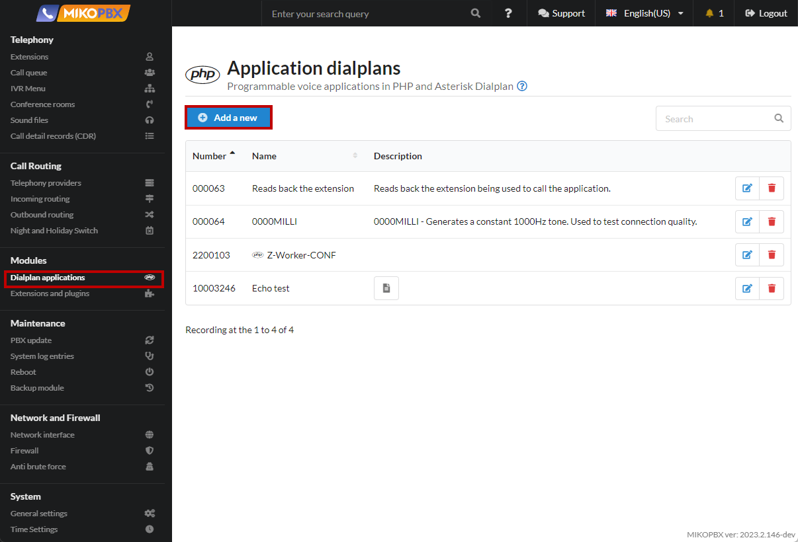
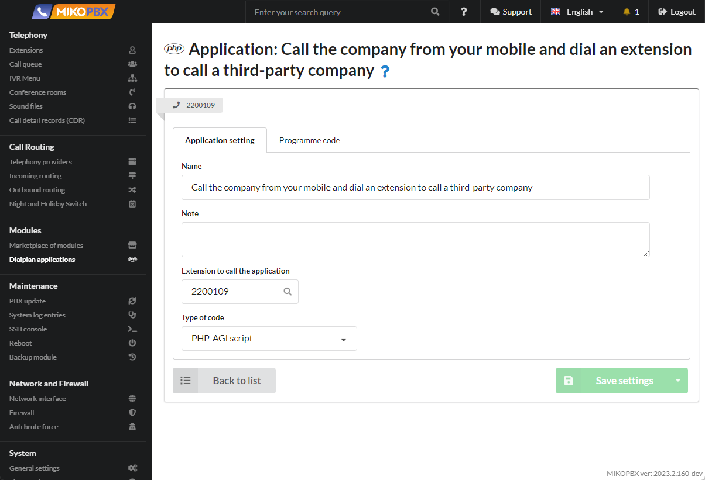
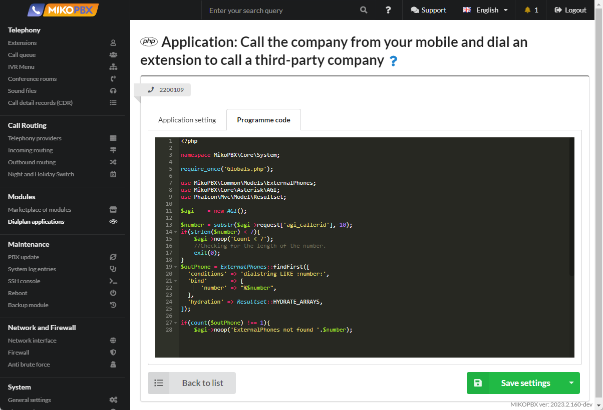
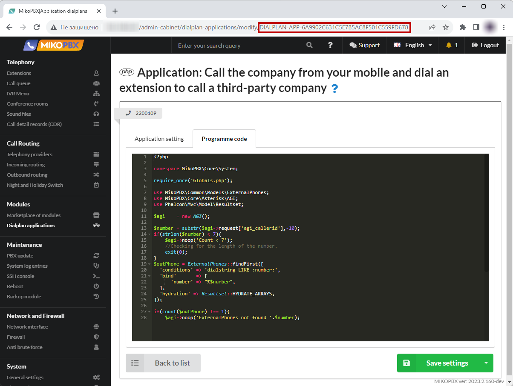
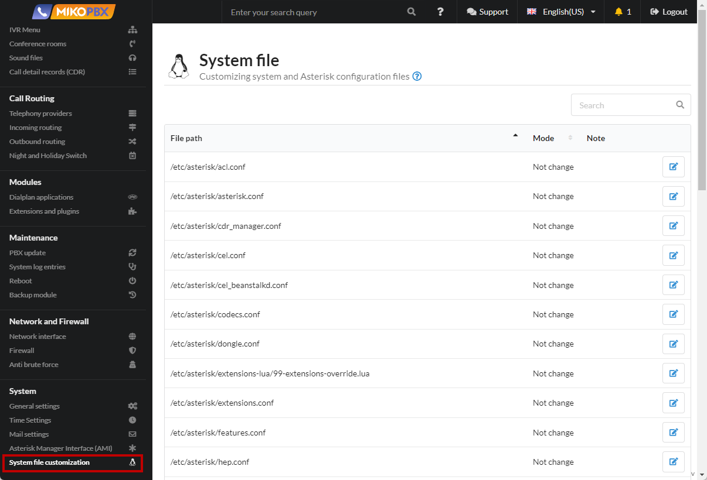
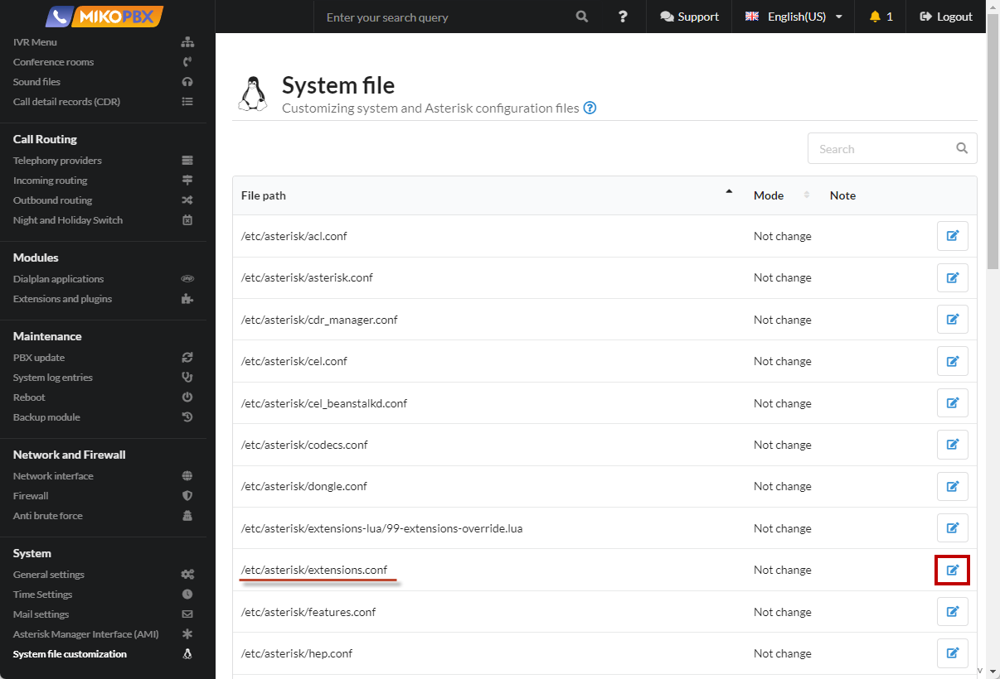
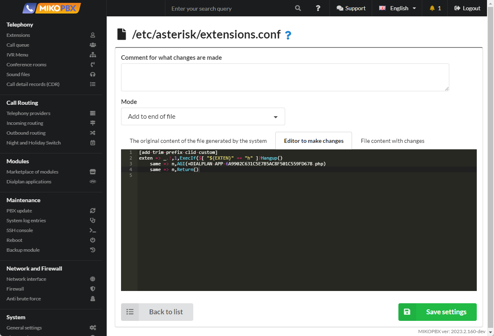

# Call the company from your mobile and dial an extension to call a third-party company

This functionality is convenient for mobile employees. When it is important that the conversation is recorded and recorded on the PBX in the call history. When it is not possible to use a softphone / or "IP-SIM".

1. Add a new dialplan application (see [Dialplan Applications](../../manual/modules/dialplan-applications.md))

<figure><figcaption><p>Dialplan applications section</p></figcaption></figure>

2. Assign an internal number, for example **2200109**

<figure><figcaption><p>Dialplan Number</p></figcaption></figure>

3. Paste the code into the "**Programme Code**" tab:

```php
<?php

namespace MikoPBX\Core\System;

require_once('Globals.php');

use MikoPBX\Common\Models\ExternalPhones;
use MikoPBX\Core\Asterisk\AGI;
use Phalcon\Mvc\Model\Resultset;

$agi    = new AGI();

$number = substr($agi->request['agi_callerid'],-10);
if(strlen($number) < 7){
    $agi->noop('Count < 7');
    //Checking for the length of the number.
    exit(0);
}
$outPhone = ExternalPhones::findFirst([
  'conditions' => 'dialstring LIKE :number:',
  'bind'       => [
      'number' => "%$number",
  ],
  'hydration' => Resultset::HYDRATE_ARRAYS,
]);

if(count($outPhone) !== 1){
    $agi->noop('ExternalPhones not found '.$number);
    // Checking whether the phone number belongs to an employee of the company.
    exit(0);
}

$agi->set_variable('AGIEXITONHANGUP', 'yes');
$agi->set_variable('AGISIGHUP', 'yes');
$agi->set_variable('__ENDCALLONANSWER', 'yes');
$agi->exec('Ringing', '');
$agi->Answer();

$result      = $agi->getData('vm-enter-num-to-call', 3000, 11);
$selectednum = $result['result']??'';
if(!empty($selectednum)){
    // Everything is OK. Ending the call.
    $agi->set_variable('__pt1c_UNIQUEID', '');
    $agi->exec(
        'Dial',
        "Local/{$selectednum}@all_peers/n,300," . 'TtekKHhU(dial_answer)b(dial_create_chan,s,1)'
    );
}else{
    $agi->noop('selectednum is empty');
}
```

<figure><figcaption><p>Code for dialplan</p></figcaption></figure>

4. In the browser's address bar, copy the application ID. It will look like "**DIALPLAN-APP-6A9902C631C5E7B5AC8F501C559FD678**"

<figure><figcaption><p>Dialplan ID</p></figcaption></figure>

5. Go to the "**System file customization**" section

<figure><figcaption><p>System file customixation section</p></figcaption></figure>

6. Open the file "**extensions.conf**" for editing

<figure><figcaption><p>"extensions.conf" file</p></figcaption></figure>

7. Paste the following code at the end of the file:

```php
[add-trim-prefix-clid-custom]
exten => _.!,1,ExecIf($[ "${EXTEN}" == "h" ]?Hangup()
    same => n,AGI(«DIALPLAN-APP-6A9902C631C5E7B5AC8F501C559FD678.php)
    same => n,Return()
```

<figure><figcaption><p>code for extensions.conf</p></figcaption></figure>


here "**DIALPLAN-APP-6A9902C631C5E7B5AC8F501C559FD678**" is the application ID.


#### Important points

1. The application will be executed for **all** incoming calls
2. It will be possible to enter an extension only if the caller's phone number is filled in the employee card, that is, the number must belong to the employee. This is done for security.
3. The script is **not a complete product**, but is open for customization

## DISA — calling out through the PBX with PIN authorization <a href="#disa" id="disa"></a>

**DISA** (Direct Inward System Access) lets you call the PBX number, authenticate with a PIN code and then dial any external or internal number "on behalf of the company" (with the outgoing CallerID substituted). Unlike the example above, access is protected by a **PIN code** and/or a **CID whitelist** rather than by matching the number to an employee card.

1. Add a new dialplan application (see [**Dialplan Applications**](../../manual/modules/dialplan-applications.md)) and assign it an internal number, for example **2204**. Code type — "**PHP-AGI script**".

<figure><figcaption><p>Dialplan applications section</p></figcaption></figure>

2. Paste the code into the "**Programme Code**" tab:

```php
<?php
require_once 'Globals.php';

use MikoPBX\Core\Asterisk\AGI;
use MikoPBX\Core\System\SystemMessages;

/* ──────────────────── SETTINGS ──────────────────── */

// Access PIN. An empty string — the PIN is not requested.
const DISA_PIN = '2204';

// CallerID substituted into the outgoing call.
const DISA_CID = '89778485090';

// Whitelist of incoming CIDs (who is allowed to use DISA).
// An empty array — allowed for EVERYONE.
const DISA_CID_WHITELIST = [
    // '79161234567',
];

// MikoPBX dialing context (internal numbers + outbound routes).
const DISA_CONTEXT = 'all_peers';

const DISA_MAX_ATTEMPTS = 3;      // PIN entry attempts
const DISA_PIN_TIMEOUT  = 5000;   // ms to enter the PIN
const DISA_NUM_TIMEOUT  = 7000;   // ms to enter the number
const DISA_NUM_MAXLEN   = 20;     // max length of the dialed number

/* ──────── SOUND FILES (without extension, an absolute path is allowed) ────────
 * Set full paths to your own files, e.g.
 *   '/storage/usbdisk1/mikopbx/custom_sound/enter_pin'
 * Check that the file exists: find /offload/asterisk/sounds -iname '<name>.*'
 */

// Prompt to enter the PIN. Text: "Enter the PIN code and press the hash key".
const DISA_PIN_PROMPT  = '/storage/usbdisk1/mikopbx/media/custom/enter_pin';

// Wrong PIN. Text: "The password is incorrect".
const DISA_BAD_PROMPT  = '/storage/usbdisk1/mikopbx/media/custom/auth-incorrect';

// Goodbye / termination. Text: "Goodbye".
const DISA_BYE_PROMPT  = '/storage/usbdisk1/mikopbx/media/custom/goodbye';

// Whitelist rejection. Text: "Access denied" / "The number is not served".
const DISA_DENY_PROMPT = '/storage/usbdisk1/mikopbx/media/custom/ss-noservice';

// Prompt to dial the number (dial tone). Text: short tone / "Dial the number".
const DISA_DIAL_PROMPT = '/storage/usbdisk1/mikopbx/media/custom/enter-number';

/* ─────────────────────────────────────────────────── */

$agi    = new AGI();
$caller = (string)$agi->get_variable('CALLERID(num)', true);

$agi->answer();

// 1. CID whitelist check.
if (DISA_CID_WHITELIST !== [] && !in_array($caller, DISA_CID_WHITELIST, true)) {
    SystemMessages::sysLogMsg('DISA', "Rejected: CID {$caller} not in whitelist", LOG_WARNING);
    $agi->stream_file(DISA_DENY_PROMPT);
    $agi->hangup();
    return;
}

// 2. PIN check (if set).
if (DISA_PIN !== '') {
    $authorized = false;
    for ($i = 0; $i < DISA_MAX_ATTEMPTS; $i++) {
        $res   = $agi->getData(DISA_PIN_PROMPT, DISA_PIN_TIMEOUT, strlen(DISA_PIN) + 2);
        $entry = (string)($res['result'] ?? '');

        // Prompt did not play / timeout without input — this is NOT a wrong PIN.
        if ((int)($res['code'] ?? 0) !== 200 || $entry === '' || $entry === '-1') {
            SystemMessages::sysLogMsg('DISA', 'No PIN input / prompt failed: ' . json_encode($res), LOG_WARNING);
            continue;
        }
        if (hash_equals(DISA_PIN, $entry)) {
            $authorized = true;
            break;
        }
        $agi->stream_file(DISA_BAD_PROMPT);
    }
    if (!$authorized) {
        SystemMessages::sysLogMsg('DISA', "Wrong/absent PIN from CID {$caller}", LOG_WARNING);
        $agi->stream_file(DISA_BYE_PROMPT);
        $agi->hangup();
        return;
    }
}

// 3. Substituting the outgoing CallerID.
$agi->set_callerid(DISA_CID);
$agi->set_variable('CALLERID(num)', DISA_CID);
$agi->set_variable('CALLERID(name)', DISA_CID);

// 4. Receiving the dialed number (dial tone + digit collection, terminated by #).
$res    = $agi->getData(DISA_DIAL_PROMPT, DISA_NUM_TIMEOUT, DISA_NUM_MAXLEN);
$number = (string)($res['result'] ?? '');

if ($number === '' || $number === '-1') {
    $agi->stream_file(DISA_BYE_PROMPT);
    $agi->hangup();
    return;
}

SystemMessages::sysLogMsg('DISA', "CID {$caller} -> dial {$number} as " . DISA_CID, LOG_NOTICE);

// 5. Jump into the dialing context — internal and outbound routes will apply.
$agi->exec_goto(DISA_CONTEXT, $number, '1');
```

<figure><figcaption><p>Code for dialplan</p></figcaption></figure>

3. Configure the constants in the `SETTINGS` block:

| Constant | Purpose |
| --- | --- |
| `DISA_PIN` | Access PIN. An empty string — the PIN is not requested (then protection is by `DISA_CID_WHITELIST` only) |
| `DISA_CID` | CallerID substituted into the outgoing call |
| `DISA_CID_WHITELIST` | Whitelist of incoming CIDs allowed to use DISA. An empty array — allowed for **everyone** |
| `DISA_CONTEXT` | MikoPBX dialing context. `all_peers` — internal numbers and outbound routes |
| `DISA_MAX_ATTEMPTS` | Number of PIN entry attempts |
| `DISA_*_TIMEOUT` | Timeouts (ms) for entering the PIN and the number |
| `DISA_NUM_MAXLEN` | Maximum length of the dialed number |
| `DISA_*_PROMPT` | Paths to the sound files (without extension) |

4. Prepare the sound files. Upload your own recordings (for example, via the "**Sound files**" section or over SSH to `/storage/usbdisk1/mikopbx/media/custom/`) and set their full paths in the `DISA_*_PROMPT` constants. You can verify a file exists on the host with:

```bash
find /offload/asterisk/sounds -iname '<name>.*'
```


You do not have to record the prompts with your own voice — you can synthesize them right on the PBX with our modules: [**Phrase Studio (TTS)**](../../modules/miko/module-phrase-studio.md) (offline, powered by Piper) or the RHVoice speech generation module. Generate the phrases ("Enter the PIN code and press the hash key", "The password is incorrect", "Goodbye", etc.) and then set the paths to the resulting files in the `DISA_*_PROMPT` constants.


5. Route an incoming call to DISA. In the "[**Incoming routes**](../../manual/routing/incoming-routing.md)" section create a route (by a specific DID if needed) and set the created dialplan application (internal number **2204**) as its destination.

<figure><figcaption><p>Pointing an incoming route to the DISA application</p></figcaption></figure>

#### Important points (DISA)&#x20;

1. DISA allows calling out through your PBX and at your expense. You **must** protect it with a PIN code (`DISA_PIN`) and/or a CID whitelist (`DISA_CID_WHITELIST`). An open DISA without a PIN on a public DID is a risk of unauthorized calls.
2. All PIN entry and dialing attempts are logged via `SystemMessages::sysLogMsg('DISA', ...)` — search by the `DISA` tag in the system log.
3. The substituted `DISA_CID` must be allowed for outgoing calls by your provider, otherwise the operator will reject the call.
4. The script is **not a complete product**, but is open for customization.
