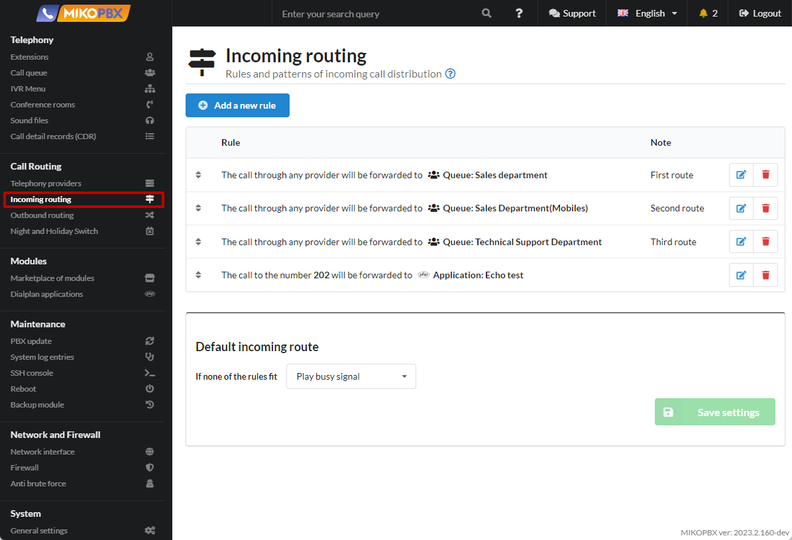
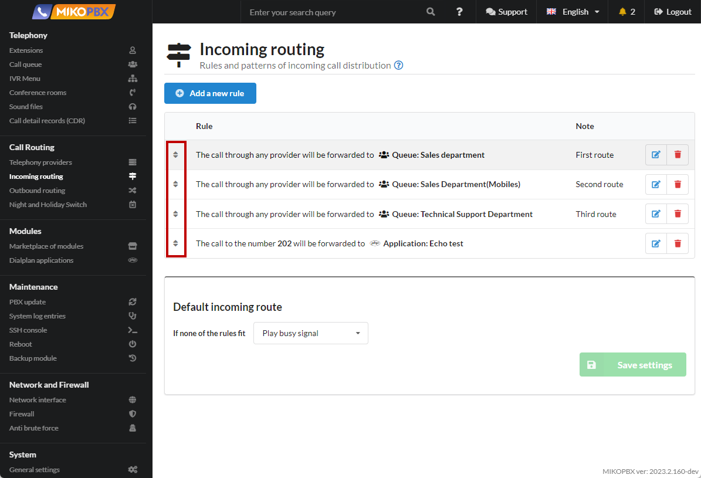
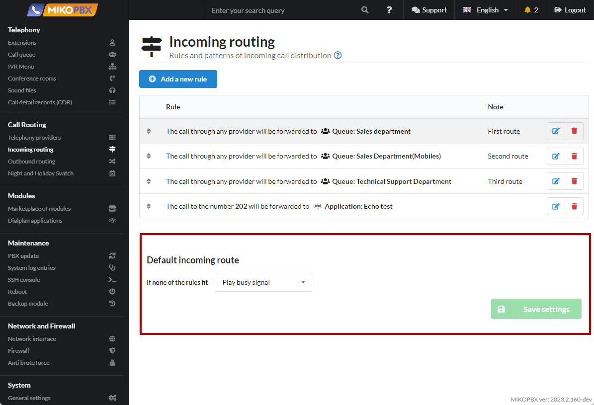
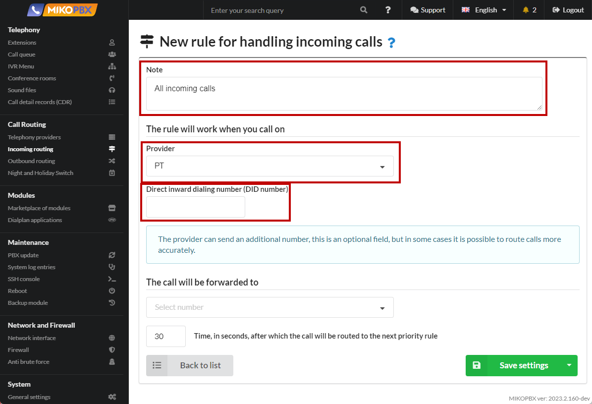
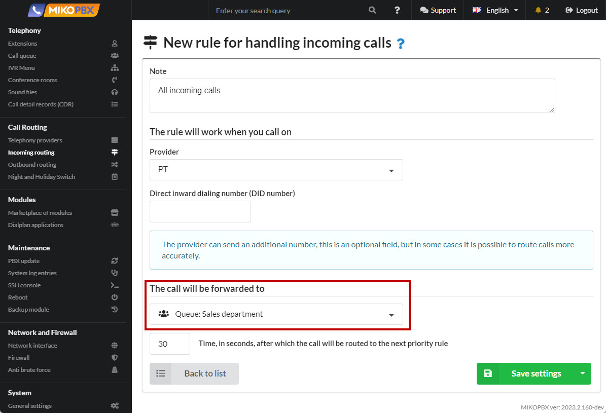
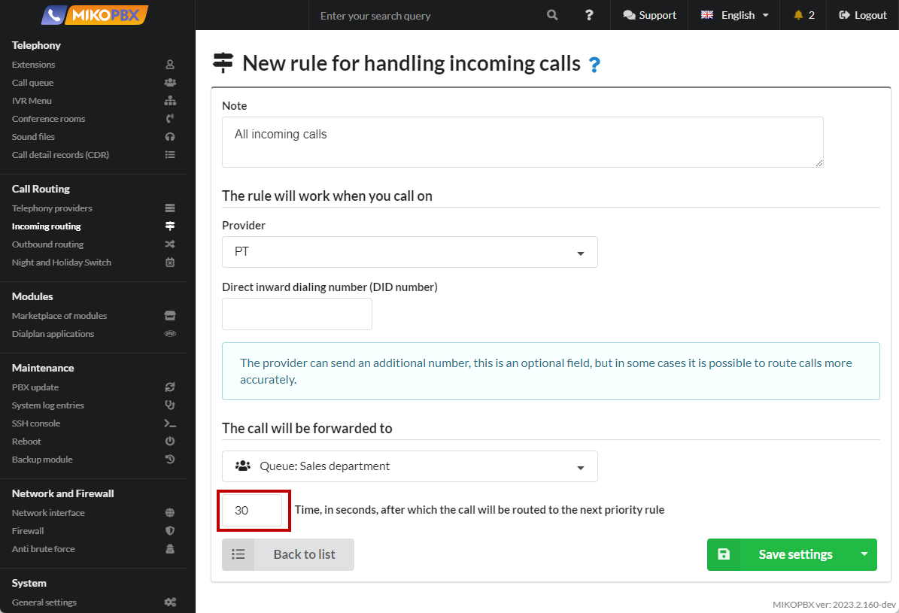

# Incoming routing

In this section, you need to create rules and templates for distributing incoming calls for providers created in MikoPBX. The rules for incoming calls describe the route of a call from the moment it arrives at the PBX to the moment it is completed. You can create an unlimited number of inbound routing rules. You can create several rules for one provider.

<figure><figcaption>
"Call Routing" -> "Incoming Routing" section
</figcaption></figure>


Additional examples of configuring incoming routing are available in the [FAQ ](../../faq/incoming-routing/)section.


## Routing rule priority and default route

Rules are listed in order of priority. If no one answers the incoming call within the time interval specified in the rule, the call will be routed to the next priority rule. Rules can be moved up and down in the list, that is, their priority can be changed by dragging them by the arrows.

<figure><figcaption>
Priority Scheme
</figcaption></figure>

If the call is not answered according to any of the rules, the **Default incoming route** is used.

<figure><figcaption>
Default incoming route
</figcaption></figure>

The following actions are available and can be specified as the default rule:

* **Play busy signa**l - the client will play a busy signal and the incoming call will be ended;
* **Hang up**;
* **Redirect the call** - the call can be transferred to a number that you can select in the field located to the right of the action. You can select an IVR menu, call queue, conference, or employee extension number as the number for transfer.

## Multiple routes for one provider

For one provider, you can describe **several** incoming routes.

First, the call goes along the upper route. If the client does not get through, then the call goes according to the lower rule (lower priority). If the client does not get through via the second route, then the call goes through the **default route.**

<figure><figcaption>
Several incoming routes for one provider
</figcaption></figure>

## Create a routing rule

To add a new incoming routing rule, click the **Add a new rule** button.

<figure><figcaption>
New Rule
</figcaption></figure>

In the **Note** field, describe the route you want to implement. In the future, this will help you debug the call circuit.

Select the **Provider** for which you are creating a new incoming call distribution template.

The additional **DID number** is the number the client called you on. This field is optional and should be completed if you need to route calls more accurately.

<figure><figcaption>
Parameters for a new rule
</figcaption></figure>

At the next step, you need to indicate to which **phone number** the incoming call from the client will be sent. The telephone number can be IVR menu numbers, call queues, conferences, or employee internal numbers.

<figure><figcaption>
Parameters for a new rule
</figcaption></figure>

Specify the time during which the call will be sent to the phone number you specified.

<figure><figcaption>
Parameters for a new rule
</figcaption></figure>

If after the specified time interval no one answers the incoming call, the call will be routed to the next priority rule.

## DID number field templates and CallerID restriction 

The **`Additional DID number`** field can be set as an exact number, as an Asterisk pattern, or additionally restricted by the caller's number (CallerID).

### DID templates

The field is matched against the number the client dialed (DID). If the value consists only of pattern characters, MikoPBX treats it as an Asterisk pattern; exact numbers are entered as-is.

| DID field value   | What it matches                            | Examples              |
| ----------------- | ------------------------------------------ | --------------------- |
| empty or `X!`     | any incoming call (default route)          | all calls             |
| `XZZ`             | 3 digits, 2nd and 3rd are 1–9              | 711, 923              |
| `3XX`             | 300–399                                    | 300, 350, 399         |
| `4XX`             | 400–499                                    | 400, 455              |
| `[3-4]XX`         | 300–499                                    | 312, 489              |
| `NXX`             | first digit 2–9, then any two digits       | 234, 900              |
| `74952293042`     | exact DID                                  | only 74952293042      |
| `+79066643322`    | exact DID with `+`                         | only +79066643322     |

Notation: `X` — digit 0–9, `Z` — digit 1–9, `N` — digit 2–9, `[a-b]` — range, `.` — one or more of any character, `!` — zero or more characters.


Use only **uppercase** `X`, `Z`, `N`. Lowercase (e.g. `3xx`) is treated by MikoPBX as an exact number, not a pattern.


### CallerID restriction

Asterisk lets you specify both the DID and the allowed caller's number in a single field using `/`: the part before `/` is matched against the dialed number (DID), the part after — against the caller's number (CallerID).

| DID field value                | What it matches                                                   |
| ------------------------------ | ----------------------------------------------------------------- |
| `74951234567/+79261234567`     | DID = 74951234567 **and** CallerID = +79261234567                 |
| `_X!/+79261234567`             | any DID **and** CallerID = +79261234567                           |
| `_3XX/_79XXXXXXXXX`            | DID in 300–399 **and** CallerID matching `79XXXXXXXXX`            |


Without `_` both parts are treated as exact matches. To use a pattern, start the corresponding part with `_` (e.g. `_X!` — "any DID", `_79XXXXXXXXX` — a CallerID pattern).

