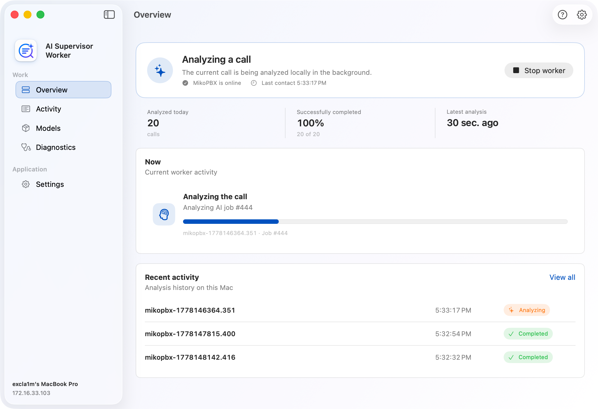
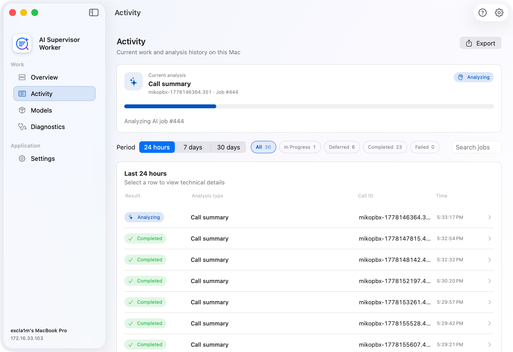
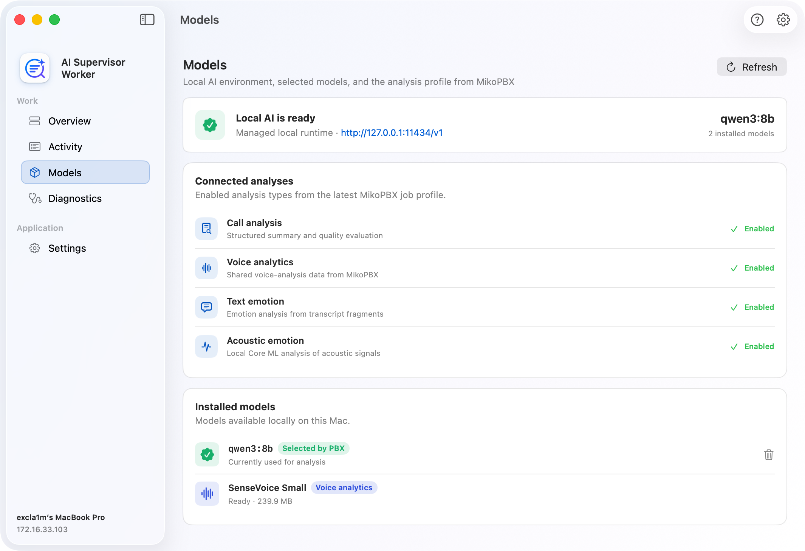
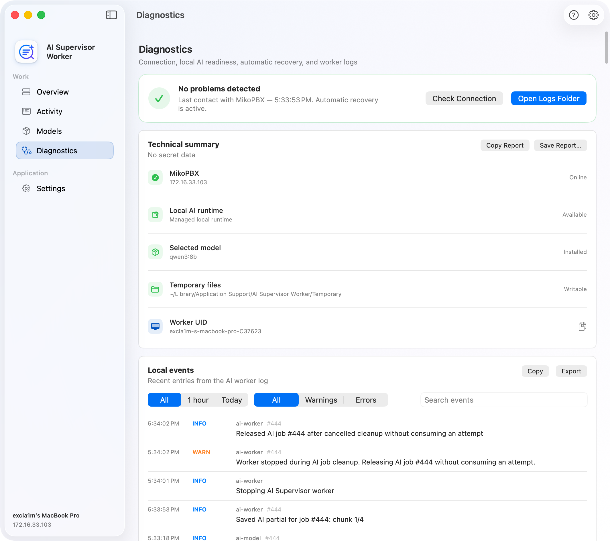
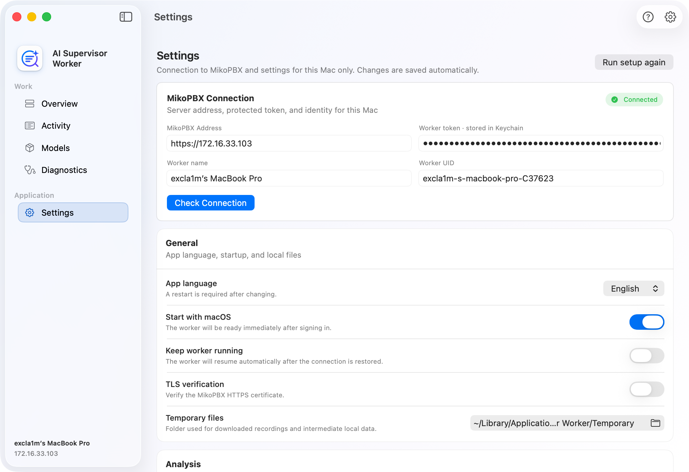

# AI Supervisor Worker

**AI Supervisor Worker** is a standalone macOS application that performs local AI analysis of completed MikoPBX transcripts. The application receives jobs from the **AI Supervisor** module, uses a local language model, processes the call recording, and sends a structured result back to the PBX.

The application does not select which calls to analyze and does not store the server-side queue. Transcript import, analysis components, model profile, result language, attention rules, and saved results are managed by the module in MikoPBX.

<figure><figcaption>
Worker application interface
</figcaption></figure>

### Requirements and compatibility

* A Mac with Apple silicon.
* macOS 14 or later.
* MikoPBX 2025.1.1 or later.
* Network access from the Mac to MikoPBX.
* A local Ollama runtime or an OpenAI-compatible local endpoint.
* Internet access for the initial runtime and model installation.

### Application navigation

The sidebar contains:

| Section         | Purpose                                                                       |
| --------------- | ----------------------------------------------------------------------------- |
| **Overview**    | Worker readiness, connection, current work, and summary statistics.           |
| **Activity**    | Current job and local processing history with filters and export.             |
| **Models**      | Ollama, the model selected by the PBX, analysis components, and local models. |
| **Diagnostics** | Connection, runtime readiness, automatic recovery, and logs.                  |
| **Settings**    | MikoPBX connection, local behavior, and analysis parameters.                  |

There is no longer a separate **Registration** screen. The PBX address, token, worker name, and Worker UID are under **Settings**.

### Overview

**Overview** is the main AI Supervisor Worker status screen. It includes:

* the overall status and primary available action;
* MikoPBX connection status and last contact time;
* calls analyzed today and the success rate;
* current work and job progress;
* recent local jobs.

Main states:

| State                          | What to do                                                               |
| ------------------------------ | ------------------------------------------------------------------------ |
| **Setup required**             | Open the connection settings and enter the PBX address and worker token. |
| **Checking local AI**          | Wait while Ollama and the models are checked.                            |
| **Model download in progress** | Do not close the application until the download finishes.                |
| **Local AI needs attention**   | Open **Models**.                                                         |
| **Ready to start**             | Click **Start worker**.                                                  |
| **Everything works**           | The worker is connected and checks the queue automatically.              |
| **Analyzing a call**           | The current job is being processed locally.                              |
| **Connecting to MikoPBX**      | The worker automatically restores the connection.                        |
| **Worker needs attention**     | Open **Diagnostics**.                                                    |

### Activity

**Activity** shows the current work and the job history saved on this Mac. The history persists after the application restarts, but it is not the MikoPBX server-side queue.

Available controls include:

* periods of 24 hours, 7 days, and 30 days;
* **In Progress**, **Deferred**, **Completed**, and **Failed** filters;
* search by job and Call ID;
* expandable rows with the model, analysis type, components, and error text;
* export of visible rows to CSV.

The **Deferred** status means that the worker safely released the job for another processing attempt, for example when a local model or dependency was temporarily unavailable.

<figure><figcaption>
Activity in the application
</figcaption></figure>

### Models

**Models** shows the local runtime, the analysis profile from MikoPBX, and installed models.

<figure><figcaption>
Former model management screen
</figcaption></figure>

The page includes:

* an Ollama installation card if the runtime is not yet available;
* endpoint and model readiness;
* the model selected by MikoPBX;
* the connected analysis profile: Call analysis, Voice analytics, Text emotion, and Acoustic emotion;
* a list of installed local models;
* Voice Analytics model status;
* current download progress.

The **Refresh** button checks the runtime, model, and voice components again. The current interface has no separate **Check Runtime** or **Check Model** buttons.

The following actions are available for local models:

| Action             | Description                                      |
| ------------------ | ------------------------------------------------ |
| **Show in Finder** | Open the model or related files in Finder.       |
| **Delete**         | Delete the model from the managed local runtime. |

Deletion is disabled while the worker is running or the model is in use. If MikoPBX selects the deleted model again, the worker can download it again.

### Diagnostics

**Diagnostics** combines status checks and the local log.

The top section shows:

* MikoPBX connection status;
* the token and Worker UID;
* the local endpoint and selected model;
* recovery after a transient error;
* **Check Connection** and **Open Logs Folder** buttons.

The log supports:

* **1 hour**, **Today**, and **All** periods;
* **All**, **Warnings**, and **Errors** levels;
* event search;
* copying visible entries;
* exporting to a file.

<figure><figcaption>
Diagnostics in the application
</figcaption></figure>

### Settings

<figure><figcaption>
Application settings
</figcaption></figure>

Settings are divided into three groups.

#### Connection

This group contains the PBX address, token stored in Keychain, worker name, Worker UID, and connection test.

Required fields:

| Field               | Description                                                   |
| ------------------- | ------------------------------------------------------------- |
| **MikoPBX Address** | Full address beginning with `http://` or `https://`.          |
| **Worker token**    | Key created under AI Supervisor → **Settings** → **Workers**. |
| **Worker name**     | A friendly name for this Mac in MikoPBX.                      |
| **Worker UID**      | A stable technical identifier.                                |

Click **Check Connection**. The application first requests `GET /worker-api-contract`, verifies ModuleAISupervisor, the API version, and the required capabilities, and then uses the token to register.

<figure><figcaption>
MikoPBX connection settings
</figcaption></figure>

#### General

| Setting                 | Purpose                                                               |
| ----------------------- | --------------------------------------------------------------------- |
| **App language**        | Interface language. Changing it requires an application restart.      |
| **Start with macOS**    | Open the application after the user signs in.                         |
| **Keep worker running** | Resume automatically after the network or PBX connection is restored. |
| **TLS verification**    | Verify the MikoPBX HTTPS certificate.                                 |
| **Custom CA file**      | Custom PEM/CRT/CER file for a private certificate.                    |
| **Temporary files**     | Directory for temporary recordings and intermediate data.             |

#### Analysis

| Setting                        | Purpose                                                                             |
| ------------------------------ | ----------------------------------------------------------------------------------- |
| **Analysis profile**           | Opens **Models**; active components are supplied by the MikoPBX job.                |
| **OpenAI-compatible endpoint** | Local endpoint for structured analysis; the default is `http://127.0.0.1:11434/v1`. |
| **Emotion model profile**      | Model used for text-based emotion analysis.                                         |
| **Max fragments**              | Maximum number of fragments used for emotion analysis.                              |
| **Minimum call length**        | Shorter calls skip the optional emotion enrichment stage.                           |

The primary model profile, context size, and analysis components are configured in MikoPBX and sent with every job.
