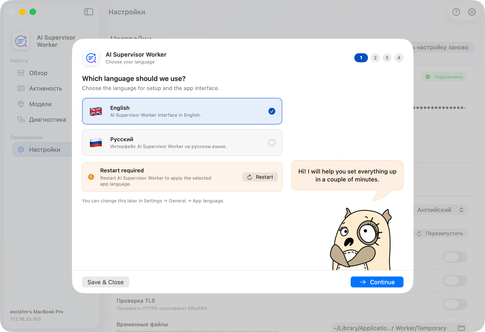
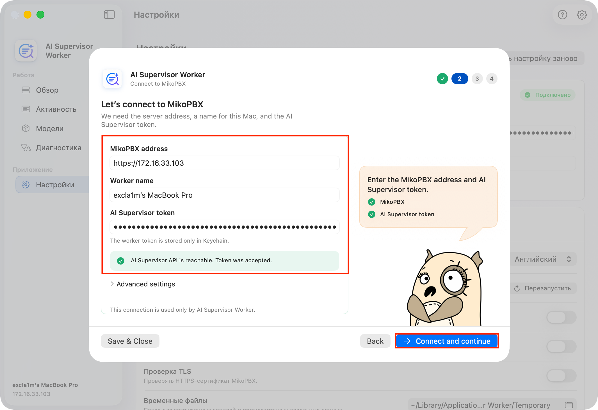
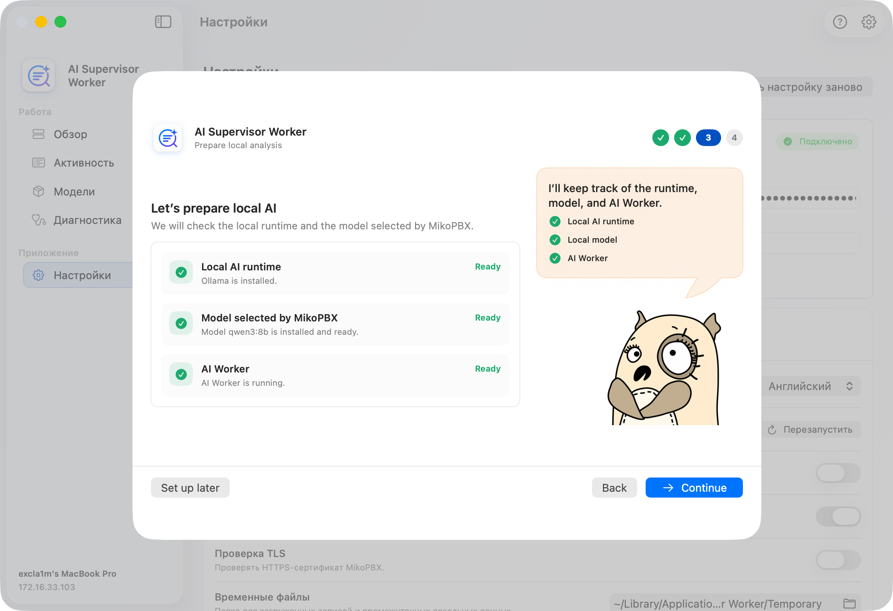
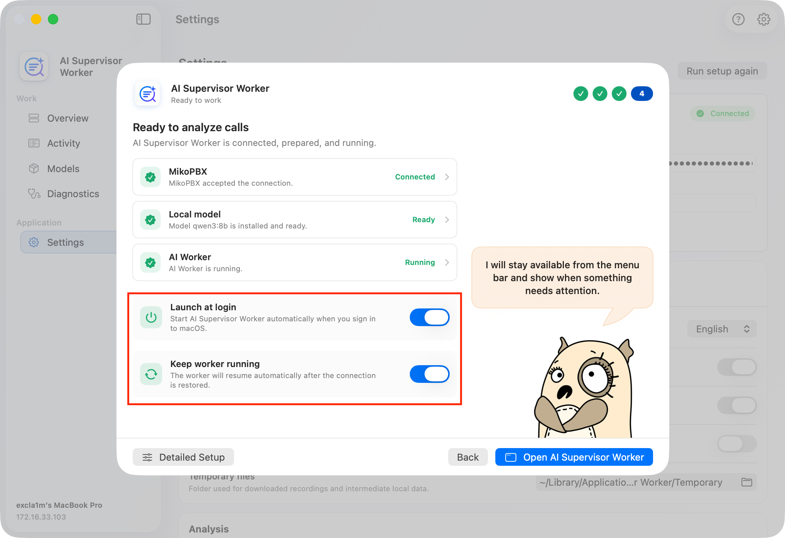
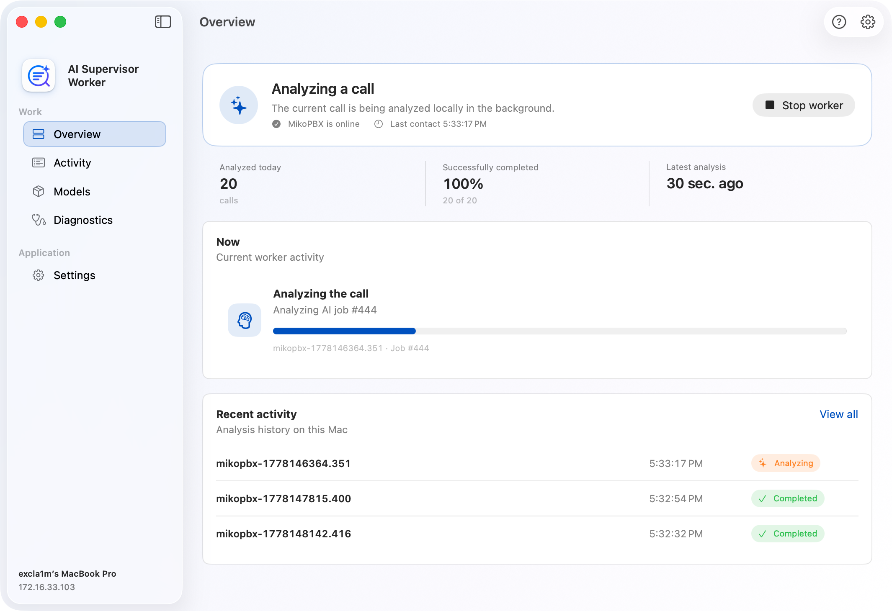

# Quick Start

### Before you begin

You will need:

* MikoPBX **2025.1.1** or later;
* an installed and configured transcription module: **Local Transcription** 1.102+ or **Cloud Speech-to-Text** 1.75+;
* an Apple silicon Mac with macOS 14 or later;
* network access from the Mac to the MikoPBX web interface.


Local AI Supervisor analyzes completed transcripts. If transcription has not been configured yet, first follow the [Local Transcription quick start](../module-local-speech-to-text/quick-start.md) or set up the [Cloud Speech-to-Text module](../module-cloud-speech-to-text/).


### Installing the module

1. Open the MikoPBX web interface.
2. Go to **Modules** → **Module Marketplace**.

<figure><figcaption>
The "Module Marketplace" section
</figcaption></figure>

3. Find the **Local AI Supervisor** module and install it.
4. Open the list of installed modules and enable the module.
5. Click the settings button to the right of the module version.

SCREENSHOT: The "Installed modules" section - enabling "Local AI Supervisor" and the button that opens its settings

### Step 1. Select the transcript source

The setup wizard starts when you open the module for the first time.

1. Select the transcription module that will provide transcripts. The source must be in the **Ready** state.
2. Choose from which moment calls are analyzed: **From now**, **Last day**, **Last 7 days**, or **Last 30 days**.
3. Click **Next**.


The longer the period, the more calls end up in the queue after the start. For a first look at the module, **Last day** is a convenient choice: results appear quickly, and you can review them right away.


SCREENSHOT: Setup wizard - step 1 "Transcript source"

### Step 2. Download the application and create a key

1. Click **Download worker** and install AI Supervisor Worker from the downloaded `.dmg` on the Mac.
2. Click **Generate API key** and copy the key right away: it is shown only once.

Keep the wizard open - once the application connects, the wizard shows the worker status.

SCREENSHOT: Setup wizard - step 2 "Local worker": downloading the application and creating a key

### Setting up AI Supervisor Worker

#### 1. Select the language

Open **AI Supervisor Worker**. On the first screen, select the interface language and click **Continue**. Restart the application if it prompts you to do so after the language change.

<figure><figcaption>
Application language selection
</figcaption></figure>

#### 2. Connect to MikoPBX

On the connection screen, enter:

* the MikoPBX address in `https://...` or `http://...` format;
* a friendly name for this Mac;
* the access key created in the module setup wizard.

Open **Advanced settings** only if you need to change the worker UID, disable TLS verification, or select a custom PEM CA file. Click **Connect and continue** - the application verifies the address and the key.

<figure><figcaption>
Connecting to MikoPBX
</figcaption></figure>

#### 3. Prepare local AI

On the **Prepare local analysis** screen, the application checks:

1. the local Ollama runtime;
2. the model selected in MikoPBX;
3. worker readiness.

If Ollama is not installed, click **Install Ollama**. Then click **Prepare and start**: the application downloads the model, registers the Mac in MikoPBX and starts the worker.


The first model download may take a long time. Do not close the application, and make sure the Mac has enough free disk space.


<figure><figcaption>
Preparing the local model
</figcaption></figure>

#### 4. Finish the application setup

On the final screen, check the **MikoPBX**, **Local model** and **AI Worker** states.

If necessary, enable:

* **Launch at login** - the application opens automatically when you sign in to macOS;
* **Keep worker running** - the worker resumes on its own after the network is restored or the Mac wakes from sleep.

Click **Open AI Supervisor Worker**.

<figure><figcaption>
Final onboarding screen of the application
</figcaption></figure>

### Step 3. Finish the wizard in MikoPBX

Return to the MikoPBX web interface. When the application connects, the worker status in the wizard changes to **Connected and online**. Click **Finish setup**.

The wizard shows **Analysis is running**: calls start being imported and analyzed. Click **Go to overview**.

SCREENSHOT: Setup wizard - the final "Analysis is running" screen


If the Mac is not ready yet, you can click **Skip, I will connect it later** on step 2. Call import starts right away, and analysis starts once the application is connected. In this case, the access key is created in **Settings** → **Workers**.


### Verifying the result

1. In AI Supervisor Worker, open **Overview**: the status should show that the worker is ready for new jobs.

<figure><figcaption>
Overview in AI Supervisor Worker
</figcaption></figure>

2. In MikoPBX, open **Settings** → **System** → **Processing** and make sure jobs move from **Pending** to **In progress** and **Done**.
3. Open the **Calls** tab and select a processed call to see the analysis result.

SCREENSHOT: The "Calls" tab - the first analyzed call

### What to configure next

* **Settings** → **Call flow** - enable internal call processing, choose the AI result language and the data retention period.
* **Settings** → **AI analysis** - enable additional analysis components and, if needed, select the higher-quality model.
* **Settings** → **Scripts** - define conversation requirements for employees.

All sections are described in detail in [Local AI Supervisor](./).
