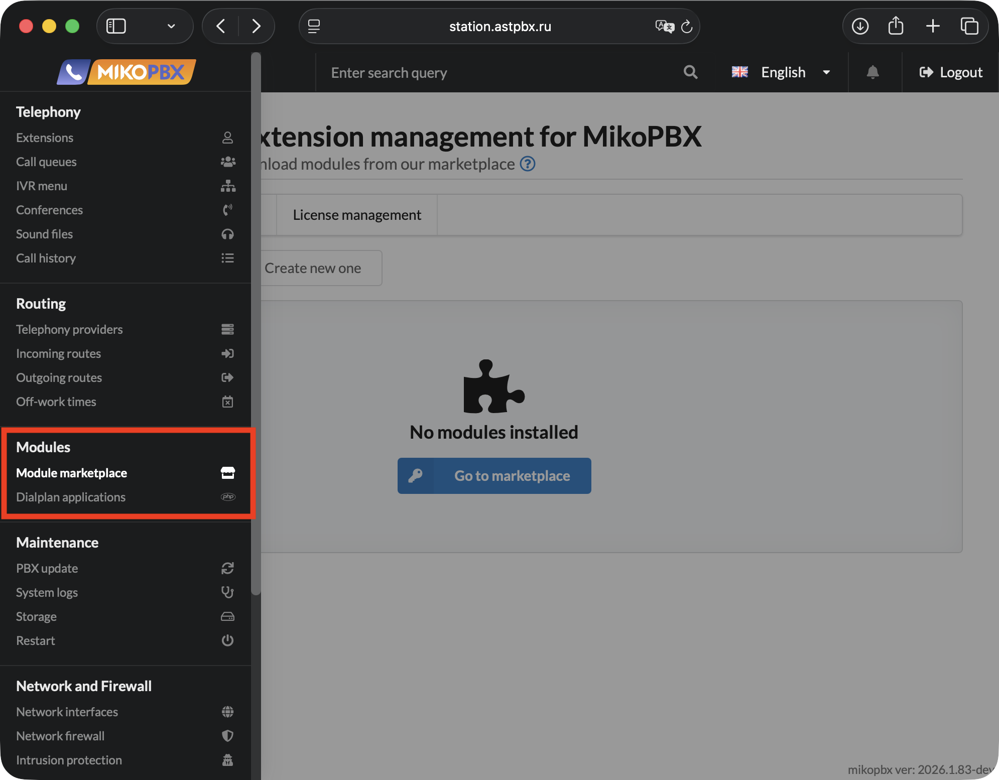
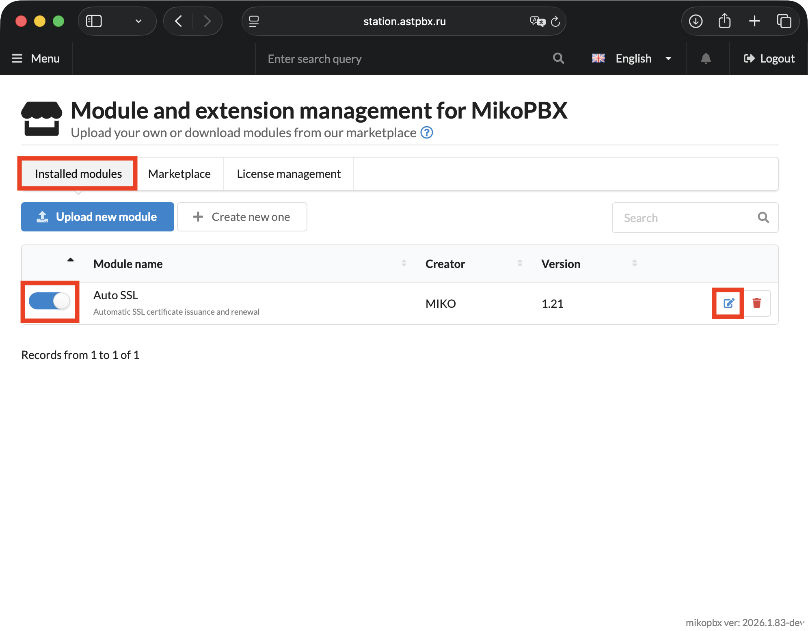
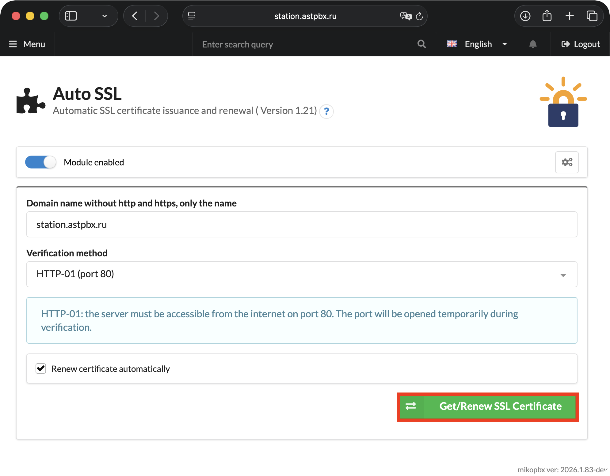

# Let's Encrypt

**Let's Encrypt** is a free, automated Certificate Authority (CA) that issues trusted SSL/TLS certificates to secure websites and services over HTTPS.

**When is this certificate useful in MikoPBX?**

* If your PBX is accessible from the internet and you want to secure the admin web interface.
* For secure WebRTC client connections (browser-based calls require HTTPS).
* To eliminate browser warnings about "insecure connections".
* If you use mobile apps or SIP clients that require a valid certificate.

**System requirements:**

1. A domain must be assigned to the PBX, for example **sip.test.com**
2. The PBX web interface must be accessible from the internet via `HTTP` on port **`80` (for HTTP-01 verification method)**
3. In the general settings (section "**HTTP/HTTPS**"), disable the "**`Redirect to HTTPS`**" option — the Let's Encrypt server accesses your PBX via `http` during verification. **(for HTTP-01 verification method)**

### Module Installation

1. Go to "**Modules**" -> "**Module Marketplace**".

<figure><figcaption>
Section "Modules" -> "Module Marketplace" in MikoPBX
</figcaption></figure>

2. Navigate to the "**Marketplace**" tab. Install the module "**Generator** **Let's Encrypt SSL certificate**".

<figure><figcaption>
Let's Encrypt module installation
</figcaption></figure>

### Obtaining a Certificate

1. Return to "**Installed Modules**". Enable the installed module and open its settings.

<figure><figcaption>
Enabling and opening the settings of the installed module
</figcaption></figure>

2. Fill in the general information:

* **Domain name without http and https, only the name** — enter the domain name of your PBX.
* **Verification method** — choose one of two options: "HTTP-01 (Port 80)" or "DNS-01".


- **HTTP-01**: the server must be accessible from the internet on port 80. The port will be opened temporarily during verification.
- **DNS-01**: the certificate is issued via your DNS provider's API. Port 80 is not required. Wildcard certificates (\*.domain.com) are supported.


* Enable the "**Renew certificate automatically**" option.

If you selected the **DNS-01** verification method, fill in the additional fields:

* **DNS Provider** — select your provider from the list (e.g., Cloudflare, Route53, Namecheap, etc.)
* **API Token** — paste the API access token obtained from your DNS provider's control panel. The token must have permissions to create and delete TXT records in the domain zone.
* **Account ID** — your account identifier at the DNS provider. Usually found in profile settings or the "Overview" section of the control panel.
* **Zone ID** **(Optional)** — the DNS zone identifier for your domain. Typically displayed on the domain's main page in the provider's control panel.

Click "**Get/Renew SSL Certificate**".

<figure><figcaption>
Module settings (certificate generation)
</figcaption></figure>

The result of the certificate request will appear in a black console window.

<figure><figcaption>
Certificate successfully obtained
</figcaption></figure>

In the "**System**" -> "**General Settings**" section, under the "**HTTP/HTTPS**" tab, you can find information about the issued certificate.

<figure><figcaption>
Issued certificate. "HTTP/HTTPS" tab in system settings
</figcaption></figure>
