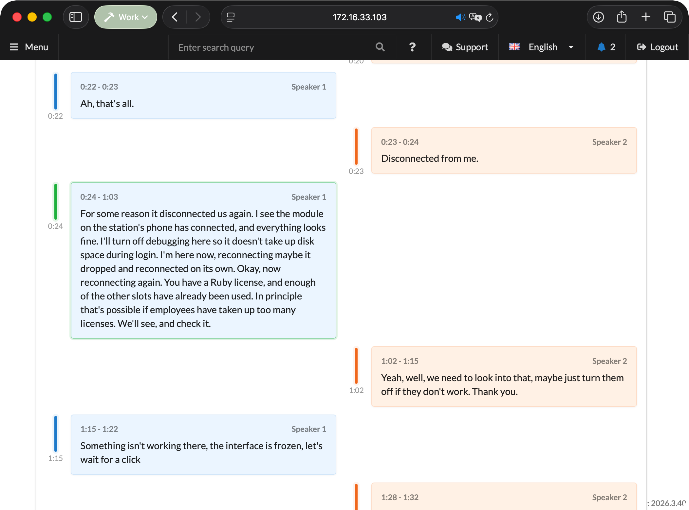
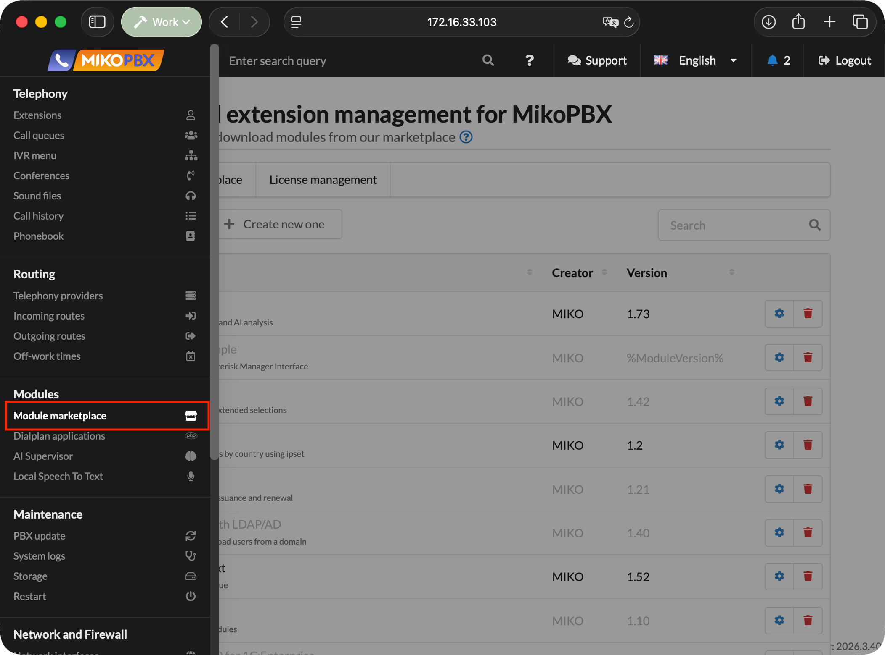
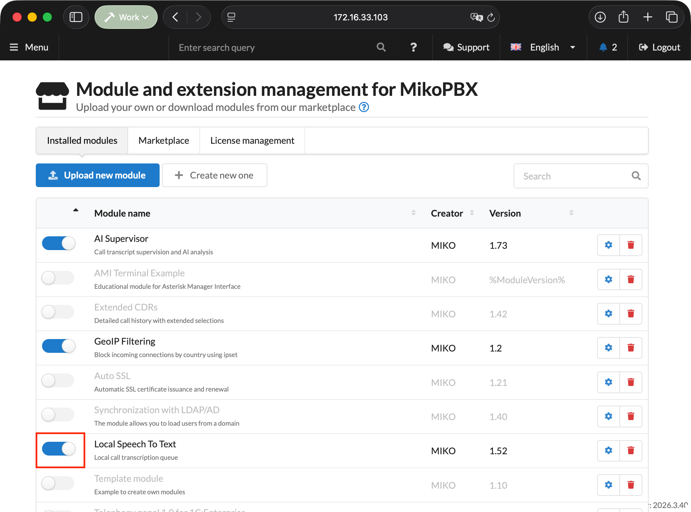
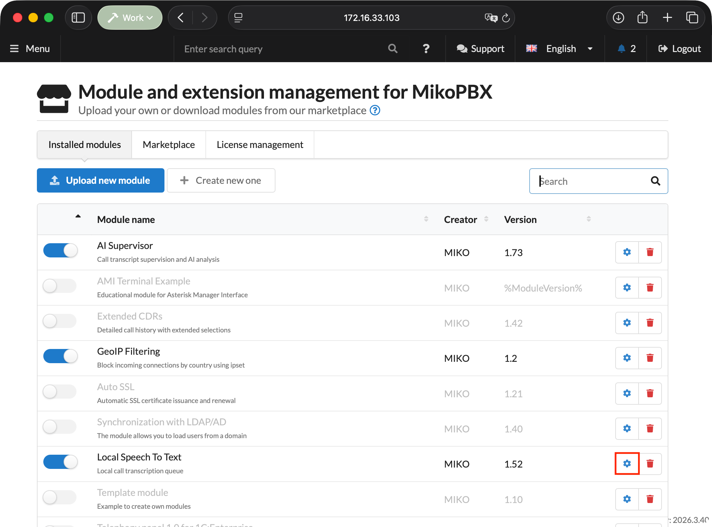
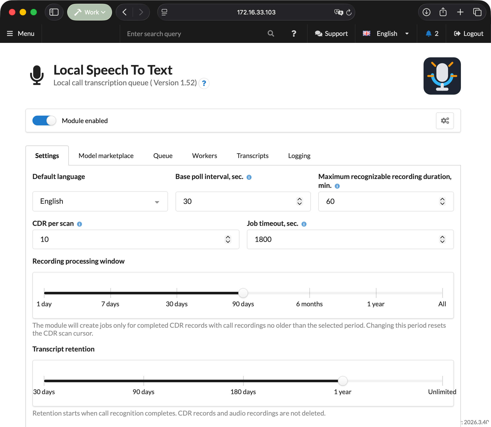
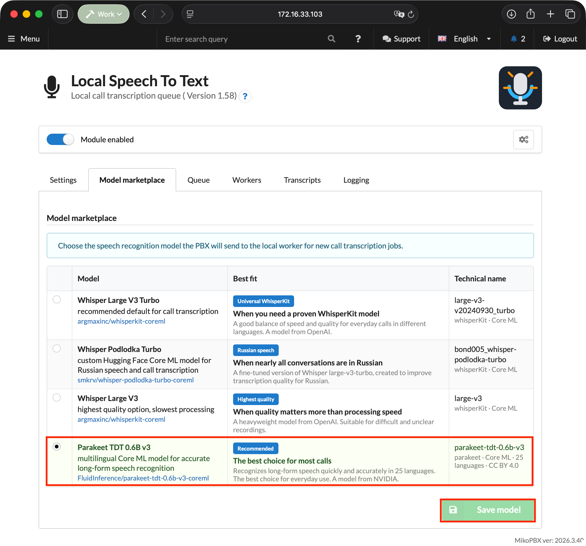
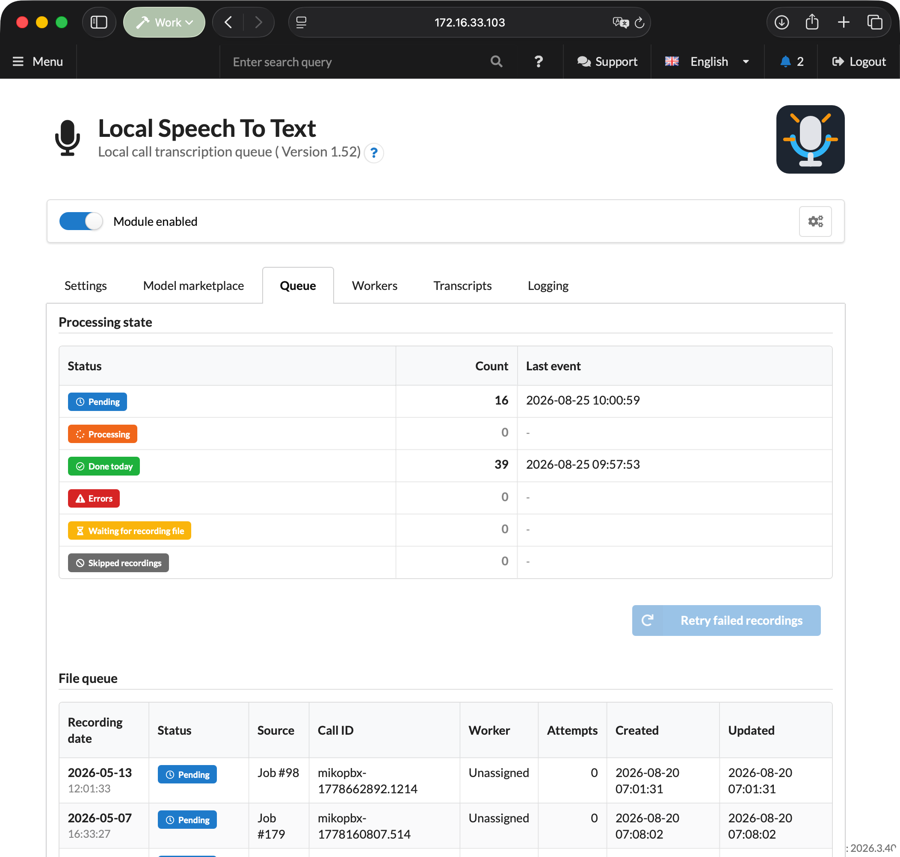
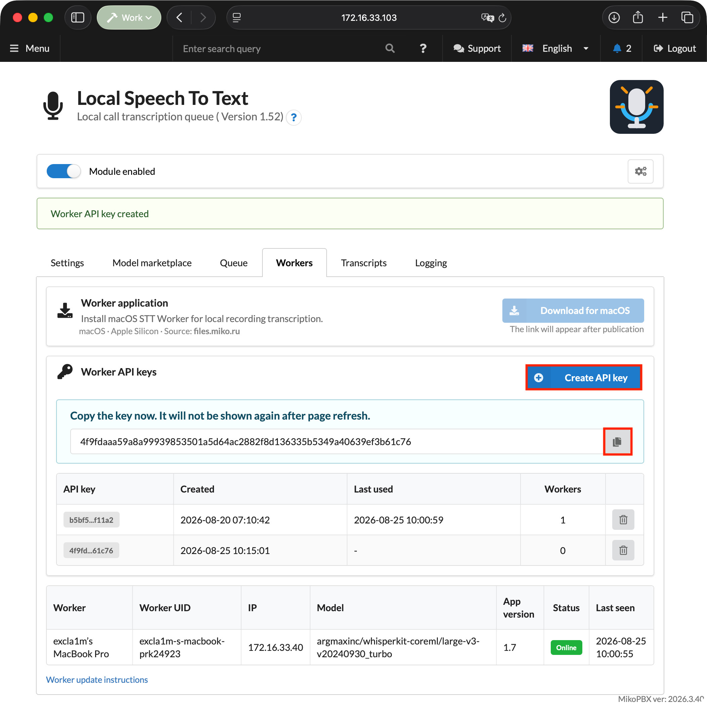
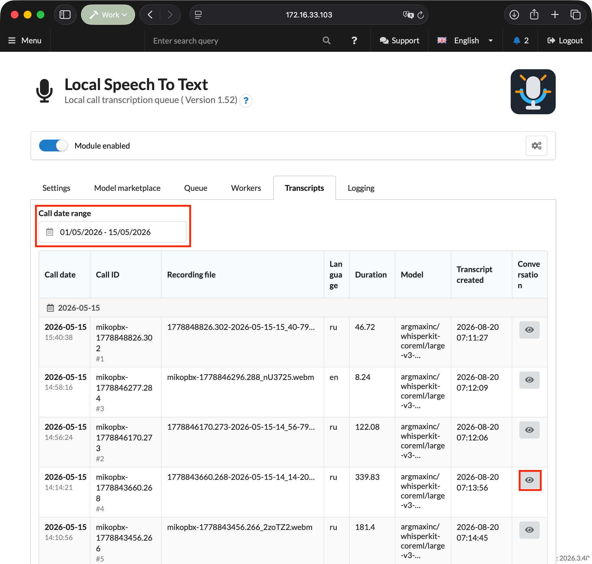

# Local Transcription

The **Local Speech To Text** module recognizes speech in recorded MikoPBX calls and saves the completed transcript as a conversation. Audio files are not sent to external cloud services: the PBX creates a job queue, while a separate **Local STT Worker** application downloads the assigned recording, recognizes it locally with the Parakeet or WhisperKit engine selected in MikoPBX, and returns the result to MikoPBX.


The PBX module runs inside MikoPBX. The separate Local STT Worker application is available for Apple silicon Macs. See [Local STT Worker](miko-ai-worker.md) for a detailed description of the application.


<figure><figcaption>
OUTDATED. Example transcription result
</figcaption></figure>

### How processing works

1. A call ends, and MikoPBX saves the call recording.
2. The module's background process finds the recording and creates a job.
3. Local STT Worker acquires a lease for the job.
4. The PBX provides the assigned recording file to that worker.
5. The worker prepares the audio, starts the engine and Core ML model specified in the job, and produces transcript segments.
6. The module filters the result, saves the transcript, and publishes an event for integrations.

If the worker stops renewing its lease, the job returns to the queue. Each job gets up to three processing attempts, after which it moves to the **Errors** status.

### Requirements and compatibility

* MikoPBX **2025.1.1** or later.
* macOS **14.0** or later on a Mac with Apple silicon.
* Call recording enabled for the required routes, queues, or extensions.
* Network access from the Mac to the MikoPBX web interface. Open the web interface over HTTPS: over HTTP, a newly created access key is not displayed.
* Internet access for the first download of the selected model and its supporting files. After the model has been downloaded, the worker only needs access to the PBX for processing.

### Installing the module

1. Open the MikoPBX web interface.
2. Go to **Modules** → **Module marketplace**.

<figure><figcaption>
Module marketplace
</figcaption></figure>

3. Find **Local Speech To Text** and install it.
4. Open the **Installed modules** tab and enable the module.

<figure><figcaption>
Enabling the module
</figcaption></figure>

5. Click the settings button to the right of the module version.

<figure><figcaption>
Opening the module page
</figcaption></figure>

### Settings tab

| Setting                         | Default              | Purpose                                                                                                                  |
| ------------------------------- | -------------------- | ------------------------------------------------------------------------------------------------------------------------ |
| **Default language**            | Auto - detect automatically | Language hint for the recognition engine. In automatic mode, the call language is detected during recognition.           |
| **Recording processing window** | `30 days`            | How far back to search for completed calls with recordings: 1, 7, 30, or 90 days, 6 months, 1 year, or all recordings.   |
| **Transcript retention**        | `1 year`             | When transcription results are deleted: after 30, 90, or 180 days, 1 year, or unlimited.                                 |
| **Recognition terms**           | Empty                | Company, product, and system names, plus other words used as recognition hints.                                          |

The recording processing window cannot exceed the transcript retention period: on a conflict, the module shows a warning and does not let you save the settings. Retention starts when recognition completes; CDR records and source audio recordings are not deleted.

The list of languages depends on the model selected on the **Model marketplace** tab: for Parakeet, only the languages it supports are available.


Changing the recording processing window resets the scan cursor so that the module reviews call history within the new range.


<figure><figcaption>
OUTDATED. Module settings
</figcaption></figure>

### Model marketplace tab

This tab selects the model that the PBX includes in new jobs. The selection applies centrally to all workers and appears in Local STT Worker after its settings synchronize.


Parakeet supports 25 languages: Bulgarian, Croatian, Czech, Danish, Dutch, English, Estonian, Finnish, French, German, Greek, Hungarian, Italian, Latvian, Lithuanian, Maltese, Polish, Portuguese, Romanian, Slovak, Slovenian, Spanish, Swedish, Russian, and Ukrainian. For another language, select a WhisperKit model or change the model before processing such calls.


| Model                      | When to choose it                       | Characteristics                                                                                  |
| -------------------------- | --------------------------------------- | ------------------------------------------------------------------------------------------------ |
| **Parakeet TDT 0.6B v3**   | Most calls                              | Default model. Fast recognition of long-form speech in 25 languages through the Parakeet engine. |
| **Whisper Large V3 Turbo** | You want a proven general-purpose model | A good balance of speed and quality for typical multilingual calls through WhisperKit.           |
| **Whisper Podlodka Turbo** | Almost all conversations are in Russian | A Whisper model fine-tuned for Russian speech from `smkrv/whisper-podlodka-turbo-coreml`.        |
| **Whisper Large V3**       | Quality matters more than speed         | The heaviest model in the catalog for difficult or unclear recordings. Runs through WhisperKit.  |

After selecting a model, click **Save model**.

<figure><figcaption>
Selecting a recognition model
</figcaption></figure>

### Queue tab

The **Processing state** block shows the number of recordings in each status and the time of the last event.

| Status                         | Meaning                                                                 |
| ------------------------------ | ----------------------------------------------------------------------- |
| **Pending**                    | The job is waiting for an available worker.                             |
| **Processing**                 | The job is assigned to a worker under an active lease.                  |
| **Done today**                 | Jobs completed during the current day.                                  |
| **Errors**                     | Failed jobs that can be returned to the queue.                          |
| **Waiting for recording file** | A CDR record was found, but the file has not appeared or is unreadable. |
| **Skipped recordings**         | Recordings that will not be processed unless the conditions change.     |

The **Retry failed recordings** button returns all jobs in the **Errors** status to the queue.

<figure><figcaption>
OUTDATED. Queue in the module interface
</figcaption></figure>

### Workers tab

Use this tab to download the macOS application, create access keys, and view registered Macs.

#### Worker application

The **Download for macOS** button at the top of the tab downloads Local STT Worker for Apple silicon Macs from `releases.mikopbx.com`.

#### Worker API keys

The **Create API key** button generates a new key. It is shown only once after it is created, so copy it immediately.

A single key cannot be bound to multiple `worker_uid` values at the same time; create a separate key for each Mac.

#### Registered workers

The worker table shows the name, UID, IP address, model selected in MikoPBX, application version, status, and last activity. An incompatible worker appears offline. Until the first worker is registered, a three-step **How to connect a worker** hint is displayed above the table.

<figure><figcaption>
OUTDATED. Workers tab
</figcaption></figure>

### Transcripts tab

You can filter the list by call date range and search the transcript text. Clicking a row opens the conversation.

<figure><figcaption>
OUTDATED. Transcript list
</figcaption></figure>

#### Conversation view

Clicking a turn or the timeline moves the player to the corresponding point in the recording.

The actions menu offers **Download TXT**, **Download JSON**, and **Delete transcript**. Deletion requires confirmation: the transcript and related module data are removed, while the MikoPBX CDR record and the source call recording are kept.

<figure><figcaption>
OUTDATED. Transcript conversation view
</figcaption></figure>

### Transcript in call history

The module adds a **Show transcript** button to the MikoPBX **Call Detail Records** section for calls with a completed transcript.

### Logging tab

The log contains structured technical events from the module and workers, without transcripts, audio recordings, or secrets.

### Access rights

When the user access management module (ModuleUsersUI) is used, separate permissions are available for Local Speech To Text:

| Permission                                       | What it opens                                                                          |
| ------------------------------------------------ | -------------------------------------------------------------------------------------- |
| **View transcripts and call recordings**         | The **Transcripts** tab, conversation view, export, and the transcript in call history. |
| **Delete transcripts**                           | The **Delete transcript** action in the conversation view.                                          |
| **Manage module settings**                       | The **Settings** and **Model marketplace** tabs.                                       |
| **Connect workers and manage the queue and logs** | The **Queue**, **Workers**, and **Logging** tabs.                                      |

Tabs the user has no permission for are not displayed. These permissions do not grant access to the module's REST API.
