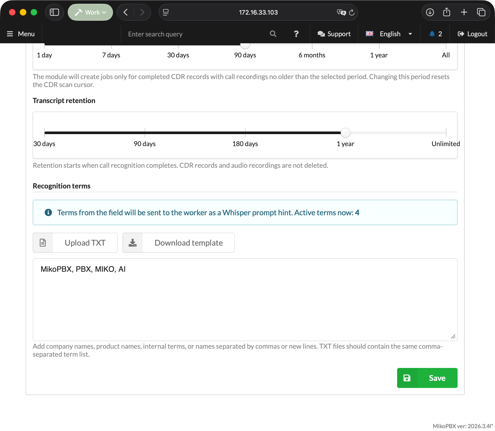
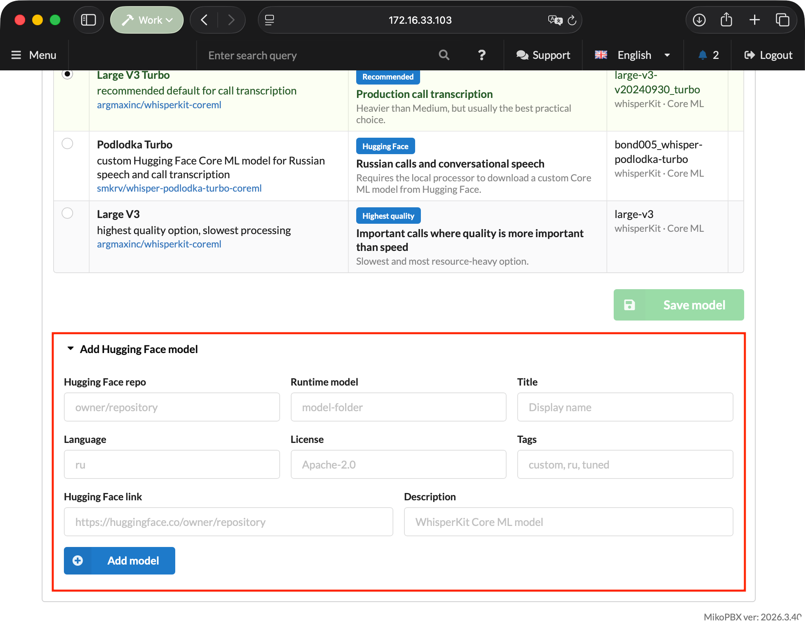

# Local Transcription

The **Local Speech To Text** module recognizes speech in recorded MikoPBX calls and saves the completed transcript as a conversation. Audio files are not sent to external cloud services: the PBX creates a job queue, while a separate **Local STT Worker** application downloads the assigned recording, recognizes it locally with the Parakeet or WhisperKit engine selected in MikoPBX, and returns the result to MikoPBX.


The PBX module runs inside MikoPBX. The separate Local STT Worker application is available for Apple silicon Macs. See [Local STT Worker](miko-ai-worker.md) for a detailed description of the application.


<figure><figcaption><p>OUTDATED. Example transcription result</p></figcaption></figure>

### How processing works

1. A call ends, and MikoPBX saves the call recording.
2. The module's background process finds the recording and creates a job.
3. Local STT Worker acquires a lease for the job.
4. The PBX provides the assigned recording file to that worker.
5. The worker prepares the audio, starts the engine and Core ML model specified in the job, and produces transcript segments.
6. The module filters the result, saves the transcript, and publishes an event for integrations.

If the worker stops renewing its lease, the job returns to the queue. Each job gets up to three processing attempts, after which it moves to the **Errors** status.

### Requirements and compatibility

* MikoPBX **2025.1.1** or later.
* macOS **14.0** or later on a Mac with Apple silicon.
* Call recording enabled for the required routes, queues, or extensions.
* Network access from the Mac to the MikoPBX web interface. Open the web interface over HTTPS: over HTTP, a newly created access key is not displayed.
* Internet access for the first download of the selected model and its supporting files. After the model has been downloaded, the worker only needs access to the PBX for processing.

### Installing the module

1. Open the MikoPBX web interface.
2. Go to **Modules** → **Module marketplace**.

<figure><figcaption><p>Module marketplace</p></figcaption></figure>

3. Find **Local Speech To Text** and install it.
4. Open the **Installed modules** tab and enable the module.

<figure><figcaption><p>Enabling the module</p></figcaption></figure>

5. Click the settings button to the right of the module version.

<figure><figcaption><p>Opening the module page</p></figcaption></figure>

### Settings tab

| Setting                         | Default              | Purpose                                                                                                                  |
| ------------------------------- | -------------------- | ------------------------------------------------------------------------------------------------------------------------ |
| **Default language**            | Auto - detect automatically | Language hint for the recognition engine. In automatic mode, the call language is detected during recognition.           |
| **Recording processing window** | `30 days`            | How far back to search for completed calls with recordings: 1, 7, 30, or 90 days, 6 months, 1 year, or all recordings.   |
| **Transcript retention**        | `1 year`             | When transcription results are deleted: after 30, 90, or 180 days, 1 year, or unlimited.                                 |
| **Recognition terms**           | Empty                | Company, product, and system names, plus other words used as recognition hints.                                          |

The recording processing window cannot exceed the transcript retention period: on a conflict, the module shows a warning and does not let you save the settings. Retention starts when recognition completes; CDR records and source audio recordings are not deleted.

The list of languages depends on the model selected on the **Model marketplace** tab: for Parakeet, only the languages it supports are available.


Changing the recording processing window resets the scan cursor so that the module reviews call history within the new range.


<figure><figcaption><p>OUTDATED. Module settings</p></figcaption></figure>

#### Fixed limits

The poll interval, batch size, job timeout, and maximum recording duration are no longer configurable in the interface. The module uses fixed values:

| Parameter                          | Value       |
| ---------------------------------- | ----------- |
| Maximum recording duration         | 180 minutes |
| Maximum recording file size        | 500 MiB     |
| Interval for finding new recordings | 15 seconds  |
| CDR records per scan               | 30          |
| Lease lifetime without renewal     | 600 seconds |
| Processing attempts per job        | 3           |

#### Recognition terms

Enter terms in the text field, separated by commas, semicolons, or new lines. The module removes duplicates and sends the worker up to 100 terms, each no longer than 120 characters.

<figure><figcaption><p>OUTDATED. Recognition terms</p></figcaption></figure>

#### Audio processing parameters

WhisperKit model decoding parameters, normalization, VAD, maximum segment duration, and overlap are stored centrally in MikoPBX and sent to registered workers. In the current version, the advanced block containing these parameters is hidden, so they cannot be configured through either the module or worker interface.

### Model marketplace tab

This tab selects the model that the PBX includes in new jobs. The selection applies centrally to all workers and appears in Local STT Worker after its settings synchronize.


Parakeet supports 25 languages: Bulgarian, Croatian, Czech, Danish, Dutch, English, Estonian, Finnish, French, German, Greek, Hungarian, Italian, Latvian, Lithuanian, Maltese, Polish, Portuguese, Romanian, Slovak, Slovenian, Spanish, Swedish, Russian, and Ukrainian. Select a WhisperKit model before processing calls in another language.


| Model                      | When to choose it                       | Characteristics                                                                                  |
| -------------------------- | --------------------------------------- | ------------------------------------------------------------------------------------------------ |
| **Parakeet TDT 0.6B v3**   | Most calls                              | Default model. Fast recognition of long-form speech in 25 languages through the Parakeet engine. |
| **Whisper Large V3 Turbo** | You want a proven general-purpose model | A good balance of speed and quality for typical multilingual calls through WhisperKit.           |
| **Whisper Podlodka Turbo** | Almost all conversations are in Russian | A Whisper model fine-tuned for Russian speech from `smkrv/whisper-podlodka-turbo-coreml`.        |
| **Whisper Large V3**       | Quality matters more than speed         | The heaviest model in the catalog for difficult or unclear recordings. Runs through WhisperKit.  |

After selecting a model, click **Save model**.

If the language selected on the **Settings** tab is not supported by the chosen model, a warning appears above the table. In that case, select **Auto - detect automatically** or a compatible language.

<figure><figcaption><p>Selecting a recognition model</p></figcaption></figure>

#### Catalog contents

The catalog contains only the four reviewed models listed above. Adding arbitrary custom repositories through the interface is not supported: the worker accepts only the engine and Core ML artifact combinations provided by the module.


Previously saved custom models do not extend the current catalog. After upgrading, select one of the supported models and save the selection.


<figure><figcaption><p>OUTDATED. Adding a Hugging Face model (feature removed)</p></figcaption></figure>

### Queue tab

The **Processing state** block shows the number of recordings in each status and the time of the last event.

| Status                         | Meaning                                                                 |
| ------------------------------ | ----------------------------------------------------------------------- |
| **Pending**                    | The job is waiting for an available worker.                             |
| **Processing**                 | The job is assigned to a worker under an active lease.                  |
| **Done today**                 | Jobs completed during the current day.                                  |
| **Errors**                     | Failed jobs that can be returned to the queue.                          |
| **Waiting for recording file** | A CDR record was found, but the file has not appeared or is unreadable. |
| **Skipped recordings**         | Recordings that will not be processed unless the conditions change.     |

The **Retry failed recordings** button returns all jobs in the **Errors** status to the queue.

Below it, the **File queue** table lists active recordings: recording date, status with details, source, call ID, worker, number of attempts, and creation and update times.

Reasons for skipping include exceeding the maximum duration (180 minutes), exceeding the fixed 500 MiB limit, a missing file after the waiting period expires, and a call falling outside the processing window. An unknown or zero CDR duration does not by itself prevent the module from creating a job. When the CDR duration exceeds the limit, the module verifies the media file duration with a time-limited `ffprobe` process; if the duration cannot be determined, the check is repeated later.

<figure><figcaption><p>OUTDATED. Queue in the module interface</p></figcaption></figure>

### Workers tab

Use this tab to download the macOS application, create access keys, and view registered Macs.

#### Worker application

The **Download for macOS** button at the top of the tab downloads Local STT Worker for Apple silicon Macs from `releases.mikopbx.com`. The download is available with an active license; if the release is unavailable for the license or the licensing server does not respond, the module shows a corresponding message.

#### Worker API keys

The **Create API key** button generates a new key. It is shown only once after it is created, so copy it immediately. The key table shows the shortened key, creation date, last use time, and number of bound workers; a key can be deleted with the button at the end of its row.

A single key cannot be bound to multiple `worker_uid` values at the same time; create a separate key for each Mac. After deleting a key, register the associated worker again with a new token.


If the web interface is opened over HTTP, the tab shows an **Insecure connection** warning and the key is not displayed after creation. Use HTTPS to create keys.


#### Registered workers

The worker table shows the name, UID, IP address, model selected in MikoPBX, application version, status, and last activity. An incompatible worker appears offline. Until the first worker is registered, a three-step **How to connect a worker** hint is displayed above the table.

<figure><figcaption><p>OUTDATED. Workers tab</p></figcaption></figure>

### Transcripts tab

You can filter the list by call date range and search the transcript text. The table shows the call direction, call date, client, employees, duration, and update time. For transferred calls, the employees column shows the chain of participants. Clicking a row opens the conversation.

<figure><figcaption><p>OUTDATED. Transcript list</p></figcaption></figure>

#### Conversation view

The conversation view includes:

* recording details;
* a player with `0.5x`, `1x`, and `2x` speed options and recording download;
* a timeline with a separate lane for each participant;
* timestamped turns with pause markers;
* search across turns and a filter by participant.

Clicking a turn or the timeline moves the player to the corresponding point in the recording.

The actions menu offers **Download TXT**, **Download JSON**, and **Delete transcript**. Deletion requires confirmation: the transcript and related module data are removed, while the MikoPBX CDR record and the source call recording are kept. A transcript cannot be deleted while that call is still being processed.

If the call included a consultative transfer, the view is split into the **Customer conversation** and **Internal consultation** tabs.

<figure><figcaption><p>OUTDATED. Transcript conversation view</p></figcaption></figure>

### Transcript in call history

The module adds a **Show transcript** button to the MikoPBX **Call Detail Records** section for calls with a completed transcript. The transcript opens in the **Call transcript** window without leaving the call history page.

### Logging tab

The log contains structured technical events from the module and workers, without transcripts, audio recordings, or secrets. Available periods are `1h`, `3h`, `12h`, `1d`, and the entire log. You can filter by level and component, perform a full-text search, and refresh the list. The interface displays no more than the latest 1,000 matching events.

### Access rights

When the user access management module (ModuleUsersUI) is used, separate permissions are available for Local Speech To Text:

| Permission                                       | What it opens                                                                          |
| ------------------------------------------------ | -------------------------------------------------------------------------------------- |
| **View transcripts and call recordings**         | The **Transcripts** tab, conversation view, export, and the transcript in call history. |
| **Delete transcripts**                           | The **Delete transcript** action in the conversation view.                                          |
| **Manage module settings**                       | The **Settings** and **Model marketplace** tabs.                                       |
| **Connect workers and manage the queue and logs** | The **Queue**, **Workers**, and **Logging** tabs.                                      |

Tabs the user has no permission for are not displayed. These permissions do not grant access to the module's REST API.

### Updating the module and worker

The module and Local STT Worker communicate through Worker API v2. When upgrading from older versions, update the components in this order:

1. Update ModuleLocalSpeechToText to the current version.
2. Workers using Worker API v1 become incompatible and offline; their active leases return to the queue without increasing the attempt count.
3. Update Local STT Worker to version 1.7 or later.
4. Open **Diagnostics** or **Settings** in the worker and run the connection check again.

The queue, completed results, settings, worker UIDs, and existing API keys are preserved. A MikoPBX Core version newer than 2025.1.1 is not required.

### REST API

Base path:

```
/pbxcore/api/v3/module-local-speech-to-text
```

Requests are authorized with a Bearer token.

#### Transcripts for integrations

* `GET /transcripts?limit=50&offset=0&date_from=YYYY-MM-DD&date_to=YYYY-MM-DD&search={text}`
* `GET /transcripts/{result_id}`
* `GET /call-transcripts/{call_transcript_id}?revision={revision}`
* `GET /call-transcripts/events?cursor=created_at:event_id&limit=100&include_deleted=false`

`transcripts` returns recognition results for individual recordings. The `limit` parameter accepts values from 1 to 200, and `search` is a query against the transcript text. A detailed transcript contains stable `segment_id` values, source segments, merged `turns`, and plain text.

`call-transcripts` combines multiple recordings from one logical call into a versioned transcript. Its part manifest preserves `cdr_start_ms` and `cdr_end_ms`, while segments contain relative and absolute timestamps. Adjacent segments from the same participant and channel are combined into a single turn without losing their source `segment_id` values. The response includes `source_instance_id`, a permanent identifier of the module's data set, and `contract_version`.

`call-transcripts/events` publishes idempotent `call-transcript.completed` and `call-transcript.updated` events. To read from the beginning, use the cursor `0:0`; store `next_cursor` only after all returned events have been processed successfully. With `include_deleted=true`, the stream also returns `call-transcript.deleted` events with the `deleted_at` and `deletion_reason` fields: `manual` for manual deletion, `retention` for an expired retention period.

#### Administration

| Operation                             | Endpoint                            |
| ------------------------------------- | ----------------------------------- |
| List jobs                             | `GET /jobs`                         |
| Get a job                             | `GET /jobs/{job_id}`                |
| Create a job for a recording file     | `POST /jobs`                        |
| Retry or reset a failed job           | `PATCH /jobs/{job_id}`              |
| Retry or reset several jobs           | `PATCH /jobs`                       |
| Delete a job                          | `DELETE /jobs/{job_id}`             |
| Bulk delete by status                 | `DELETE /jobs`                      |
| List workers                          | `GET /workers`                      |
| Get a worker                          | `GET /workers/{worker_id}`          |
| Update a worker                       | `PUT`, `PATCH /workers/{worker_id}` |
| Delete a worker                       | `DELETE /workers/{worker_id}`       |

The `retry` action keeps the attempt counter, while `reset` clears it; only failed jobs can be changed. Only a pending or failed job without saved results can be deleted. A worker can be deleted only when it has no active lease; job and result history is preserved. Worker credentials do not grant access to job management.

#### Worker API v2

The worker first calls `GET /worker-api-contract`, then sends the `X-MikoPBX-Worker-API-Version: 2` header with every Worker API request. A request without a matching version is rejected with code `426` and the `worker_upgrade_required` error.

The `GET /worker-processing-settings` response contains the centralized processing profile and a `selected_model` object with the model identifier, repository, engine, Core ML artifact type, and display name. Jobs also contain `model_engine` and `model_artifact_type`, which the worker uses to choose Parakeet or WhisperKit. Arbitrary engine, model, and artifact combinations are rejected.

| Operation                 | Endpoint                          |
| ------------------------- | --------------------------------- |
| Registration              | `POST /workers`                   |
| Processing profile        | `GET /worker-processing-settings` |
| Worker update license     | `GET /worker-update-license`      |
| Acquire lease             | `POST /job-leases`                |
| Download recording        | `GET /job-recordings/{job_id}`    |
| Renew lease               | `PATCH /job-leases/{job_id}`      |
| Release lease             | `DELETE /job-leases/{job_id}`     |
| Submit result             | `PUT /job-results/{job_id}`       |
| Submit failure            | `PUT /job-failures/{job_id}`      |

Legacy Worker API v1 endpoints have been removed. Local STT Worker 1.7 does not fall back to v1 and stops with upgrade guidance when it encounters an incompatible module version.
