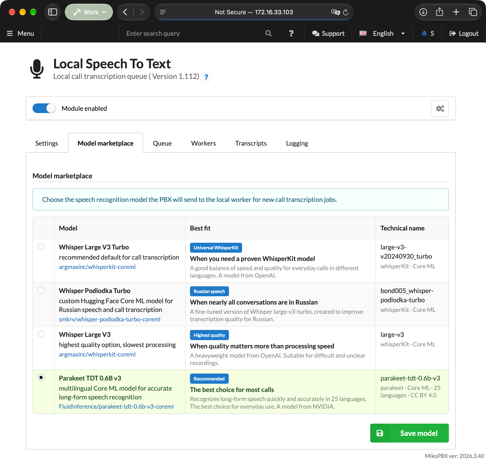
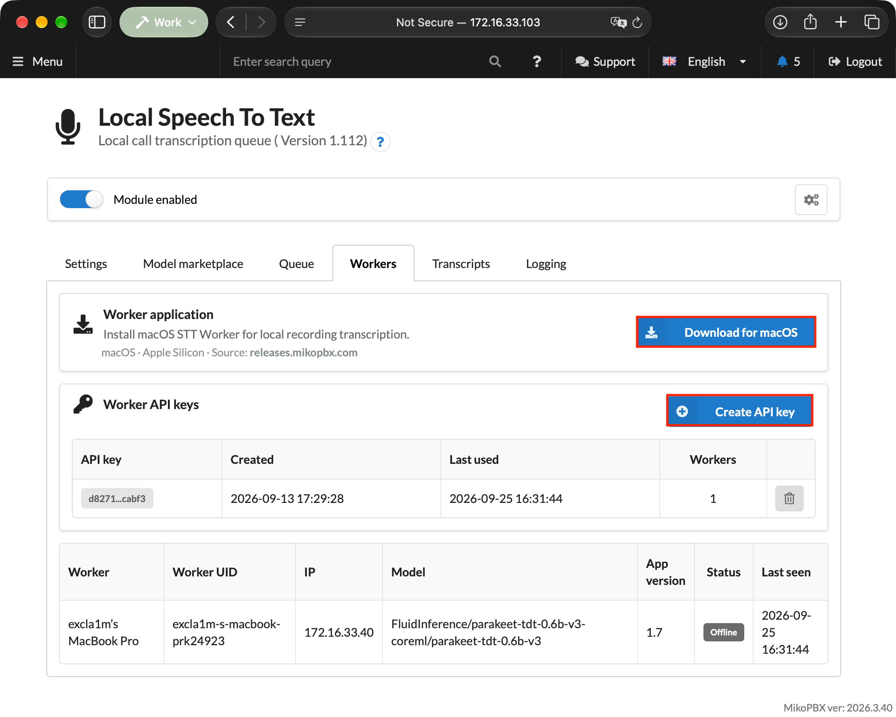
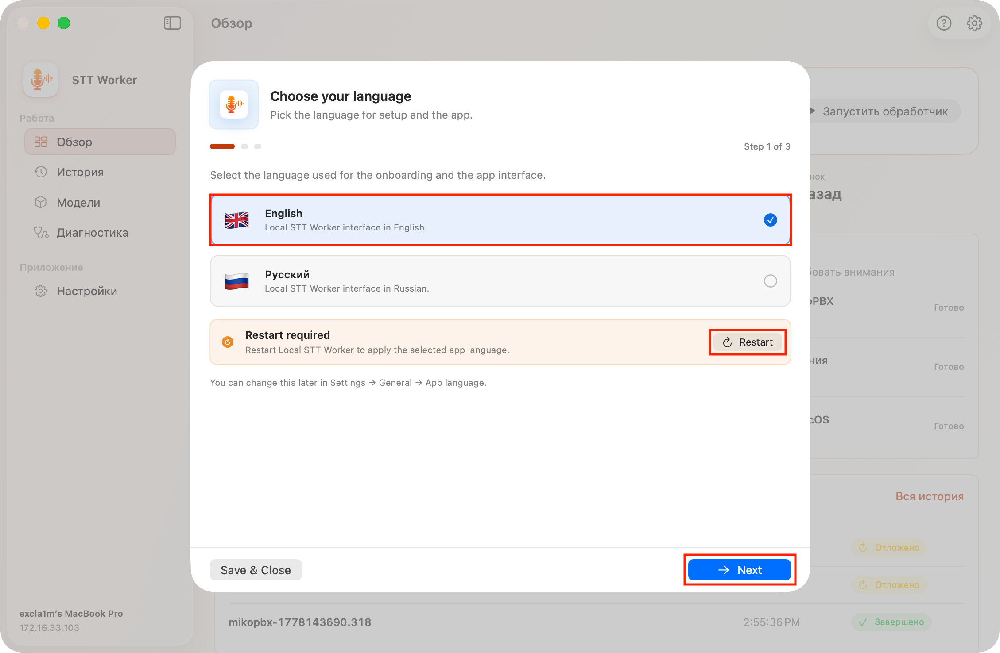
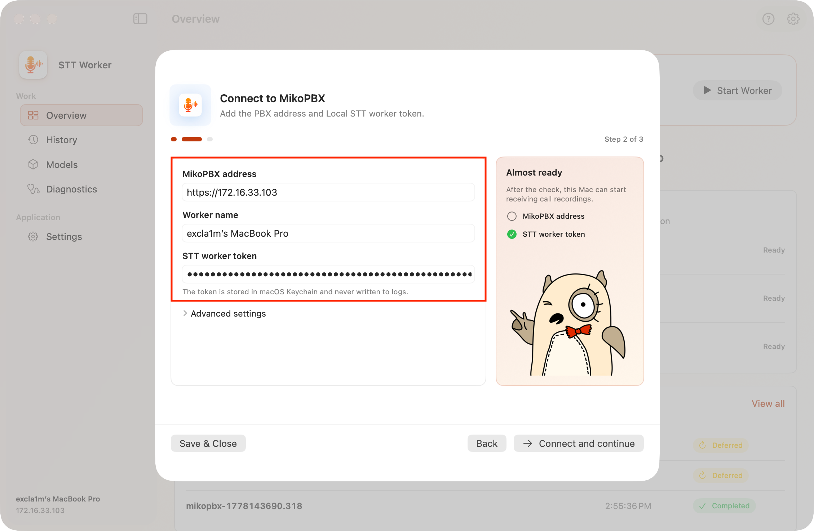
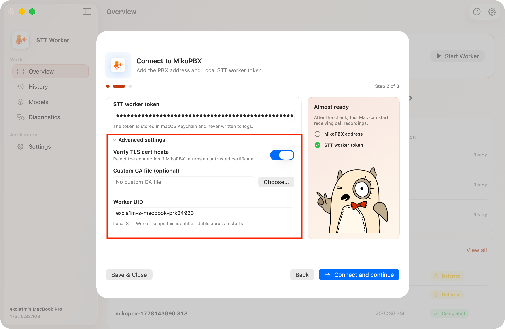
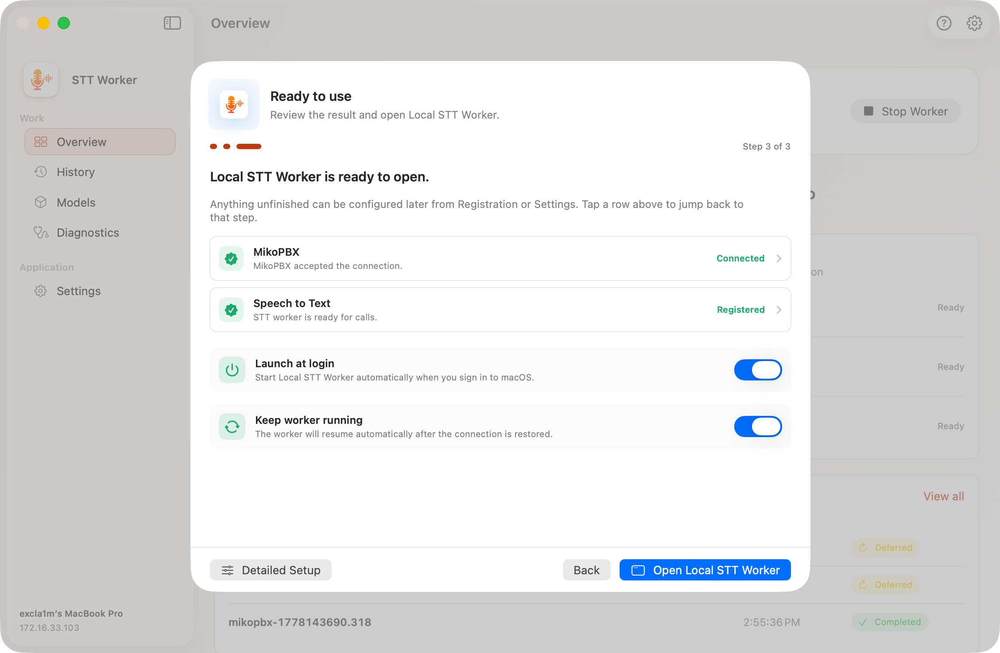
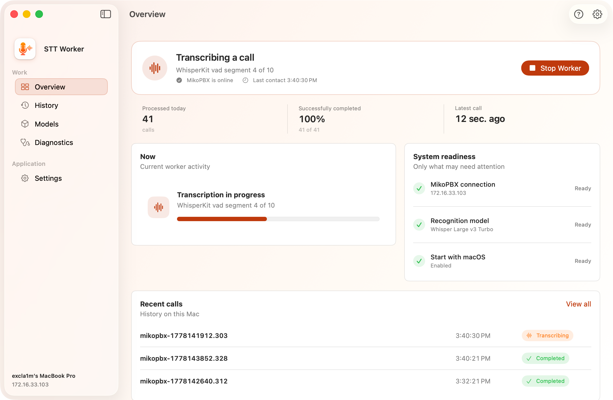

# Quick Start

### Installing the module

1. Open the MikoPBX web interface.
2. Go to **Modules** → **Module marketplace**.

<figure><figcaption>
Module marketplace
</figcaption></figure>

3. Find **Local Speech To Text** and install it.
4. Open the **Installed modules** tab and enable the module.

<figure><figcaption>
Enabling Local Speech To Text
</figcaption></figure>

5. Click the settings button to the right of the module version.

<figure><figcaption>
Opening the module page
</figcaption></figure>

### Initial module setup

1. On the **Settings** tab, select the main language used in calls or leave **Auto - detect automatically** selected.
2. Select the **Recording processing window** and **Transcript retention**. The processing window cannot exceed the retention period.
3. If necessary, add internal names and abbreviations under **Recognition terms**.
4. Save the settings.

<figure><figcaption>
OUTDATED. Module settings
</figcaption></figure>

### Selecting a model

1. Open the **Model marketplace** tab.
2. Select the model for call transcription. The default **Parakeet TDT 0.6B v3** is recommended for most calls; use a WhisperKit model for languages outside Parakeet's 25 supported languages.
3. Click **Save model**.


The selected model is downloaded to the Mac when the worker receives its first job. Keep the Mac connected to the internet until the model and its supporting files finish downloading.


<figure><figcaption>
Selecting a recognition model
</figcaption></figure>

### Downloading the worker and creating an API key

1. Open the **Workers** tab. Use HTTPS for the web interface: over HTTP, the created key is not displayed.
2. Click **Download for macOS** to download Local STT Worker.
3. Click **Create API key**.
4. Copy the displayed token immediately. It cannot be viewed again after the page is refreshed.


Create a separate key for each Mac. One key cannot be bound to multiple worker UIDs.


<figure><figcaption>
Creating a Worker API key
</figcaption></figure>

### Connecting Local STT Worker

Install and open **Local STT Worker**. A three-step onboarding wizard appears on first launch.

#### Step 1. Language

Select English or Russian as the interface language, then click **Next**. Changing the language may require a restart; after restarting, the onboarding wizard opens again.

<figure><figcaption>
Selecting the Local STT Worker language
</figcaption></figure>

#### Step 2. Connect to MikoPBX

Complete these fields:

| Field                | What to enter                                                                 |
| -------------------- | ----------------------------------------------------------------------------- |
| **MikoPBX address**  | An address such as `https://pbx.example.com`, without credentials in the URL. |
| **Worker name**      | A recognizable Mac name that will be displayed in MikoPBX.                    |
| **STT worker token** | The key created on the **Workers** tab.                                       |

<figure><figcaption>
Configuring the MikoPBX connection
</figcaption></figure>

Expand **Advanced settings** to configure:

* TLS certificate verification;
* a custom CA PEM file;
* a custom worker UID.

<figure><figcaption>
Advanced MikoPBX connection settings
</figcaption></figure>

Click **Connect and continue**. The application checks the connection and validates the supplied settings.

#### Step 3. Ready to use

The final step displays the worker status. You can also enable two options here:

* **Launch at login** — open Local STT Worker automatically when you sign in to macOS.
* **Keep worker running** — resume the worker automatically after the network connection is restored, the Mac wakes from sleep, or a temporary error occurs.

<figure><figcaption>
Final Local STT Worker setup step
</figcaption></figure>

In the application, open **Overview**. If the worker is stopped, click **Start Worker**. The readiness panel should display the model selected in MikoPBX.

### Verifying operation

1. Make a call for which call recording is enabled.
2. Wait for a job to appear on the module's **Queue** tab.
3. On first use, wait for the model to download to the Mac.
4. Check local processing stages under **Overview**, or review events under **Diagnostics**.
5. Open the completed result on the **Transcripts** tab in MikoPBX, or click **Show transcript** in the call history.

<figure><figcaption>
Call processing on the worker Overview page
</figcaption></figure>

See [Local STT Worker](miko-ai-worker.md) for a detailed description of the application sections.
