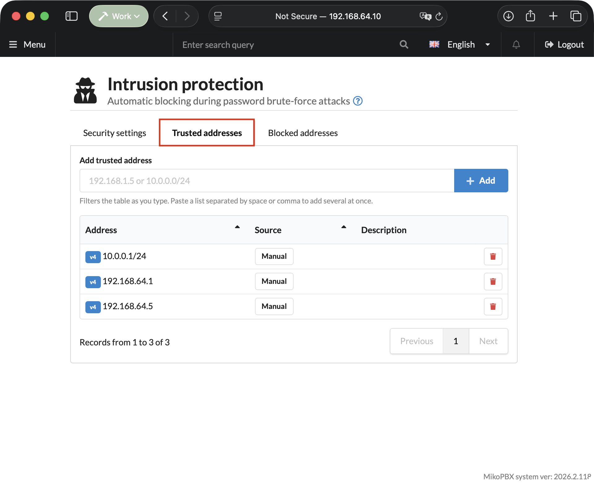
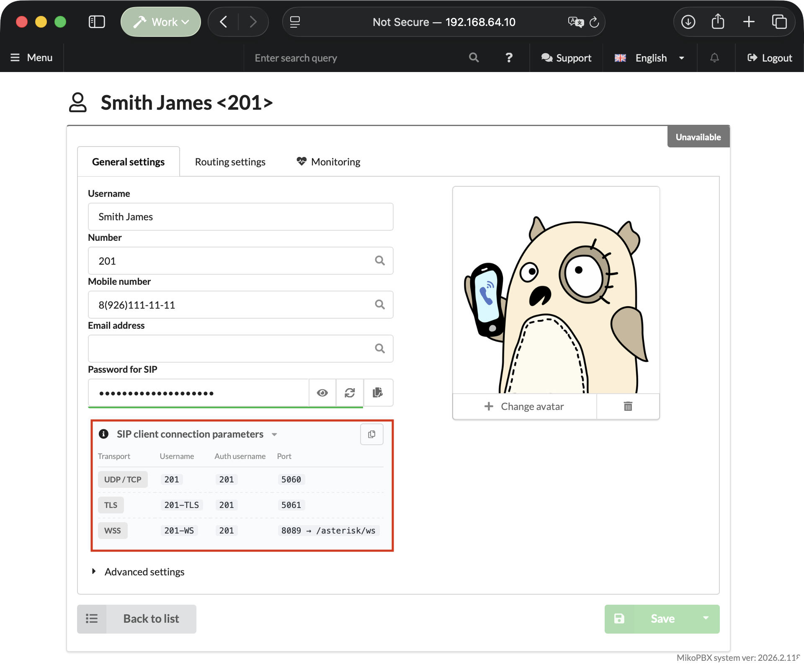
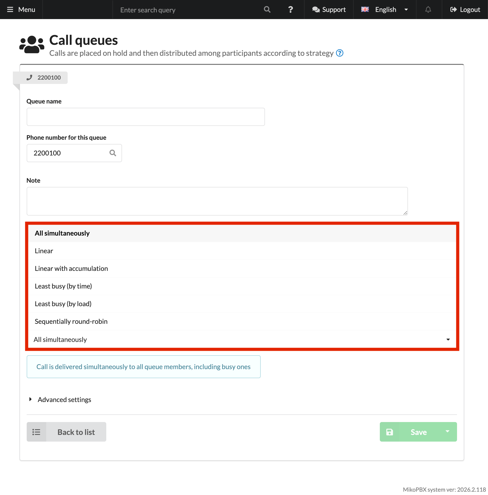
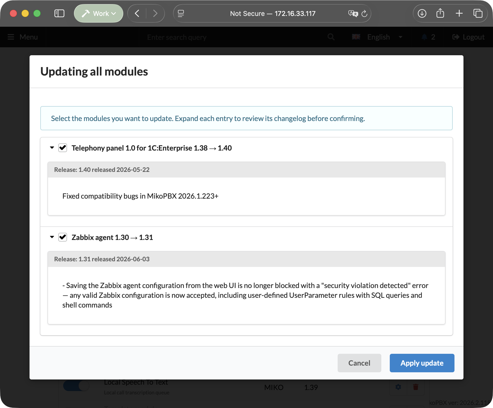
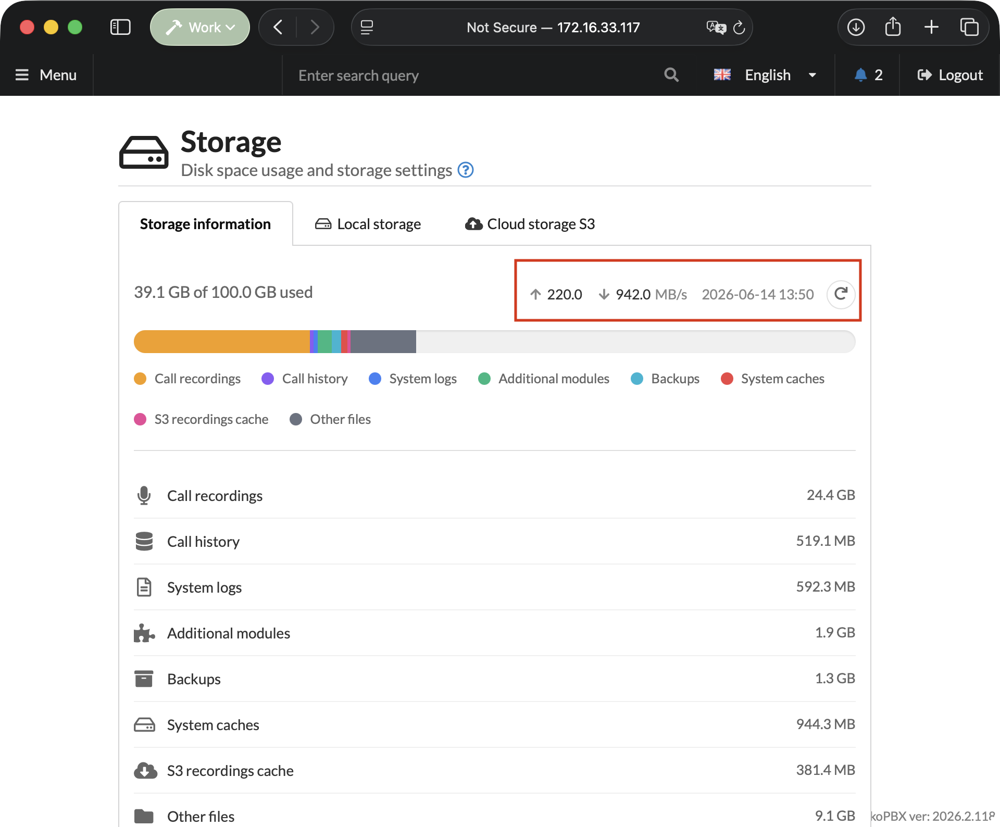
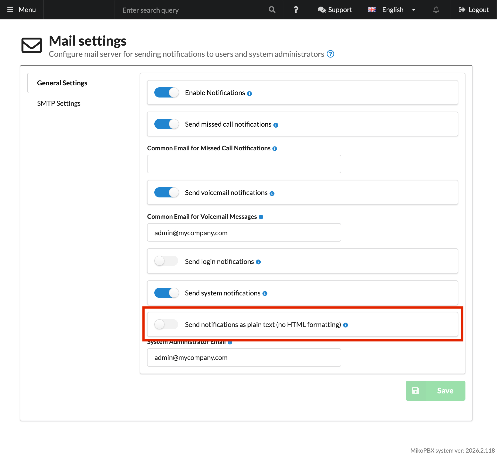

# MikoPBX 2026.2.118

MikoPBX 2026.2.118 includes a large set of security fixes, improvements to SIP registration, Fail2Ban and Firewall, updates for sound files, S3 storage, CDR, modules, and the console menu. The release also improves stability for background processes, the REST API, and the web interface.

### Security Hardening

Several vulnerabilities in PBXCoreREST and the web interface have been closed: auth bypass, XSS, RCE, path traversal, arbitrary file write, and command injection. Lua WAF has been strengthened: it now checks the original request path before rewrite, query string, POST body, and double-encoded payloads.

CSP and `X-Frame-Options` have been added, wildcard CORS has been removed, and HTTP/2 has been enabled. Zip Slip protection during module installation has been fixed. HTTP request limiting now respects the selected security level and no longer blocks service `HEAD` requests to audio files.

Firmware download validation has been fixed, and upload/patch scenarios and file paths have been hardened. Unknown API endpoints now return `404` instead of `403` for authenticated users.

### Important Compatibility Changes

The `UseWebRTC` and `UseSipTls` flags have been removed from PBX settings. TLS transport is now enabled automatically when a certificate is present. If an external integration sends these fields through the REST API in `PUT` requests, the API will return HTTP `422`.

The whitelist field in the old Fail2Ban settings form is no longer used for editing trusted addresses. All trusted addresses are now managed through the separate **Trusted addresses** tab.

The `en_GB` language key is no longer supported. During the update, existing installations are automatically switched to `en`.

### Authorization and Sessions

Authorization issues have been fixed that could cause refresh loops, a `500` error with an invalid cookie, and incorrect handling of redirects to `/session/index`.

The **Remember me** option now correctly preserves the session between browser restarts. Login notifications now include the client IP address.

### Firewall Bouncer and Fail2Ban

A Firewall Bouncer API has been added for external protection systems, including a CrowdSec-LAPI endpoint. MikoPBX publishes the list of blocked addresses, and an external agent can apply these blocks at the host or cloud firewall level. This is especially useful for Docker environments, where the container's built-in firewall cannot always protect the external network perimeter.

The Fail2Ban section now has a **Trusted addresses** tab with bulk paste, live search, and an automatic list of addresses from firewall rules. The whitelist now correctly supports CIDR and IPv6, while wildcard networks `0.0.0.0/0` and `::/0` are rejected to avoid accidentally opening access to the entire internet.

<figure><figcaption><p>Trusted addresses seciton in Fail2Ban</p></figcaption></figure>

The list of blocked addresses is now sorted by the actual ban date instead of as text. Ban time and expiration time are displayed in the server time zone, and the tooltip additionally shows browser time.

Ban/unban operations are now faster: instead of a full PJSIP reload, a lightweight ACL module reload is used.

### SIP Provider Improvements

SRV-based SIP registration support has been added. The interface now correctly displays registration status through SRV, and port `0` is displayed as an empty field.

TLS transport for SIP clients now works as a separate endpoint alongside UDP/TCP and WebRTC, and appears automatically when a certificate is present. A case has been fixed where TLS connections from different SIP providers could be mixed up if different hostnames resolved to the same IP address.

<figure><figcaption><p>New SIP client connection parameters</p></figcaption></figure>

The hostname resolver for PJSIP identify now works through Redis cache and a separate worker, supports `additionalHosts`, and performs stricter trusted-source checks. Hostnames in SIP providers' additional hosts pass through the same DNS cache as the main address, so providers with changing IP addresses do not lose connectivity after DNS changes.

`uniqid` deduplication for providers and peers in `pjsip.conf` has been fixed. SIP login validation now allows the `*` character. CIDR support has been added to provider settings, and host/subnet validation errors are now clearer. A `LEGACY_CP1251` hint and `res_legacy_cp1251.so` loading have been added for legacy providers.

### Extensions, Call Queues, and Routing

A separate **Accept multiple simultaneous calls** switch has been added for each employee. This allows call waiting for a second call to be enabled or disabled individually per extension.

A new call queue strategy, `linear_progressive`, has been added. With this strategy, agents are added to the dialing process gradually.

<figure><figcaption><p>New call queue strategies</p></figcaption></figure>

Dialplan errors have been fixed: routes with an empty `providerid` no longer break configuration generation, `Q_TIMEOUT` no longer causes extra errors for non-queue calls, and an employee's Call Recording setting is now correctly applied to outbound calls and calls through queues.

### CDR and Call Recordings

CDR handling has been fixed: record retrieval by id has been added, `linkedid` is supported, recovery works when CDR tables are missing, WAL has been enabled, and old-record cleanup has been optimized.

Old CDR records are now cleaned up in small batches with a 5-second timeout instead of blocking the system on large databases. On first launch, records older than 360 days may be cleaned up gradually. On large databases, the process may take several minutes, while new calls continue to be recorded.

After an unsuccessful attended transfer, `MixMonitor` now resumes correctly. DID handling in grouped CDR records has been fixed, and CallerID data is protected when displayed in tables.

### Modules

A server-side bulk module update mechanism has been added. The web interface now has a workflow for updating all modules with changelog preview and installation confirmation. The administrator can use checkboxes to choose which modules to update and which to skip.

<figure><figcaption><p>New feature: Update many modules at one time</p></figcaption></figure>

Module installation is now safer: a Zip Slip vulnerability has been fixed, error handling has been improved, and optional `developer` and `support_email` fields in `module.json` are now supported.

### Sound Files and Language Packages

Asterisk sound files have been moved to writable storage via symlink, while base files are now stored separately in `sounds-base`. This prevents issues with read-only partitions.

Opus, WebM preview, `.wav16`, and `.wav48` support has been added. WebM is used as the browser preview format while preserving the quality of the original recording. If conversion through ffmpeg fails, the uploaded file is no longer deleted.

The language package system has been simplified: standard Asterisk language codes are automatically mapped to web codes, and special cases such as `zh-cn → zh_Hans` are handled separately.

### S3 and Storage

S3 provider presets and an explicit path-style flag have been added. The web interface now includes hints for preset providers, and the test infrastructure has been expanded with MinIO and Garage environments.

A disk I/O benchmark has been added to check read and write performance directly on the Storage page. The result can be refreshed with a button without opening the console.

<figure><figcaption><p>New feature: A disk I/O benchmark</p></figcaption></figure>

Free-space checks have been improved, and `sys_disk` detection, swap creation, and a false warning about an unmounted disk in Docker have been fixed. SQLite backup is now created as a binary snapshot, eliminating the risk of mixing data between tables during backup.

### Web Interface

Interactive hints have been updated: the field-info tooltip is now built through `TooltipBuilder`, displays apostrophes correctly, and is positioned better in complex forms. Hints under input fields are more stable across all pages and no longer disappear on hover.

404/error UX, several JS null-dereference crashes, Fullscreen API behavior on iPhone WebKit, language selection, and time display according to the server time zone have been fixed.

The extension card now shows a SIP client connection hint under the **Password for SIP** (`Secret`) field.

### Console Menu

The console network setup wizard now shows a single change review screen comparing the new values with the current values in the database. The administrator sees only fields that will actually change and can immediately confirm applying the settings.

A behavior has been fixed where the review screen briefly appeared and then disappeared after clearing the terminal. More convenient DNS prompts and numeric hotkeys have been added. The network setup wizard skips asking for DNS servers if the network uses DHCP and IPv6 is disabled.

If the SSH session is interrupted, the console menu now exits correctly and no longer hangs with CPU load up to 100%. The welcome banner can now show the external host when running behind NAT.

### REST API and Migrations

Saving `networkfilterid` cleanup during REST `UPDATE/PATCH` has been fixed. Switching the network filter to **Connections from any addresses are allowed** for AMI managers, API keys, and providers now actually clears the network filter binding.

The `ipv6_mode` setting is now saved correctly even if the field is not passed in the payload. Short API key passwords are now rejected with a clear error message instead of being silently ignored.

Static route migration now understands the net-tools syntax `gateway <ip>` and an interface specified as the last argument without `dev`. Redis metadata cache is cleared before database migration.

DHCP deconfig no longer clears custom DNS settings, and legacy `route` commands have been replaced with `ip route`.

### Mail and Notifications

The `MailPlainText` switch has been added for sending emails in plain text format. Cache synchronization after changing mail settings has been fixed.

<figure><figcaption><p>"Send notifications as plain text" switch</p></figcaption></figure>

The recording attachment in voicemail notifications has been fixed. When license registration fails, the real reason is shown instead of a generic no-connection message.

### System Stability

Worker process management has been improved: protection has been added against out-of-memory conditions, pool worker multiplication, restart storms on ENOSPC, and stuck extra processes. When the disk is full, service processes no longer enter an infinite restart loop.

Three monitor workers have been merged into `WorkerStatusMonitor`. Pheanstalk has been updated from 4.x to 8.x, and socket-read fatal errors have been fixed. Redis connections are now more resilient, with fewer reconnects. OPcache is disabled for CLI workers, reducing memory usage.

The REST worker now resets ORM state between tasks. This improves stability under a large number of sequential API requests. NATS now writes stderr to the log instead of `/dev/null`.

### Tests and Infrastructure

A BrowserStack architecture matrix has been added to test different architectures. Regression tests have been expanded for the REST API, WAF, security, S3, CDR, sound conversion, workers, syslog, and network scenarios.

Tests have been added for `DnsResolver`, `ForwardedHeaderFilter`, bearer token parsing, WAF registry/exemptions, Redis provider, PID files, and signal handling.

## Known Issues

**Fix: audio disappears on H.323 bridge (ooh323) after update**

**Component:** `chan_ooh323` / H.323 bridge

**Symptom:** After the update, incoming H.323 calls through `ooh323` lose audio completely. Greetings in queues and IVR menus are not heard, although the dialplan runs correctly and files appear to be played in the console. Disabling the firewall does not resolve the issue.

**Cause:** A change in DTMF handling in this release breaks media stream negotiation in the `ooh323` channel driver.

**Workaround / Fix:** Set the following in `ooh323.conf`:

```
dtmfmode=h245alphanumeric
```

For peers, changing only the snippet is not enough: export the full peer configuration through the web interface, change the file application mode from `append` (**add content**) to `override` (**replace file**), and include the corrected `dtmfmode` value.
