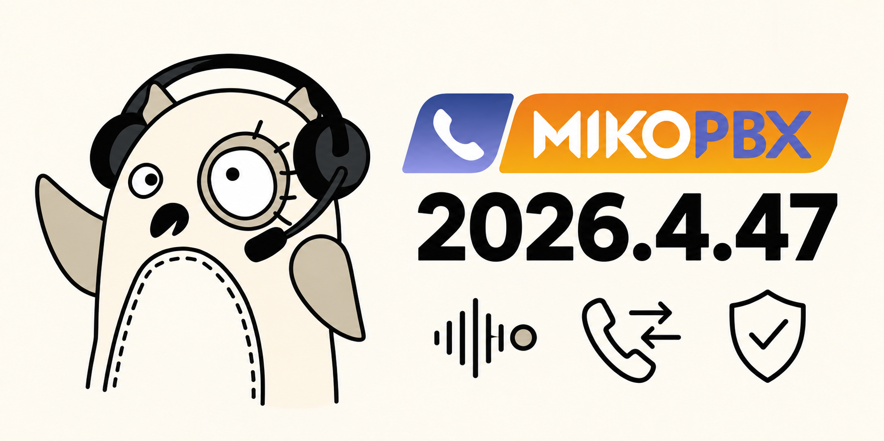
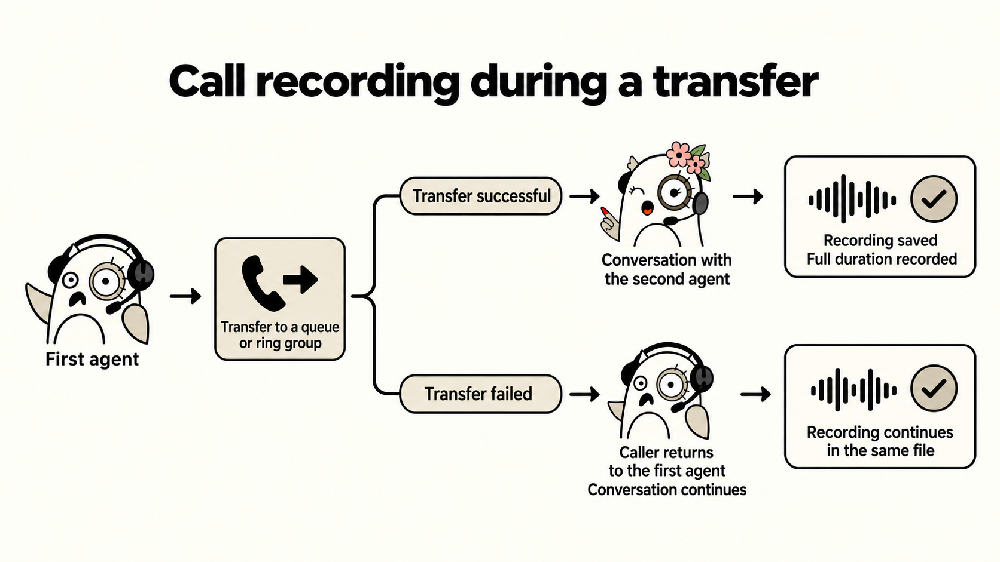
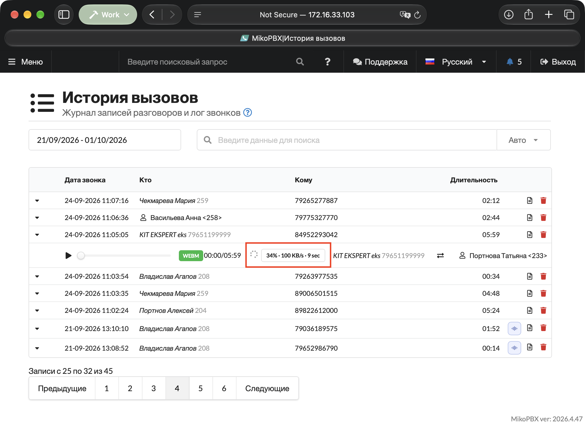

# MikoPBX 2026.4.47

MikoPBX 2026.4.47 makes call recording, transfers, and call pickup more reliable. Module and integration handling has been improved, and PBX security has been strengthened. The web interface is easier to use, while network settings changes and system updates are more dependable.

<figure><figcaption></figcaption></figure>

### Call recordings and call history

If an attended transfer to a queue or ring group fails and the call returns to the agent, recording continues in the same file. Previously, the second part of the conversation could go unrecorded.

After a successful transfer to a queue, the transferring agent leaving the call no longer cuts short the recorded call duration. Call history retains the recording and the full duration of the conversation with the answering agent. Cases where completed calls continued to appear unfinished have also been fixed.

<figure><figcaption></figcaption></figure>

Recording has been restored in certain call interception and Smart IVR routing scenarios. When a call is picked up using `*8` or by a supervisor, call history shows the name of the employee who actually answered and the correct conversation duration.

Conference recordings are available from call history again: links that could previously point to a missing file have been fixed.

When downloading a recording, the interface shows download progress, speed, and estimated time remaining. This is especially useful for long conversations and slow connections.

<figure><figcaption><p>Call recording download progress</p></figcaption></figure>

Stereo recordings now include information identifying which participant each audio track belongs to. This helps transcription systems and CRMs distinguish the employee's speech from the customer's in both incoming and outgoing calls.

### Routing, queues, and IVR

Incoming routes no longer get mixed up for providers using inbound registration on the same server. Calls follow the settings of their own account.

The actual caller's number is now resolved for out-of-hours calls as well. It is passed correctly to call history and integrations, even if the call ends after an announcement. Changing the source of the caller's number preserves the caller name supplied by the provider.

Module extension numbers are available in forwarding destination lists again. They can be selected in incoming routes, queues, and other call routing settings.

A queue without employees can be saved if a destination is set for calls arriving at an empty queue. Without that destination, the form reports an error. An IVR menu with no greeting selected no longer plays an unrelated sound file.

### Module management

After an enabled module is installed or updated, its changes take effect without rebooting the PBX. This also works when reinstalling the same version. Cases where enabling or disabling a module was not fully applied to running services have been fixed.

Long-running module operations are more reliable. The installation indicator shows the current stage and no longer disappears immediately after an operation starts or freezes because of an interface error.

<figure><figcaption><p>Module update in progress</p></figcaption></figure>

The system log now shows who started installing, removing, enabling, or disabling a module. During a bulk update, this information is retained for each module.


```log
026-10-02 11:40:18 daemon.warning php.backend[20047]:  Module operation started: {"operation":"install_package","module":"2295928-ModuleCloudAISupervisor120zip","user":"admin","ip":"172.16.33.40","operationId":"cd2bc2586ef6bea12d6b603c"} on MikoPBX\PBXCoreREST\Lib\ModulesManagementProcessor
```


### Security and access

Cloud installations using the default administrator password now require a password change after login. The web interface redirects the administrator to the passwords tab in General Settings until the default password has been replaced.

Protection has been strengthened for telephony settings, sound file uploads, employee imports, and unblocking addresses. Invalid parameters can no longer be used to execute unauthorized commands or access PBX files through the affected operations. Service interfaces intended for internal use are no longer accessible from the network by default.

Intrusion protection no longer blocks an administrator because of a brief internal service outage or a missing image on a page. Checks for suspicious requests remain in place.

When a session expires, the browser returns to the login form. Being denied access to an individual feature no longer signs a user out of an active session. Users with restricted permissions are directed to their configured home page, and the access-denied page lets them sign out and log in with a different account.

SSH settings now accept keys from FIDO hardware devices. Long randomly generated SIP passwords are no longer rejected as weak because of a short character sequence within the password.

### Network, storage, and updates

Changing IPv6 settings no longer drops the IPv4 connection. The web interface remains accessible over IPv4 when these changes are saved.

On older installations with a separate storage disk, storage detection has been fixed when disk ordering changes. The PBX no longer substitutes a system partition for missing configured storage.

Uploading system update images from macOS works again. Several issues with uploading files in chunks have also been fixed.

### Web interface usability

Long caller names and IVR menu names no longer stretch tables beyond the screen. Action buttons remain visible, and the full name can be read by hovering over it.

Search and sorting on the Out-of-hours page work again. The top-menu search no longer opens its results list unexpectedly.

Employee extension numbers can now contain up to 11 digits. The description of the default password is displayed correctly in General Settings on cloud installations.

### PBX and integration stability

The PBX recovers service connections to telephony more reliably after disconnections. Confirmed stalled local connections that prevent call events from being received can now be disconnected automatically. External integration connections are not disconnected by this mechanism.

Settings changes are applied after they have been saved successfully. Reloading the web server configuration preserves open connections. Memory usage during password checks and the load when processing large numbers of calls have been reduced.

File downloads are compatible with older modules again. For integration developers, saving sound files through the REST API has changed: send the `conversion_id` returned after conversion instead of the `path` field. Standard sound uploads through the web interface handle this automatically.

In the console menu, an extra Enter keypress after selecting an option no longer closes the next screen or automatically confirms a disk selection.
