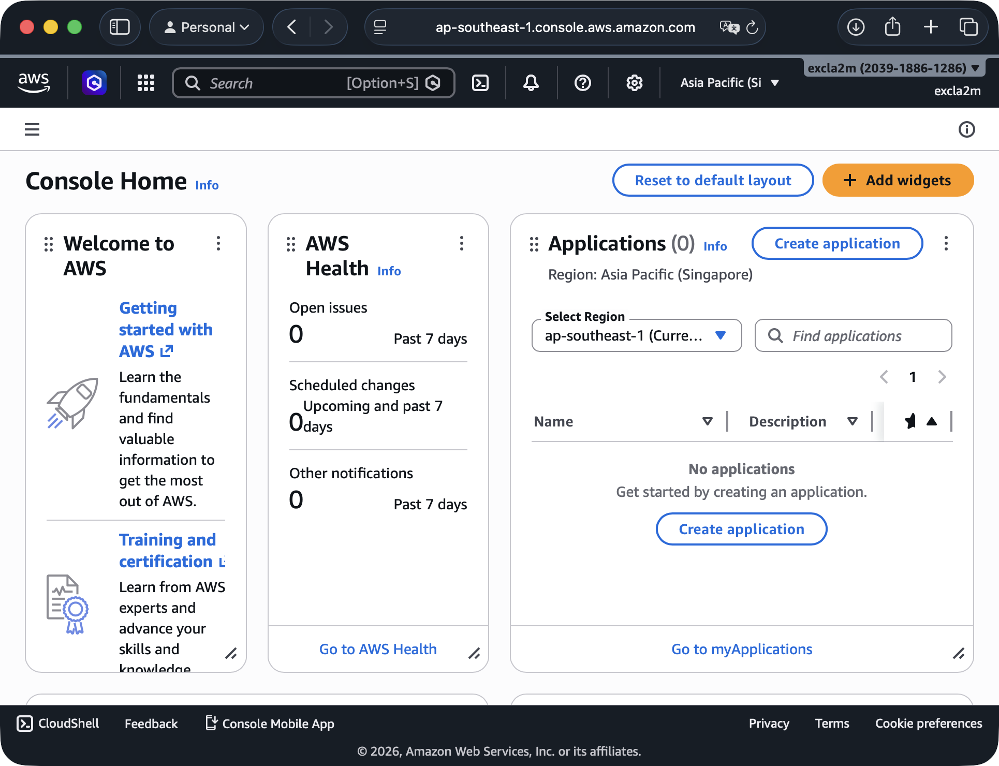
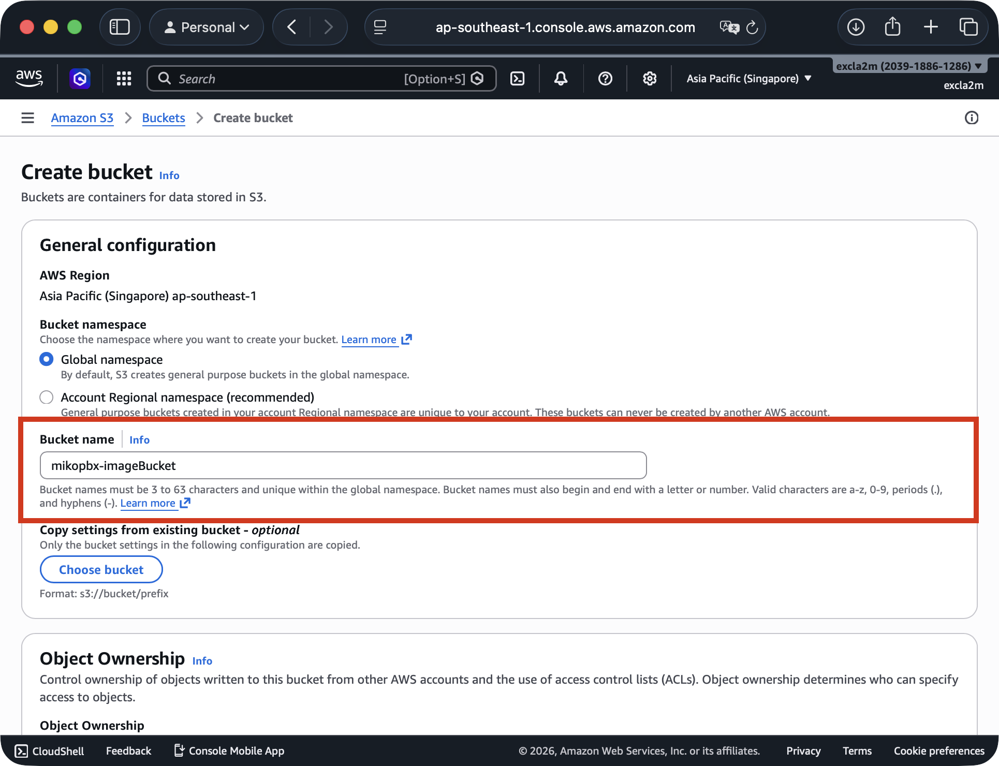
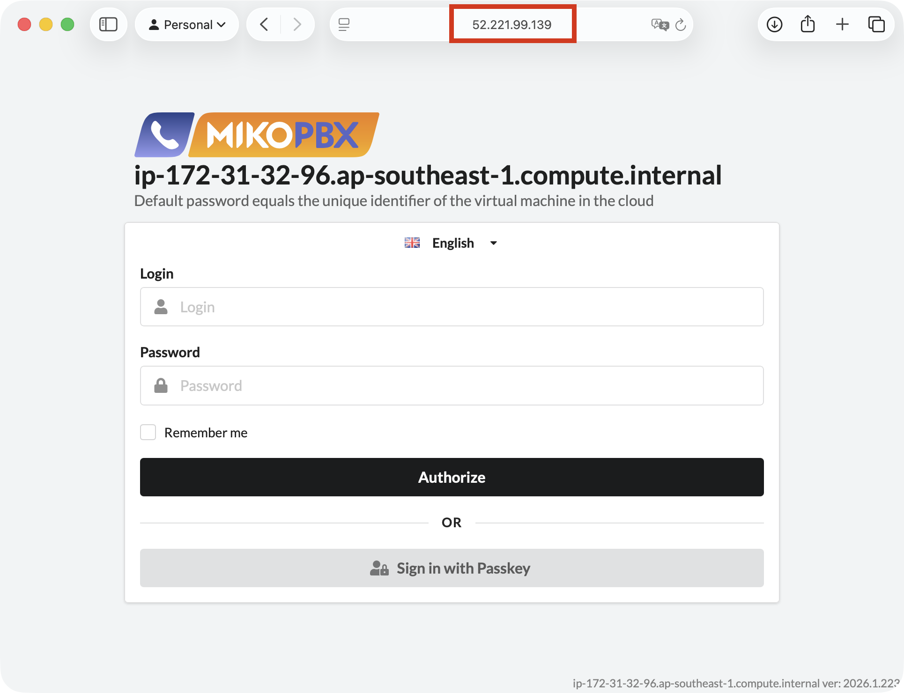

# AWS Terraform Script

This guide describes deploying MikoPBX in AWS using the **Infrastructure as Code (IaC)** approach with Terraform. The entire infrastructure — EC2 instance, network rules, disks, and IP address — is declared in code, ensuring reproducibility, versioning, and the ability to quickly redeploy in any environment.

General process:

```
Download .raw  →  Upload to S3  →  Import as AMI  →  Deploy via Terraform
```


**Note:** AMI image import cannot be performed directly via Terraform — AWS does not support this process through the Terraform provider. A separate bash script is used for the import, after which Terraform uses the created AMI.


***

### Prerequisites

* **Terraform** >= 1.3.0
* **AWS CLI** configured with access keys (`aws configure`)
* **Bash** (macOS / Linux)
* IAM permissions: `ec2:*`, `s3:*`, `iam:CreateRole`, `iam:PutRolePolicy`

**Configuring AWS CLI**

```bash
aws configure
# AWS Access Key ID: your_key
# AWS Secret Access Key: your_secret_key
# Default region name: us-east-1 (your region)
# Default output format: json
```

***

### Uploading the Image to S3

1.  Go to the MikoPBX releases page: [https://github.com/mikopbx/Core/releases](https://github.com/mikopbx/Core/releases)

    Download the latest image with the `.raw` extension.
2. Go to the [Amazon Web Services Console](https://console.aws.amazon.com/).

<figure><figcaption><p>Amazon Web Services Console</p></figcaption></figure>

3. Navigate to **Services** → **Storage** → **S3**.

<figure><figcaption><p>S3 section in AWS Console</p></figcaption></figure>

4. Click **Create bucket**. Enter a unique bucket name in the **Bucket name** field. Use default values for all other fields.

Confirm by clicking **Create bucket**.

<figure><figcaption><p>Creating bucket to store disk image file</p></figcaption></figure>

5. Open the created bucket by clicking its name. Click **Upload** and select the disk image file with the `.raw` extension.

Click **Upload** to confirm.

<figure><figcaption><p>Uploading disk image file</p></figcaption></figure>

***

### Configuring the IAM Role for Import

AWS requires a special IAM role `vmimport` for image imports. Perform these steps **once per account**.

Create a file `trust-policy.json` with the following content:

```json
{
  "Version": "2012-10-17",
  "Statement": [
    {
      "Effect": "Allow",
      "Principal": { "Service": "vmie.amazonaws.com" },
      "Action": "sts:AssumeRole",
      "Condition": {
        "StringEquals": { "sts:Externalid": "vmimport" }
      }
    }
  ]
}
```

Create a file `role-policy.json` with the following content:

> Replace `mikopbx-bucket` with your S3 bucket name.

```json
{
  "Version": "2012-10-17",
  "Statement": [
    {
      "Effect": "Allow",
      "Action": [
        "s3:GetBucketLocation",
        "s3:GetObject",
        "s3:ListBucket"
      ],
      "Resource": [
        "arn:aws:s3:::mikopbx-bucket",
        "arn:aws:s3:::mikopbx-bucket/*"
      ]
    },
    {
      "Effect": "Allow",
      "Action": [
        "ec2:ModifySnapshotAttribute",
        "ec2:CopySnapshot",
        "ec2:RegisterImage",
        "ec2:Describe*"
      ],
      "Resource": "*"
    }
  ]
}
```

Run the following commands to apply the policies:

```bash
# Create the role
aws iam create-role \
  --role-name vmimport \
  --assume-role-policy-document "file://trust-policy.json"
```

```bash
# Attach the policy to the role
aws iam put-role-policy \
  --role-name vmimport \
  --policy-name vmimport \
  --policy-document "file://role-policy.json"
```

***

### Importing the Image as an AMI

Save the script below as `import-image.sh` and edit the variables `DEFAULT_BUCKET`, `DEFAULT_IMAGE`, and `DEFAULT_NAME`.

**`import-image.sh`**

```bash
#!/bin/bash

# -----------------------------------------------
# Settings — change these to match your values
# -----------------------------------------------
DEFAULT_IMAGE="mikopbx-2026.1.223-x86_64.raw"
DEFAULT_BUCKET="mikopbx-bucket"
DEFAULT_DESCRIPTION="MikoPBX PBX on Asterisk"
DEFAULT_NAME="MikoPBX 2026.1.223"

# Override via environment variables (optional)
IMAGE="${IMAGE:-$DEFAULT_IMAGE}"
BUCKET="${BUCKET:-$DEFAULT_BUCKET}"
DESCRIPTION="${DESCRIPTION:-$DEFAULT_DESCRIPTION}"
NAME="${NAME:-$DEFAULT_NAME}"

# -----------------------------------------------
# Import snapshot from S3
# -----------------------------------------------
JSON_FILE="disk_container.json"

cat <<EOF > ${JSON_FILE}
{
  "Description": "${DESCRIPTION} image",
  "Format": "raw",
  "UserBucket": {
    "S3Bucket": "${BUCKET}",
    "S3Key": "${IMAGE}"
  }
}
EOF

echo "Starting snapshot import..."
IMPORT_TASK_ID=$(aws ec2 import-snapshot \
  --description "${DESCRIPTION} image" \
  --disk-container "file://${JSON_FILE}" \
  --query 'ImportTaskId' \
  --output text)

echo "Import task started: $IMPORT_TASK_ID"

# Wait for import to complete
while true; do
  STATUS=$(aws ec2 describe-import-snapshot-tasks \
    --import-task-ids "$IMPORT_TASK_ID" \
    --query 'ImportSnapshotTasks[0].SnapshotTaskDetail.Status' \
    --output text)
  echo "Status: $STATUS"
  if [ "$STATUS" == "completed" ]; then
    break
  elif [ "$STATUS" == "error" ]; then
    echo "Import failed!"
    exit 1
  fi
  sleep 30
done

# Get snapshot ID
SNAPSHOT_ID=$(aws ec2 describe-import-snapshot-tasks \
  --import-task-ids "$IMPORT_TASK_ID" \
  --query 'ImportSnapshotTasks[0].SnapshotTaskDetail.SnapshotId' \
  --output text)

echo "Snapshot created: $SNAPSHOT_ID"

# -----------------------------------------------
# Register AMI from snapshot
# -----------------------------------------------
AMI_ID=$(aws ec2 register-image \
  --name "$NAME" \
  --description "$DESCRIPTION" \
  --architecture x86_64 \
  --sriov-net-support simple \
  --virtualization-type hvm \
  --ena-support \
  --boot-mode uefi \
  --root-device-name "/dev/sda1" \
  --block-device-mappings "[
    {\"DeviceName\": \"/dev/sda1\", \"Ebs\": {
      \"DeleteOnTermination\": true,
      \"VolumeSize\": 1,
      \"SnapshotId\": \"$SNAPSHOT_ID\"
    }},
    {\"DeviceName\": \"/dev/sdb\", \"Ebs\": {\"VolumeSize\": 50}}
  ]" \
  --query 'ImageId' \
  --output text)

echo ""
echo "=========================================="
echo "AMI successfully created: $AMI_ID"
echo "Use this ID in terraform.tfvars:"
echo "  custom_ami_id = \"$AMI_ID\""
echo "=========================================="

# Remove temporary file
rm -f "$JSON_FILE"
```

Run the script:

```bash
sh import-image.sh
```

Once complete, the script will output the `AMI ID` — save it, as it will be needed for Terraform.

```
==========================================
AMI successfully created: ami-0c8820696110d0613
Use this ID in terraform.tfvars:
  custom_ami_id = "ami-0c8820696110d0613"
==========================================
```

***

### Deploying via Terraform

Create all of the following files (directory structure):

```
mikopbx-aws-custom/
├── main.tf
├── variables.tf
├── outputs.tf
├── terraform.tfvars
```

Below we walk through each file and the content to add to each:

#### **`main.tf`**

The main configuration file describing all AWS resources to be created: EC2 instance, Security Group, EBS disks, and Elastic IP. By default, the Security Group opens only the ports required for MikoPBX to operate: SSH, HTTP/HTTPS, SIP, and RTP.

> **Warning:** Be sure to configure the Firewall in MikoPBX after your first login!

```hcl
terraform {
  required_providers {
    aws = {
      source  = "hashicorp/aws"
      version = "~> 5.0"
    }
  }
  required_version = ">= 1.3.0"
}

provider "aws" {
  region = var.aws_region
}

# --------------------------------------------------
# Security Group
# --------------------------------------------------
resource "aws_security_group" "mikopbx_sg" {
  name        = "${var.instance_name}-sg"
  description = "Security group for MikoPBX"

  ingress {
    from_port   = 22
    to_port     = 22
    protocol    = "tcp"
    cidr_blocks = [var.allowed_ssh_cidr]
    description = "SSH"
  }

  ingress {
    from_port   = 443
    to_port     = 443
    protocol    = "tcp"
    cidr_blocks = ["0.0.0.0/0"]
    description = "HTTPS web UI"
  }

  ingress {
    from_port   = 80
    to_port     = 80
    protocol    = "tcp"
    cidr_blocks = ["0.0.0.0/0"]
    description = "HTTP"
  }

  ingress {
    from_port   = 5060
    to_port     = 5060
    protocol    = "udp"
    cidr_blocks = ["0.0.0.0/0"]
    description = "SIP UDP"
  }

  ingress {
    from_port   = 5060
    to_port     = 5060
    protocol    = "tcp"
    cidr_blocks = ["0.0.0.0/0"]
    description = "SIP TCP"
  }

  ingress {
    from_port   = 10000
    to_port     = 10200
    protocol    = "udp"
    cidr_blocks = ["0.0.0.0/0"]
    description = "RTP media"
  }

  egress {
    from_port   = 0
    to_port     = 0
    protocol    = "-1"
    cidr_blocks = ["0.0.0.0/0"]
  }

  tags = {
    Name = "${var.instance_name}-sg"
  }
}

# --------------------------------------------------
# SSH Key Pair (optional)
# --------------------------------------------------
resource "aws_key_pair" "mikopbx_key" {
  count      = var.create_key_pair ? 1 : 0
  key_name   = "${var.instance_name}-key"
  public_key = file(pathexpand(var.public_key_path))
}

# --------------------------------------------------
# EC2 Instance with custom AMI
# --------------------------------------------------
resource "aws_instance" "mikopbx" {
  # Use the AMI created by import-image.sh
  ami           = var.custom_ami_id
  instance_type = var.instance_type

  key_name               = var.create_key_pair ? aws_key_pair.mikopbx_key[0].key_name : var.existing_key_pair_name
  vpc_security_group_ids = [aws_security_group.mikopbx_sg.id]

  # System disk (1 GB)
  root_block_device {
    volume_size = 1
    volume_type = "gp3"
  }

  tags = {
    Name = var.instance_name
  }
}

# --------------------------------------------------
# Disk for call recordings (50+ GB)
# --------------------------------------------------
resource "aws_ebs_volume" "mikopbx_storage" {
  availability_zone = aws_instance.mikopbx.availability_zone
  size              = var.storage_disk_size
  type              = "gp3"

  tags = {
    Name = "${var.instance_name}-storage"
  }
}

resource "aws_volume_attachment" "storage_attach" {
  device_name = "/dev/sdc"
  volume_id   = aws_ebs_volume.mikopbx_storage.id
  instance_id = aws_instance.mikopbx.id
}

# --------------------------------------------------
# Elastic IP
# --------------------------------------------------
resource "aws_eip" "mikopbx_eip" {
  instance = aws_instance.mikopbx.id
  domain   = "vpc"

  tags = {
    Name = "${var.instance_name}-eip"
  }
}
```

***

#### **`variables.tf`**

Declares variables with their types, descriptions, and default values. Does not contain specific values on its own — only the schema.

```hcl
variable "aws_region" {
  description = "AWS region"
  type        = string
  default     = "us-east-1"
}

variable "custom_ami_id" {
  description = "ID of the custom AMI created by import-image.sh"
  type        = string
  # Value must be provided via terraform.tfvars
}

variable "instance_name" {
  description = "EC2 instance name"
  type        = string
  default     = "mikopbx-vm"
}

variable "instance_type" {
  description = "EC2 instance type"
  type        = string
  default     = "t3.micro"
}

variable "storage_disk_size" {
  description = "Size of the recordings disk (GB)"
  type        = number
  default     = 50
}

variable "allowed_ssh_cidr" {
  description = "CIDR block for SSH access"
  type        = string
  default     = "0.0.0.0/0"
}

variable "create_key_pair" {
  description = "Create an SSH Key Pair (true) or use an existing one (false)"
  type        = bool
  default     = true
}

variable "public_key_path" {
  description = "Path to the public SSH key"
  type        = string
  default     = "~/.ssh/id_rsa.pub"
}

variable "existing_key_pair_name" {
  description = "Name of an existing Key Pair (if create_key_pair = false)"
  type        = string
  default     = ""
}
```

***

#### **`outputs.tf`**

Defines what data Terraform will output after a successful `apply`: the web interface URL, and the login and password for the first login. Convenient for quickly retrieving credentials without opening the AWS Console.

```hcl
output "first_login" {
  description = "Credentials for the first login to the MikoPBX web interface"
  value = <<-EOT

    ======================================
     MikoPBX is ready!
    ======================================
     URL:      https://${aws_eip.mikopbx_eip.public_ip}
     Login:    admin
     Password: ${aws_instance.mikopbx.id}
    ======================================

  EOT
}
```

***

#### **`terraform.tfvars`**

Contains the specific variable values for your environment: region, AMI ID, instance type, etc. This is the file that changes when moving between environments (dev/staging/prod).

> **Note:** Specify your own parameters in this file — replace `aws_region`, `instance_name`, `instance_type`, `storage_disk_size`, `allowed_ssh_cidr`, `create_key_pair`, and `public_key_path` as needed. Be sure to replace `custom_ami_id` with the ID of the AMI you created earlier.

```hcl
aws_region        = "ap-southeast-1"
custom_ami_id     = "ami-0c8820696110d0613"   # <- ID from import-image.sh
instance_name     = "mikopbx-vm"
instance_type     = "t3.micro"
storage_disk_size = 50
allowed_ssh_cidr  = "0.0.0.0/0"
create_key_pair   = true
public_key_path   = "~/.ssh/id_rsa.pub"
```

***

#### **Running Terraform**

Make sure all 4 files are created, then run the following commands:

```bash
cd mikopbx-aws-custom  # Navigate to the directory with the created files

terraform init
```

You will see the following output:

```shellscript
Terraform has been successfully initialized!

You may now begin working with Terraform. Try running "terraform plan" to see
any changes that are required for your infrastructure. All Terraform commands
should now work.

If you ever set or change modules or backend configuration for Terraform,
rerun this command to reinitialize your working directory. If you forget, other
commands will detect it and remind you to do so if necessary.
```

Run the following command to preview the configuration:

```bash
terraform plan
```

You will see the configuration that Terraform has parsed and plans to create. Review all parameters, then run:

```bash
terraform apply
```

Enter `yes` to confirm. Upon successful creation of the MikoPBX instance, the required credentials will be displayed:

```
======================================
 MikoPBX is ready!
======================================
 URL:      https://52.221.99.139
 Login:    admin
 Password: i-007352c23fa6d3b01
======================================
```

***

### Connecting to MikoPBX

After a successful `terraform apply`:

1. Copy the `URL` from the output values.
2. Open it in your browser: `https://<URL>`

Use the credentials displayed during infrastructure creation to log in.

<figure><figcaption><p>MikoPBX Web-Interface (Deployed using terraform in AWS)</p></figcaption></figure>

> ⚠️ **After logging in, be sure to configure the Firewall in MikoPBX.**

***

### Destroying Resources

```bash
terraform destroy
```

> ⚠️ The AMI and the S3 bucket containing the image are **not deleted automatically** — they must be removed manually via the AWS Console or CLI if no longer needed.

```bash
# Delete the AMI
aws ec2 deregister-image --image-id ami-0a1b2c3d4e5f67890

# Delete the snapshot (ID can be found in AWS Console → EC2 → Snapshots)
aws ec2 delete-snapshot --snapshot-id snap-xxxxxxxxxxxxxxxxx

# Delete the file from S3
aws s3 rm s3://mikopbx-bucket/mikopbx-2026.1.223-x86_64.raw

# Delete the bucket (if empty)
aws s3 rb s3://mikopbx-bucket
```

***

### Common Errors

**Error: `InvalidAMIID.NotFound`**

```
Error: InvalidAMIID.NotFound: The image id 'ami-xxxx' does not exist
```

**Cause:** The AMI exists in a different region.\
**Solution:** Make sure the region in `terraform.tfvars` matches the region where the import script was run.

**Error: `OptInRequired` during import**

```
Error: OptInRequired
```

**Cause:** The `vmimport` role has not been created or lacks the required permissions.\
**Solution:** Repeat the IAM role configuration step.

**Error: import status `error`**

```
Status: error
Import failed!
```

**Cause:** Corrupted `.raw` file or incorrect format.\
**Solution:** Verify that the original image was downloaded correctly and that the filename in `DEFAULT_IMAGE` is accurate.

**Slow snapshot import**

Importing a large image can take **10–30 minutes**. The script automatically waits for completion, polling the status every 30 seconds.
