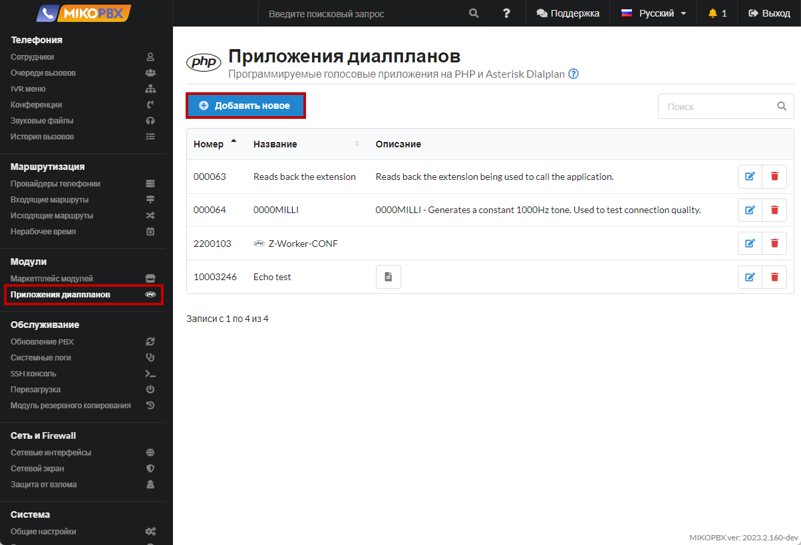
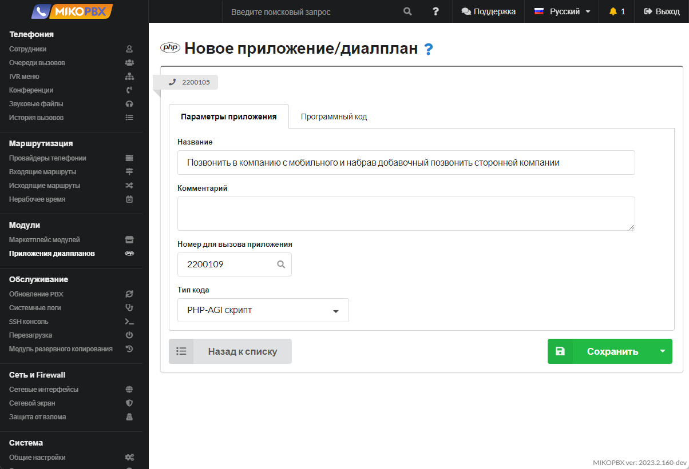
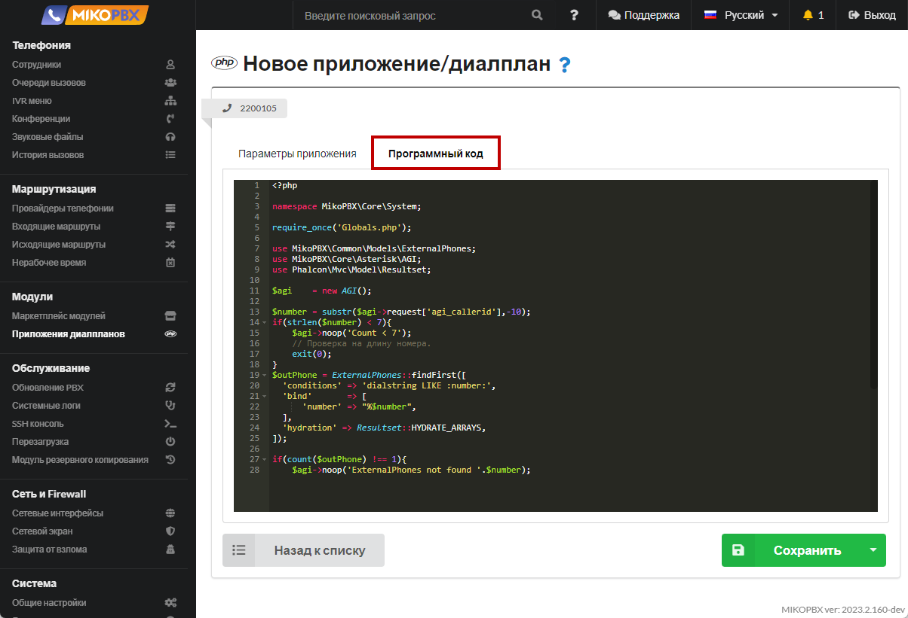
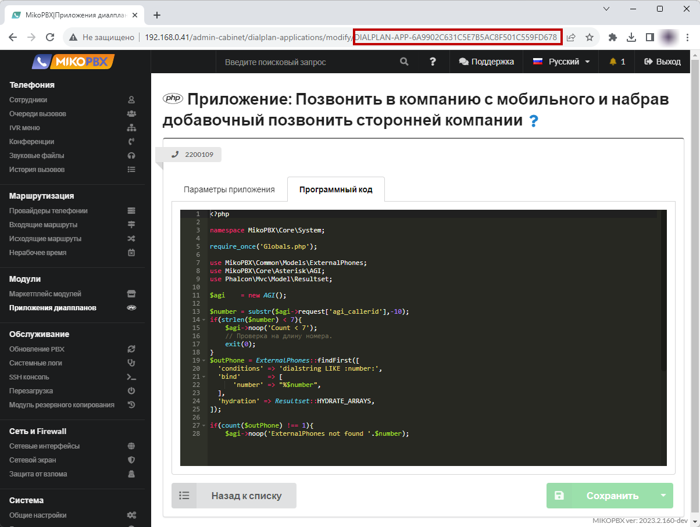
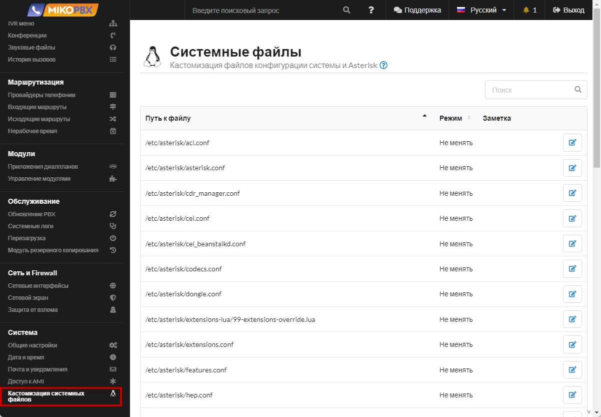
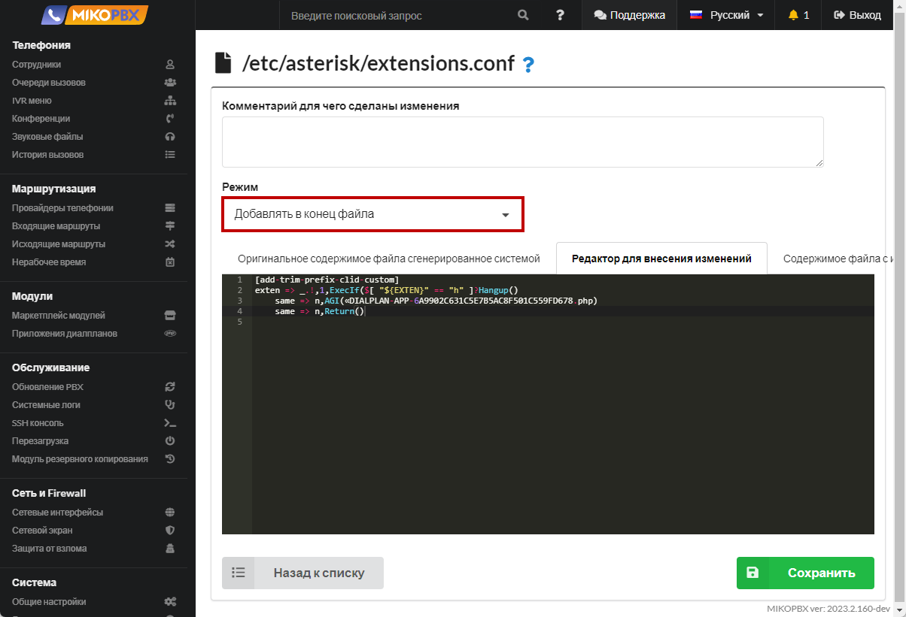

# Позвонить в компанию с мобильного и набрав добавочный позвонить сторонней компании

Такой функционал удобен для мобильных сотрудников. Когда важно, чтобы разговор был записан и зафиксирован на АТС в истории звонков. Когда нет возможности использовать софтфон / или «IP-SIM».

1. Добавьте новое приложение dialplan (см. [**Приложения диалпланов**](../../manual/modules/dialplan-applications.md))

<figure><figcaption><p>Новое приложение диалпланов</p></figcaption></figure>

2. Назначьте внутренний номер, к примеру **2200109**

<figure><figcaption><p>Номер диалплана</p></figcaption></figure>

3. Вставьте код во вкладку "**Программный код**":

```php
<?php

namespace MikoPBX\Core\System;

require_once('Globals.php');

use MikoPBX\Common\Models\ExternalPhones;
use MikoPBX\Core\Asterisk\AGI;
use Phalcon\Mvc\Model\Resultset;

$agi    = new AGI();

$number = substr($agi->request['agi_callerid'],-10);
if(strlen($number) < 7){
    $agi->noop('Count < 7');
    // Проверка на длину номера.
    exit(0);
}
$outPhone = ExternalPhones::findFirst([
  'conditions' => 'dialstring LIKE :number:',
  'bind'       => [
      'number' => "%$number",
  ],
  'hydration' => Resultset::HYDRATE_ARRAYS,
]);

if(count($outPhone) !== 1){
    $agi->noop('ExternalPhones not found '.$number);
    // Проверка на принадлежность номера телефона сотруднику компании.
    exit(0);
}

$agi->set_variable('AGIEXITONHANGUP', 'yes');
$agi->set_variable('AGISIGHUP', 'yes');
$agi->set_variable('__ENDCALLONANSWER', 'yes');
$agi->exec('Ringing', '');
$agi->Answer();

$result      = $agi->getData('vm-enter-num-to-call', 3000, 11);
$selectednum = $result['result']??'';
if(!empty($selectednum)){
    // Все ок. Завершаем вызов.
    $agi->set_variable('__pt1c_UNIQUEID', '');
    $agi->exec(
        'Dial',
        "Local/{$selectednum}@all_peers/n,300," . 'TtekKHhU(dial_answer)b(dial_create_chan,s,1)'
    );
}else{
    $agi->noop('selectednum is empty');
}
```

<figure><figcaption><p>Код для создаваемого диалплана</p></figcaption></figure>

4. В адресной строке браузера скопируйте ID приложения. Он будет иметь вид «**DIALPLAN-APP-6A9902C631C5E7B5AC8F501C559FD678**»

<figure><figcaption><p>ID диалплана</p></figcaption></figure>

5. Перейдите в раздел "**Кастомизация системных файлов**"

<figure><figcaption><p>Раздел "Кастомизация системных файлов"</p></figcaption></figure>

6. Откройте для редактирования файл "**extensions.conf**"

<figure><figcaption><p>Конфигурационный файл "<strong>extensions.conf</strong>"</p></figcaption></figure>

7. Вставьте в конец файла следующий код:

```php
[add-trim-prefix-clid-custom]
exten => _.!,1,ExecIf($[ "${EXTEN}" == "h" ]?Hangup()
    same => n,AGI(«DIALPLAN-APP-6A9902C631C5E7B5AC8F501C559FD678.php)
    same => n,Return()
```

<figure><figcaption><p>Код для extensions.conf</p></figcaption></figure>


тут «DIALPLAN-APP-6A9902C631C5E7B5AC8F501C559FD678» - это ID приложения.


### Важные моменты <a href="#vazhnye_momenty" id="vazhnye_momenty"></a>

1. Приложение будет выполнено для **всех** входящих вызовов
2. Ввести добавочный будет возможно лишь в том случае, если номер телефона звонящего заполнен в карточке сотрудника, то есть номер должен принадлежать сотруднику. Это сделано для безопасности
3. **Скрипт не является завершенным продуктом**, но открыт для кастомизации

## DISA — звонок через АТС с авторизацией по PIN <a href="#disa" id="disa"></a>

**DISA** (Direct Inward System Access) позволяет позвонить на номер АТС, пройти авторизацию по PIN-коду и уже «от имени компании» (с подменой исходящего CallerID) набрать любой внешний или внутренний номер. В отличие от примера выше, доступ защищён **PIN-кодом** и/или **белым списком CID**, а не привязкой номера к карточке сотрудника.

1. Добавьте новое приложение dialplan (см. [**Приложения диалпланов**](../../manual/modules/dialplan-applications.md)) и назначьте ему внутренний номер, например **2204**. Тип кода — «**PHP-AGI скрипт**».

<figure><figcaption><p>Новое приложение диалпланов</p></figcaption></figure>

2. Вставьте код во вкладку «**Программный код**»:

```php
<?php
require_once 'Globals.php';

use MikoPBX\Core\Asterisk\AGI;
use MikoPBX\Core\System\SystemMessages;

/* ──────────────────── НАСТРОЙКИ ──────────────────── */

// PIN доступа. Пустая строка — PIN не спрашивается.
const DISA_PIN = '2204';

// CallerID, который подставляется в исходящий звонок.
const DISA_CID = '89778485090';

// Белый список входящих CID (кому разрешён DISA).
// Пустой массив — разрешено ВСЕМ.
const DISA_CID_WHITELIST = [
    // '79161234567',
];

// Контекст набора MikoPBX (внутренние + исходящие маршруты).
const DISA_CONTEXT = 'all_peers';

const DISA_MAX_ATTEMPTS = 3;      // попыток ввода PIN
const DISA_PIN_TIMEOUT  = 5000;   // мс на ввод PIN
const DISA_NUM_TIMEOUT  = 7000;   // мс на ввод номера
const DISA_NUM_MAXLEN   = 20;     // макс. длина набираемого номера

/* ──────── ЗВУКОВЫЕ ФАЙЛЫ (без расширения, можно абсолютный путь) ────────
 * Пропиши полные пути к своим файлам, напр.
 *   '/storage/usbdisk1/mikopbx/custom_sound/enter_pin'
 * Проверь наличие: find /offload/asterisk/sounds -iname '<имя>.*'
 */

// Приглашение ввести PIN. Текст: «Введите PIN-код и нажмите решётку».
const DISA_PIN_PROMPT  = '/storage/usbdisk1/mikopbx/media/custom/enter_pin';

// Неверный PIN. Текст: «Пароль неверен».
const DISA_BAD_PROMPT  = '/storage/usbdisk1/mikopbx/media/custom/auth-incorrect';

// Прощание / завершение. Текст: «До свидания».
const DISA_BYE_PROMPT  = '/storage/usbdisk1/mikopbx/media/custom/goodbye';

// Отказ по белому списку. Текст: «Доступ запрещён» / «Номер не обслуживается».
const DISA_DENY_PROMPT = '/storage/usbdisk1/mikopbx/media/custom/ss-noservice';

// Приглашение набрать номер (гудок). Текст: короткий гудок / «Наберите номер».
const DISA_DIAL_PROMPT = '/storage/usbdisk1/mikopbx/media/custom/enter-number';

/* ─────────────────────────────────────────────────── */

$agi    = new AGI();
$caller = (string)$agi->get_variable('CALLERID(num)', true);

$agi->answer();

// 1. Проверка белого списка CID.
if (DISA_CID_WHITELIST !== [] && !in_array($caller, DISA_CID_WHITELIST, true)) {
    SystemMessages::sysLogMsg('DISA', "Rejected: CID {$caller} not in whitelist", LOG_WARNING);
    $agi->stream_file(DISA_DENY_PROMPT);
    $agi->hangup();
    return;
}

// 2. Проверка PIN (если задан).
if (DISA_PIN !== '') {
    $authorized = false;
    for ($i = 0; $i < DISA_MAX_ATTEMPTS; $i++) {
        $res   = $agi->getData(DISA_PIN_PROMPT, DISA_PIN_TIMEOUT, strlen(DISA_PIN) + 2);
        $entry = (string)($res['result'] ?? '');

        // Промпт не воспроизвёлся / таймаут без ввода — это НЕ неверный PIN.
        if ((int)($res['code'] ?? 0) !== 200 || $entry === '' || $entry === '-1') {
            SystemMessages::sysLogMsg('DISA', 'No PIN input / prompt failed: ' . json_encode($res), LOG_WARNING);
            continue;
        }
        if (hash_equals(DISA_PIN, $entry)) {
            $authorized = true;
            break;
        }
        $agi->stream_file(DISA_BAD_PROMPT);
    }
    if (!$authorized) {
        SystemMessages::sysLogMsg('DISA', "Wrong/absent PIN from CID {$caller}", LOG_WARNING);
        $agi->stream_file(DISA_BYE_PROMPT);
        $agi->hangup();
        return;
    }
}

// 3. Подстановка исходящего CallerID.
$agi->set_callerid(DISA_CID);
$agi->set_variable('CALLERID(num)', DISA_CID);
$agi->set_variable('CALLERID(name)', DISA_CID);

// 4. Приём набираемого номера (гудок + сбор цифр, завершение по #).
$res    = $agi->getData(DISA_DIAL_PROMPT, DISA_NUM_TIMEOUT, DISA_NUM_MAXLEN);
$number = (string)($res['result'] ?? '');

if ($number === '' || $number === '-1') {
    $agi->stream_file(DISA_BYE_PROMPT);
    $agi->hangup();
    return;
}

SystemMessages::sysLogMsg('DISA', "CID {$caller} -> dial {$number} as " . DISA_CID, LOG_NOTICE);

// 5. Переход в контекст набора — сработают внутренние и исходящие маршруты.
$agi->exec_goto(DISA_CONTEXT, $number, '1');
```

<figure><figcaption><p>Код для создаваемого диалплана</p></figcaption></figure>

3. Настройте константы в блоке `НАСТРОЙКИ`:

| Константа | Назначение |
| --- | --- |
| `DISA_PIN` | PIN-код доступа. Пустая строка — PIN не спрашивается (тогда защита только по `DISA_CID_WHITELIST`) |
| `DISA_CID` | CallerID, который подставляется в исходящий звонок |
| `DISA_CID_WHITELIST` | Белый список входящих CID, кому разрешён DISA. Пустой массив — разрешено **всем** |
| `DISA_CONTEXT` | Контекст набора MikoPBX. `all_peers` — внутренние номера и исходящие маршруты |
| `DISA_MAX_ATTEMPTS` | Число попыток ввода PIN |
| `DISA_*_TIMEOUT` | Таймауты (мс) на ввод PIN и номера |
| `DISA_NUM_MAXLEN` | Максимальная длина набираемого номера |
| `DISA_*_PROMPT` | Пути к звуковым файлам (без расширения) |

4. Подготовьте звуковые файлы. Залейте свои записи (например, через раздел «**Звуковые файлы**» или по SSH в `/storage/usbdisk1/mikopbx/media/custom/`) и пропишите к ним полные пути в константах `DISA_*_PROMPT`. Проверить наличие файла на хосте можно командой:

```bash
find /offload/asterisk/sounds -iname '<имя>.*'
```


Не обязательно записывать промпты голосом — их можно синтезировать прямо на АТС нашими модулями: [**Студия фраз (TTS)**](../../modules/miko/module-phrase-studio.md) (офлайн на базе Piper) или [**Генерация речи RHVoice**](../../modules/miko/generaciya-rechi-rhvoice.md). Сгенерируйте фразы («Введите PIN-код и нажмите решётку», «Пароль неверен», «До свидания» и т.д.), а затем пропишите пути к полученным файлам в константах `DISA_*_PROMPT`.


5. Направьте на DISA входящий вызов. В разделе «[**Входящие маршруты**](../../manual/routing/incoming-routing.md)» создайте маршрут (при необходимости — по конкретному DID) и в качестве назначения выберите созданное приложение dialplan (внутренний номер **2204**).

<figure><figcaption><p>Назначение входящего маршрута на приложение DISA</p></figcaption></figure>

### Важные моменты (DISA) <a href="#vazhnye_momenty_disa" id="vazhnye_momenty_disa"></a>

1. DISA даёт возможность звонить наружу через вашу АТС и за ваш счёт. **Обязательно** защитите его PIN-кодом (`DISA_PIN`) и/или белым списком CID (`DISA_CID_WHITELIST`). Открытый DISA без PIN на публичном DID — риск несанкционированных звонков.
2. Все попытки ввода PIN и набора логируются через `SystemMessages::sysLogMsg('DISA', ...)` — ищите по тегу `DISA` в системном журнале.
3. Подставляемый `DISA_CID` должен быть разрешён вашим провайдером для исходящих, иначе звонок отклонит оператор.
4. **Скрипт не является завершённым продуктом**, но открыт для кастомизации.
