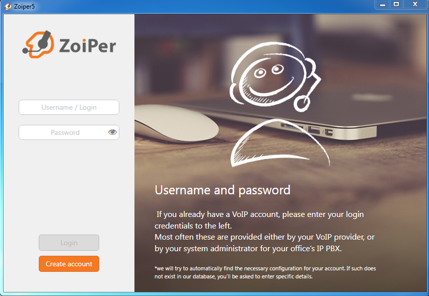
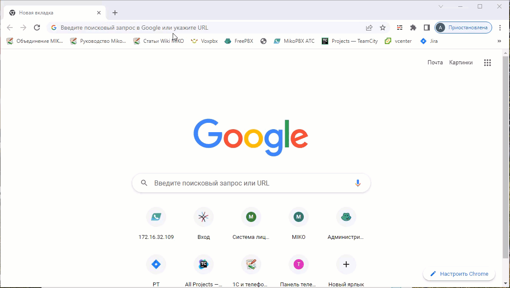
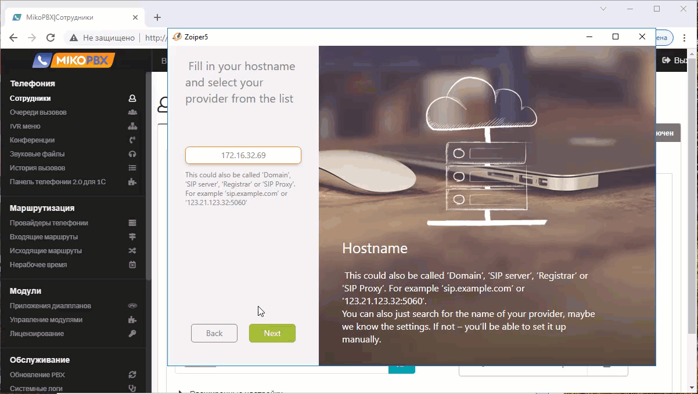
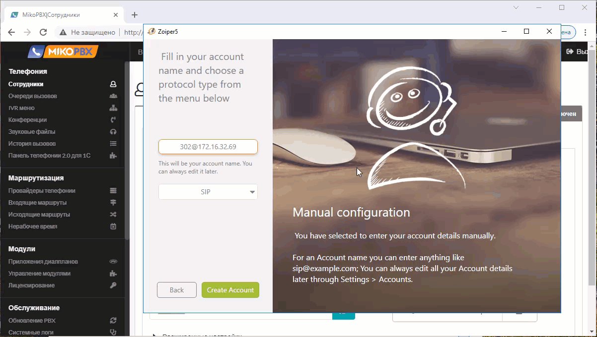

# Zoiper

1\. Скачайте инсталлятор софтфона с официального сайта по [ссылке](https://www.zoiper.com/en/voip-softphone/download/current). Установите его, следуя инструкциям инсталлятора.

2\. Запустите установленный софтфон. Вам отроется окно следующего вида. В нем предлагается ввести **login** и **password**.

**login** - <внутренний номер>@<адрес АТС>.

**password** - пароль внутреннего номера.

3\. Перейдите в веб-интерфейс АТС.

Перейдите в раздел сотрудники, выберите нужный внутренний номер и скопируйте необходимые данные.

Нажмите **Login.**

4\. На предложение **Fill In your hostname and select provider from the list** убедитесь, что в поле подставился адрес вашей АТС и нажмите **Next.**

На опции **Authentication and Outbound proxy** не взводя флажок нажмите **Skip**.

На странице тестирования конфигураций, не дожидаясь окончания, нажмите **Skip.** Согласитесь на предупреждение.

4\. На предложение **Fill in your account name and choose a protocol type from the menu below** убедитесь, что поле **account name** заполнено значением **<внутренний номер>@<адрес АТС>,** а поле **Protocol type** значением **SIP.**

Нажмите **Create account.**

Об успешной авторизации свидетельствует зеленый флажок слева от текущего аккаунта.\
Также на АТС у данного внутреннего номера должен отобразиться статус <mark style="background-color:green;">Подключен</mark><mark style="background-color:green;">**.**</mark>

