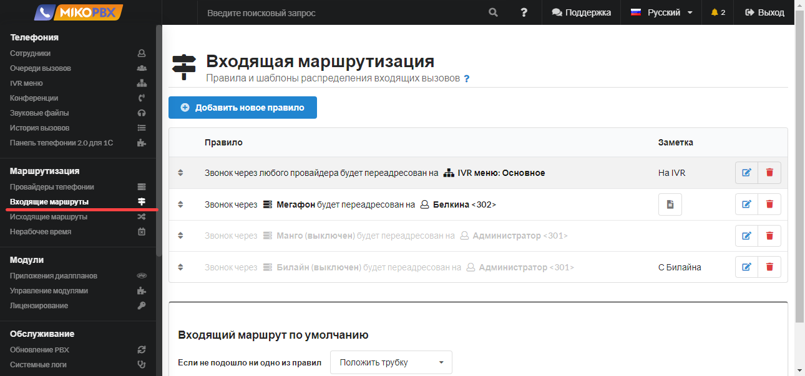
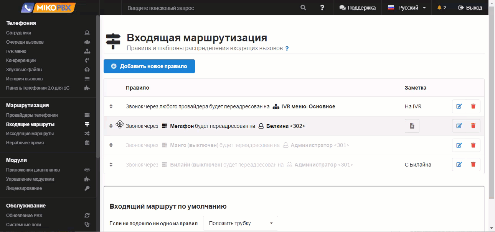
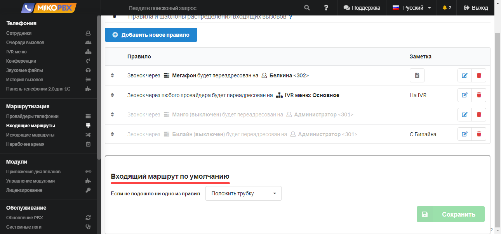
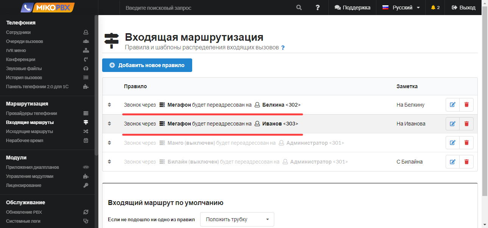
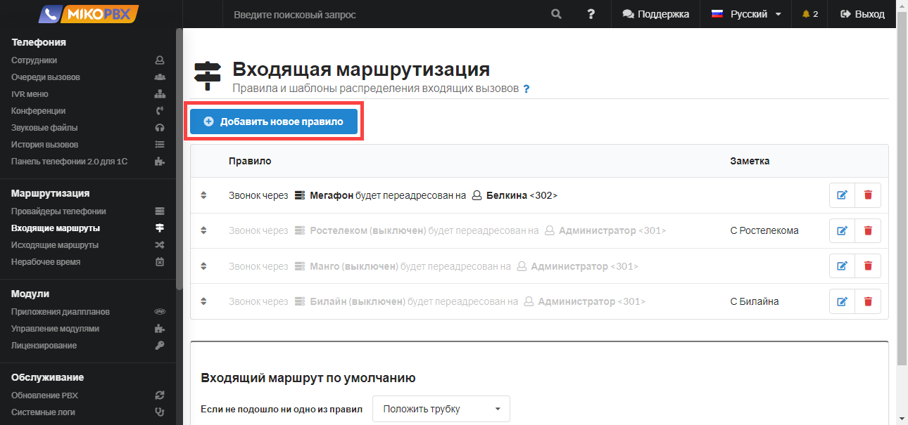

# Входящие маршруты

В данном разделе необходимо создать правила и шаблоны распределения входящих звонков для созданных в MikoPBX провайдеров. Правила входящих звонков описывают маршрут звонка с момента его поступления в АТС до момента его завершения. Вы можете создавать неограниченное количество правил входящей маршрутизации. Для одного провайдера можно создать несколько правил.

<figure><figcaption>
Раздел "<strong>Входящие маршруты</strong>" в MikoPBX
</figcaption></figure>


Дополнительные примеры настройки входящей маршрутизации доступны в [разделе FAQ](../../faq/incoming-routing/).


## Приоритет правил маршрутизации и маршрут по умолчанию

Правила располагаются в списке в порядке их приоритета. Если за указанный в правиле интервал времени никто не ответит на входящий вызов, то вызов направится на следующее по приоритету правило. Правила можно перемещать в списке вверх-вниз, то есть изменять их приоритет, перетаскивая их за стрелки.

<figure><figcaption>
Настройка приоритета правил маршрутизации
</figcaption></figure>

Если ни по одному из правил на звонок не ответили, применяется **входящий маршрут по умолчанию**.

<figure><figcaption>
Маршрут по умолчанию
</figcaption></figure>

Доступны следующие действия, которые можно указать в качестве правила по умолчанию:

* **Воспроизвести сигнал занято** - клиент будет воспроизведен сигнал занято и входящий вызов будет завершен;
* **Положить трубку;**
* **Перевести вызов** - вызов можно перевести на номер, который вы можете выбрать в поле, расположенном справа от действия. В качестве номера для перевода можно выбрать IVR-меню, очередь вызовов, конференцию, внутренний номер сотрудника.

## Несколько маршрутов для одного провайдера

Для **одного** провайдера можно описать **несколько** входящих маршрутов.

Сперва вызов идет по верхнему маршруту. Если клиент не дозвонился, то вызов идет по нижнему правилу (более низкий приоритет). Если клиент не дозвонился и по второму маршруту, то вызов идет по **маршруту по умолчанию**.

<figure><figcaption>
Несколько маршрутов для одного провайдера
</figcaption></figure>

## Создание правила маршрутизации

Чтобы добавить новое правило входящей маршрутизации нажмите на кнопку **Добавить новое правило**.

<figure><figcaption>
Элемент "<strong>Добавить новое правило</strong>"
</figcaption></figure>

В поле **`Заметка`** опишите маршрут, который хотите реализовать. В дальнейшем это поможет вам в отладке схемы звонка.

Выберите **`Провайдера`**, для которого создаете новый шаблон распределения входящих звонков.

**`Дополнительный номер DID`** - это номер, на который вам позвонил клиент, в ряде случаев может совпадать с логином провайдера. Это не обязательное поле и его следует заполнять, если необходимо более точно маршрутизировать вызовы.

<figure><figcaption>
Параметры обработки входящих
</figcaption></figure>

**`Голосовое приветствие`** - необязательное поле, допускается выбрать медиа файл для воспроизведения звонящему.

На следующем шаге необходимо указать на какой **телефонный номер** будет направлен входящий вызов от клиента. В качестве телефонного номера могут выступать номера IVR-меню, очереди вызовов, конференции, внутренние номера сотрудников.

Укажите время, в течение которого вызов будет идти на указанный вами телефонный номер.

Если спустя указанный интервал времени никто не ответит на входящий вызов, то вызов направится на следующее по приоритету правило.

## Шаблоны поля «Дополнительный номер DID» и ограничение по CallerID 

Поле **`Дополнительный номер DID`** можно задать как точный номер, как шаблон Asterisk, либо дополнительно ограничить вызов по номеру звонящего (CallerID).

### Шаблоны DID

Поле сопоставляется с номером, на который позвонил клиент (DID). Если значение состоит только из символов шаблона, MikoPBX воспринимает его как шаблон Asterisk; точные номера указываются как есть.

| Значение поля DID | Что сматчит | Примеры |
| ----------------- | ---------------------------------------- | ---------------------- |
| пусто или `X!`    | любой входящий (маршрут по умолчанию)    | все звонки             |
| `XZZ`             | 3 цифры, 2-я и 3-я — от 1 до 9           | 711, 923               |
| `3XX`             | 300–399                                  | 300, 350, 399          |
| `4XX`             | 400–499                                  | 400, 455               |
| `[3-4]XX`         | 300–499                                  | 312, 489               |
| `NXX`             | первая цифра 2–9, далее две любые цифры  | 234, 900               |
| `74952293042`     | точный DID                               | только 74952293042     |
| `+79066643322`    | точный DID с `+`                         | только +79066643322    |

Обозначения: `X` — цифра 0–9, `Z` — цифра 1–9, `N` — цифра 2–9, `[a-b]` — диапазон, `.` — один и более любых символов, `!` — ноль и более символов.


Используйте только **заглавные** `X`, `Z`, `N`. Строчные (например `3xx`) MikoPBX примет как точный номер, а не как шаблон.


### Ограничение по CallerID

Asterisk позволяет в одном поле задать и DID, и допустимый номер звонящего через `/`: часть до `/` сопоставляется с набранным номером (DID), часть после — с номером звонящего (CallerID).

| Значение поля DID              | Что сматчит                                                        |
| ------------------------------ | ------------------------------------------------------------------ |
| `74951234567/+79261234567`     | DID = 74951234567 **и** CallerID = +79261234567                    |
| `_X!/+79261234567`             | любой DID **и** CallerID = +79261234567                            |
| `_3XX/_79XXXXXXXXX`            | DID из диапазона 300–399 **и** CallerID по шаблону `79XXXXXXXXX`    |


Без `_` обе части трактуются как точное совпадение. Чтобы задать шаблон, начните соответствующую часть с `_` (например `_X!` — «любой DID», `_79XXXXXXXXX` — шаблон CallerID).

