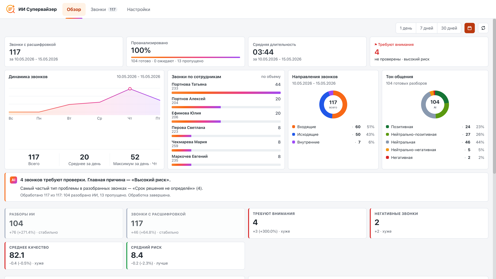
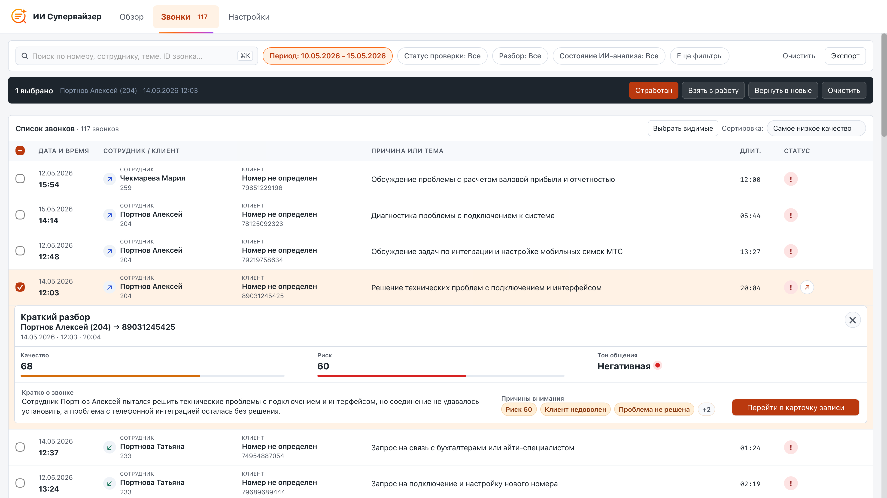
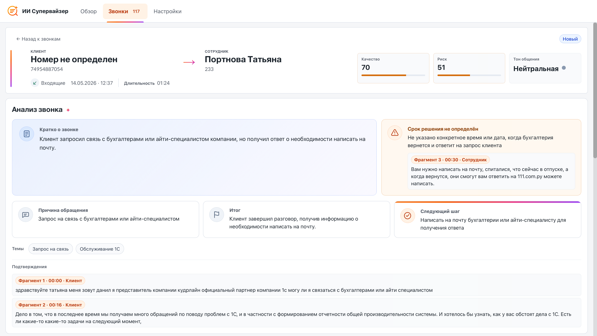
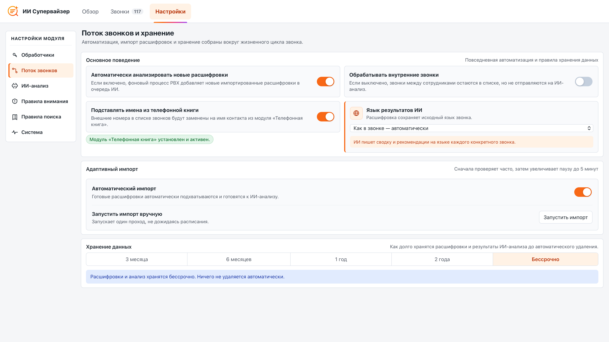
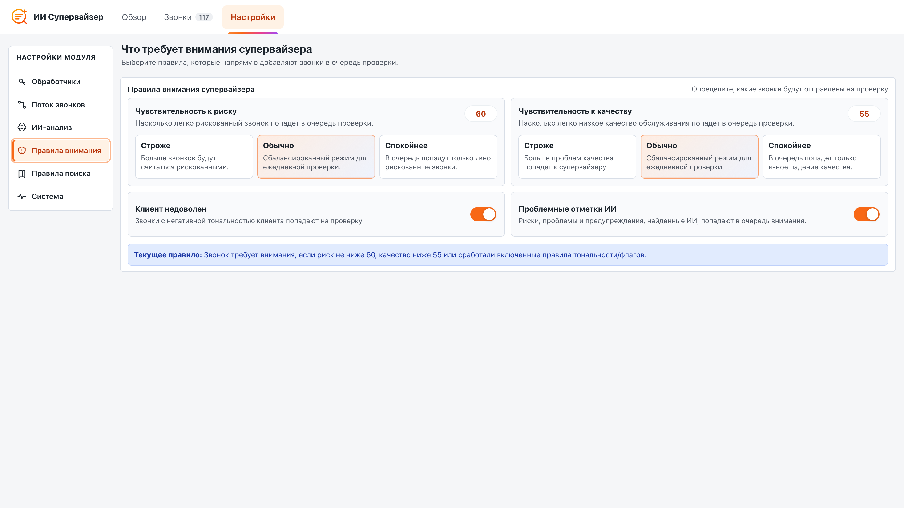
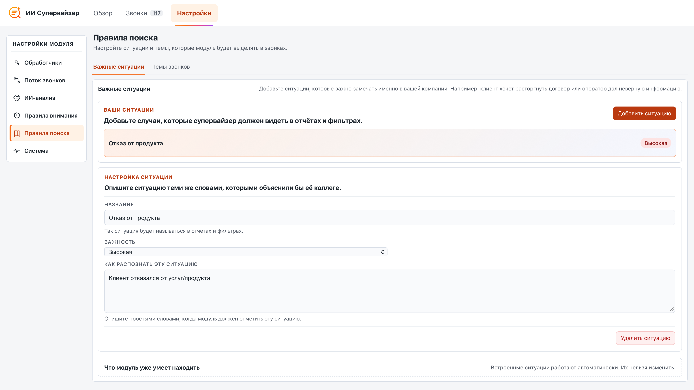
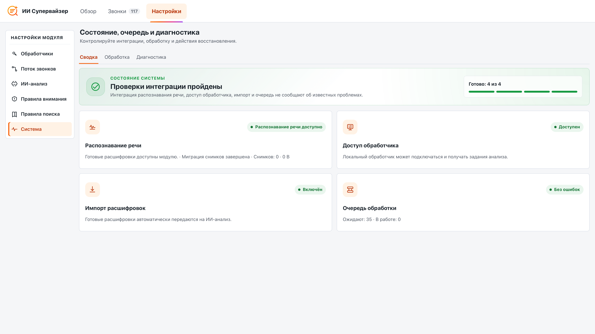

# Модуль ИИ Супервайзер

**Модуль ИИ Супервайзер** анализирует готовые расшифровки звонков MikoPBX и помогает руководителю контролировать качество коммуникаций. Модуль формирует краткую и подробную сводку, определяет причину обращения и итог разговора, выделяет следующие действия, темы, риски и подтверждающие фрагменты, оценивает тональность, риск и качество обслуживания.

Сам модуль в MikoPBX не запускает языковую модель. Он импортирует расшифровки, управляет очередью, хранит ключи доступа и результаты, а локальную обработку выполняет отдельное приложение **AI Supervisor Worker** на Mac. По умолчанию приложение использует Ollama и локальную модель, поэтому расшифровки и результаты анализа остаются внутри вашей инфраструктуры.

<figure><figcaption><p>Главная страница модуля</p></figcaption></figure>

### Как устроен анализ

Решение состоит из трёх независимых частей:

1. **Модуль локального распознавания речи** создаёт расшифровку и публикует событие `transcript.completed`.
2. **Модуль ИИ Супервайзер** импортирует расшифровку, создаёт задание и сохраняет результат анализа.
3. **AI Supervisor Worker** на Mac получает задание, подготавливает локальную модель, выполняет анализ и отправляет результат в MikoPBX.

Обычный цикл обработки:

1. После звонка модуль распознавания речи создаёт готовую расшифровку.
2. ИИ Супервайзер импортирует событие и сохраняет ссылку на расшифровку.
3. Для подходящего звонка создаётся задание `call_summary`.
4. Обработчик регистрируется и получает lease через `POST /job-leases`.
5. Для длинного разговора обработчик выполняет анализ по частям и сохраняет промежуточные результаты.
6. Итоговый JSON проходит проверку в приложении и повторную проверку в модуле.
7. Результат появляется на вкладках **Обзор** и **Звонки**.

### Требования и совместимость

* MikoPBX **2025.1.1** или новее.
* Установленный и включённый модуль локального распознавания речи.
* Сетевой доступ от Mac к веб-интерфейсу MikoPBX.
* Доступ в интернет для первой установки Ollama и загрузки локальных моделей.

### Установка модуля

1. Откройте веб-интерфейс MikoPBX.
2. Перейдите в раздел **Модули** → **Маркетплейс модулей**.

<figure><figcaption><p>Раздел «Маркетплейс модулей»</p></figcaption></figure>

3. Найдите **Модуль ИИ Супервайзер** и установите его.
4. Откройте список установленных модулей и включите модуль.

<figure><figcaption><p>Включение модуля «ИИ Супервайзер»</p></figcaption></figure>

5. Нажмите значок **Настройки** справа от версии модуля.

<figure><figcaption><p>Переход в модуль «ИИ Супервайзер»</p></figcaption></figure>

### Навигация модуля

В текущей версии доступны три основные вкладки:

| Вкладка       | Назначение                                                                                 |
| ------------- | ------------------------------------------------------------------------------------------ |
| **Обзор**     | Показатели звонков, покрытие ИИ-анализом, очередь внимания и сводная аналитика.            |
| **Звонки**    | Список импортированных звонков, фильтры, карточка звонка, расшифровка и разбор обращения.  |
| **Настройки** | Обработчики, импорт, состав анализа, правила внимания, справочники, очередь и диагностика. |

### Вкладка «Обзор»

Вкладка **Обзор** показывает состояние контроля звонков за выбранный период.

<figure><figcaption><p>Вкладка «Обзор»</p></figcaption></figure>

Основные показатели:

| Показатель                | Что означает                                                                                           |
| ------------------------- | ------------------------------------------------------------------------------------------------------ |
| **Звонки с расшифровкой** | Количество импортированных звонков за выбранный период.                                                |
| **Проанализировано**      | Количество и доля звонков с сохранённым результатом анализа.                                           |
| **Средняя длительность**  | Средняя длительность звонков в выбранном периоде.                                                      |
| **Требуют внимания**      | Непроверенные оператором звонки, соответствующие правилам риска, качества, тональности или отметок ИИ. |

Ниже отображаются динамика звонков, сотрудники, направления, тон общения и звонки, которые необходимо проверить. Нажатие на показатель или аналитический блок открывает соответствующий список на вкладке **Звонки**.

### Вкладка «Звонки»

Вкладка **Звонки** - это основная рабочая область супервайзера.

<figure><figcaption><p>Вкладка «Звонки»</p></figcaption></figure>

Доступны поиск, сортировка и фильтры по периоду, направлению, сотруднику, тональности, качеству, риску, статусу проверки, статусу разбора, сроку и состоянию ИИ-анализа. Состояние ИИ-анализа позволяет отдельно показать звонки, которые выполняются, завершены полностью или частично, ожидают распознавания речи либо ещё не запускались.

Статусы разбора:

| Статус        | Назначение                                                        |
| ------------- | ----------------------------------------------------------------- |
| **Новый**     | Обращение ещё не взято в работу.                                  |
| **В работе**  | Руководитель разбирает обращение или ожидает дальнейшее действие. |
| **Отработан** | Разбор завершён.                                                  |

Можно выбрать несколько строк и массово взять обращения в работу, отметить отработанными или вернуть в новые.

#### Карточка звонка

Карточка объединяет факты звонка, встроенное воспроизведение записи, расшифровку, результат анализа и рабочий разбор обращения. В ней доступны:

* краткая и подробная сводка;
* причина обращения, итог и следующие действия;
* темы, риски и подтверждающие фрагменты;
* оценки риска, качества и тональности;
* ключевые моменты с переходом по времени;
* голосовые метрики и эмоции, если соответствующие этапы включены;
* состояние каждого этапа ИИ-анализа;
* ответственный, срок, эскалация и заметки;
* история изменений разбора.

<figure><figcaption></figcaption></figure>

<figure><figcaption><p>Карточка звонка</p></figcaption></figure>

### Очередь обработки

Очередь находится в **Настройки** → **Система** → **Обработка**. Здесь отображаются активные, ошибочные, завершённые и пропущенные задания. Можно обновить данные, повторить отдельное ошибочное задание, повторить все ошибки, вернуть просроченные lease в очередь или очистить незавершённую очередь.

Состояние `waiting_for_stt` означает, что заданию нужна расшифровка, но нет ни доступного снимка, ни ответа от модуля распознавания речи. Такое ожидание не считается ошибкой, задание не выдаётся обработчику и не расходует попытки.

<mark style="color:red;">Устарело</mark>

<figure><figcaption><p>Прежняя отдельная вкладка «ИИ-анализ»</p></figcaption></figure>

### Вкладка «Настройки»

Настройки разделены на шесть рабочих областей. Изменения сохраняются автоматически; отдельной кнопки **Сохранить настройки** нет.

#### Обработчики

Здесь создаются и удаляются ключи доступа для AI Supervisor Worker. Полное значение нового ключа показывается только один раз. Скопируйте его до закрытия окна.

<figure><figcaption><p>Раздел подключения обработчика в настройках модуля</p></figcaption></figure>

#### Поток звонков

В этом разделе настраиваются:

* автоматический ИИ-анализ;
* обработка внутренних звонков;
* подстановка имён из телефонной книги;
* язык результата;
* автоматический импорт и ручной запуск импорта;
* срок хранения расшифровок и результатов: 3 месяца, 6 месяцев, 1 год, 2 года или бессрочно.

<figure><figcaption><p>Раздел "Поток звонков"</p></figcaption></figure>

#### ИИ-анализ

Раздел определяет состав линии обработки и то, какие модели будут использованы:


LLM - Large Language Model, или «большая языковая модель» - это модель машинного обучения, которая умеет работать с языком: читать текст, понимать его смысл в контексте и генерировать связные ответы.


| Компонент                                     | Назначение                                              |
| --------------------------------------------- | ------------------------------------------------------- |
| **Сводка (LLM модель)**                       | Структурированный разбор звонка, темы, риски, качество. |
| **Голосовые метрики (Технический анализ)**    | Темп, паузы, перебивания, тишина и баланс участников.   |
| **Анализ эмоций (LLM модель)**                | Текстовое определение эмоций по выбранным фрагментам.   |
| **Акустический анализ (Акустическая модель)** | Асинхронное выявление акустических признаков записи.    |

Актуальные профили LLM моделей:

| Профиль                  | Модель       | Ориентировочная память | Назначение                                  |
| ------------------------ | ------------ | ---------------------- | ------------------------------------------- |
| **Qwen3 8B Instruct Q4** | `qwen3:8b`   | 6–9 ГБ                 | Рекомендуемый сбалансированный профиль.     |
| **Qwen3.5 4B Q4**        | `qwen3.5:4b` | 4–6 ГБ                 | Быстрый компактный профиль.                 |
| **Qwen3.5 9B Q4**        | `qwen3.5:9b` | 8–12 ГБ                | Подробный анализ длинных и сложных звонков. |

В экспертных параметрах доступны время удержания модели в памяти, время ожидания и количество попыток. Размер контекста и фрагмента определяется выбранным профилем.

<figure><figcaption><p>Параметры ИИ-анализа модуля</p></figcaption></figure>

#### Правила внимания

Здесь задаются пороги риска и качества, а также правила для негативной тональности и проблемных отметок ИИ. Изменения влияют на очередь проверки и фильтры; сохранённые ответы модели при этом не пересчитываются.

<figure><figcaption><p>Раздел "Правила внимания" с настройкой чувствительности</p></figcaption></figure>

#### Правила поиска

Область содержит две вкладки:

* **Важные ситуации** - системные и пользовательские типы рисков звонков, их важность для анализа и инструкция для модели по .

<figure><figcaption><p>Раздел "Правила анализа" -> "Важные ситуации"</p></figcaption></figure>

* **Темы звонков** - корпоративные темы и синонимы, по которым приводятся к единому виду разные формулировки ИИ.

<figure><figcaption><p>Раздел "Правила анализа" -> "Темы звонков"</p></figcaption></figure>

#### Система

Область **Система** содержит:

* **Сводка** - готовность распознавания речи, доступа обработчика, импорта и очереди;
* **Обработка** - задания, повторы, просроченные звонки и очистка незавершённой очереди звонков;
* **Диагностика** - логи, техническая сводка информации для отладки.

<figure><figcaption><p>Прежний экран диагностики</p></figcaption></figure>

### REST API

Базовый путь:

```
/pbxcore/api/v3/module-ai-supervisor
```

| Метод                            | Адрес                                       | Назначение                                     |
| -------------------------------- | ------------------------------------------- | ---------------------------------------------- |
| `GET`, `PATCH`                   | `/settings`                                 | Чтение и изменение настроек.                   |
| `GET`                            | `/dashboard`                                | Данные обзора.                                 |
| `GET`, `PATCH`                   | `/calls`, `/calls/{id}`                     | Список, карточка и обновление разбора звонков. |
| `GET`, `POST`                    | `/call-notes`                               | Чтение и добавление заметок.                   |
| `GET`                            | `/call-workflow-events`                     | История разбора.                               |
| `GET`, `POST`, `PATCH`, `DELETE` | `/jobs`, `/jobs/{id}`                       | Очередь и действия над заданиями.              |
| `GET`, `POST`, `DELETE`          | `/worker-api-keys`, `/worker-api-keys/{id}` | Ключи доступа обработчиков.                    |
| `POST`, `GET`                    | `/imports`, `/imports/{id}`                 | Запуск и состояние импорта.                    |
| `GET`                            | `/logs`                                     | Журнал модуля.                                 |

Основные ресурсы обработчика:

* `GET /worker-api-contract`;
* `POST /workers`;
* `POST /job-leases`;
* `PATCH` и `DELETE /job-leases/{id}`;
* `GET /job-recordings/{id}`;
* `PUT /job-results/{id}`;
* `PUT /job-failures/{id}`;
* `PUT /job-partials/{id}`;
* `PATCH /job-voice-analytics/{id}`.

### Если что-то не работает

**На вкладке «Звонки» пусто**

* Проверьте, что установлен и включён модуль локального распознавания речи.
* Убедитесь, что в нём есть завершённые расшифровки.
* Откройте **Настройки** → **Система** → **Сводка**.
* Проверьте автоматический импорт в **Настройки** → **Поток звонков** и при необходимости запустите импорт вручную.

**Задания не обрабатываются**

* Откройте **Настройки** → **Система** → **Обработка**.
* Проверьте ошибки и состояние `waiting_for_stt`.
* Убедитесь, что автоматический анализ включён в разделе **Поток звонков**.
* Для внутренних звонков включите соответствующую настройку.

**Обработчик не подключается**

* Проверьте совместимость ModuleAISupervisor 1.73 и AI Supervisor Worker 1.7 build 34.
* Убедитесь, что используется ключ ИИ Супервайзера, а не токен Local STT Worker.
* Проверьте адрес PBX, сертификат TLS и файл CA.
* Откройте в приложении раздел **Диагностика** и выполните проверку соединения.

**Модель не готовится**

* Откройте в AI Supervisor Worker раздел **Модели** и нажмите **Обновить**.
* Проверьте состояние Ollama, выбранную PBX модель и свободное место.
* Для меньшего расхода памяти выберите **Qwen3.5 4B Q4**.
* Подробности загрузки и ошибки смотрите в разделах **Активность** и **Диагностика**.
