# Локальный ИИ Супервайзер

**Локальный ИИ Супервайзер** помогает руководителю контролировать качество телефонных разговоров. Модуль берет готовые расшифровки звонков и с помощью локальной языковой модели (LLM) разбирает каждый разговор: составляет краткую и подробную сводку, определяет причину обращения, итог и следующий шаг, выделяет темы и риски, оценивает тон общения и качество работы сотрудника. Звонки, которые требуют внимания, модуль собирает в отдельный список, чтобы руководитель не искал их вручную.


Сам модуль не запускает языковую модель внутри MikoPBX. Анализ выполняет отдельное приложение **AI Supervisor Worker** на Mac с Apple Silicon. Оно работает через локальную среду Ollama, поэтому расшифровки и результаты анализа не покидают вашу инфраструктуру. Подробнее о приложении - в статье [AI Supervisor Worker](miko-ai-worker.md).


<figure>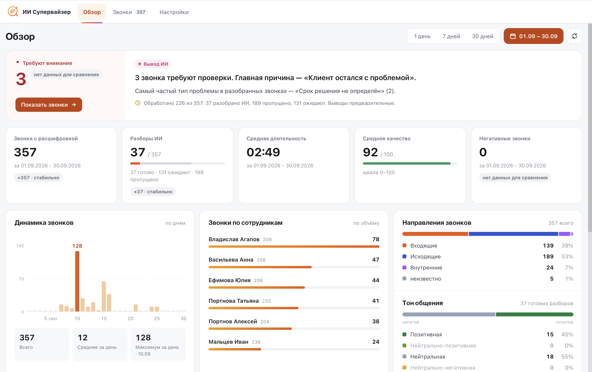<figcaption>
Вкладка «Обзор» модуля - общий вид главной страницы
</figcaption></figure>

### Как это работает?

1. Модуль транскрибации расшифровывает записанный звонок.
2. Локальный ИИ Супервайзер импортирует готовую расшифровку и создает задание на анализ.
3. AI Supervisor Worker на Mac забирает задание, получает расшифровку и запись разговора.
4. Локальная модель разбирает разговор. Длинные звонки обрабатываются по частям, промежуточные результаты сохраняются, поэтому повторная попытка не начинается с нуля.
5. Worker отправляет результат в MikoPBX. Модуль проверяет его: каждая цитата должна подтверждаться репликой из расшифровки, иначе вывод не засчитывается.
6. ИИ анализ появляется во вкладках **Обзор** и **Звонки**.

### Требования и совместимость

* MikoPBX **2025.1.1** или новее.
* Установленный и включенный модуль транскрибации: **Локальная транскрибация** 1.102+ или **Облачная транскрибация** 1.75+.
* Mac с Apple Silicon и macOS 14 или новее для приложения **AI Supervisor Worker** версии **1.78** или новее.
* Сетевой доступ от Mac к веб-интерфейсу MikoPBX.
* Доступ в интернет на Mac при первой установке Ollama и загрузке модели.

### Установка модуля

1. Откройте веб-интерфейс MikoPBX.
2. Перейдите в раздел **Модули** → **Маркетплейс модулей**.

<figure><figcaption>
Раздел «Маркетплейс модулей»
</figcaption></figure>

3. Найдите модуль **Локальный ИИ Супервайзер** и установите его.

<figure><figcaption>
Модуль Локальный ИИ Супервайзер в маркетплейсе MikoPBX
</figcaption></figure>

4. Откройте список установленных модулей и включите модуль. Нажмите кнопку настроек справа от версии модуля.

<figure><figcaption>
Раздел «Установленные модули» - включение модуля «Локальный ИИ Супервайзер» и кнопка перехода к его настройкам
</figcaption></figure>

### Вкладка «Обзор»

Вкладка открывается по умолчанию и показывает картину по звонкам за выбранный период: **1 день**, **7 дней**, **30 дней** или **Свой период**.

<figure><figcaption>
Вкладка «Обзор» - блок «Требуют внимания», карточки показателей и графики
</figcaption></figure>

В верхней части находится блок **Требуют внимания** - количество проанализированных звонков, которые нужно проверить и которые еще не отработаны. Кнопка **Показать звонки** открывает их список. Рядом отображается **Вывод ИИ** - короткое резюме самой заметной проблемы и повторяющейся закономерности за период.


Любой показатель, столбец графика или строка рейтинга кликабельны: модуль откроет вкладку **Звонки** с уже примененным фильтром.


Ниже расположены показатели:

* **Звонки с расшифровкой -** Сколько звонков с готовой расшифровкой импортировано за период.
* **Разборы ИИ -** Сколько звонков уже проанализировано, сколько ожидают анализа и сколько пропущено.
* **Средняя длительность -** Средняя длительность звонков за период.
* **Среднее качество -** Средняя оценка качества звонков по шкале 0–100.
* **Негативные звонки -** Количество звонков с негативной тональностью и сравнение с прошлым периодом.

Под показателями расположены графики **Динамика звонков**, **Звонки по сотрудникам**, **Направления звонков** и **Тон общения**, а также рейтинги **Топ проблем**, **Причины внимания**, **Главные темы звонков** и **Причины негатива**.

### Вкладка «Звонки»

Это основная рабочая область руководителя: здесь собраны все импортированные звонки и результаты их анализа.

<figure>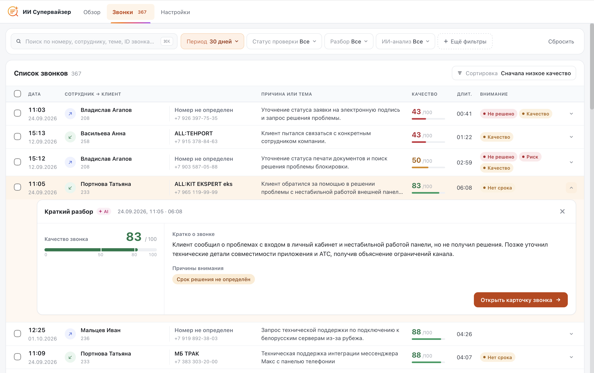<figcaption>
Вкладка «Звонки»
</figcaption></figure>

#### Поиск и фильтры

Строка поиска ищет по номеру, сотруднику, теме и ID звонка. Рядом выбирается период и доступны фильтры:

| Фильтр              | Значения                                                                                          |
| ------------------- | ------------------------------------------------------------------------------------------------- |
| **Статус проверки** | Открытые или закрытые звонки.                                                                     |
| **Разбор**          | Новый, в работе или отработан.                                                                    |
| **ИИ-анализ**       | Выполняется, завершено, завершено не полностью, ожидает распознавания речи, не начато, отключено. |
| **Просрочено**      | Звонки с просроченным сроком разбора.                                                             |

Кнопка **Ещё фильтры** открывает дополнительные фильтры: направление или номер, сотрудник, тональность, качество (высокое, среднее, низкое), риск (высокий, средний, низкий) и срок разбора.

#### Список звонков

В строке звонка отображаются время, клиент, сотрудник, причина обращения или тема, оценка качества, причины внимания и длительность.

* Если звонок переводили и с клиентом общались несколько сотрудников, то в колонке качества показывается средняя оценка с отметкой, например **2 сотр.** При наведении видна оценка каждого сотрудника.
* Звонки с эскалацией подсвечиваются голубым цветом.
* Звонки, совершенные до подключения источника расшифровок, отмечены как **До подключения источника** и не анализируются.

Клик по строке раскрывает краткий разбор прямо в списке. Чтобы перейти к полной карточке, нажмите **Открыть карточку звонка**.

Звонок попадает в список **Требуют внимания** по одной или нескольким причинам:

| Причина                               | Когда срабатывает                                   |
| ------------------------------------- | --------------------------------------------------- |
| **Высокий риск**                      | ИИ оценил риск звонка как высокий.                  |
| **Низкое качество работы сотрудника** | Оценка качества ниже порога.                        |
| **Клиент недоволен**                  | Клиент разговаривал в негативном тоне.              |
| **Клиент остался с проблемой**        | Подтверждено, что вопрос клиента не решен.          |
| **ИИ нашел проблемы**                 | ИИ отметил в разговоре проблемы или предупреждения. |

Правила внимания и справочники рисков и тем работают автоматически, отдельно настраивать их не нужно. Звонок перестает требовать внимания, когда его разбор отмечен как **Отработан**.

#### Карточка звонка

Карточка объединяет все, что известно о звонке.

<figure>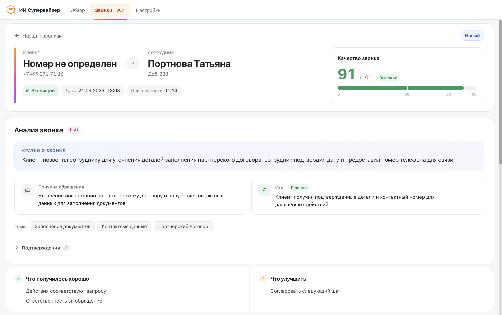<figcaption>
Карточка звонка: шапка с участниками, оценкой качества и причинами внимания
</figcaption></figure>

В шапке карточки отображаются участники разговора, направление, дата, длительность и оценка качества звонка. Если звонок требует внимания, ниже перечислены **Причины внимания**.

Блок **Анализ звонка** содержит:

* **Кратко о звонке** и подробную сводку;
* **Причину обращения**, **Итог** со статусом (решено, решено частично, передано, ждет действий, не решено) и **Следующий шаг**;
* **Темы** разговора;
* **Подтверждения** - цитаты из расшифровки, на которых основаны выводы ИИ;
* показатели риска, тона общения и сложности.

Рядом находится подробная **оценка качества** по группам критериев - она описана в разделе [Оценка качества звонка](./#ocenka-kachestva-zvonka).

<figure>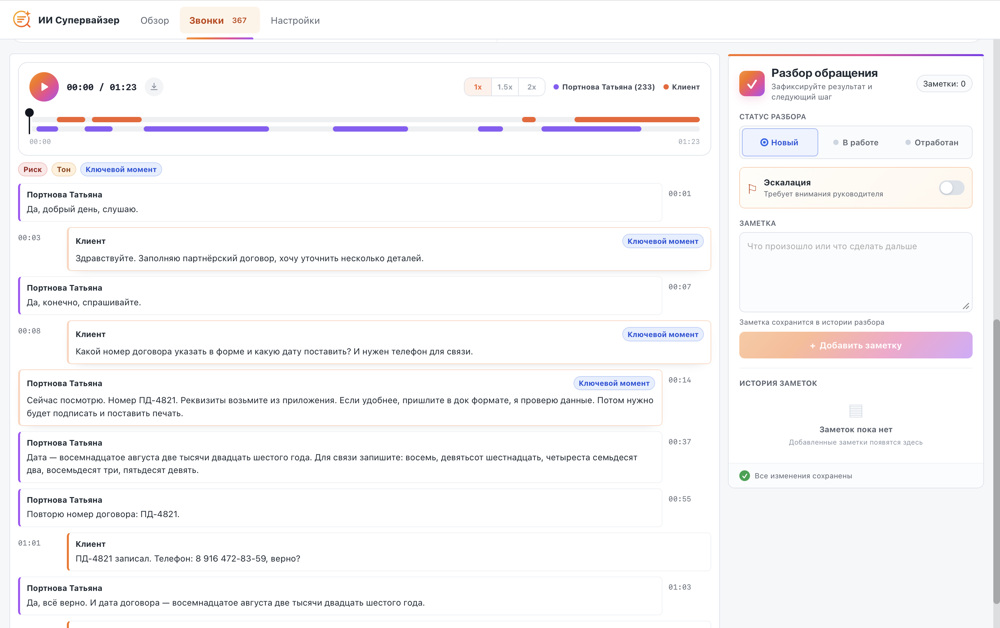<figcaption>
Карточка звонка: блок «Анализ звонка» и оценка качества
</figcaption></figure>

Ниже расположена **расшифровка** со встроенным проигрывателем: нажатие на реплику переводит запись к нужному моменту, доступна скорость воспроизведения 1x, 1.5x и 2x. Реплики сотрудника подписаны его именем. Если во время звонка сотрудник советовался с коллегой, расшифровка разделена на вкладки **Разговор с клиентом** и **Внутренняя консультация**. <mark style="color:$danger;">ИИ анализирует только разговор с клиентом.</mark>

Справа находится панель **Разбор обращения**:

* **Статус разбора** - **Новый**, **В работе** или **Отработан**;
* **Эскалация** - отметка, что звонок требует внимания и к нему необходимо вернуться (он будет отображен голубым цветом в разделе "Звонки");
* **Заметки** - комментарии о том, что произошло и что сделать дальше. Все заметки сохраняются в истории разбора.

### Вкладка «Настройки»

#### Обработчики

Раздел для подключения приложения AI Supervisor Worker:

* **Программа обработчика** - кнопка **Скачать обработчик** загружает последнюю версию приложения для macOS.
* **Ключ доступа** - кнопка **Создать ключ доступа** создает новый ключ. Полный ключ показывается только один раз, скопируйте его сразу.
* **Активные ключи доступа** - список ключей с датой создания, временем последнего использования и количеством привязанных обработчиков. Ненужный ключ можно удалить.
* **Подключенные обработчики** - зарегистрированные Mac с IP-адресом, статусом и временем последней активности.


Для каждого Mac создавайте отдельный ключ: один ключ нельзя привязать к нескольким обработчикам.


<figure>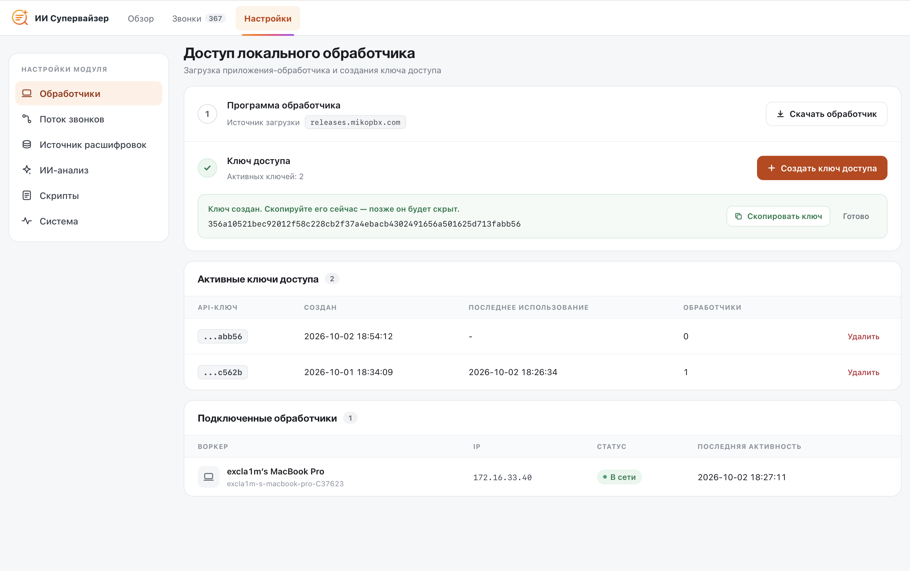<figcaption>
Раздел "Настройки → «Обработчики»"
</figcaption></figure>

#### Поток звонков

<table><thead><tr><th width="264.37109375">Настройка</th><th>Назначение</th></tr></thead><tbody><tr><td><strong>Автоматически анализировать новые расшифровки</strong></td><td>Новые расшифровки сразу ставятся в очередь анализа.</td></tr><tr><td><strong>Обрабатывать внутренние звонки</strong></td><td>Если выключено, звонки между сотрудниками остаются в списке, но не анализируются.</td></tr><tr><td><strong>Язык результатов ИИ</strong></td><td>Язык сводок и рекомендаций: язык звонка, русский или английский. Расшифровка всегда остается на языке звонка.</td></tr><tr><td><strong>Хранение данных</strong></td><td>Срок хранения расшифровок и результатов анализа: 3 месяца, 6 месяцев, 1 год, 2 года или бессрочно.</td></tr></tbody></table>


При ограниченном сроке хранения расшифровки, результаты ИИ и связанные данные старше выбранного периода удаляются автоматически раз в сутки. Отменить удаление нельзя. Записи разговоров и история звонков MikoPBX при этом не затрагиваются.


<figure>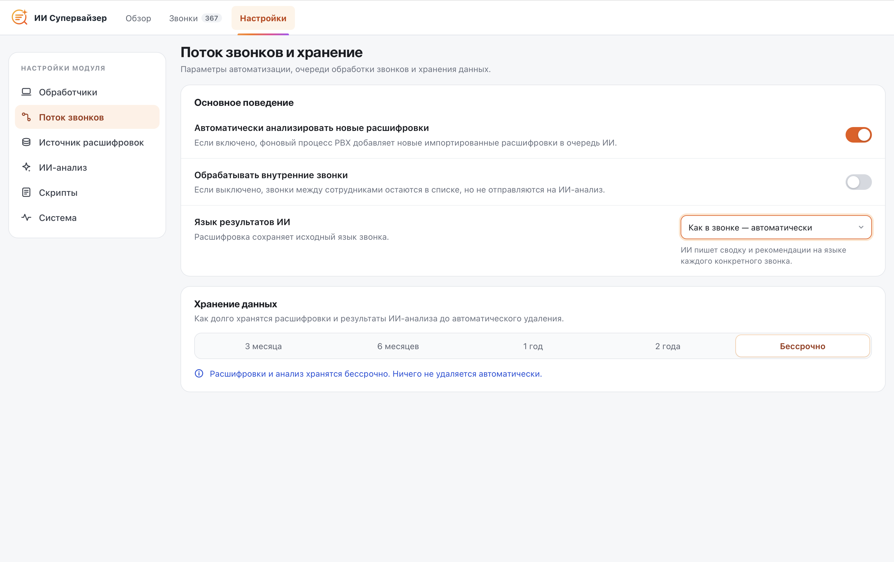<figcaption>
Раздел "Настройки → «Поток звонков»"
</figcaption></figure>

#### Источник расшифровок

Здесь видно, какой модуль транскрибации сейчас используется, его состояние и с какого момента анализируются звонки.

Чтобы сменить источник:

1. В блоке **Сменить источник** выберите другой модуль транскрибации.
2. Укажите, с какого момента анализировать звонки нового источника.
3. Нажмите **Перейти на ...**.

Уже проанализированные звонки сохраняются.&#x20;

<figure>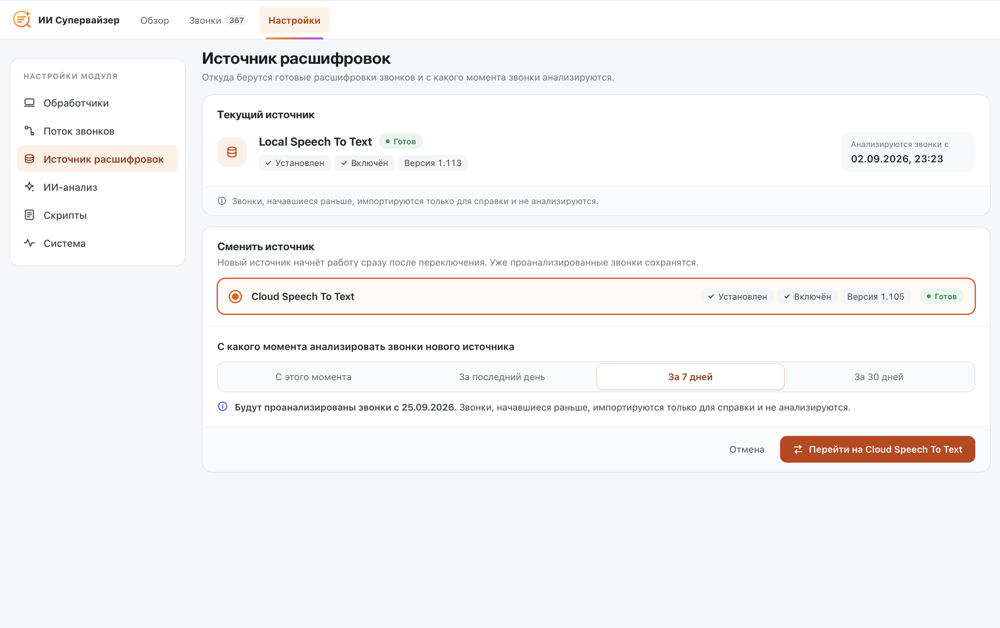<figcaption>
Раздел "Настройки → «Источник расшифровок»"
</figcaption></figure>

#### ИИ-анализ

**Компоненты анализа** определяют, какие этапы обработчик выполняет для каждого нового звонка. Основной разбор звонка - сводка, итог, риски, темы и оценка качества - выполняется всегда, когда включен автоматический анализ. Дополнительно можно включить:

<table><thead><tr><th width="221.38671875">Компонент</th><th>Назначение</th></tr></thead><tbody><tr><td><strong>Голосовые метрики</strong></td><td>Темп речи, перебивания, паузы и баланс участников разговора.</td></tr><tr><td><strong>Эмоции по тексту</strong></td><td>Локальная модель оценивает эмоции участников по фрагментам расшифровки. Требует включенных голосовых метрик.</td></tr><tr><td><strong>Акустический анализ</strong></td><td>Добавляет к голосовым метрикам акустические признаки записи. Требует включенных голосовых метрик.</td></tr></tbody></table>

В блоке **Модель для составления сводки по звонкам** выберите профиль модели. Выбранная модель передается обработчику, и он сам загрузит ее на Mac.

| Профиль           | Модель       | Необходимая свободная оперативаня память для нормальной работы | Когда выбирать                                                                            |
| ----------------- | ------------ | -------------------------------------------------------------- | ----------------------------------------------------------------------------------------- |
| **Qwen3.5 4B Q4** | `qwen3.5:4b` | 4–6 ГБ                                                         | Быстрый ежедневный анализ звонков, оставляет память для распознавания речи на том же Mac. |
| **Qwen3.5 9B Q4** | `qwen3.5:9b` | 8–12 ГБ                                                        | Длинные и сложные звонки. До 2 раз медленнее, однако качество лучше чем у qwen3.5:4b.     |

В свернутом блоке **Экспертные параметры обработки** доступны:

<table><thead><tr><th width="249.25390625">Параметр</th><th>Назначение</th></tr></thead><tbody><tr><td><strong>Держать модель в памяти</strong></td><td>Как долго Ollama держит модель загруженной после запроса. По умолчанию - 5 минут.</td></tr><tr><td><strong>Время ожидания</strong></td><td>Сколько обработчик ждет ответа модели на один запрос.</td></tr><tr><td><strong>Повторы</strong></td><td>Сколько раз задание повторяется после временных сбоев на Mac.</td></tr></tbody></table>


Экспертные параметры влияют на стабильность очереди. Для большинства станций подходят значения по умолчанию. |


<figure>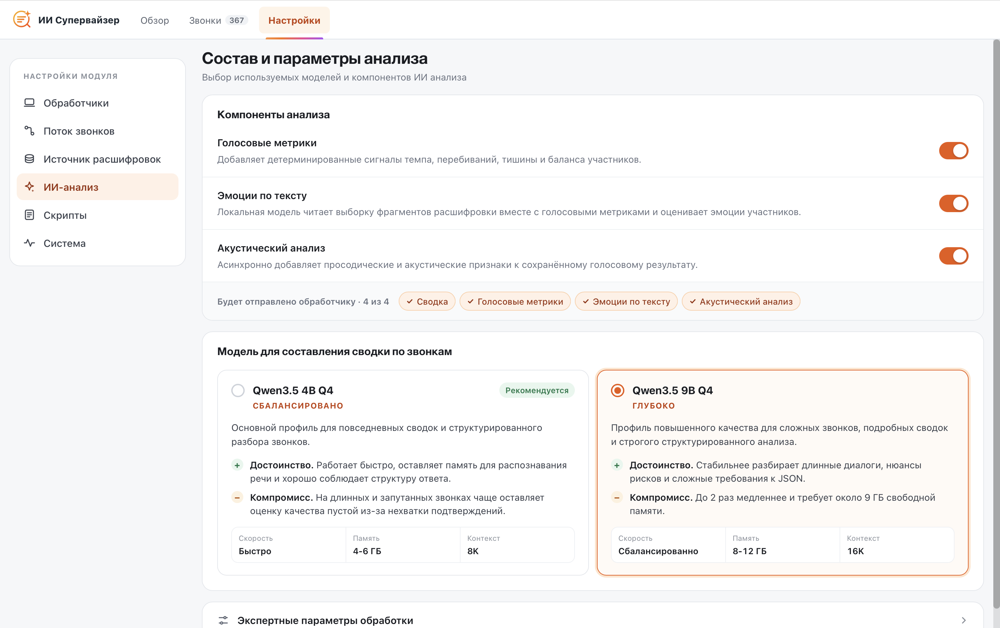<figcaption>
Раздел "Настройки → «ИИ-анализ»"
</figcaption></figure>

#### Скрипты

Скрипт - это набор требований к разговору, по которым дополнительно оценивается сотрудник. Например, для исходящих звонков можно требовать, чтобы сотрудник представился, назвал цель звонка и спросил, удобно ли клиенту говорить.


При добавлении скриптов рекомендуется переключиться на более сильную модель - **qwen3.5:9b**


Чтобы создать скрипт:

1. Нажмите **Новый скрипт** или выберите **Шаблон: исходящий звонок**.
2. Укажите **Название** и **Описание**.
3. Добавьте **Требования**. Для каждого требования задайте:
   * текст требования;
   * **Когда применяется** - условие, например «если нужен обратный звонок»;
   * **Важность** - обычное, важное или критическое;
   * **Учитывать вместо стандартного критерия** - заменить им один из стандартных критериев оценки или оставить самостоятельным требованием;
   * **Проверять** - смысл сказанного или обязательную фразу дословно.
4. Нажмите **Сохранить скрипт**.

Затем в блоке **Назначения сотрудникам** выберите сотрудника (или **Все сотрудники**), скрипт и тип звонков - **Все направления**, входящие, исходящие или внутренние - и нажмите **Назначить**. Одному сотруднику для одного типа звонков можно назначить только один скрипт.


Изменения скрипта применяются только к новым оценкам. Звонки, оцененные раньше, сохраняют правила, по которым их проверяли.


<figure>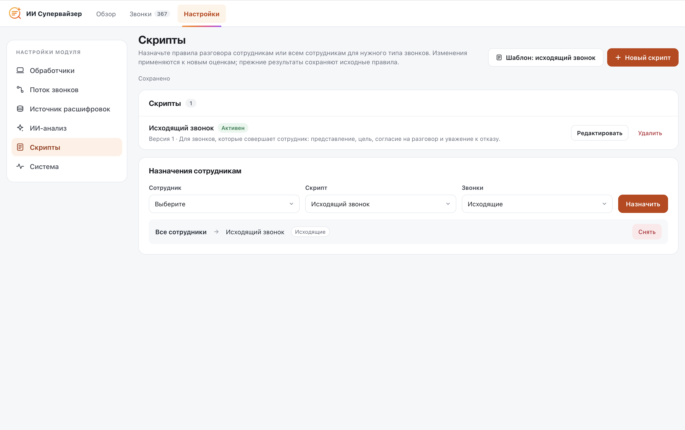<figcaption>
Раздел "Настройки → «Скрипты»"
</figcaption></figure>

#### Система

Раздел содержит две вкладки.

**Обработка** - состояние очереди анализа:

| Счетчик            | Что означает                                                                |
| ------------------ | --------------------------------------------------------------------------- |
| **Новые звонки**   | Расшифровки, по которым еще нет разбора ИИ.                                 |
| **Ожидают**        | Задания готовы и ждут обработчика на Mac.                                   |
| **В работе**       | Задание выполняется обработчиком.                                           |
| **Нужны действия** | Ошибки и задания, ожидающие повтора.                                        |
| **Готово**         | Сохраненные разборы ИИ.                                                     |
| **Пропущено**      | Пустые или малоинформативные расшифровки и звонки до подключения источника. |

В блоке **Действия восстановления** можно **Повторить ошибочные** задания, **Вернуть зависшие в очередь** и **Очистить очередь** - удалить незавершенные и ошибочные задания. Готовые разборы при очистке сохраняются. Ниже находится список заданий с фильтрами **Активные**, **Ошибки**, **Готово**, **Пропущены** и **Все**: по каждому заданию можно открыть звонок или повторить анализ.

<figure>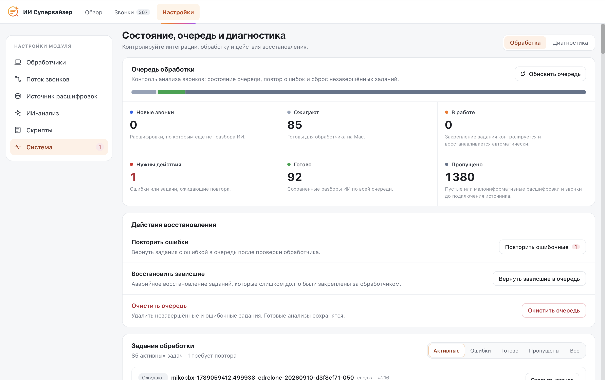<figcaption>
Раздел "Настройки → «Система» → «Обработка»"
</figcaption></figure>

**Диагностика** - журнал модуля и диагностический файл. Журнал содержит технические события модуля и обработчиков, его можно фильтровать по уровню, компоненту и тексту. Кнопка **Скачать диагностику** формирует обезличенный файл для службы поддержки: в нем нет расшифровок, результатов анализа, ключей и записей разговоров.

<figure>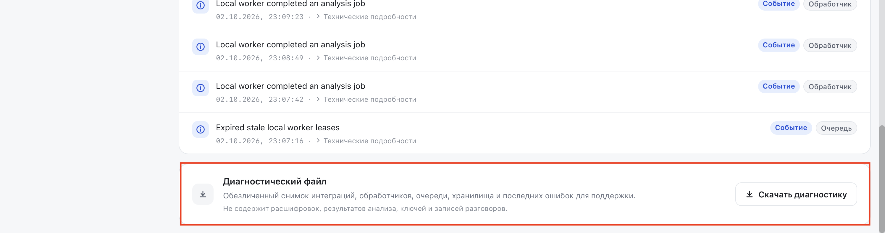<figcaption>
Раздел для загрузки диагностического файла
</figcaption></figure>

### Права доступа

При использовании модуля [Управление доступом в систему](../module-users-u-i.md) для Локального ИИ Супервайзера доступны отдельные права:

| Право                                                     | Что открывает                                                                          |
| --------------------------------------------------------- | -------------------------------------------------------------------------------------- |
| **Просмотр звонков и статистики**                         | Вкладки **Обзор** и **Звонки**, карточка звонка и разбор обращения.                    |
| **Управление настройками модуля**                         | Разделы **Поток звонков**, **Источник расшифровок**, **ИИ-анализ** и мастер настройки. |
| **Подключение обработчиков, просмотр очереди и журналов** | Разделы **Обработчики**, **Скрипты** и **Система**.                                    |
