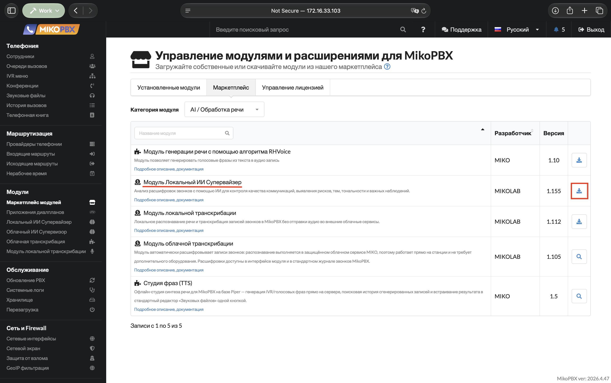
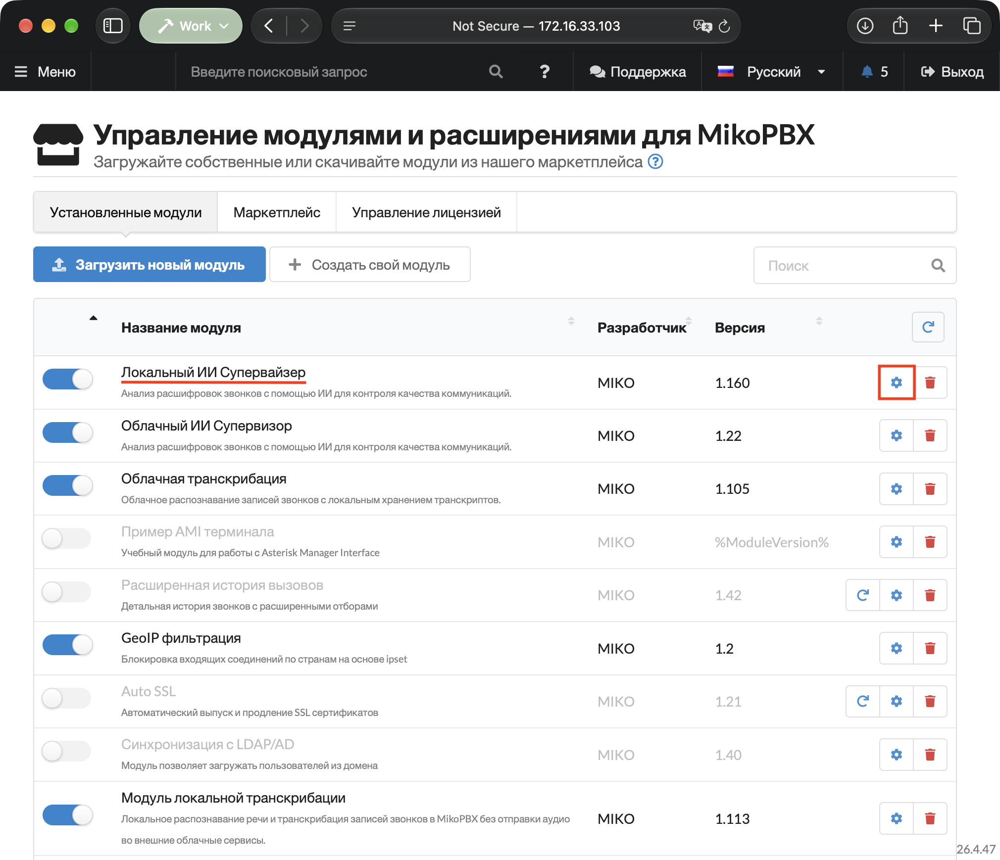
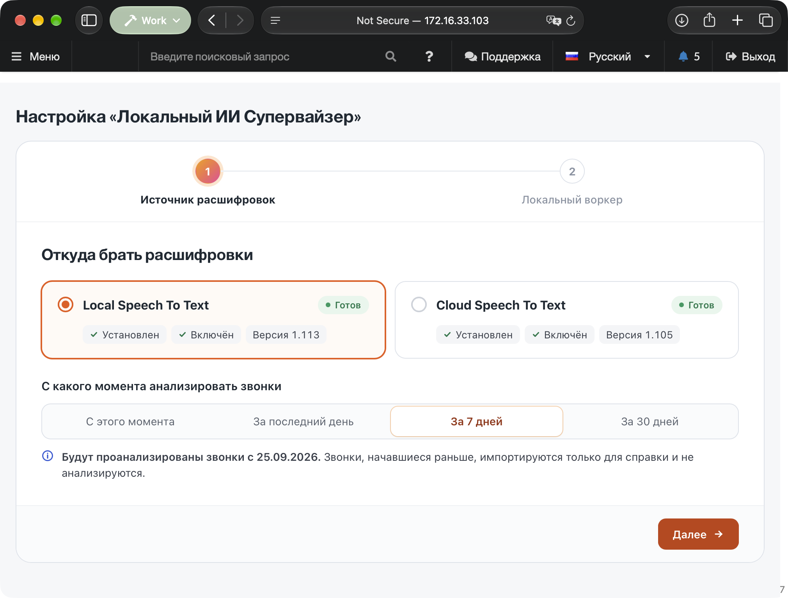
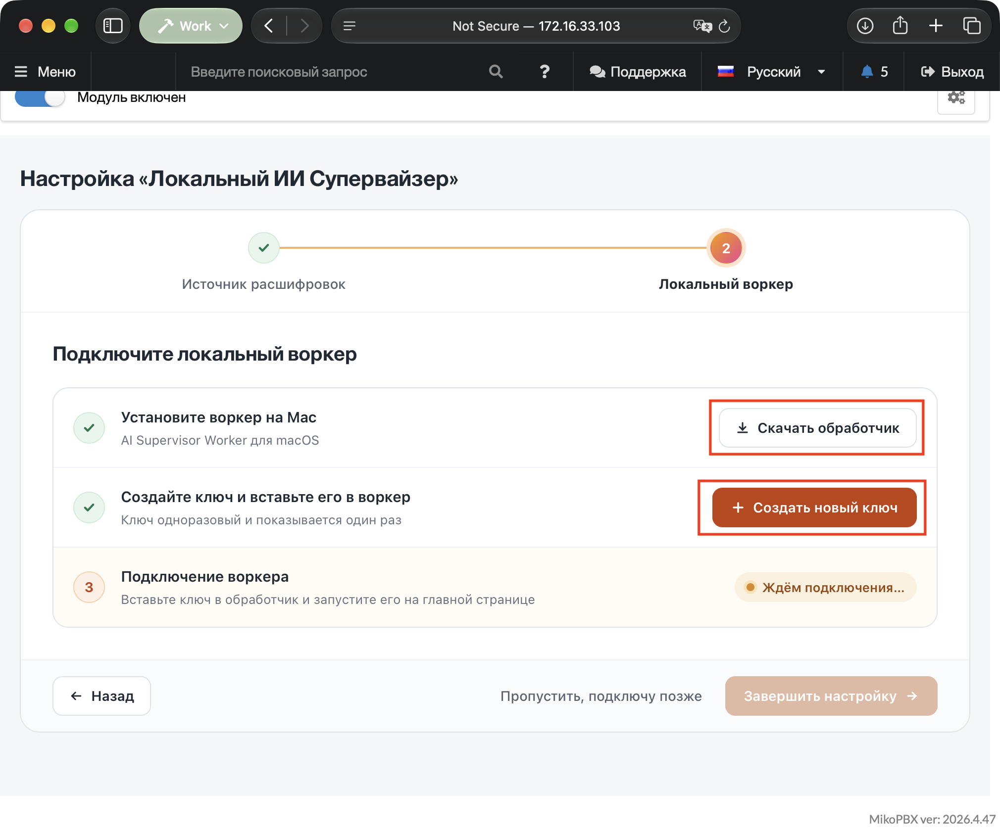
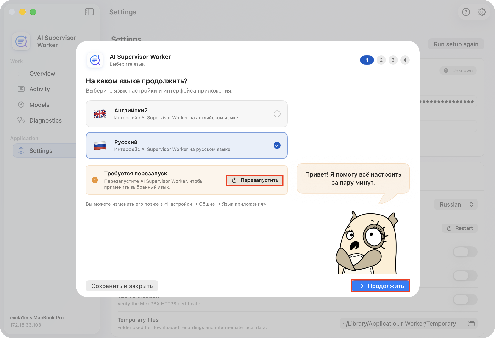
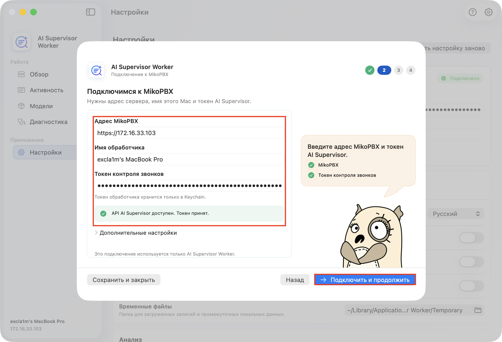
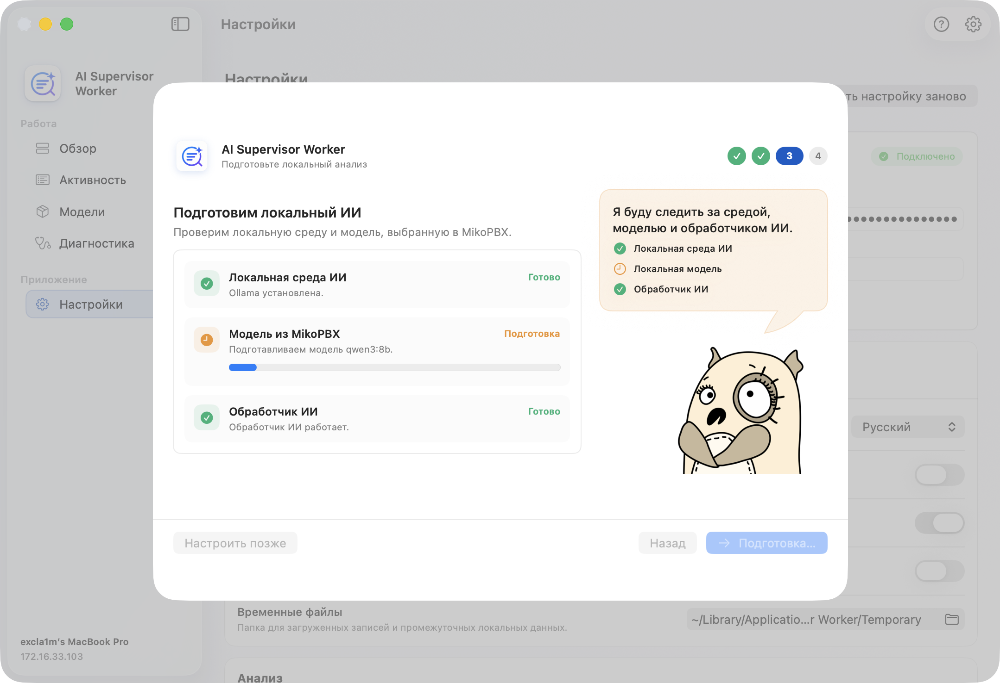
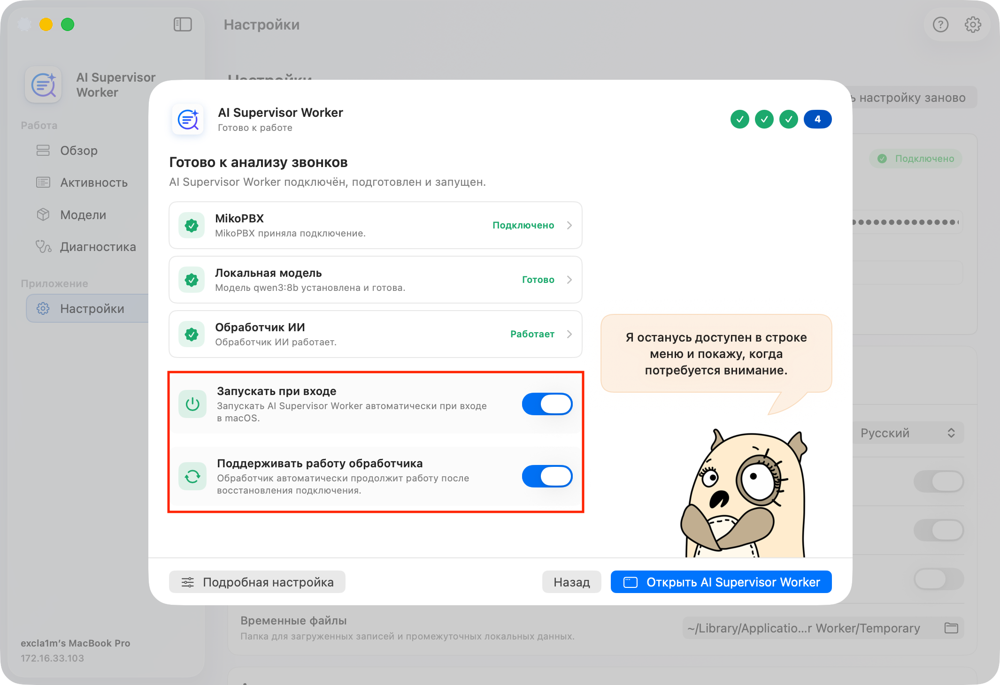
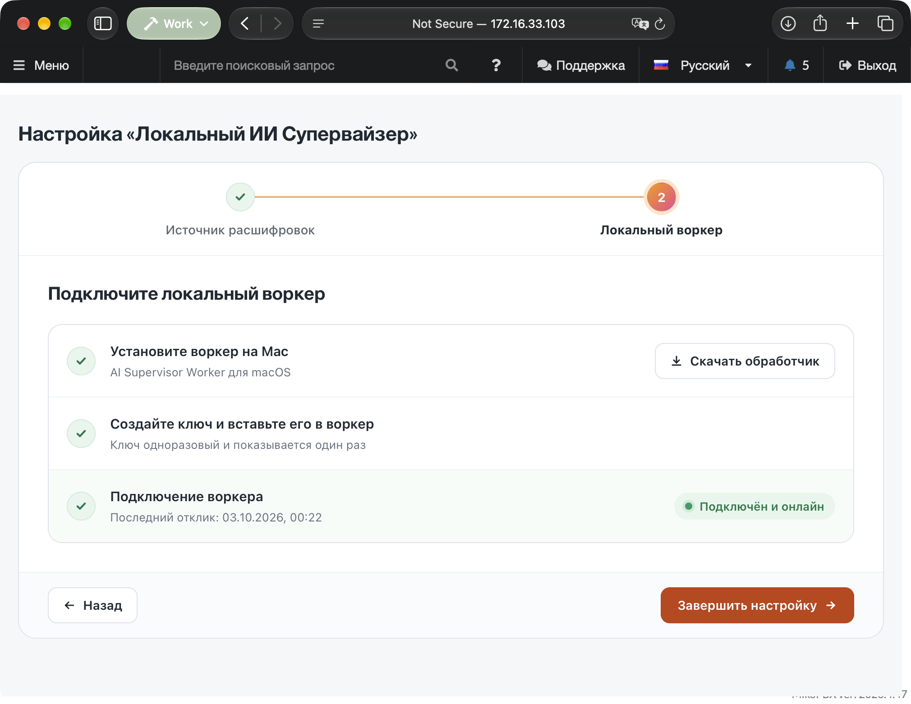
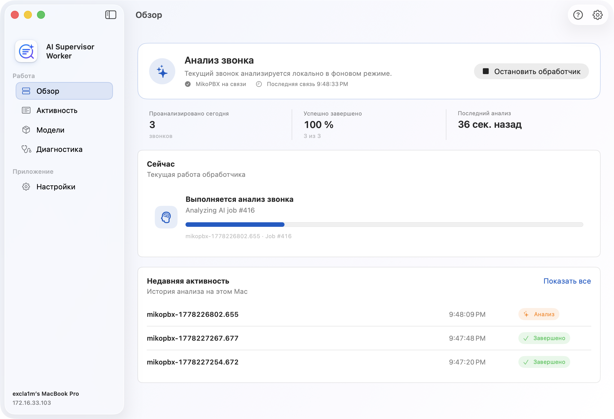

# Быстрый старт

### Перед началом

Для работы понадобятся:

* MikoPBX **2025.1.1** или новее;
* установленный и настроенный модуль транскрибации: **Локальная транскрибация** 1.102+ или **Облачная транскрибация** 1.75+;
* Mac с Apple Silicon и macOS 14 или новее;
* сетевой доступ от Mac к веб-интерфейсу MikoPBX.


Локальный ИИ Супервайзер анализирует готовые расшифровки. Если транскрибация еще не настроена, сначала выполните [быстрый старт модуля локальной транскрибации](../module-local-speech-to-text/quick-start.md) или настройте [модуль облачной транскрибации](../module-cloud-speech-to-text/).


### Установка модуля

1. Откройте веб-интерфейс MikoPBX.
2. Перейдите в раздел **Модули** → **Маркетплейс модулей**.

<figure><figcaption>
Раздел «Маркетплейс модулей»
</figcaption></figure>

3. Найдите модуль **Локальный ИИ Супервайзер** и установите его.

<figure><figcaption>
Установка модуля
</figcaption></figure>

4. Откройте список установленных модулей и включите модуль. Нажмите кнопку настроек справа от версии модуля.

<figure><figcaption>
Раздел «Установленные модули» - включение модуля «Локальный ИИ Супервайзер» и кнопка перехода к его настройкам
</figcaption></figure>

### Шаг 1. Выберите источник расшифровок

При первом открытии модуля запустится мастер настройки.

1. Выберите модуль транскрибации, из которого будут поступать расшифровки. Источник должен быть в состоянии **Готов**.
2. Укажите, с какого момента анализировать звонки: **С этого момента**, **За последний день**, **За 7 дней** или **За 30 дней**.
3. Нажмите **Далее**.


Чем больше период, тем больше звонков окажется в очереди после запуска. Для первого знакомства с модулем удобно выбрать **За последний день**: результаты появятся быстро, и на них сразу можно посмотреть.


<figure><figcaption>
Мастер настройки - шаг 1 «Источник расшифровок»
</figcaption></figure>

### Шаг 2. Скачайте приложение и создайте ключ

1. Нажмите **Скачать обработчик** и установите AI Supervisor Worker из загруженного `.dmg` на Mac.
2. Нажмите **Создать ключ доступа** и сразу скопируйте ключ: он показывается только один раз.

Не закрывайте мастер - после подключения приложения в нем отобразится статус воркера.

<figure><figcaption>
Мастер настройки - шаг 2 «Локальный воркер»: скачивание приложения и создание ключа
</figcaption></figure>

### Настройка AI Supervisor Worker

#### 1. Выберите язык

Откройте приложение **AI Supervisor Worker**. На первом экране выберите язык интерфейса и нажмите **Продолжить**. Если приложение предложит перезапуск после смены языка, выполните его.

<figure><figcaption>
Экран выбора языка приложения
</figcaption></figure>

#### 2. Подключитесь к MikoPBX

На этапе подключения укажите:

* адрес MikoPBX в формате `https://...` или `http://...`;
* понятное имя этого Mac;
* ключ доступа, созданный в мастере настройки модуля.

Откройте **Расширенные настройки**, только если нужно отключить проверку TLS или выбрать собственный PEM-файл CA. Нажмите **Подключить и продолжить** - приложение проверит адрес и ключ.

<figure><figcaption>
Подключение к MikoPBX
</figcaption></figure>

#### 3. Подготовьте локальный ИИ

На этапе **Подготовка локального ИИ** приложение проверяет:

1. локальную среду Ollama;
2. модель, выбранную в MikoPBX;
3. готовность обработчика.

Если Ollama не установлена, нажмите **Установить Ollama**. Затем нажмите **Подготовить и запустить**: приложение загрузит модель, зарегистрирует Mac в MikoPBX и запустит обработчик.


Первая загрузка модели может занять продолжительное время. Не закрывайте приложение и убедитесь, что на Mac достаточно свободного места.


<figure><figcaption>
Подготовка локальной модели
</figcaption></figure>

#### 4. Завершите настройку приложения

На последнем экране проверьте состояния **MikoPBX**, **Локальная модель** и **AI Worker**.

При необходимости включите:

* **Запускать при входе** - приложение будет открываться автоматически при входе в macOS;
* **Поддерживать работу обработчика** - обработчик сам возобновит работу после восстановления сети или пробуждения Mac.

Нажмите **Открыть AI Supervisor Worker**.

<figure><figcaption>
Финальный экран первичной настройки приложения
</figcaption></figure>

### Шаг 3. Завершите мастер в MikoPBX

Вернитесь в веб-интерфейс MikoPBX. Когда приложение подключится, статус воркера в мастере сменится на **Подключён и онлайн**. Нажмите **Завершить настройку**.

Мастер покажет сообщение **Анализ запущен**: звонки начнут импортироваться и анализироваться. Нажмите **Перейти к обзору**.

<figure><figcaption>
Мастер настройки - итоговый экран «Анализ запущен»
</figcaption></figure>


Если Mac пока не готов, на шаге 2 можно нажать **Пропустить, подключу позже**. Импорт звонков начнется сразу, а анализ - после подключения приложения. Ключ доступа в этом случае создается в разделе **Настройки** → **Обработчики**.


### Проверка результата

1. В AI Supervisor Worker откройте раздел **Обзор**: состояние должно показывать готовность к новым заданиям.

<figure><figcaption>
Раздел «Обзор» в приложении
</figcaption></figure>

2. В MikoPBX откройте **Настройки** → **Система** → **Обработка** и убедитесь, что задания переходят из **Ожидают** в **В работе** и **Готово**.
3. Откройте вкладку **Звонки** и выберите обработанный звонок, чтобы посмотреть результат анализа.

СКРИНШОТ: Вкладка «Звонки» - первый проанализированный звонок

### Что настроить дальше

* **Настройки** → **Поток звонков** - включите обработку внутренних звонков, выберите язык результатов ИИ и срок хранения данных.
* **Настройки** → **ИИ-анализ** - включите дополнительные компоненты анализа и при необходимости выберите модель повышенного качества.
* **Настройки** → **Скрипты** - задайте требования к разговору для сотрудников.

Подробное описание всех разделов приведено в статье [Локальный ИИ Супервайзер](./).
