# Облачная транскрибация

**Модуль облачной транскрибации** автоматически распознает записанные звонки MikoPBX и сохраняет готовые расшифровки на станции.&#x20;


Модуль полностью автономен: отдельное приложение-обработчик не требуется. Если аудиозаписи нельзя передавать во внешний сервис, используйте [Модуль локальной транскрибации](../module-local-speech-to-text/).



Отправка записи на распознавание - платное действие: стоимость списывается с баланса вашей лицензии MIKO (пополнить можно по ссылке - [lm.miko.ru](https://lm.miko.ru)).


<figure>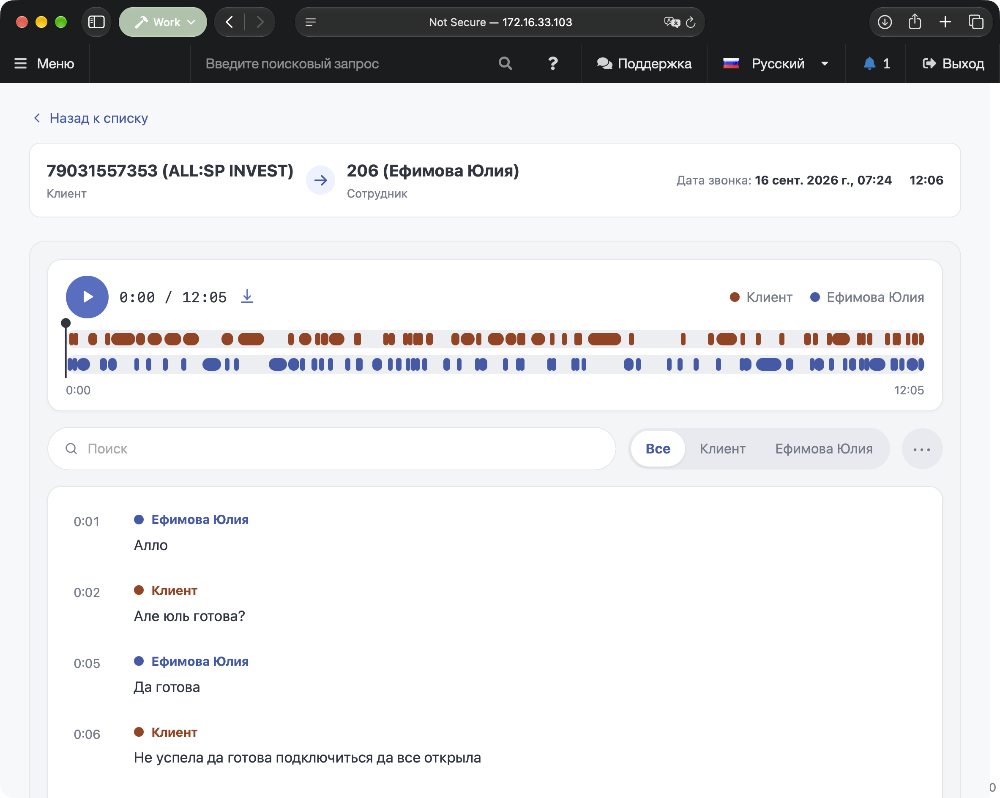<figcaption>
Пример расшифровки звонка, сделанной модулем облачной транскрибации
</figcaption></figure>

### Требования и совместимость

* Действующая лицензия MIKO с опцией облачной транскрибации и положительный баланс.
* Включенная запись разговоров для нужных маршрутов, очередей или сотрудников.
* Прямой исходящий доступ по HTTPS к `speech.mikolab.ru:443`.&#x20;

### Установка модуля

1. Откройте веб-интерфейс MikoPBX. Перейдите в раздел **Модули** → **Маркетплейс модулей**.

<figure>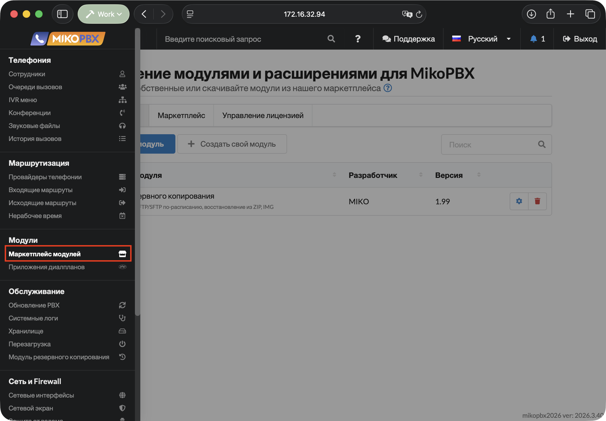<figcaption>
Раздел "Маркетплейс модулей"
</figcaption></figure>

2. Найдите модуль "**Облачная транскрибация"** и установите его.

<figure>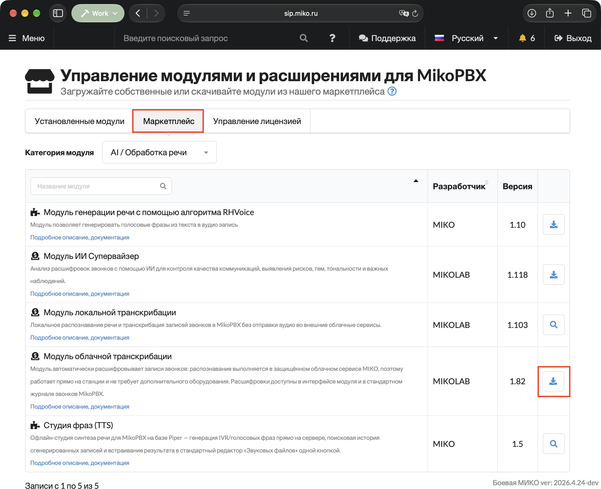<figcaption>
Модуль облачной транскрибации в разделе "Маркетплейс"
</figcaption></figure>

3. Откройте список установленных модулей и включите модуль. Нажмите кнопку настроек справа от версии модуля.

<figure>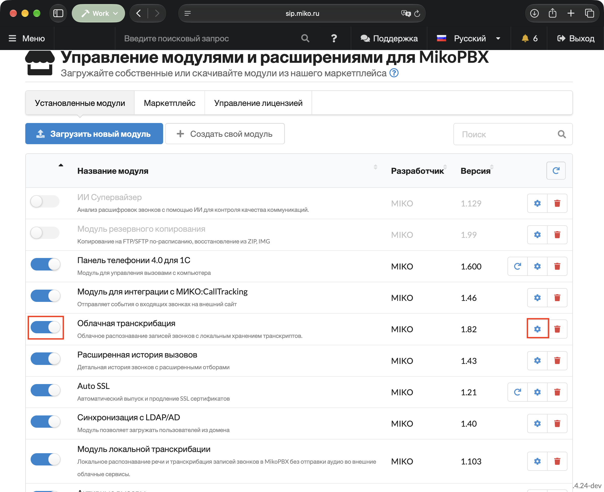<figcaption>
Включение модуля и переход к его странице
</figcaption></figure>

### Первый запуск

При первом запуске модуля, откроется мастер его настройки. На первой странице модуль предупреждает, что выбранные записи звонков передаются на `speech.mikolab.ru` для распознавания. Подтвердите согласие кнопкой **Продолжить**.

<figure>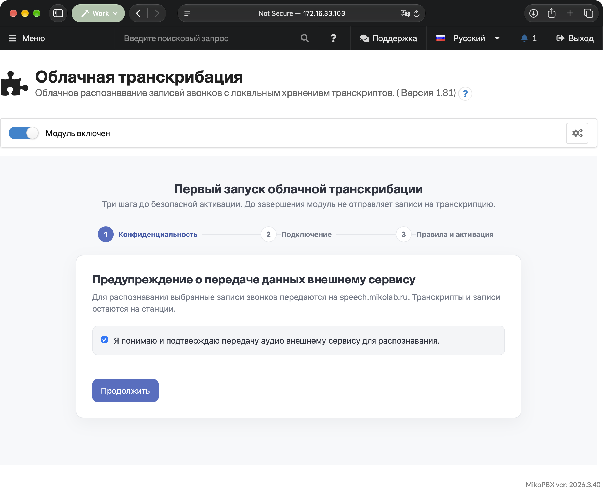<figcaption>
Шаг «Конфиденциальность» мастера первого запуска
</figcaption></figure>

На втором шаге онбоардинга, нажмите **Проверить подключение**: модуль проверит доступность API сервиса, авторизацию по лицензии и состояние баланса.

<figure>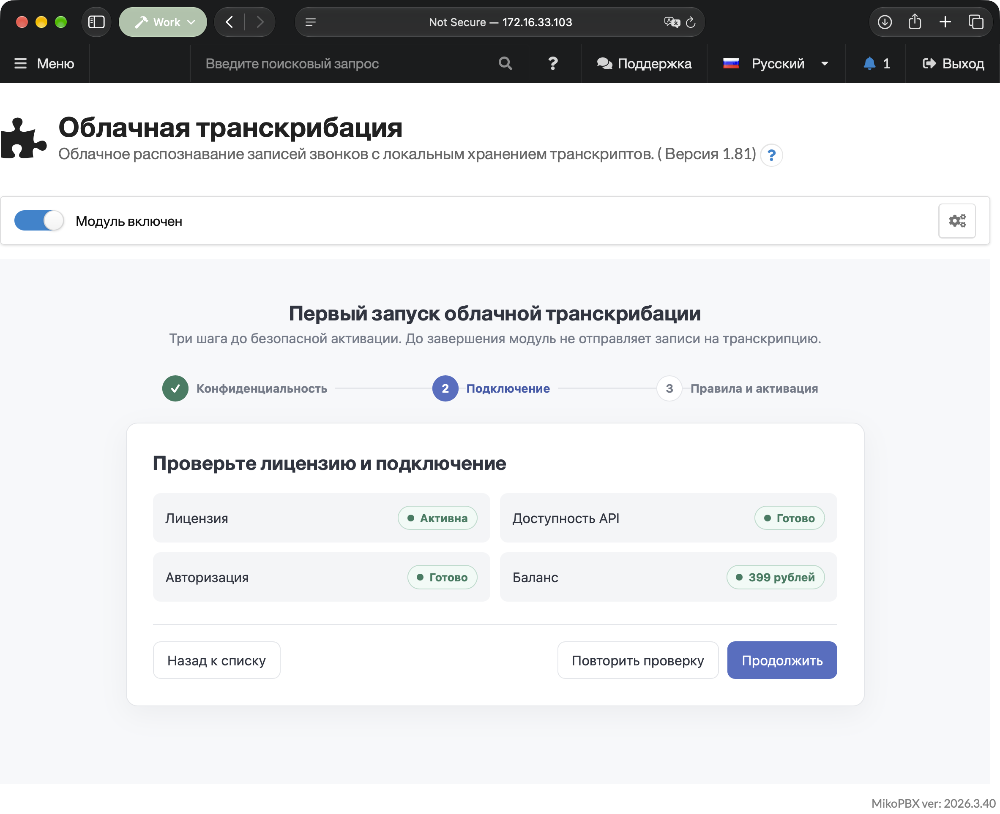<figcaption>
Шаг «Подключение» мастера первого запуска
</figcaption></figure>

На следующем эатпе проверьте правила отбора звонков (направления, сотрудники, лимиты). Подтвердите включение автоматического отбора и нажмите **Активировать модуль**. Первая отправка произойдет только после появления подходящей записи.

<figure>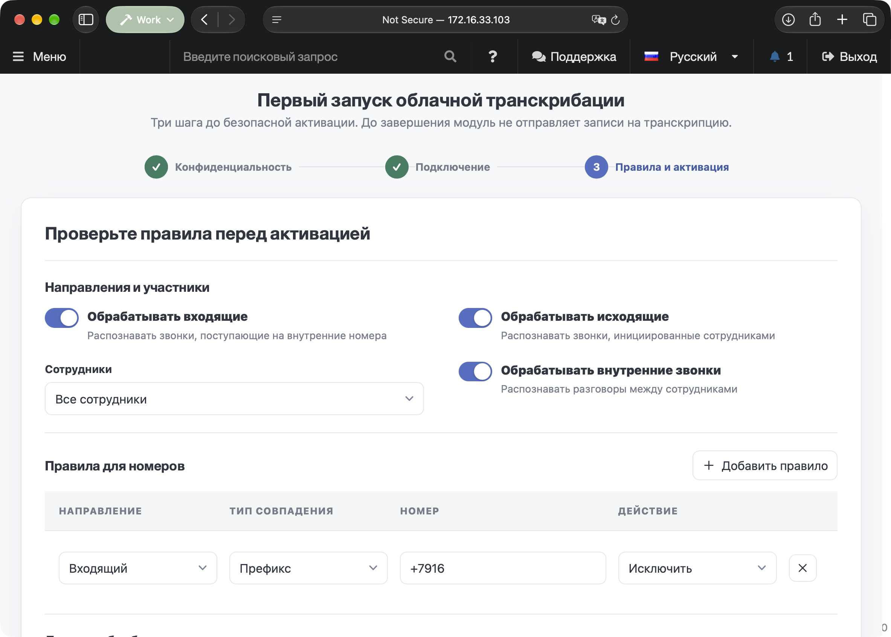<figcaption></figcaption></figure>

<figure>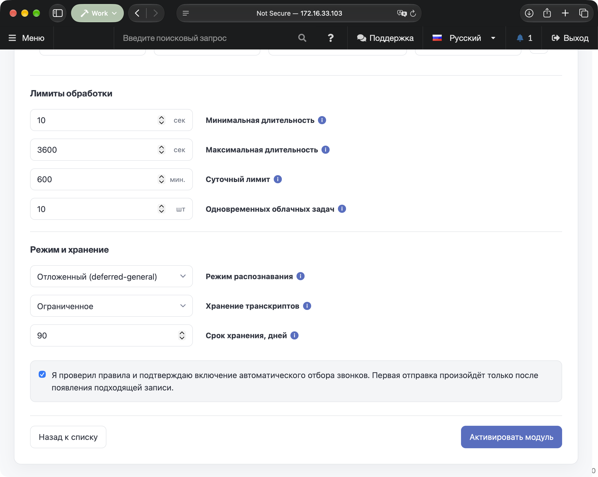<figcaption>
Шаг «Правила и активация» мастера первого запуска
</figcaption></figure>

### Вкладка «Обзор»

Вкладка открывается по умолчанию и показывает состояние модуля:

* карточки **В обработке**, **Транскриптов**, **Инцидентов** и **Баланс** с кнопкой обновления;
* график **Успешно транскрибировано за 7 дней** — минуты распознанного аудио по дням;
* список **Последние задания** со статусами и переходом в очередь.

<figure>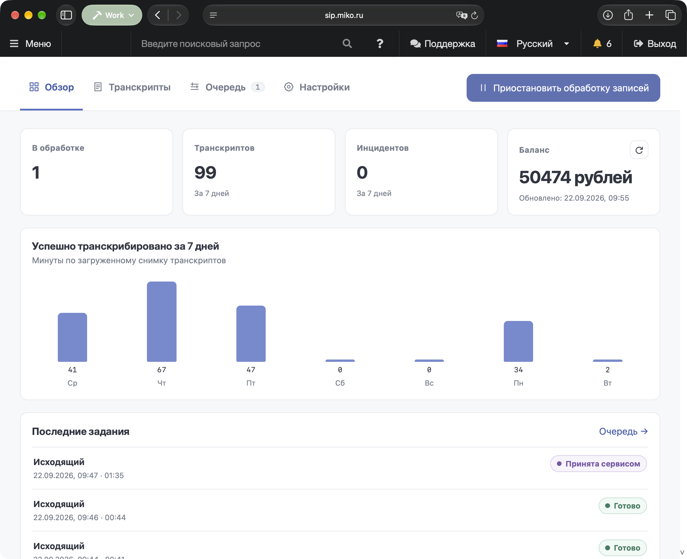<figcaption>
Главный экран модуля (вкладка «Обзор»)
</figcaption></figure>

### Вкладка «Транскрипты»

Здесь собраны локально сохраненные результаты распознавания. Список фильтруется по периоду звонков (календарь или «Сегодня») и ищет по номеру, сотруднику или тексту расшифровки. В таблице отображаются дата, направление, контрагент, сотрудник, статус (полный или частичный), длительность и время обновления.

<figure>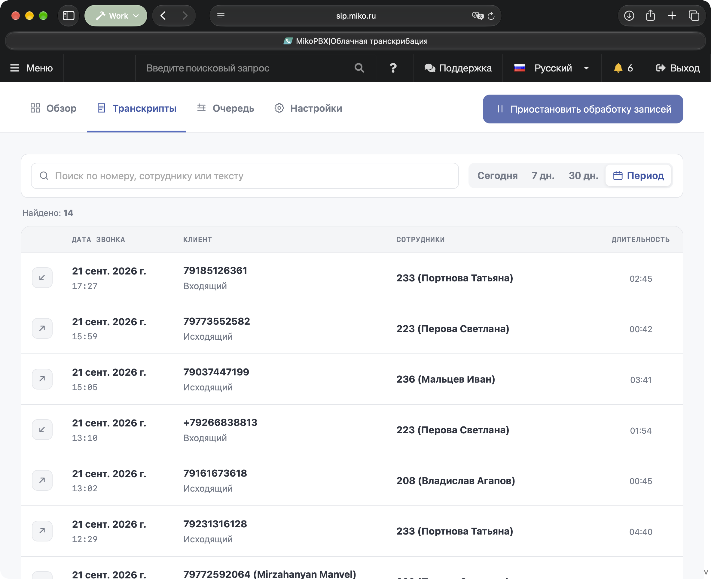<figcaption>
Раздел «Транскрипты» в Модуле облачной транскрибации
</figcaption></figure>

Нажмите на интересующий траснкрипт - откроется его карточка. Она содержит:

* реплики с таймкодами и ролями участников - сотрудник/клиент
* встроенный проигрыватель с регулировкой скорости и скачиванием записи
* поиск&#x20;
* экспорт в **JSON** или **TXT**
* удаление транскрипта&#x20;

Нажатие на реплику переводит проигрыватель к соответствующему моменту записи.

<figure><figcaption>
Карточка транскрипта с репликами и проигрывателем
</figcaption></figure>

### Вкладка «Очередь»

На этой вкладке управляется локальная очередь задач. Доступны фильтр по статусу, период (1 день или все время), поиск по номеру или направлению и постраничная навигация.

| Группа фильтра       | Состояния задач                                                                                                               |
| -------------------- | ----------------------------------------------------------------------------------------------------------------------------- |
| **Ожидают**          | Найдена, Ожидает запись, Готова к отправке, Безопасное ожидание отправки                                                      |
| **Обрабатываются**   | Отправляется, Принята сервисом, Распознаётся                                                                                  |
| **Требуют внимания** | Исход отправки неизвестен, Локальная ошибка, Ошибка сервиса, Некорректный результат, Обработка зависла, Истёк срок результата |
| **Завершены**        | Готово, Результат не сохранён после удаления, Отменена                                                                        |

По задаче доступна техническая информация: ID задачи, номер запуска (поколение), этап обработки, код ошибки, HTTP-код и тип сетевой ошибки, CDR ID, размер и формат аудио.

| Действие               | Когда доступно и что делает                                                                                                               |
| ---------------------- | ----------------------------------------------------------------------------------------------------------------------------------------- |
| **Отменить задачу**    | Только до начала загрузки аудио. Подтверждение не требуется.                                                                              |
| **Повторить задачу**   | Явное платное подтверждение. Создает новое поколение задачи и может привести к повторному списанию. Автоматических повторов у модуля нет. |
| **Открыть транскрипт** | Переход к готовой расшифровке на вкладке «Транскрипты».                                                                                   |

<figure>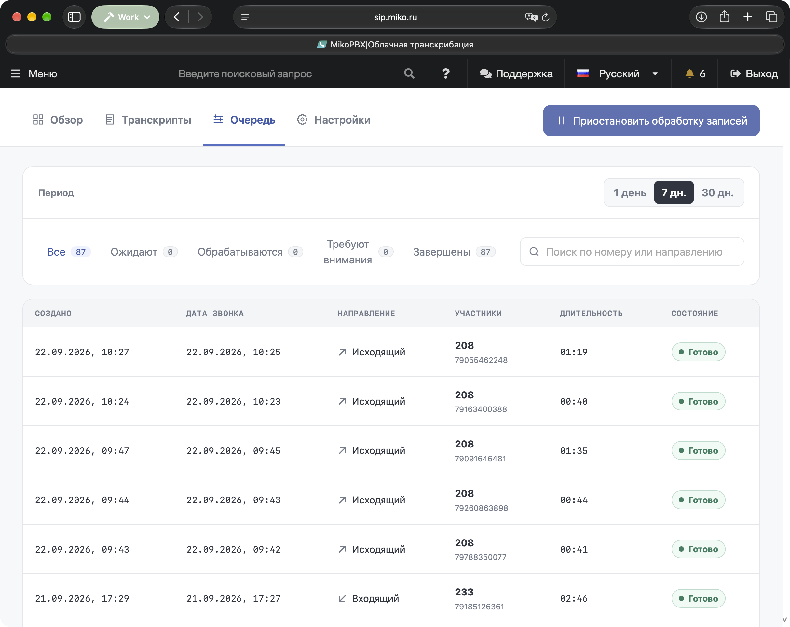<figcaption>
Раздел «Очередь» в Модуле облачной транскрибации
</figcaption></figure>

### Вкладка «Настройки»

Здесь настраиваются настройки распознавания звонков: что распознавать, а что пропускать. Ниже представлена сводка по параметрам в каждом разделе настроек:

#### **Направления и участники**

<table><thead><tr><th width="248.546875">Настройка</th><th>Назначение</th></tr></thead><tbody><tr><td><strong>Обрабатывать входящие</strong></td><td>Распознавать ли звонки, поступающие на внутренние номера.</td></tr><tr><td><strong>Обрабатывать исходящие</strong></td><td>Распознавать ли звонки, инициированные сотрудниками на внешние номера.</td></tr><tr><td><strong>Обрабатывать внутренние</strong></td><td>Распознавать ли разговоры между сотрудниками.</td></tr><tr><td><strong>Сотрудники</strong></td><td>Звонки каких сотрудников нужно/не нужно распознавать.</td></tr></tbody></table>

#### **Правила для номеров**

Правила включают или исключают номера из обработки. У каждого правила задаются направление (любое, входящее или исходящее), тип совпадения (точный номер или префикс), номер и действие (включить или исключить).

<figure>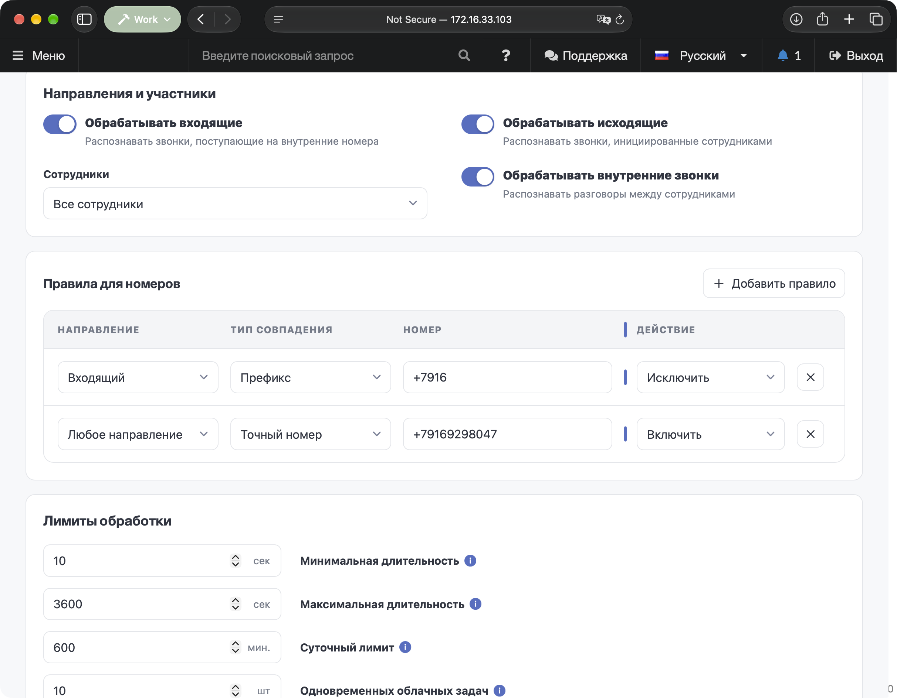<figcaption>
Блок «Правила для номеров»
</figcaption></figure>

#### **Лимиты обработки**

В этом разделе так же настраиваются правила для того: какие звонки обрабатывать, а какие пропускать. Так же указывается суточный лимит и число возможных одновременных задач. Более подробное описание представлено в таблице ниже:

<table><thead><tr><th width="312.39453125">Настройка</th><th>Назначение</th></tr></thead><tbody><tr><td><strong>Минимальная длительность</strong></td><td>Звонки короче этого значения не отправляются.</td></tr><tr><td><strong>Максимальная длительность</strong></td><td>Звонки длиннее этого значения не отправляются.</td></tr><tr><td><strong>Суточный лимит</strong></td><td>Сколько минут аудио в сутки можно отправить на распознавание.</td></tr><tr><td><strong>Одновременных облачных задач</strong></td><td>Сколько записей сервис распознает одновременно; остальные ждут в локальной очереди.</td></tr></tbody></table>


Когда суточный лимит минут исчерпан, новые задачи ждут наступления следующих суток. Если администратор увеличит лимит - отправка возобновится сразу.


#### **Режим распознавания и хранение**

В этом блоке настраивается режим распознавания, а так же срок хранения готовых транскриптов.

<table><thead><tr><th width="174.875">Настройка</th><th>Назначение</th></tr></thead><tbody><tr><td><strong>Режим распознавания</strong></td><td>Отложенный (deferred-general) - дешевле, но обработка записи может занимать до ~12 часов. Стандартный (general) быстрее, но дороже.</td></tr><tr><td><strong>Хранение транскриптов</strong></td><td>Ограниченное (1–3650 дней) или без ограничения.</td></tr></tbody></table>


По истечении срока хранения транскрипты удаляются при плановой ежедневной очистке. CDR и аудиозаписи MikoPBX не затрагиваются.


### Приостановка обработки

Кнопка **Приостановить обработку записей** в шапке модуля временно останавливает отбор и отправку новых записей — например, на время работ или при разбирательстве инцидента. Уже принятые сервисом задачи продолжают опрашиваться до готовности. Кнопка **Возобновить обработку записей** возвращает модуль в рабочий режим.

<figure>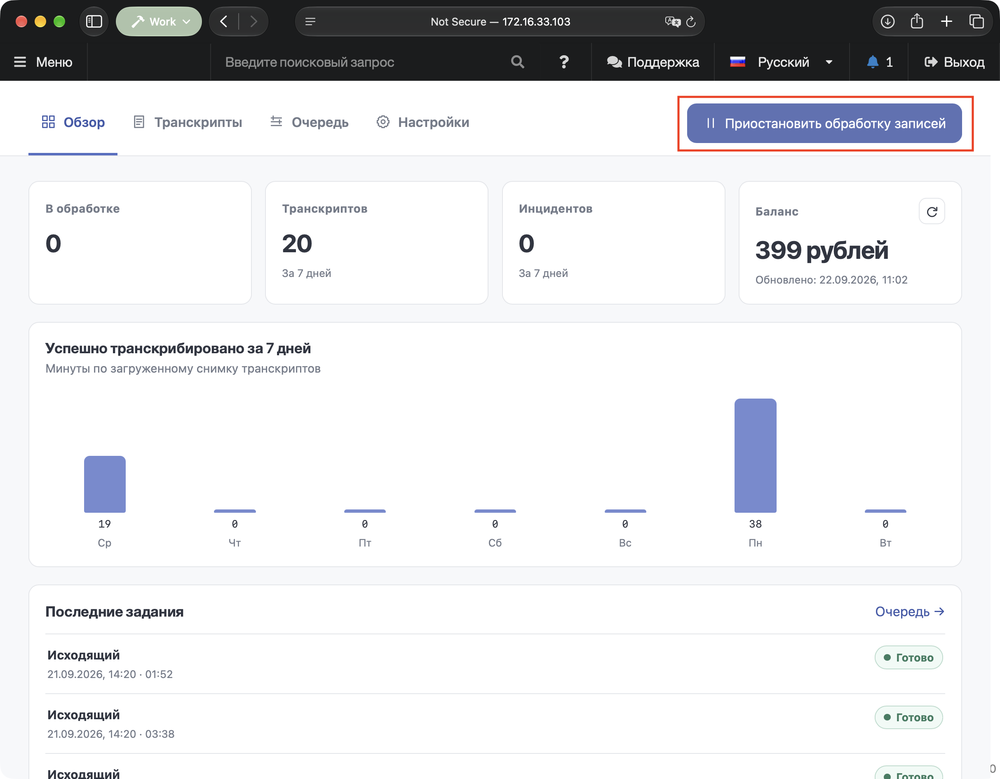<figcaption>
Кнопка для остановки обработки записей
</figcaption></figure>

### Расшифровка в истории звонков

В разделе **История звонков** MikoPBX у звонка с готовым транскриптом появляется диалог **Расшифровка звонка** с текстом разговора и кнопкой **Открыть расшифровку** для перехода в модуль.

<figure>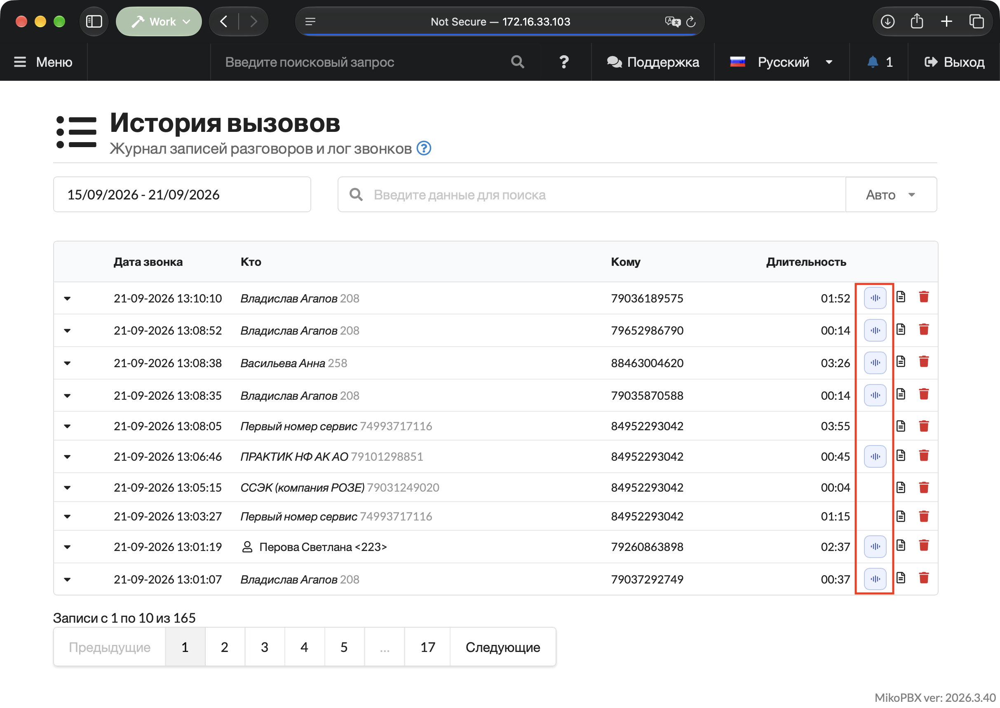<figcaption>
Кнопка для открытия расшифровки звонка из журнала звонков MikoPBX
</figcaption></figure>

<figure>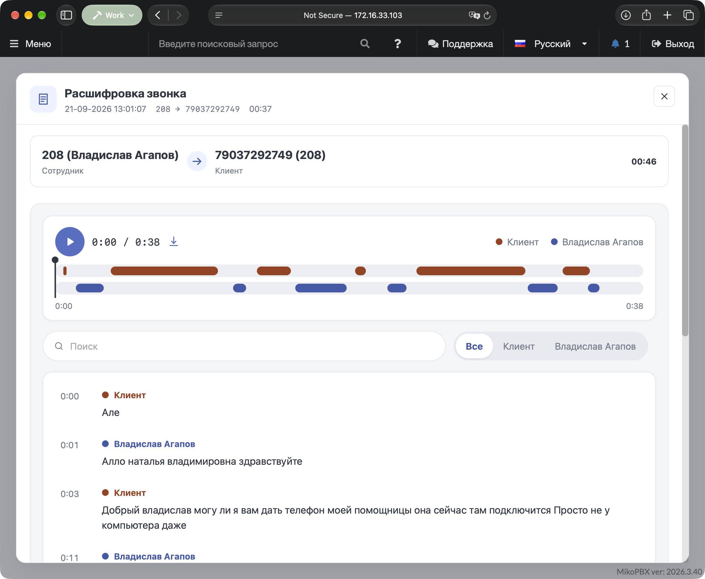<figcaption>
Расшифровка открытая из журнала звонков в MikoPBX
</figcaption></figure>
