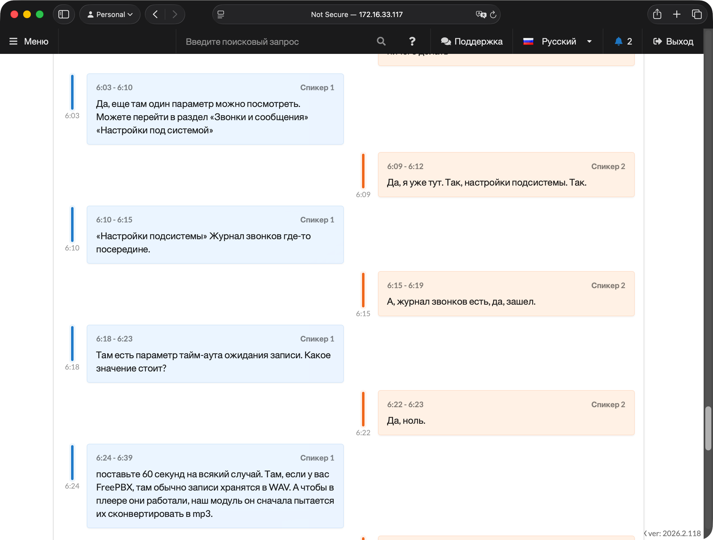
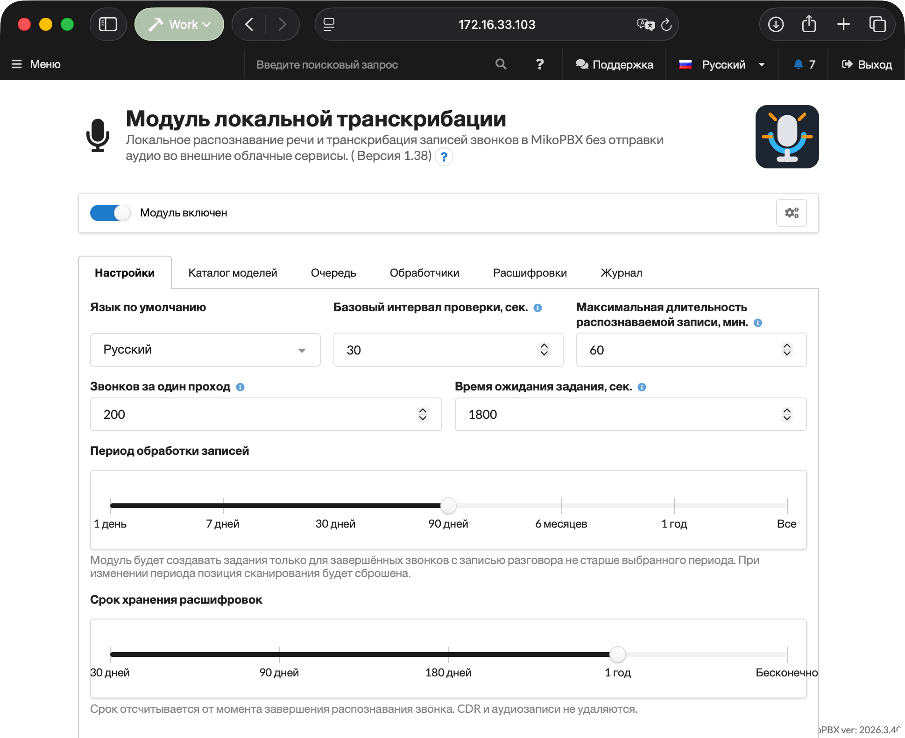
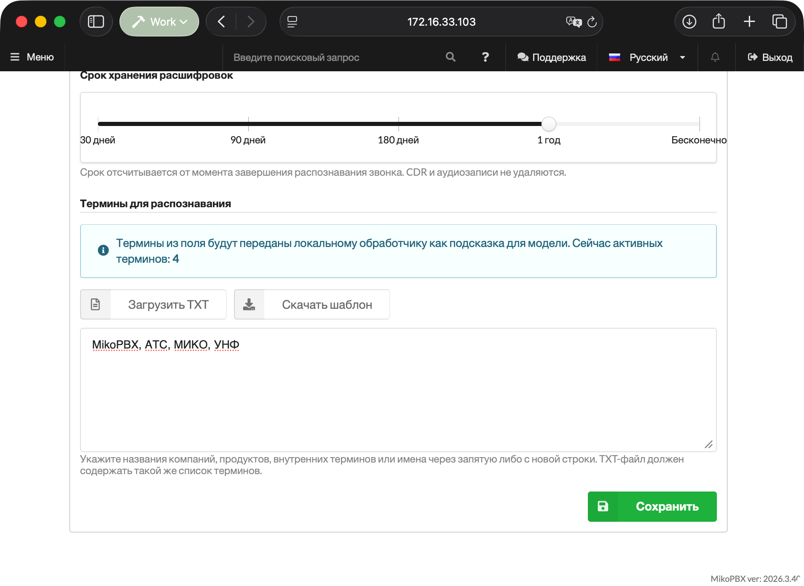
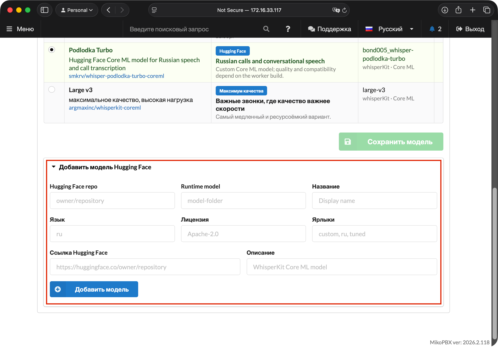
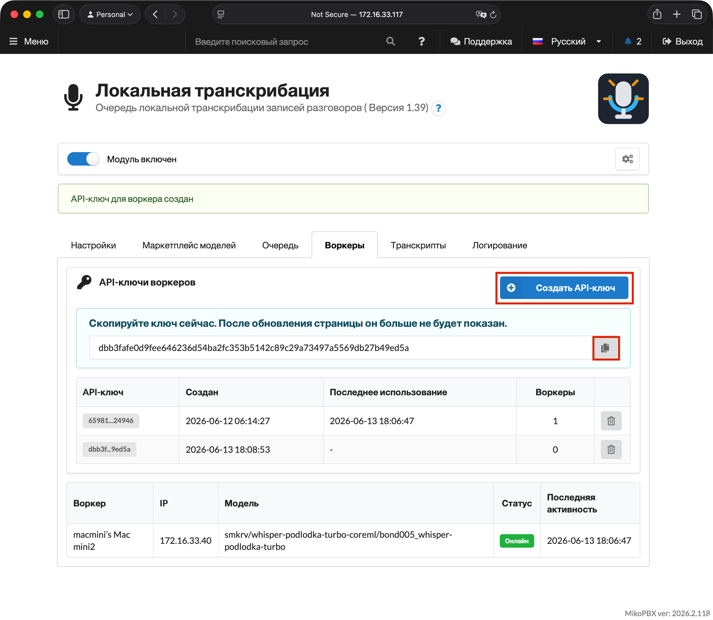
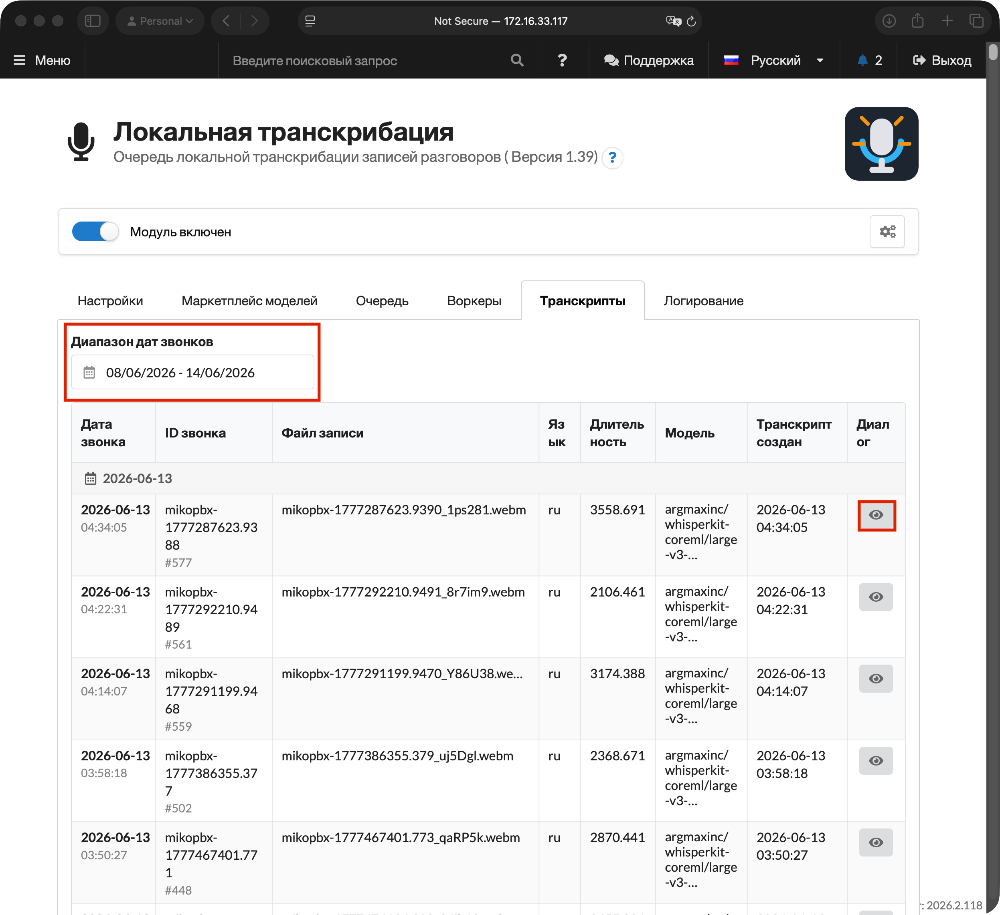

# Локальная транскрибация

**Модуль локальной транскрибации** распознает речь в записанных звонках MikoPBX и сохраняет готовую расшифровку как диалог. Аудиофайлы не отправляются во внешние облачные сервисы: PBX создает очередь заданий, а отдельное приложение **Local STT Worker** скачивает назначенную запись, распознает ее локально через выбранный в MikoPBX движок Parakeet или WhisperKit и отправляет результат обратно в MikoPBX.


PBX-модуль работает внутри MikoPBX. Отдельное приложение Local STT Worker выпускается для Mac на Apple Silicon. Подробное описание приложения приведено в статье [Local STT Worker](miko-ai-worker.md).


<figure><figcaption><p>УСТАРЕЛО. Пример результата транскрибации</p></figcaption></figure>

### Как проходит обработка

1. Звонок завершается, и MikoPBX сохраняет запись разговора.
2. Фоновый процесс модуля находит запись и создает задание.
3. Local STT Worker получает lease задания.
4. PBX отдает назначенному обработчику файл записи.
5. Worker подготавливает аудио, запускает указанный в задании движок и Core ML-модель, затем формирует сегменты расшифровки.
6. Модуль фильтрует результат, сохраняет расшифровку и публикует событие для интеграций.

Если Worker перестает продлевать lease, задание возвращается в очередь. На одно задание отводится до трех попыток обработки, после чего оно попадает в статус **Ошибки**.

### Требования и совместимость

* MikoPBX **2025.1.1** или новее.
* macOS **14.0** или новее на Mac с Apple Silicon.
* Включенная запись разговоров для нужных маршрутов, очередей или сотрудников.
* Сетевой доступ от Mac к веб-интерфейсу MikoPBX. Веб-интерфейс рекомендуется открывать по HTTPS: при подключении по HTTP созданный ключ доступа не показывается.
* Интернет при первой загрузке выбранной модели и ее служебных файлов. После загрузки модели для обработки достаточно доступа к PBX.

### Установка модуля

1. Откройте веб-интерфейс MikoPBX.
2. Перейдите в раздел **Модули** → **Маркетплейс модулей**.

<figure><figcaption><p>Маркетплейс модулей</p></figcaption></figure>

3. Найдите **Модуль локальной транскрибации** и установите его.
4. Откройте список установленных модулей и включите модуль.

<figure><figcaption><p>Включение модуля</p></figcaption></figure>

5. Нажмите кнопку настроек справа от версии модуля.

<figure><figcaption><p>Переход на страницу модуля</p></figcaption></figure>

### Вкладка «Настройки»

| Настройка                     | По умолчанию             | Назначение                                                                                                                                  |
| ----------------------------- | ------------------------ | ------------------------------------------------------------------------------------------------------------------------------------------- |
| **Язык по умолчанию**         | Определять автоматически | Языковая подсказка для движка распознавания. В автоматическом режиме язык звонка определяется при распознавании.                            |
| **Период обработки записей**  | `30 дней`                | За какой период искать завершенные звонки с записью: 1 день, 7, 30, 90 дней, 6 месяцев, 1 год или все записи.                                |
| **Срок хранения расшифровок** | `1 год`                  | Через сколько удалять результаты транскрибации: 30, 90, 180 дней, 1 год или бесконечно.                                                     |
| **Термины для распознавания** | пусто                    | Названия компаний, продуктов, систем и другие слова-подсказки.                                                                              |

Период обработки не может превышать срок хранения расшифровок: при конфликте модуль показывает предупреждение и не дает сохранить настройки. Срок хранения отсчитывается от завершения распознавания; CDR и исходные аудиозаписи не удаляются.

Список языков зависит от модели, выбранной на вкладке **Каталог моделей**: для Parakeet доступны только поддерживаемые им языки.


При изменении периода обработки позиция сканирования сбрасывается, чтобы модуль пересмотрел историю в новом диапазоне.


<figure><figcaption><p>УСТАРЕЛО. Раздел настроек модуля</p></figcaption></figure>

#### Фиксированные ограничения

Интервал проверки, размер пакета, время ожидания задания и максимальная длительность записи больше не настраиваются в интерфейсе. Модуль использует фиксированные значения:

| Параметр                                   | Значение   |
| ------------------------------------------ | ---------- |
| Максимальная длительность записи           | 180 минут  |
| Максимальный размер файла записи           | 500 MiB    |
| Интервал поиска новых записей              | 15 секунд  |
| Количество CDR за один проход              | 30         |
| Срок lease без продления                   | 600 секунд |
| Количество попыток обработки одного задания | 3          |

#### Термины для распознавания

Термины вводятся в текстовое поле через запятую, точку с запятой или с новой строки. Модуль удаляет дубликаты и передает Worker до 100 терминов длиной до 120 символов каждый.

<figure><figcaption><p>УСТАРЕЛО. Термины для распознавания</p></figcaption></figure>

#### Параметры обработки аудио

Параметры декодирования моделей WhisperKit, нормализация, VAD, максимальная длительность сегмента и перекрытие централизованно хранятся в MikoPBX и передаются зарегистрированным обработчикам. В текущей версии расширенный блок этих параметров скрыт, поэтому настраивать их через интерфейс модуля или Worker нельзя.

### Вкладка «Каталог моделей»

Здесь выбирается модель, которую PBX передает в новые задания. Выбор применяется централизованно ко всем обработчикам и отображается в Local STT Worker после синхронизации настроек.


Parakeet поддерживает 25 языков: болгарский, хорватский, чешский, датский, нидерландский, английский, эстонский, финский, французский, немецкий, греческий, венгерский, итальянский, латышский, литовский, мальтийский, польский, португальский, румынский, словацкий, словенский, испанский, шведский, русский и украинский. Для другого языка выберите модель WhisperKit либо смените модель перед обработкой таких звонков.


| Модель                     | Когда выбирать                          | Особенности                                                                                   |
| -------------------------- | --------------------------------------- | --------------------------------------------------------------------------------------------- |
| **Parakeet TDT 0.6B v3**   | Большинство звонков                     | Модель по умолчанию. Быстро распознает длинную речь на 25 языках через движок Parakeet.       |
| **Whisper Large V3 Turbo** | Нужна проверенная универсальная модель  | Хороший баланс скорости и качества для обычных многоязычных звонков через WhisperKit.         |
| **Whisper Podlodka Turbo** | Почти все разговоры проходят на русском | Дообученная версия Whisper для русской речи из `smkrv/whisper-podlodka-turbo-coreml`.         |
| **Whisper Large V3**       | Качество важнее скорости                | Самая тяжелая модель каталога для сложных и неразборчивых записей. Работает через WhisperKit. |

После выбора нажмите **Сохранить модель**.

Если язык, выбранный на вкладке **Настройки**, не поддерживается отмеченной моделью, над таблицей появляется предупреждение. В этом случае выберите **Определять автоматически** или совместимый язык.

<figure><figcaption><p>Выбор модели</p></figcaption></figure>

#### Состав каталога

Каталог содержит только четыре проверенные модели из таблицы выше. Добавление произвольных пользовательских репозиториев через интерфейс не поддерживается: Worker принимает только согласованные сочетания движка и Core ML-артефакта, переданные модулем.


Сохраненные ранее пользовательские модели не расширяют текущий каталог. После обновления выберите одну из поддерживаемых моделей и сохраните выбор.


<figure><figcaption><p>УСТАРЕЛО. Добавление модели Hugging Face (функция удалена)</p></figcaption></figure>

### Вкладка «Очередь»

Блок **Состояние обработки** показывает количество записей в каждом статусе и время последнего события.

| Статус                  | Значение                                                       |
| ----------------------- | -------------------------------------------------------------- |
| **В очереди**           | Задание ждет свободный Worker.                                 |
| **В работе**            | Задание закреплено за Worker действующим lease.                |
| **Готово сегодня**      | Задания, завершенные за текущий день.                          |
| **Ошибки**              | Неуспешные задания, которые можно вернуть в очередь.           |
| **Ожидают файл записи** | CDR найден, но файл еще не появился или недоступен для чтения. |
| **Пропущенные записи**  | Записи, которые не будут обработаны без изменения условий.     |

Кнопка **Повторить отправку ошибочных записей** возвращает в очередь все задания из статуса **Ошибки**.

Ниже находится таблица **Очередь файлов** с активными записями: дата записи, статус с пояснением, источник, ID звонка, обработчик, количество попыток, время создания и обновления.

Причины пропуска включают превышение максимальной длительности (180 минут), превышение фиксированного предела 500 MiB, отсутствие файла по истечении срока ожидания и выход звонка за период обработки. Неизвестная или нулевая длительность CDR сама по себе не блокирует создание задания. Если длительность CDR превышает лимит, модуль перепроверяет фактическую длительность файла через `ffprobe` с ограничением времени выполнения; если определить длительность не удалось, проверка повторяется позже.

<figure><figcaption><p>УСТАРЕЛО. Вид очереди в интерфейсе модуля</p></figcaption></figure>

### Вкладка «Обработчики»

На этой вкладке скачивается приложение для macOS, создаются ключи доступа и отображаются зарегистрированные Mac.

#### Программа обработчика

Кнопка **Скачать для macOS** в верхней части вкладки загружает Local STT Worker для Mac на Apple Silicon с `releases.mikopbx.com`. Загрузка доступна при активной лицензии; если выпуск недоступен для лицензии или сервер лицензирования не отвечает, модуль показывает соответствующее сообщение.

#### Ключи подключения обработчиков

Кнопка **Создать ключ доступа** создает новый ключ. Он показывается только один раз после создания — сразу скопируйте его. Таблица ключей содержит сокращенный вид ключа, дату создания, время последнего использования и количество привязанных обработчиков; ключ можно удалить кнопкой в конце строки.

Один ключ не может быть привязан сразу к нескольким `worker_uid`; для нескольких Mac создайте отдельные ключи. После удаления ключа связанный Worker необходимо зарегистрировать с новым токеном.


Если веб-интерфейс открыт по HTTP, вкладка показывает предупреждение **Небезопасное соединение**, а ключ после создания не отображается. Для создания ключей используйте HTTPS.


#### Зарегистрированные обработчики

Таблица обработчиков показывает имя, UID, IP, выбранную в MikoPBX модель, версию приложения, состояние и последнюю активность. Несовместимый Worker отображается офлайн. Пока ни один обработчик не зарегистрирован, над таблицей выводится подсказка **Как подключить обработчик** из трех шагов.

<figure><figcaption><p>УСТАРЕЛО. Вкладка обработчиков</p></figcaption></figure>

### Вкладка «Расшифровки»

Список можно фильтровать по диапазону дат звонков и искать по тексту расшифровок. В таблице отображаются направление звонка, дата звонка, клиент, сотрудники, длительность и время обновления. Для звонков с переводом в колонке сотрудников показывается цепочка участников. Нажатие на строку открывает диалог.

<figure><figcaption><p>УСТАРЕЛО. Список расшифровок</p></figcaption></figure>

#### Карточка диалога

Карточка диалога содержит:

* сведения о записи;
* проигрыватель с выбором скорости `0.5x`, `1x`, `2x` и скачиванием записи;
* шкалу времени с отдельными дорожками участников;
* реплики с таймкодами и отметками пауз;
* поиск по репликам и фильтр по участнику.

Нажатие на реплику или на шкалу переводит проигрыватель к соответствующему моменту.

Меню действий в карточке позволяет **Скачать TXT**, **Скачать JSON** и **Удалить транскрипт**. При удалении требуется подтверждение: удаляются расшифровка и связанные данные модуля, а CDR MikoPBX и исходная запись разговора сохраняются. Расшифровку нельзя удалить, пока этот звонок еще обрабатывается.

Если звонок включал перевод с консультацией, карточка разделяется на вкладки **Разговор с клиентом** и **Внутренняя консультация**.

<figure><figcaption><p>УСТАРЕЛО. Вид карточки расшифровки</p></figcaption></figure>

### Расшифровка в истории звонков

Модуль добавляет в раздел **История звонков** MikoPBX кнопку **Показать расшифровку** для звонков с готовой расшифровкой. Расшифровка открывается в окне **Расшифровка звонка** без перехода на страницу модуля.

### Вкладка «Журнал»

Журнал содержит структурированные технические события модуля и обработчиков без расшифровок, аудиозаписей и секретов. Доступны периоды `1h`, `3h`, `12h`, `1d` и весь журнал, фильтры по уровню и компоненту, полнотекстовый поиск и обновление списка. В интерфейсе показывается не более 1000 последних подходящих событий.

### Права доступа

При использовании модуля управления доступом пользователей (ModuleUsersUI) для модуля локальной транскрибации доступны отдельные права:

| Право                                                   | Что открывает                                                                   |
| ------------------------------------------------------- | ------------------------------------------------------------------------------- |
| **Просмотр расшифровок и записей звонков**              | Вкладка **Расшифровки**, карточка диалога, экспорт, расшифровка в истории звонков. |
| **Удаление транскриптов**                               | Действие **Удалить транскрипт** в карточке диалога.                             |
| **Управление настройками модуля**                       | Вкладки **Настройки** и **Каталог моделей**.                                    |
| **Подключение обработчиков, просмотр очереди и журналов** | Вкладки **Очередь**, **Обработчики** и **Журнал**.                              |

Вкладки, на которые у пользователя нет прав, не отображаются. REST API модуля через эти права не открывается.

### Обновление модуля и Worker

Модуль и Local STT Worker взаимодействуют через Worker API v2. При обновлении со старых версий соблюдайте порядок:

1. Обновите ModuleLocalSpeechToText до актуальной версии.
2. Обработчики, работающие по Worker API v1, станут несовместимыми и офлайн; их активные lease вернутся в очередь без увеличения числа попыток.
3. Обновите Local STT Worker до версии 1.7 или новее.
4. Откройте **Диагностика** или **Настройки** Worker и повторите проверку подключения.

Очередь, готовые результаты, настройки, UID обработчиков и существующие API-ключи сохраняются. Обновление MikoPBX Core сверх версии 2025.1.1 не требуется.

### REST API

Базовый путь:

```
/pbxcore/api/v3/module-local-speech-to-text
```

Запросы авторизуются Bearer-токеном.

#### Расшифровки для интеграций

* `GET /transcripts?limit=50&offset=0&date_from=YYYY-MM-DD&date_to=YYYY-MM-DD&search={текст}`
* `GET /transcripts/{result_id}`
* `GET /call-transcripts/{call_transcript_id}?revision={revision}`
* `GET /call-transcripts/events?cursor=created_at:event_id&limit=100&include_deleted=false`

`transcripts` возвращает результаты распознавания отдельных записей. Параметр `limit` принимает значения от 1 до 200, `search` — поисковый запрос по тексту расшифровки. Детальная расшифровка содержит стабильные `segment_id`, исходные сегменты, объединенные реплики `turns` и простой текст.

`call-transcripts` объединяет несколько записей одного логического звонка в версионную расшифровку. Манифест частей сохраняет `cdr_start_ms` и `cdr_end_ms`, а сегменты содержат относительные и абсолютные таймкоды. Соседние сегменты одного участника и канала объединяются в одну реплику без потери исходных `segment_id`. Ответ содержит `source_instance_id` — постоянный идентификатор набора данных модуля — и `contract_version`.

`call-transcripts/events` публикует идемпотентные события `call-transcript.completed` и `call-transcript.updated`. Для чтения с начала используйте курсор `0:0`; сохраняйте `next_cursor` только после успешной обработки всех полученных событий. С параметром `include_deleted=true` дополнительно возвращаются события `call-transcript.deleted` с полями `deleted_at` и `deletion_reason`: `manual` — удалено вручную, `retention` — истек срок хранения.

#### Администрирование

| Операция                                  | Endpoint                          |
| ----------------------------------------- | --------------------------------- |
| Список заданий                            | `GET /jobs`                       |
| Задание                                   | `GET /jobs/{job_id}`              |
| Создание задания для файла записи         | `POST /jobs`                      |
| Повтор или сброс ошибочного задания       | `PATCH /jobs/{job_id}`            |
| Повтор или сброс нескольких заданий       | `PATCH /jobs`                     |
| Удаление задания                          | `DELETE /jobs/{job_id}`           |
| Массовое удаление по статусу              | `DELETE /jobs`                    |
| Список обработчиков                       | `GET /workers`                    |
| Обработчик                                | `GET /workers/{worker_id}`        |
| Изменение обработчика                     | `PUT`, `PATCH /workers/{worker_id}` |
| Удаление обработчика                      | `DELETE /workers/{worker_id}`     |

Действие `retry` сохраняет счетчик попыток, `reset` обнуляет его; изменять можно только ошибочные задания. Удалить можно только ожидающее или ошибочное задание без сохраненных результатов. Обработчик удаляется только при отсутствии активного lease; история заданий и результатов сохраняется. Учетные данные обработчика не дают доступа к управлению заданиями.

#### Worker API v2

Worker сначала вызывает `GET /worker-api-contract`, а затем передает заголовок `X-MikoPBX-Worker-API-Version: 2` во всех запросах Worker API. Запрос без подходящей версии отклоняется с кодом `426` и ошибкой `worker_upgrade_required`.

Ответ `GET /worker-processing-settings` содержит централизованный профиль обработки и объект `selected_model` с идентификатором, репозиторием, движком, типом Core ML-артефакта и отображаемым названием модели. Задание также содержит `model_engine` и `model_artifact_type`, по которым Worker выбирает Parakeet или WhisperKit. Произвольные сочетания движка, модели и артефакта отклоняются.

| Операция                        | Endpoint                          |
| ------------------------------- | --------------------------------- |
| Регистрация                     | `POST /workers`                   |
| Профиль обработки               | `GET /worker-processing-settings` |
| Лицензия для обновления Worker  | `GET /worker-update-license`      |
| Получение lease                 | `POST /job-leases`                |
| Скачивание записи               | `GET /job-recordings/{job_id}`    |
| Продление lease                 | `PATCH /job-leases/{job_id}`      |
| Освобождение lease              | `DELETE /job-leases/{job_id}`     |
| Отправка результата             | `PUT /job-results/{job_id}`       |
| Отправка ошибки                 | `PUT /job-failures/{job_id}`      |

Устаревшие endpoints Worker API v1 удалены. Local STT Worker 1.7 не переключается на v1 и при несовместимой версии модуля останавливается с инструкцией по обновлению.
