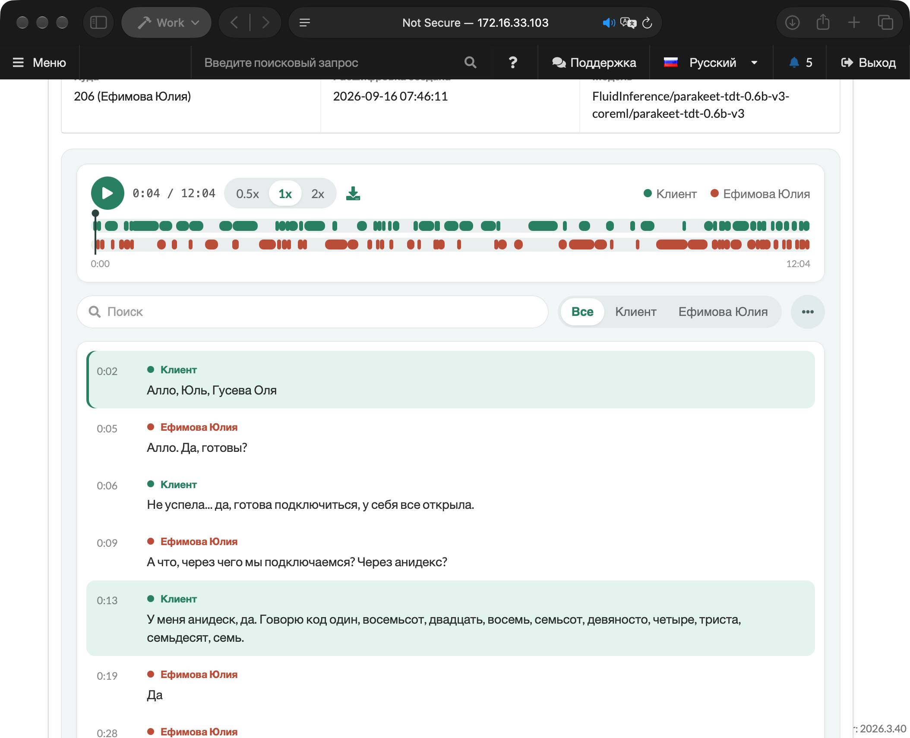
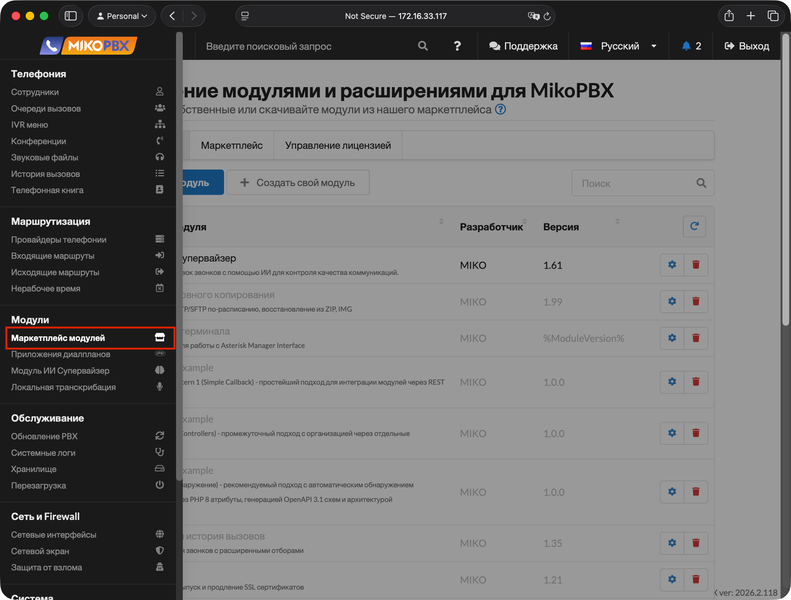
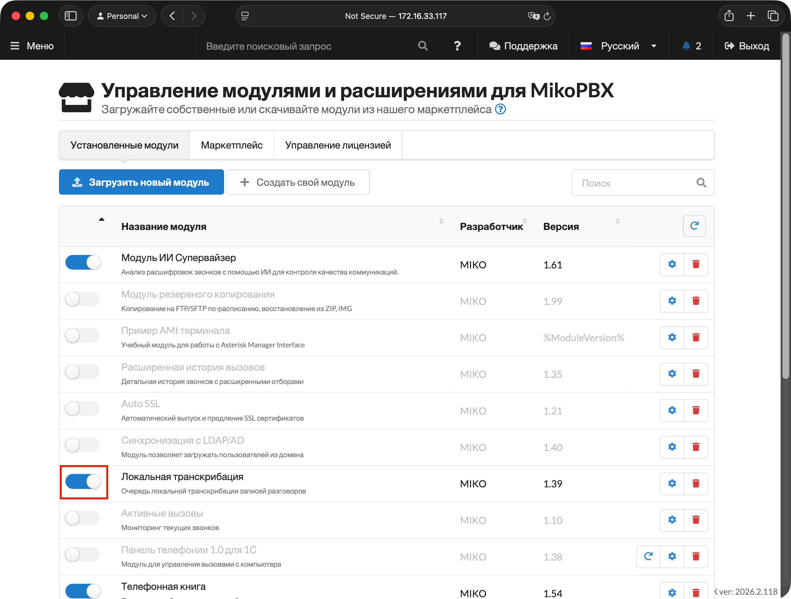
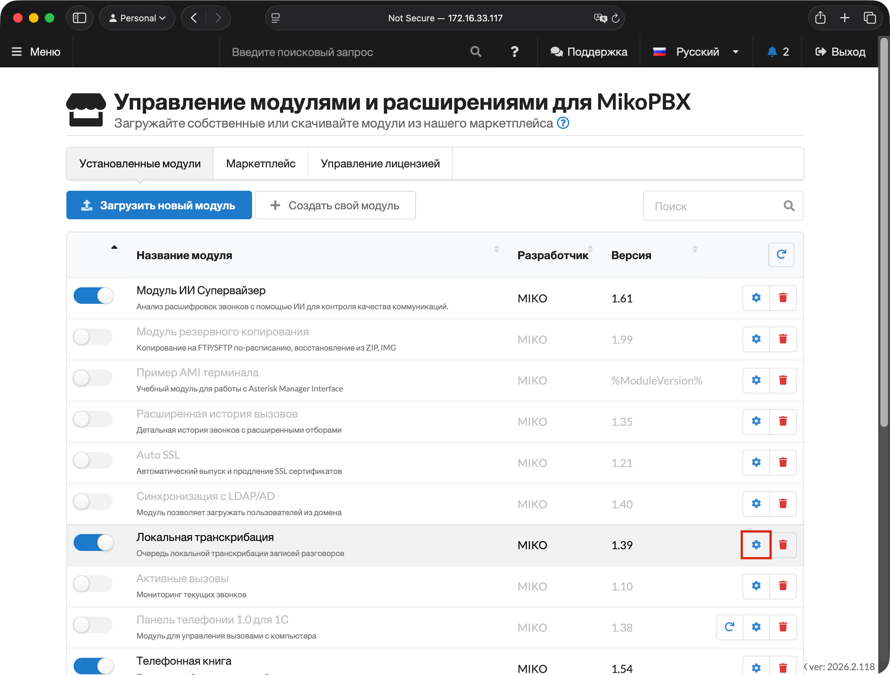
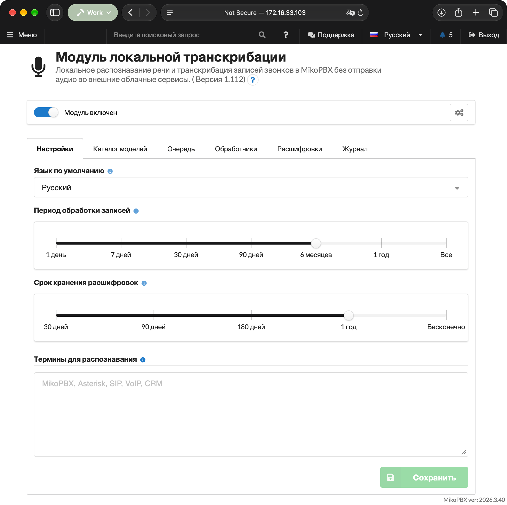
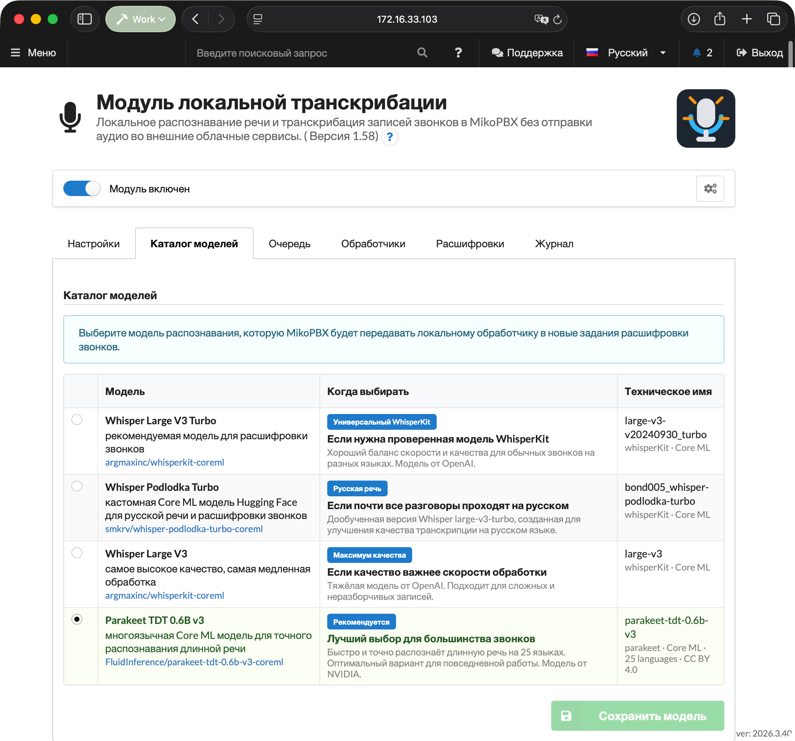
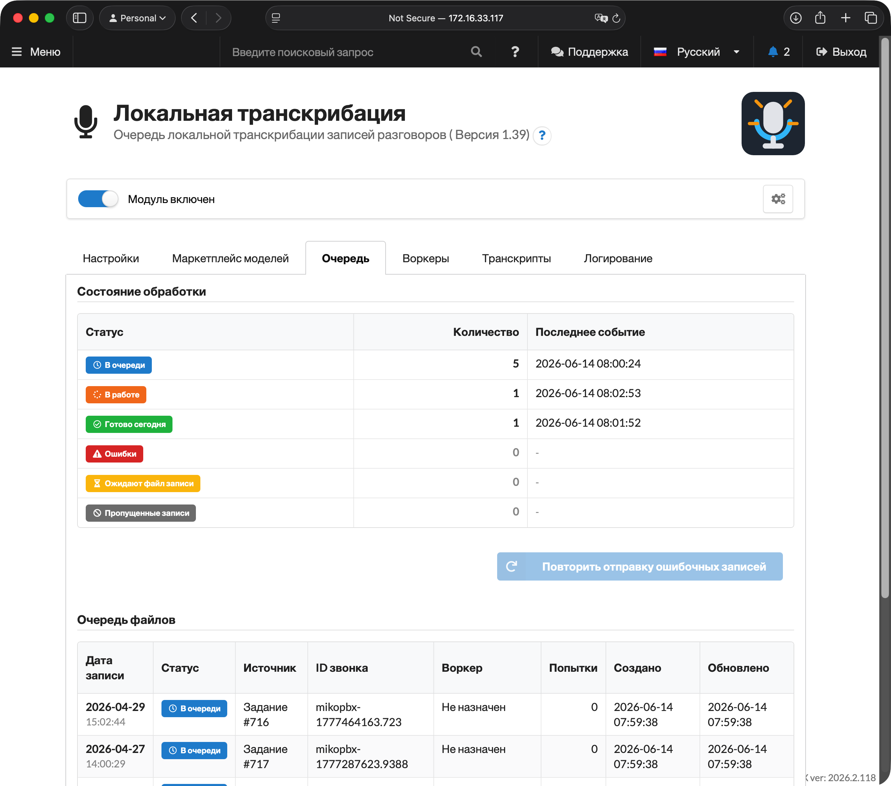
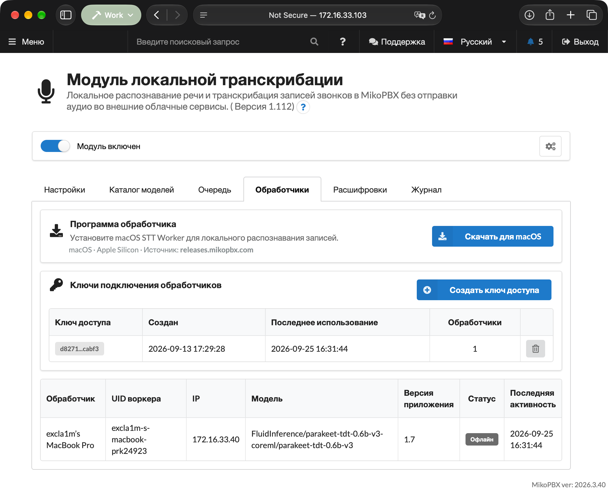
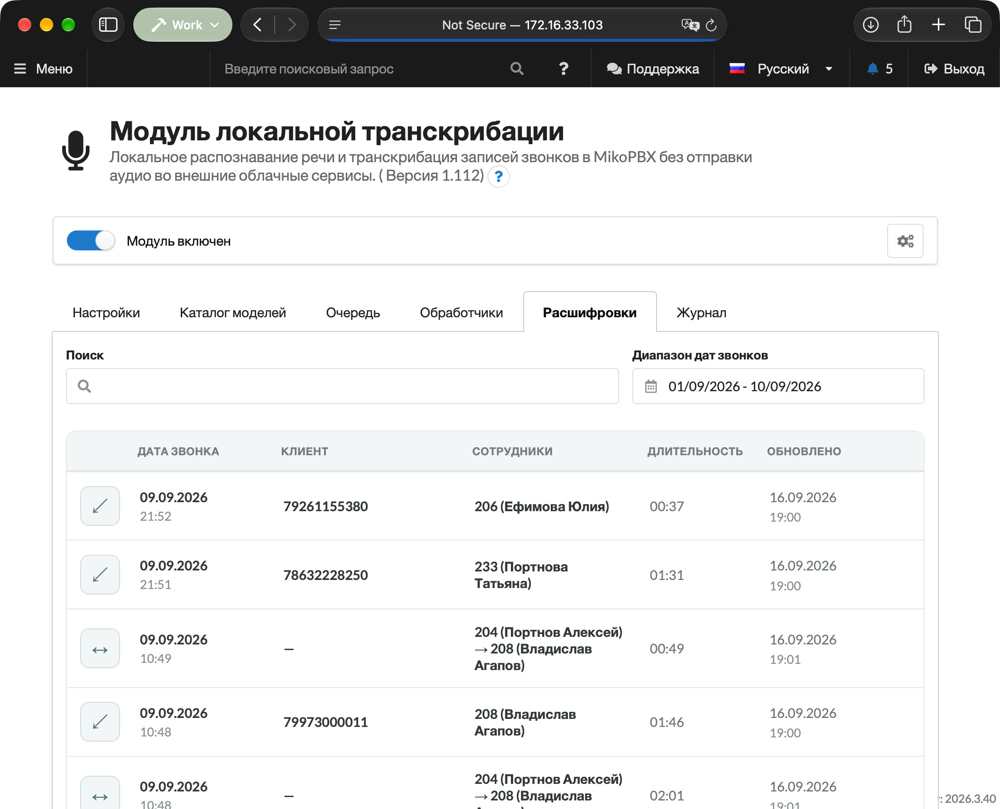
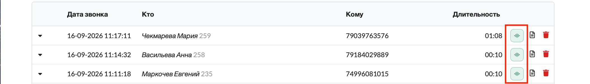

# Локальная транскрибация

**Модуль локальной транскрибации** распознает речь в записанных звонках MikoPBX и сохраняет готовую расшифровку как диалог. Аудиофайлы не отправляются во внешние облачные сервисы: PBX создает очередь заданий, а отдельный **обработчик** скачивает назначенную запись, распознает ее локально выбранной в MikoPBX моделью и отправляет результат обратно в MikoPBX.


PBX-модуль работает внутри MikoPBX, а распознавание выполняет обработчик на отдельном компьютере или сервере. Обработчик бывает двух видов: приложение для Mac и Docker-контейнер. Сравнение приведено в разделе **Виды обработчиков** ниже.


<figure><figcaption>
Пример результата транскрибации
</figcaption></figure>

### Виды обработчиков

| | **Local STT Worker для macOS** | **Docker-обработчик** |
| --- | --- | --- |
| Где работает | Mac на Apple Silicon (M1 и новее), macOS 14 или новее | Linux-сервер или Mac с Docker, x86_64 или arm64 |
| Как устанавливается | Приложение, кнопка **Скачать для macOS** на вкладке **Обработчики** | Образ [`excla1m/mikopbx-stt-worker`](https://hub.docker.com/r/excla1m/mikopbx-stt-worker) из Docker Hub |
| Модели | Parakeet и Whisper на Core ML с ускорением Apple | GigaAM v3, GigaAM Multilingual, T-one, Parakeet и Whisper Turbo на CPU |
| Когда выбирать | Есть свободный Mac; нужен Whisper с аппаратным ускорением | Есть Linux-сервер или виртуальная машина; основная часть звонков на русском |
| Подробнее | [Local STT Worker](miko-ai-worker.md) | [Docker-обработчик (Linux)](docker-worker.md) |

Вид обработчика определяется платформой модели, выбранной на вкладке **Каталог моделей**: **macOS** или **Linux (Docker)**. Задания получают только обработчики выбранной платформы, поэтому в каждый момент на станции работает один вид. Обработчики другой платформы остаются подключенными, но ждут, пока будет выбрана их модель.

### Как проходит обработка

1. Звонок завершается, и MikoPBX сохраняет запись разговора.
2. Фоновый процесс модуля находит запись и создает задание.
3. Обработчик получает lease задания.
4. PBX отдает назначенному обработчику файл записи.
5. Обработчик подготавливает аудио, запускает указанные в задании движок и модель, затем формирует сегменты расшифровки.
6. Модуль фильтрует результат, сохраняет расшифровку и публикует событие для интеграций.

Если обработчик перестает продлевать lease, задание возвращается в очередь. На одно задание отводится до трех попыток обработки, после чего оно попадает в статус **Ошибки**.

### Требования и совместимость

* MikoPBX **2025.1.1** или новее.
* Обработчик одного из видов:
  * **macOS:** Mac на Apple Silicon, macOS **14.0** или новее, от 8 ГБ памяти, около 5 ГБ на диске для моделей;
  * **Docker:** Linux-сервер или Mac с Docker 20.10 или новее, x86_64 или arm64, от 4 ядер, от 8 ГБ памяти, около 10 ГБ на диске для образа и моделей.
* Включенная запись разговоров для нужных маршрутов, очередей или сотрудников.
* Сетевой доступ от обработчика к веб-интерфейсу MikoPBX. Веб-интерфейс необходимо открывать по HTTPS: при подключении по HTTP созданный ключ доступа не показывается.
* Интернет при первой загрузке выбранной модели и ее служебных файлов. После загрузки модели для обработки достаточно доступа к PBX.

### Установка модуля

1. Откройте веб-интерфейс MikoPBX.
2. Перейдите в раздел **Модули** → **Маркетплейс модулей**.

<figure><figcaption>
Маркетплейс модулей
</figcaption></figure>

3. Найдите **Модуль локальной транскрибации** и установите его.
4. Откройте список установленных модулей и включите модуль.

<figure><figcaption>
Включение модуля
</figcaption></figure>

5. Нажмите кнопку настроек справа от версии модуля.

<figure><figcaption>
Переход на страницу модуля
</figcaption></figure>

### Вкладка «Настройки»

| Настройка                     | По умолчанию             | Назначение                                                                                                       |
| ----------------------------- | ------------------------ | ---------------------------------------------------------------------------------------------------------------- |
| **Язык по умолчанию**         | Определять автоматически | Языковая подсказка для движка распознавания. В автоматическом режиме язык звонка определяется при распознавании. |
| **Период обработки записей**  | `30 дней`                | За какой период искать завершенные звонки с записью: 1 день, 7, 30, 90 дней, 6 месяцев, 1 год или все записи.    |
| **Срок хранения расшифровок** | `1 год`                  | Через сколько удалять результаты транскрибации: 30, 90, 180 дней, 1 год или бесконечно.                          |
| **Термины для распознавания** | пусто                    | Названия компаний, продуктов, систем и другие слова-подсказки.                                                   |

Период обработки не может превышать срок хранения расшифровок: при конфликте модуль показывает предупреждение и не дает сохранить настройки. Срок хранения отсчитывается от завершения распознавания; CDR и исходные аудиозаписи не удаляются.

Список языков зависит от модели, выбранной на вкладке **Каталог моделей**: для Parakeet доступны только поддерживаемые им языки.


При изменении периода обработки позиция сканирования сбрасывается, чтобы модуль пересмотрел историю в новом диапазоне.


<figure><figcaption>
Раздел настроек модуля
</figcaption></figure>

### Вкладка «Каталог моделей»

Здесь выбирается модель, которую PBX передает в новые задания. Выбор применяется централизованно ко всем обработчикам и отображается в обработчике после синхронизации настроек.

Переключатель платформы над списком моделей выбирает вид обработчика, для которого показываются модели. У каждого вида свой набор моделей; их описание, языки и рекомендации по выбору приведены в разделе **Модели** статьи об обработчике:

* **macOS** - Parakeet и Whisper на Core ML: [Local STT Worker](miko-ai-worker.md);
* **Linux (Docker)** - GigaAM, T-one, Parakeet и Whisper на CPU: [Docker-обработчик (Linux)](docker-worker.md).

После выбора нажмите **Сохранить модель**.

<figure><figcaption>
Выбор модели
</figcaption></figure>

### Вкладка «Очередь»

Блок **Состояние обработки** показывает количество записей в каждом статусе и время последнего события.

| Статус                  | Значение                                                       |
| ----------------------- | -------------------------------------------------------------- |
| **В очереди**           | Задание ждет свободный Worker.                                 |
| **В работе**            | Задание закреплено за Worker действующим lease.                |
| **Готово сегодня**      | Задания, завершенные за текущий день.                          |
| **Ошибки**              | Неуспешные задания, которые можно вернуть в очередь.           |
| **Ожидают файл записи** | CDR найден, но файл еще не появился или недоступен для чтения. |
| **Пропущенные записи**  | Записи, которые не будут обработаны без изменения условий.     |

Кнопка **Повторить отправку ошибочных записей** возвращает в очередь все задания из статуса **Ошибки**.

<figure><figcaption>
Вид очереди в интерфейсе модуля
</figcaption></figure>

### Вкладка «Обработчики»

На этой вкладке скачивается обработчик, создаются ключи доступа и отображаются зарегистрированные обработчики.

#### Программа обработчика

Переключатель в верхней части вкладки выбирает вид обработчика:

* **macOS (Apple Silicon)** - кнопка **Скачать для macOS** загружает Local STT Worker с `releases.mikopbx.com`.
* **Docker** - показывается готовая команда `docker pull` и `docker run` с адресом этой станции. Сразу после создания ключа доступа он подставляется в команду; ее можно скопировать и выполнить на сервере с Docker. Установка с `compose.yaml` для постоянной работы описана в статье [Docker-обработчик (Linux)](docker-worker.md).

#### Ключи подключения обработчиков

Кнопка **Создать ключ доступа** создает новый ключ. Он показывается только один раз, после создания - сразу скопируйте его.

Один ключ не может быть привязан сразу к нескольким `worker_uid`; для нескольких обработчиков создайте отдельные ключи.&#x20;

#### Зарегистрированные обработчики

Таблица обработчиков показывает имя, UID, IP, выбранную в MikoPBX модель, версию обработчика, состояние и последнюю активность. Несовместимый обработчик отображается офлайн. Пока ни один обработчик не зарегистрирован, над таблицей выводится подсказка **Как подключить обработчик** из трех шагов.

<figure><figcaption>
Вкладка обработчиков
</figcaption></figure>

### Вкладка «Расшифровки»

Список можно фильтровать по диапазону дат звонков и искать по тексту расшифровок. \\. Нажатие на строку открывает диалог.

<figure><figcaption>
УСТАРЕЛО. Список расшифровок
</figcaption></figure>

#### Карточка диалога

Нажатие на реплику или на шкалу переводит проигрыватель к соответствующему моменту.

Меню действий в карточке позволяет **Скачать TXT**, **Скачать JSON** и **Удалить транскрипт**. При удалении требуется подтверждение: удаляются расшифровка и связанные данные модуля, а CDR MikoPBX и исходная запись разговора сохраняются.

<figure><figcaption>
УСТАРЕЛО. Вид карточки расшифровки
</figcaption></figure>

### Расшифровка в истории звонков

Модуль добавляет в раздел **История звонков** MikoPBX кнопку **Показать расшифровку** для звонков с готовой расшифровкой.

<figure><figcaption>
Кнопка для открытия расшифровки из журнала CDR
</figcaption></figure>

### Вкладка «Журнал»

Журнал содержит структурированные технические события модуля и обработчиков без расшифровок, аудиозаписей и секретов.

### Права доступа

При использовании модуля управления доступом пользователей (ModuleUsersUI) для модуля локальной транскрибации доступны отдельные права:

| Право                                                     | Что открывает                                                                      |
| --------------------------------------------------------- | ---------------------------------------------------------------------------------- |
| **Просмотр расшифровок и записей звонков**                | Вкладка **Расшифровки**, карточка диалога, экспорт, расшифровка в истории звонков. |
| **Удаление транскриптов**                                 | Действие **Удалить транскрипт** в карточке диалога.                                |
| **Управление настройками модуля**                         | Вкладки **Настройки** и **Каталог моделей**.                                       |
| **Подключение обработчиков, просмотр очереди и журналов** | Вкладки **Очередь**, **Обработчики** и **Журнал**.                                 |

Вкладки, на которые у пользователя нет прав, не отображаются. REST API модуля через эти права не открывается.
