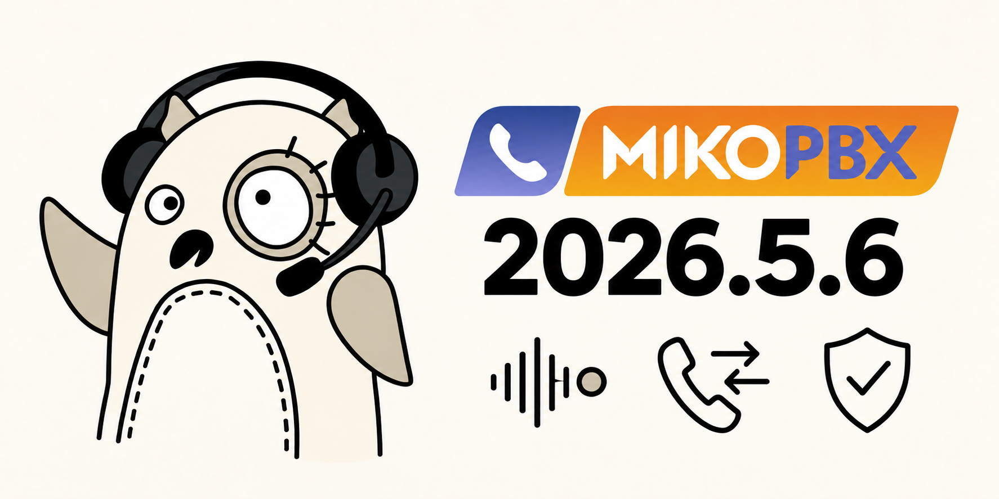
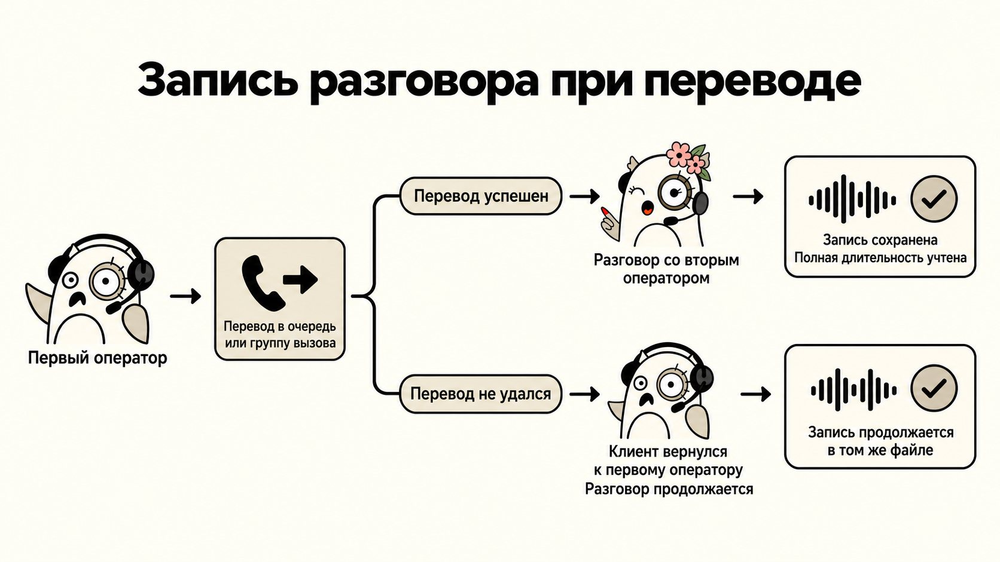
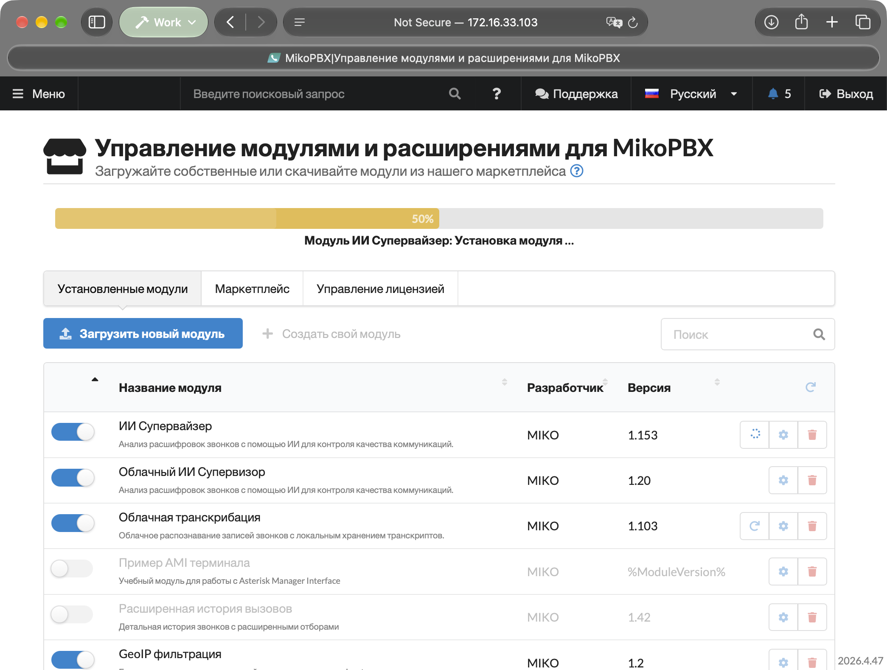

# MikoPBX 2026.5.6

Выпуск MikoPBX 2026.5.6 делает надёжнее запись разговоров, переводы и перехват вызовов. Улучшена работа модулей и интеграций, усилена защита станции. Веб-интерфейс стал удобнее, а изменения сетевых настроек и обновление системы - стабильнее.

<figure><figcaption></figcaption></figure>

### Записи разговоров и история вызовов

Если сопровождаемый перевод на очередь или группу вызова не удался и звонок вернулся к оператору, запись разговора продолжается в том же файле. Ранее вторая часть разговора могла остаться без записи.

При успешном переводе на очередь уход переводящего сотрудника больше не обрывает учёт разговора. В истории сохраняются запись и полная длительность общения с ответившим сотрудником. Исправлены случаи, когда завершённые звонки продолжали отображаться как незавершённые.

<figure><figcaption></figcaption></figure>

Восстановлена запись разговоров в отдельных сценариях перехвата и умной маршрутизации Smart IVR. При перехвате через `*8` или супервизором история показывает имя сотрудника, который действительно принял звонок, и правильную длительность разговора.

Записи конференций снова доступны из истории вызовов: исправлены ссылки, которые раньше могли вести на отсутствующий файл.

При скачивании записи отображаются ход загрузки, скорость и примерное оставшееся время. Это особенно удобно для длинных разговоров и медленных соединений.

<figure><figcaption><p>Статус загрузки записи звонка</p></figcaption></figure>

В стереозаписи добавлены сведения о том, какому участнику принадлежит каждая аудиодорожка. Это помогает системам транскрибации и CRM правильно различать речь сотрудника и клиента во входящих и исходящих звонках.

### Маршрутизация, очереди и IVR

Исправлено смешивание входящих маршрутов для провайдеров с входящей регистрацией на одном сервере. Звонки обрабатываются по настройкам своей учётной записи.

Реальный номер звонящего теперь определяется и для вызовов в нерабочее время. Он корректно передаётся в историю и интеграции, даже если звонок завершился прослушиванием объявления. При изменении источника номера сохраняется переданное провайдером имя абонента.

В списках переадресации восстановлено отображение номеров модулей. Их снова можно выбирать во входящих маршрутах, очередях и других настройках направления звонков.

Очередь без сотрудников можно сохранить, если задано направление для звонков в пустую очередь. Без такого направления форма сообщит об ошибке. IVR-меню без выбранного приветствия больше не воспроизводит случайный звуковой файл.

### Работа с модулями

После установки или обновления включённого модуля его изменения применяются без перезагрузки станции. Это работает и при повторной установке той же версии. Устранены случаи, когда включение или выключение модуля не полностью применялось к работающим службам.

Повышена надёжность длительных операций с модулями. Индикатор установки показывает текущий этап и больше не исчезает сразу после запуска операции или не замирает из-за ошибки интерфейса.

<figure><figcaption><p>Процесс обновления модуля</p></figcaption></figure>

В системном журнале теперь можно узнать, кто запустил установку, удаление, включение или выключение модуля. При массовом обновлении сведения об инициаторе сохраняются для каждого модуля.


```log
026-10-02 11:40:18 daemon.warning php.backend[20047]:  Module operation started: {"operation":"install_package","module":"2295928-ModuleCloudAISupervisor120zip","user":"admin","ip":"172.16.33.40","operationId":"cd2bc2586ef6bea12d6b603c"} on MikoPBX\PBXCoreREST\Lib\ModulesManagementProcessor
```


### Безопасность и доступ

В облачных установках со стандартным паролем администратора после входа требуется сменить пароль. Веб-интерфейс направляет на вкладку паролей в общих настройках, пока стандартный пароль не заменён.

Усилена защита настроек телефонии, загрузки звуковых файлов, импорта сотрудников и снятия блокировок. Закрыты возможности использовать некорректные параметры для выполнения посторонних команд или доступа к файлам станции. Служебные интерфейсы, предназначенные для внутренней работы, больше не доступны из сети по умолчанию.

Защита от взлома больше не блокирует администратора из-за кратковременного сбоя внутренних служб или отсутствующей картинки на странице. Проверки подозрительных запросов сохраняются.

После окончания сессии браузер возвращается к форме входа. Отказ в доступе к отдельной функции больше не вызывает выход из действующей сессии. Для пользователей с ограниченными правами учитывается настроенная домашняя страница, а на странице отказа в доступе можно выйти из системы и войти под другой учётной записью.

В настройках SSH можно добавлять ключи аппаратных FIDO-устройств. Исправлена оценка длинных случайно сгенерированных SIP-паролей: они больше не отклоняются как слабые из-за короткой последовательности символов внутри пароля.

### Сеть, хранилище и обновление

Изменение настроек IPv6 больше не сбрасывает соединение по IPv4. Веб-интерфейс, открытый по IPv4, остаётся доступным при сохранении таких изменений.

На старых установках с отдельным диском хранилища исправлено его подключение после изменения порядка дисков. Станция больше не подставляет системный раздел вместо отсутствующего настроенного хранилища.

Восстановлена загрузка образов обновления из macOS. Также исправлены отдельные ошибки загрузки файлов частями.

### Удобство веб-интерфейса

Длинные имена абонентов и названия IVR-меню больше не растягивают таблицы за пределы экрана. Кнопки действий остаются видимыми, а полное имя можно прочитать при наведении.

Восстановлены поиск и сортировка на странице нерабочего времени. Поиск в верхнем меню больше не открывает список самопроизвольно.

Для сотрудников можно использовать внутренние номера длиной до 11 цифр. В общих настройках облачной станции исправлено отображение описания стандартного пароля.

### Стабильность станции и интеграций

Станция лучше восстанавливает служебные соединения с телефонией после обрывов. Добавлено автоматическое отключение подтверждённо зависших локальных соединений, мешающих получению событий звонков. Внешние подключения интеграций этим механизмом не отключаются.

Изменения настроек применяются после их успешного сохранения. Обновление конфигурации веб-сервера сохраняет открытые соединения. Снижены расход памяти при проверке паролей и нагрузка при обработке большого количества вызовов.

Восстановлена совместимость скачивания файлов со старыми модулями. Для разработчиков интеграций изменён способ сохранения звуковых файлов через REST API: вместо поля `path` нужно передавать `conversion_id`, полученный после конвертации. Обычная загрузка звуков через веб-интерфейс учитывает это автоматически.

В консольном меню лишнее нажатие Enter после выбора пункта больше не закрывает следующий экран и не подтверждает выбор диска автоматически.
