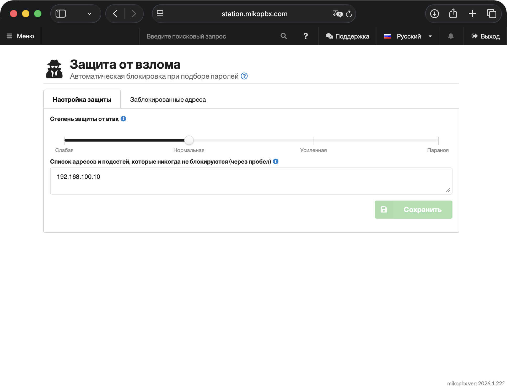

# Обеспечение безопасности MikoPBX

В последнее время участились случаи взлома IP-АТС. Злоумышленники получают доступ к телефонии и совершают звонки за ваш счёт — на платные номера и международные направления. Это может привести к потерям в десятки и сотни тысяч рублей за считанные часы.

Кроме прямых финансовых потерь, взломанная АТС может использоваться мошенниками для звонков от имени вашей организации — например, для обзвона граждан якобы от лица банков или государственных органов. При этом у жертв отображается номер вашей компании, что ведёт к репутационному ущербу и возможным проверкам со стороны правоохранительных органов.

Пройдитесь по всем пунктам этой инструкции — даже если вы уже настраивали систему, возможно, что-то было упущено.


**Критическая уязвимость в версии 2024.1.114!**

Обнаружена уязвимость в модуле внешней панели: если модуль опубликован в интернет или Firewall настроен некорректно, злоумышленник может получить все SIP-учётки и совершать звонки от имени Вашей компании.

Необходимо выполнить следующие шаги:

1. Обновиться до версии **2026.1.223** или новее.
2. Установить патч безопасности (см. ниже).
3. Закрыть WEB, CTI и SIP-доступ к станции из2вне.
4. Обновить все пароли.


### Патч безопасности для версии 2024.1.114

Если вы используете версию 2024.1.114, установите патч одной командой:

```bash
curl -L 'https://files.miko.ru/s/DPZcM2vywc2BTOZ/download' | sh
```

Подробные инструкции: [Патч 2024.1.114](../other/patchi-oshibok/2024.1.114/)


Если вы используете более старую версию — обновитесь до актуального релиза. Шаги 3 и 4 из списка выше необходимо выполнить в любом случае, независимо от версии.


***

### Обязательные меры безопасности

#### Включите сетевой экран (Firewall)

Сетевой экран — первая линия защиты. Он ограничивает, кто может подключаться к вашей АТС.

Перейдите в раздел **«Сеть и Firewall» → «Сетевой экран»**, убедитесь что переключатель активирован и создайте правила, разрешающие доступ только из нужных подсетей.

Какие адреса добавить в правила:

* Подсеть вашего офиса
* Адреса VPN-сервера
* Адреса вашего провайдера телефонии (уточните у провайдера)
* Статические IP-адреса удалённых сотрудников


Для удалённых сотрудников с динамическим IP рекомендуем подключить у их интернет-провайдера услугу статического IP-адреса (обычно 100–200 ₽/мес). Альтернатива — VPN: все удалённые сотрудники подключаются через VPN-сервер, и в Firewall добавляется только его адрес.


Подробная инструкция:


[firewall.md](../manual/connectivity/firewall.md)


#### Закройте веб-интерфейс и CTI от интернета

Панель управления АТС — это «ключи от всей системы». Если она доступна из интернета без ограничений, злоумышленник может получить полный контроль над телефонией.

В правилах сетевого экрана разрешите WEB и CTI-доступ только для подсети вашего офиса или VPN. Для всех остальных правил отключите галочки **WEB** и **CTI**. Если вам нужен удалённый доступ — используйте VPN.

#### Используйте сложные пароли

Простой пароль — самая частая причина взлома. Злоумышленники перебирают тысячи комбинаций в секунду, и пароли вроде `1234`, `admin` или `password` подбираются мгновенно.

Требования к паролям SIP-аккаунтов и веб-интерфейса:

* Минимум **12 символов**
* Буквы **ВЕРХНЕГО** и нижнего регистра
* Цифры и специальные символы (`!@#$%^&*`)
* Без словарных слов, имён и дат рождения

Что проверить:

* Откройте карточку каждого сотрудника в разделе **«Телефония» → «Сотрудники»** и убедитесь, что SIP-пароль достаточно сложный
* Проверьте пароль для входа в веб-интерфейс в разделе **«Система» → «Общие настройки» → «Пароль WEB интерфейса»**

#### **Измените имя авторизации (Auth Username)**

По умолчанию для SIP-авторизации используется внутренний номер сотрудника (например, `204`). Злоумышленники это знают и перебирают именно стандартные номера.

**Auth Username** — это имя пользователя, которое телефон или софтфон отправляет при регистрации на АТС. Оно отличается от внутреннего номера и используется исключительно для проверки подлинности подключения.

Как настроить префикс Auth Username в MikoPBX:

Перейдите в **«Система» → «Общие настройки» → «SIP»** и заполните поле **«Префикс Auth Username для авторизации»**. Например, при префиксе `MIKO` внутренний номер `204` будет авторизоваться как `204MIKO`.

После изменения Auth Username необходимо обновить настройки на каждом телефоне или софтфоне. В зависимости от производителя, настройка называется по-разному:

| Производитель | Название настройки                   |
| ------------- | ------------------------------------ |
| Yealink       | Register Name / Authentication User  |
| Grandstream   | Authenticate ID                      |
| Fanvil        | Authentication User                  |
| Snom          | Authentication Username              |
| Linphone      | Auth userid                          |
| Zoiper        | Authentication user / Auth. Username |
| MicroSIP      | Login                                |
| Cisco (SPA)   | Auth ID                              |

Обычно эта настройка находится в разделе **Account** или **SIP Account** в веб-интерфейсе телефона.

#### Включите защиту от перебора паролей (Fail2Ban)

Fail2Ban автоматически блокирует IP-адреса, с которых идут подозрительные попытки подключения.

Перейдите в раздел **«Сеть и Firewall» → «Защита от взлома»** и проверьте указанную степень защиты от атак:

* Слабая — 20 попыток за 10 мин, бан на 10 мин. Для первой настройки и доверенных сетей.
* Нормальная — 10 попыток за 1 час, бан на 1 день. Рекомендуется для большинства.
* Усиленная — 5 попыток за 6 часов, бан на 7 дней. Для серверов в интернете.
* Паранойя — 3 попытки за 24 часа, бан на 30 дней. Для серверов под активной атакой.


Убедитесь, что в белом списке указаны адреса вашего офиса, чтобы случайно не заблокировать себя.

Fail2Ban не заменяет сложные пароли — даже с включённым Fail2Ban простой пароль может быть подобран.


<figure><figcaption><p>Раздел "Защита от взлома"</p></figcaption></figure>

#### Защита веб-интерфейса в Docker

* **Docker-развёртывание**: при использовании bridge-режима внутренние правила файрвола и fail2ban не защищают веб-интерфейс. Настройте [внешний firewall-bouncer](external-firewall-enforcement.md) или переключите контейнер в `network_mode: host`.

#### Не публикуйте АТС на публичном IP-адресе

Если АТС доступна напрямую из интернета — она становится мишенью для автоматических сканеров, которые круглосуточно ищут уязвимые системы.

* Разместите АТС за NAT-маршрутизатором
* Для удалённых сотрудников используйте VPN-подключение
* Если публичный IP неизбежен — обязательно настройте сетевой экран и Fail2Ban
* В разделе **«Сеть и Firewall» → «Сетевые интерфейсы»** правильно укажите топологию сети и внешний адрес. (Подробнее читайте [в этой статье](../manual/connectivity/network.md)).

***

### Финансовая защита

Даже при хорошей технической защите стоит подстраховаться финансово. Если взлом всё-таки произойдёт, эти меры ограничат возможный ущерб.

#### Установите лимит расходов у провайдера

Свяжитесь с вашим провайдером телефонии и попросите:

* Установить суточный лимит расходов на исходящие звонки
* Включить запрет работы при отрицательном балансе
* Заблокировать звонки на международные и платные направления, если вы ими не пользуетесь

#### Не держите на счёте большие суммы

* Пополняйте баланс небольшими суммами по мере необходимости
* Настройте уведомления о расходах у провайдера, если такая возможность есть

***

### Что делать, если взлом уже произошёл?

Если вы обнаружили, что АТС была взломана, действуйте по следующей схеме:

**Шаг 1 — Немедленно изолируйте АТС**

Закройте доступ к станции извне через сетевой экран. Смените все пароли — SIP-аккаунтов, веб-интерфейса, SSH.

**Шаг 2 — Сохраните логи и записи разговоров**

Сохраните файлы записей разговоров и логи системы отдельно — они могут понадобиться как доказательства. Со временем они могут быть перезаписаны.

**Шаг 3 — Уведомите оператора связи**

Свяжитесь с вашим провайдером телефонии и сообщите об инциденте. Оператор может помочь заблокировать дальнейшие звонки и зафиксировать факт взлома.

**Шаг 4 — Подайте заявление в УФСБ**

Обратитесь в территориальное управление ФСБ с заявлением об инциденте в сфере ИТ-безопасности. Кратко опишите что произошло, укажите что звонки совершались без вашего ведома и что вы готовы предоставить логи и записи разговоров.


Обращаться следует именно в УФСБ, а не в МВД — это инцидент в сфере ИТ-безопасности, а не мошенничество с вашей стороны. На месте можно указать, что письменный ответ не требуется.


***

### Чек-лист безопасности

Пройдитесь по этому списку и убедитесь, что все пункты выполнены:

* [ ] Версия MikoPBX обновлена до актуальной
* [ ] Патч безопасности установлен (для версии 2024.1.114)
* [ ] Сетевой экран (Firewall) включён
* [ ] Правила Firewall разрешают доступ только доверенным подсетям
* [ ] Веб-интерфейс и CTI закрыты от доступа из интернета
* [ ] Все SIP-пароли сложные (12+ символов, разный регистр, цифры, спецсимволы)
* [ ] Пароль веб-интерфейса сложный
* [ ] Auth Username изменён (не совпадает с внутренним номером)
* [ ] Fail2Ban включён и настроен
* [ ] АТС расположена за NAT или доступ ограничен через VPN
* [ ] У провайдера телефонии установлен лимит расходов
* [ ] Международные и платные направления заблокированы (если не используются)
* [ ] На балансе провайдера нет лишних средств

***

### Полезные ссылки

* [Сетевой экран](../manual/connectivity/firewall.md) — настройка правил доступа.
* [Защита от взлома (Fail2Ban)](../manual/connectivity/fail2-ban.md).
* [Сетевые интерфейсы](../manual/connectivity/network.md) — настройка сети, NAT, DNS.
* [Статические маршруты](../manual/connectivity/network.md#ruchnaya-nastroika-setevykh-marshrutov) - настройка маршрутов через web-интерфейс.
* [Сотрудники](../manual/telephony/extensions.md) — управление учётными записями и SIP-паролями.
