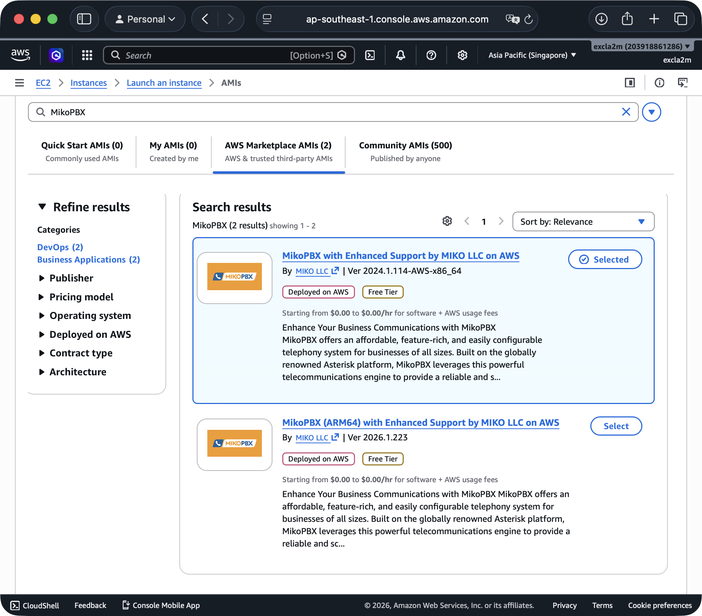
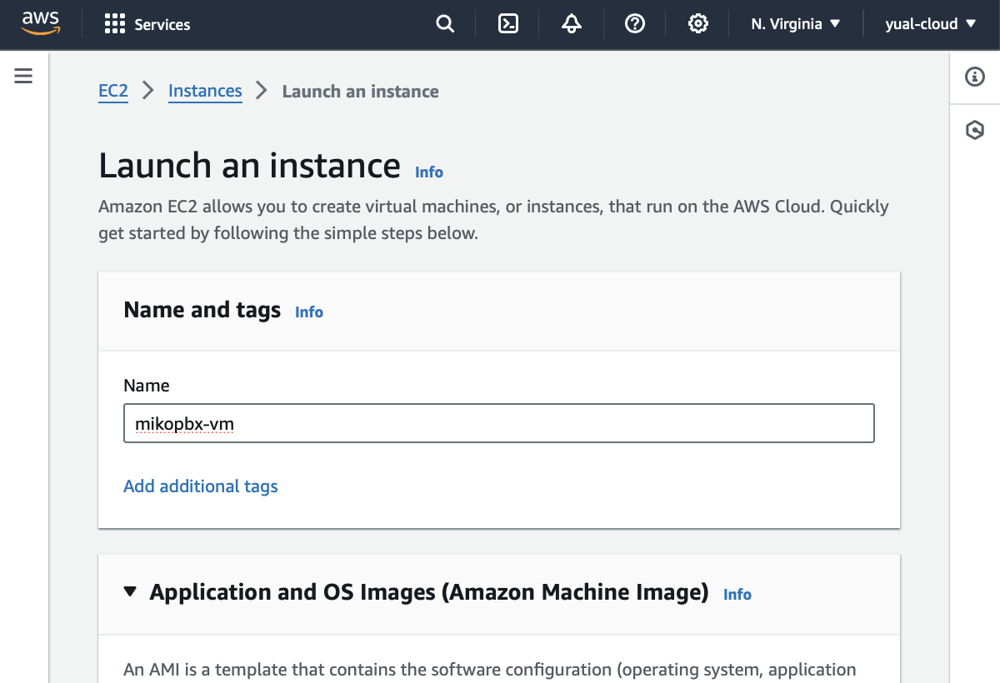
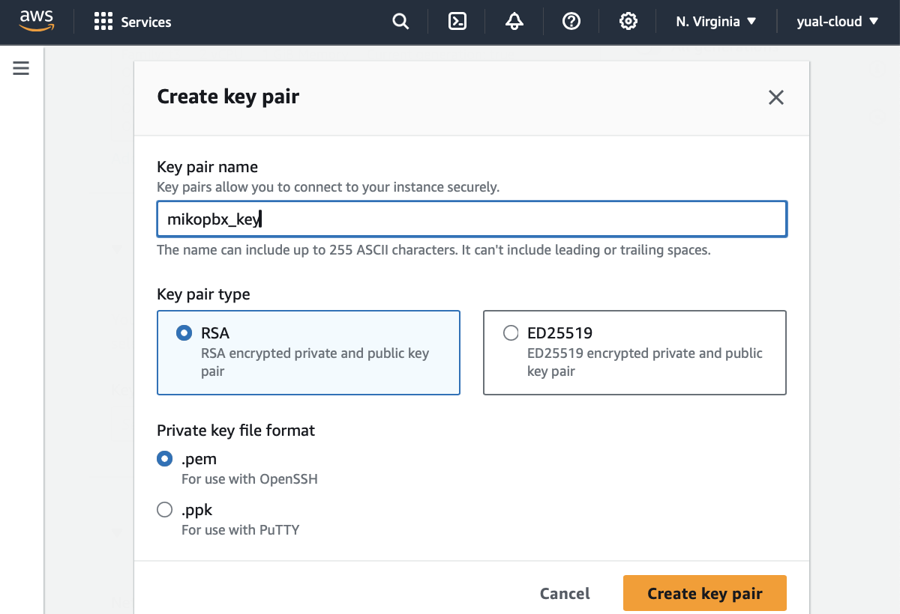
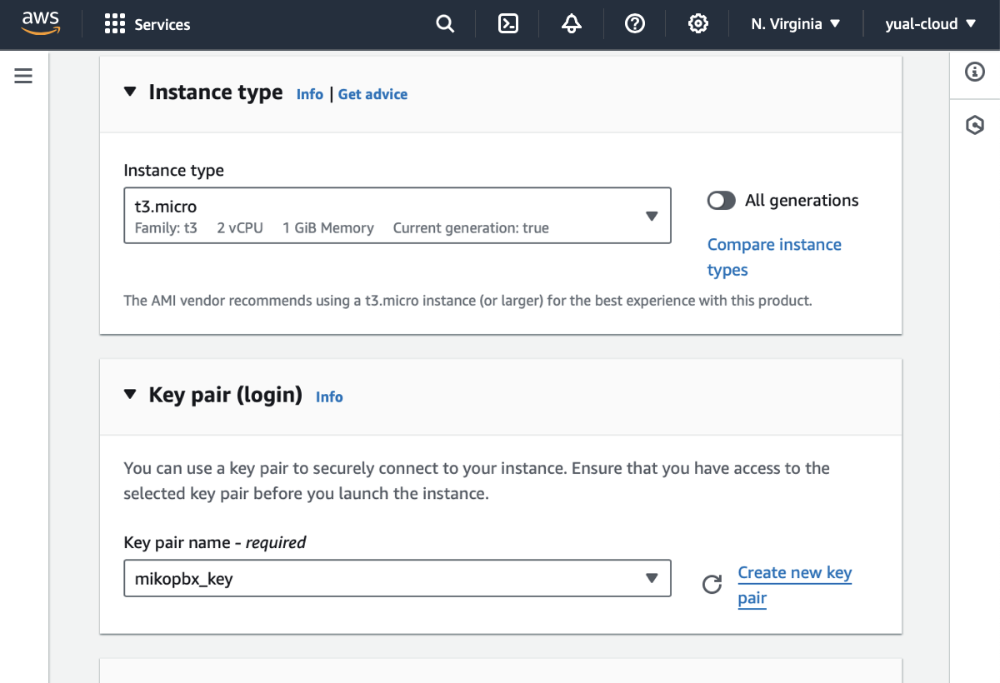
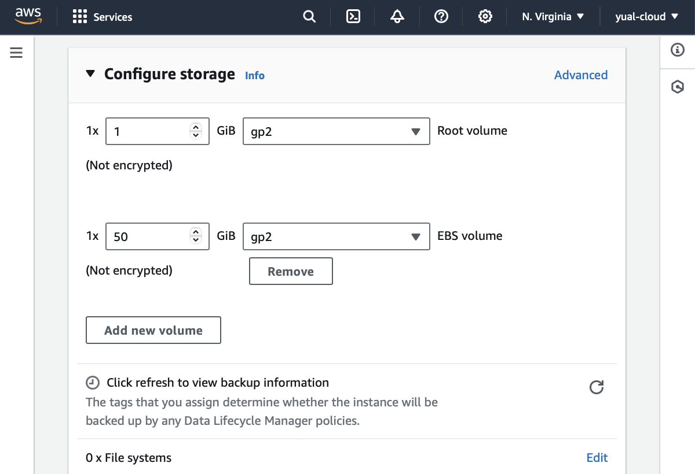
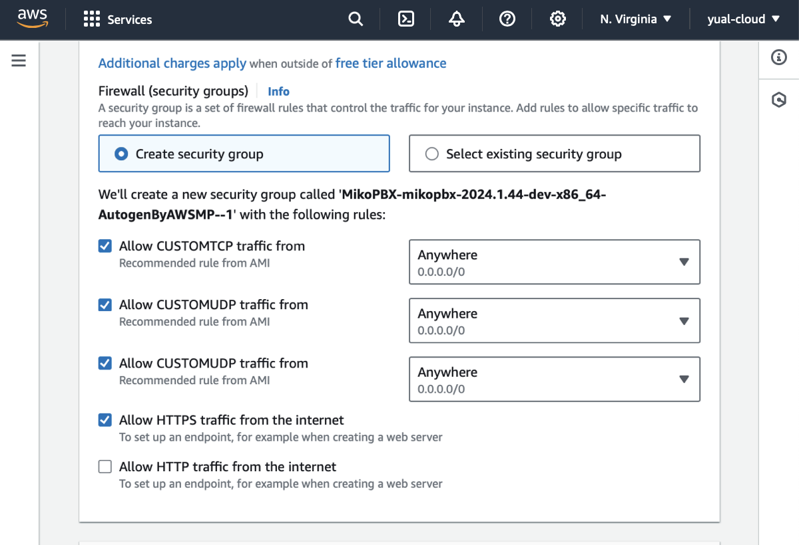
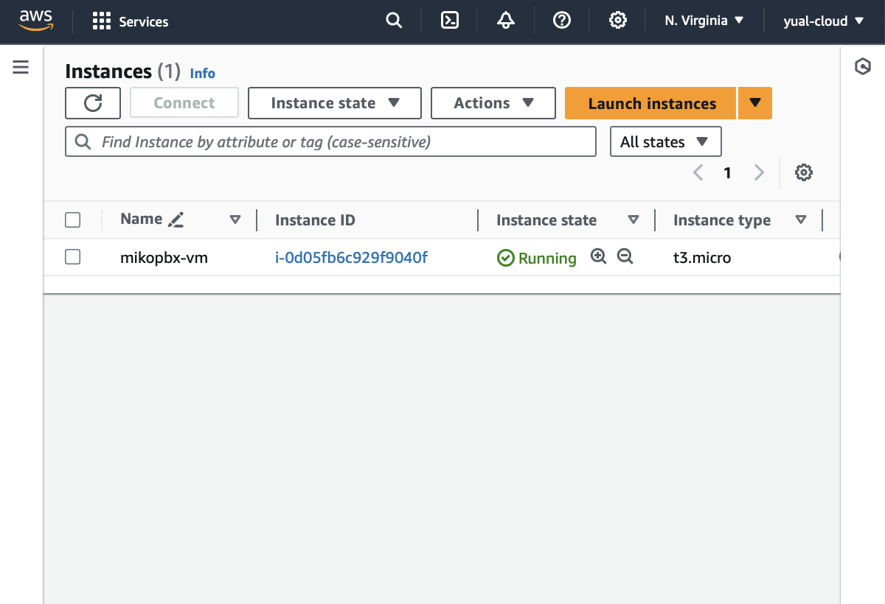
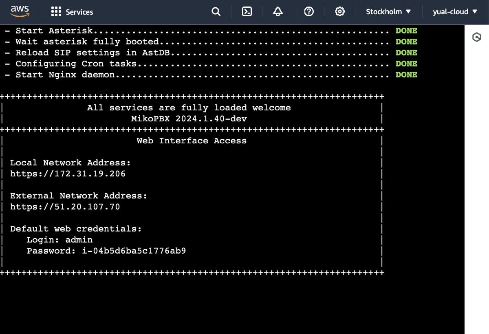
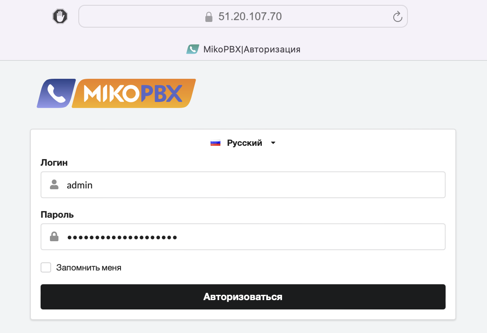

# AWS Маркетплейс

Авторизуйтесь в сервисе Amazon Web Services [https://aws.amazon.com](https://aws.amazon.com/)


MikoPBX в AWS Маркетплейс:

X86: [https://aws.amazon.com/marketplace/pp/prodview-ota6fb2tftuhw](https://aws.amazon.com/marketplace/pp/prodview-ota6fb2tftuhw)

ARM64: [https://aws.amazon.com/marketplace/pp/prodview-nrp2sx3c4kuow](https://aws.amazon.com/marketplace/pp/prodview-nrp2sx3c4kuow?sr=0-1\&ref_=beagle\&applicationId=AWSMPContessa)




Приступим к настройке


Для быстрого и удобного поиска в сервисе Amazon используйте панель поиска


### **Создание виртуальной машины**

1. Откройте Services / Compute / **EC2** и перейдите в раздел Images / AMI Catalog
2. На открытой вкладке в поисковой строке введите **MikoPBX**
3. В разделе AWS Marketplace AMIs выберите образ [MikoPBX](https://aws.amazon.com/marketplace/pp/prodview-ota6fb2tftuhw) (x86 или ARM версию), нажав кнопку **Select**
4. На открытой вкладке нажмите кнопку **Subscribe now**
5. Нажмите кнопку **Launch an instance form AMI** для создания виртуальной машины

<figure><figcaption>
Образы MikoPBX в маркетплейсе AWS
</figcaption></figure>

6. Введите имя виртуальной машины (Name), например _mikopbx-vm_

<figure><figcaption></figcaption></figure>

Если у вас есть ключ SSH, выполните следующее

7. Укажите SSH ключ в поле Key pair

Если у вас есть нет ключа SSH, выполните следующее

7. Выберите **Create new key pair** и укажите имя пары ключей (Key pair name), например _mikopbx\_key_

<figure><figcaption></figcaption></figure>

<figure><figcaption></figcaption></figure>

Следуйте дальше по инструкции


Для развертывания АТС используйте **два** диска:

* диск объемом **1 Гб** для основной системы
* диск объемом **50+ Гб** для хранения записей разговоров


8. При необходимости измените размер диска для хранения данных в разделе Configure storage, по умолчанию его размер - 50Гб

<figure><figcaption></figcaption></figure>

9. В разделе Network settings все необходимые правила Firewall настраиваются автоматически

<figure><figcaption></figcaption></figure>

10. Для других полей используйте значения по умолчанию
11. Нажмите кнопку **Launch instance**

<figure><figcaption></figcaption></figure>

### **Запуск АТС MikoPBX**

1. Перейдите к созданной виртуальной машине _mikopbx-vm_
2. На открытой вкладке выберите Connect / EC2 serial console, дождитесь полной загрузки системы, пока не отобразятся параметры авторизации

<figure><figcaption></figcaption></figure>

3. Скопируйте внешний адрес созданной виртуальной машины и введите его в строке браузера
4. Для входа используйте указанные в EC2 serial console логин и пароль

<figure><figcaption></figcaption></figure>


Обязательно выполните настройку Firewall на самой АТС MikoPBX

