# UTM



В данной иснтрукции будет произведена установка на UTM. Перед ее началом скачайте файл образа диска с расширением ".iso". Сделать это можно [по ссылке](https://github.com/mikopbx/core/releases).


Данная инструкция актуальна с первого релиза, опубликованного в 2026 году. Протестированно на процессорах Apple Silicon.


## Создание виртуальной машины

1. Перейдите в UTM. Нажмите "Create a New Virtual Machine" для создания новой виртуальной машины.

<figure><figcaption>
Главная страница UTM. Создание новой виртуальной машины.
</figcaption></figure>

2. В качестве типа виртуальной машины выберите "Virtualize".

<figure>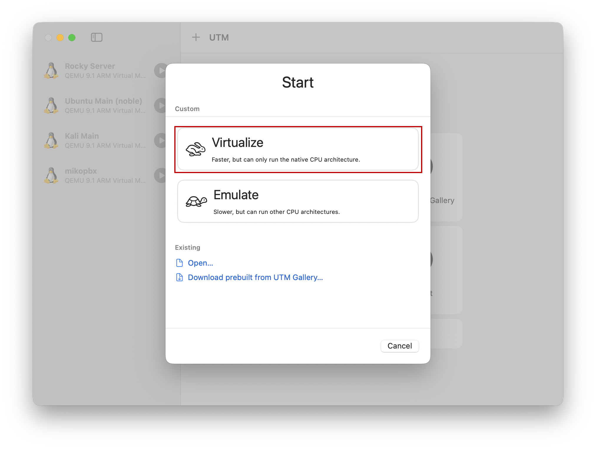<figcaption>
Выбор типа виртуальной машины
</figcaption></figure>

3. В качестве типа операционной системы выберите "Preconfigured" - "Linux".

<figure><figcaption>
Выбор типа операционной системы
</figcaption></figure>

4. Выберите ранее загруженный файл образа диска в разделе "Boot ISO Image". Для этого нажмите на "Browse...".

<figure><figcaption>
Выбор файла образа диска для виртуальной машины
</figcaption></figure>

5. Далее укажите характеристики Вашей виртуальной машины. В нашем случае будут использованы 2 ГБ ОЗУ и 2 ядра процессора.

<figure>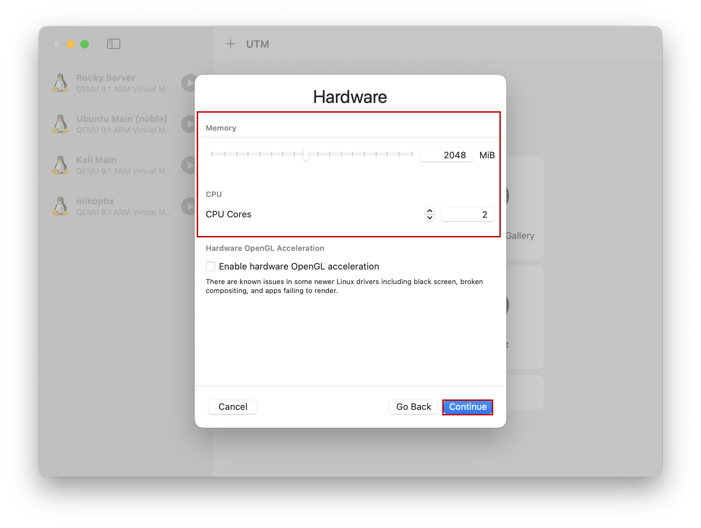<figcaption>
Конфигурация ВМ
</figcaption></figure>

6. Далее укажите размер для системного диска. В нашем случае - 1 Гб.


В MikoPBX используются два диска:

1. Системный диск. На него устанавливается система, рекомендуемый размер - 1 Гб.
2. Диск для хранения записей разговоров. Рекомендуемый размер - от 50 Гб.


<figure>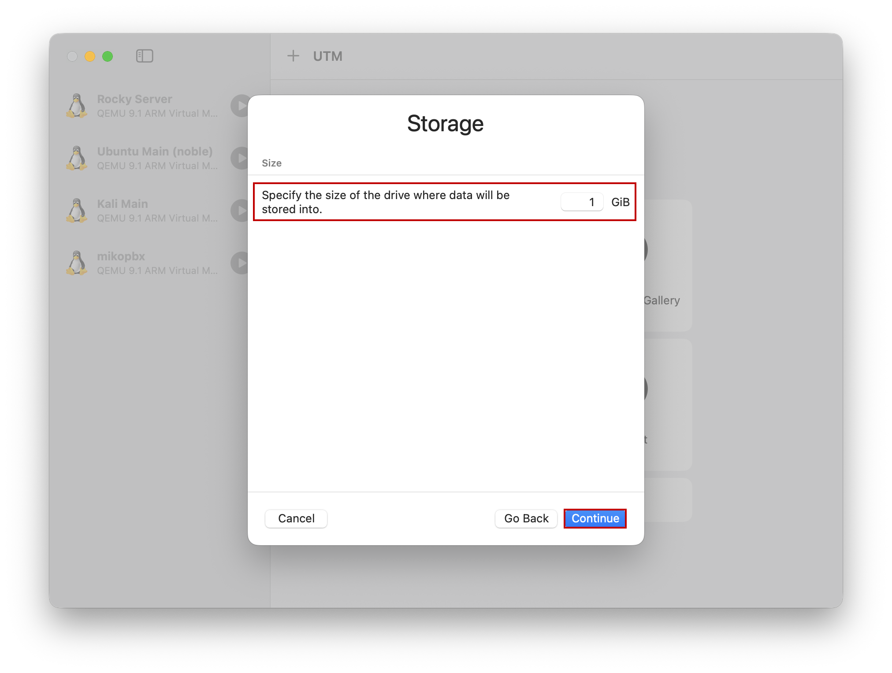<figcaption>
Указание размера системного диска
</figcaption></figure>

7. Нажмите Continue.

<figure><figcaption>
Раздел "Shared Directory"
</figcaption></figure>

8. Будет отображена итоговая конфигурация виртуальной машины. Задайте ей желаемое имя (поле "Name"). И нажмите "Save".

<figure><figcaption>
Итоговая конфигурация
</figcaption></figure>

## Подключение диска для хранения данных

1. Перейдите в настройки ВМ. Для этого нажмите правой кнопкой мыши по её названию, далее "Edit".

<figure>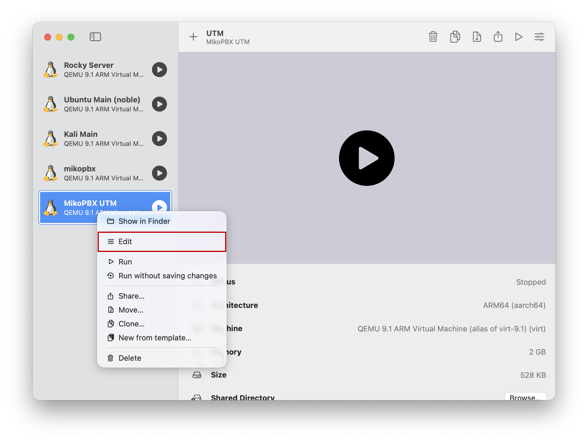<figcaption>
Настройки ВМ
</figcaption></figure>

2. Перейдите в "Drives". Нажмите "New..."

<figure>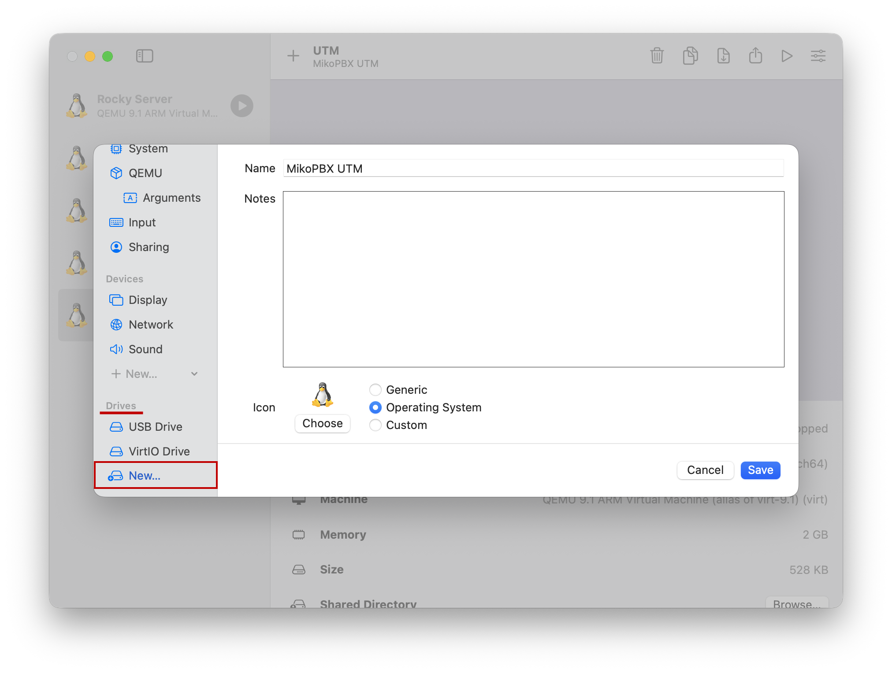<figcaption>
Раздел "Drives"
</figcaption></figure>

3. Создайте новый диск со следующими параметрами:

* **Interface** - VirtlO
* **Size** - не менее 50Гб (в этой документации для тестовой машины будет использовано 10Гб)

Нажмите "Create".

<figure><figcaption>
Создание второго диска
</figcaption></figure>

## Установка системы

1. Запустите виртуальную машину.

<figure>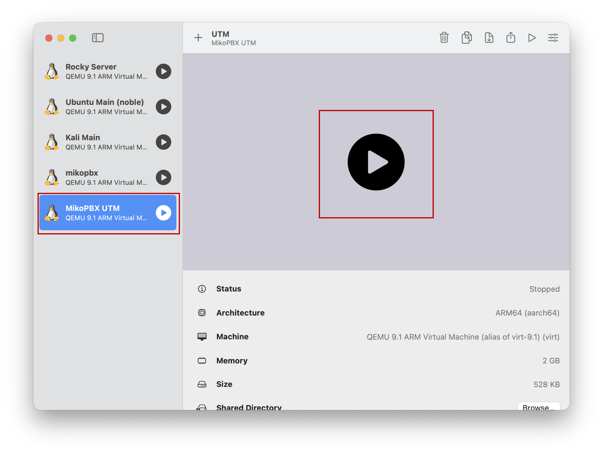<figcaption>
Запуск ВМ
</figcaption></figure>

2. После загрузки Вы увидите надпись <mark style="color:red;">PBX is running in Live or Recovery mode</mark>. Это означает, что система загружена из образа диска в Live режиме. Необходимо произвести установку системы. Для этого перейдите к разделу "\[8] Install on Hard Drive".

<figure>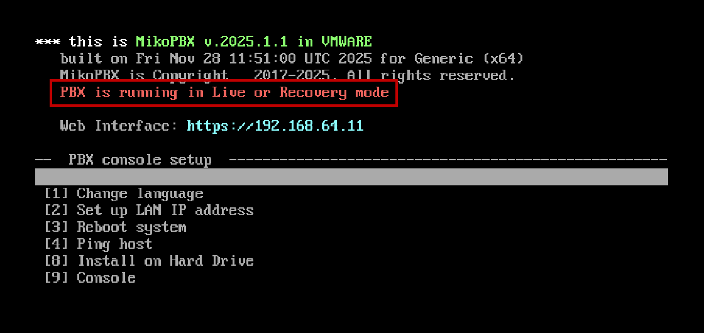<figcaption>
MikoPBX в режиме LiveCD
</figcaption></figure>

3. Выберите диск для установки системы. В нашем случае доступны диски vda и vdb, для установки выбираем диск vda.

<figure>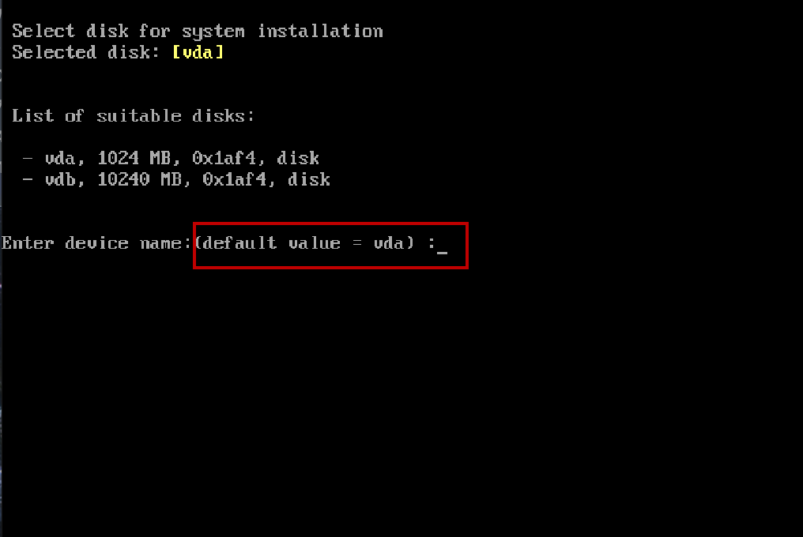<figcaption>
Выбор диска для установки системы
</figcaption></figure>

4. Подтвердите выбор: введите "y" с клавиатуры и нажмите Enter.

<figure>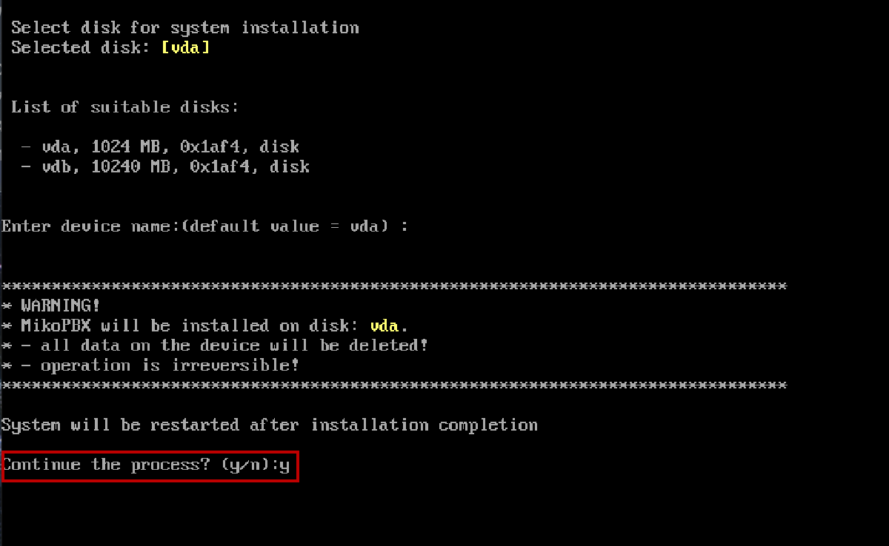<figcaption>
Подтверждение выбора диска
</figcaption></figure>

5. Далее выберите диск для хранения записей разговоров. В нашем случае единственный оставшийся размером 10 Гб.

<figure><figcaption>
Выбор диска для хранения записей разговоров
</figcaption></figure>

После этого система будет перезагружена и доступна в обычном режиме (надпись "<mark style="color:red;">PBX is running in Live or Recovery mode</mark>" пропадет).

<figure>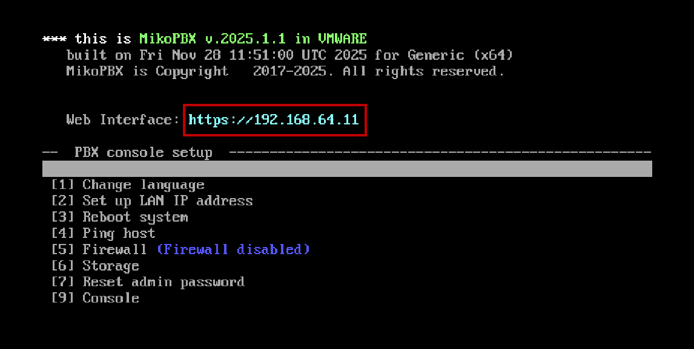<figcaption>
IP-адрес MikoPBX
</figcaption></figure>

Введите этот IP-адрес в строку браузера для перехода в Веб-интерфейс.

<figure>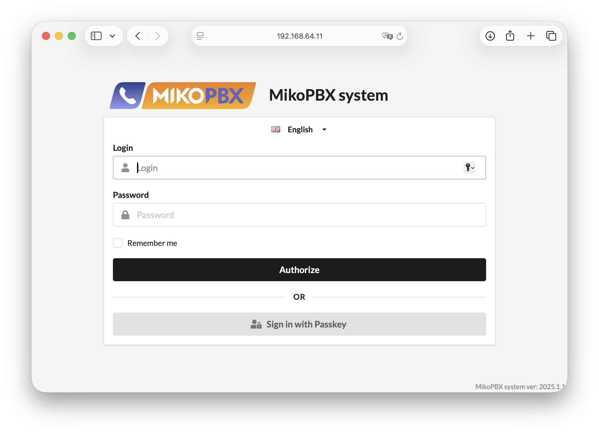<figcaption>
Web-интерфейс MikoPBX
</figcaption></figure>


Стандартные данные для входа:

* Login: admin
* Password: admin

