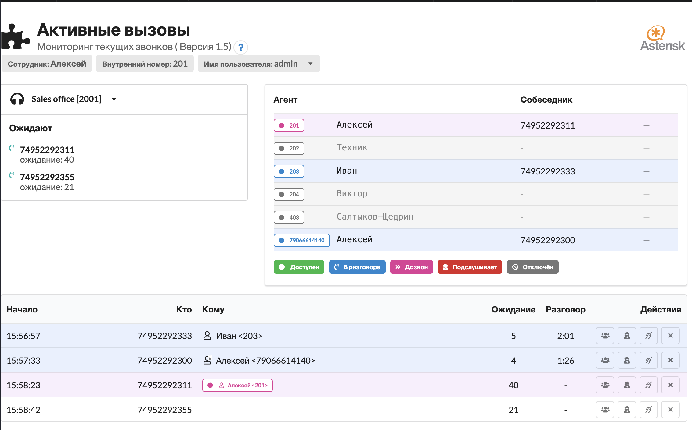
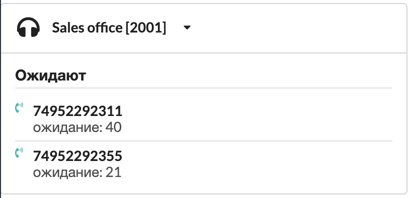
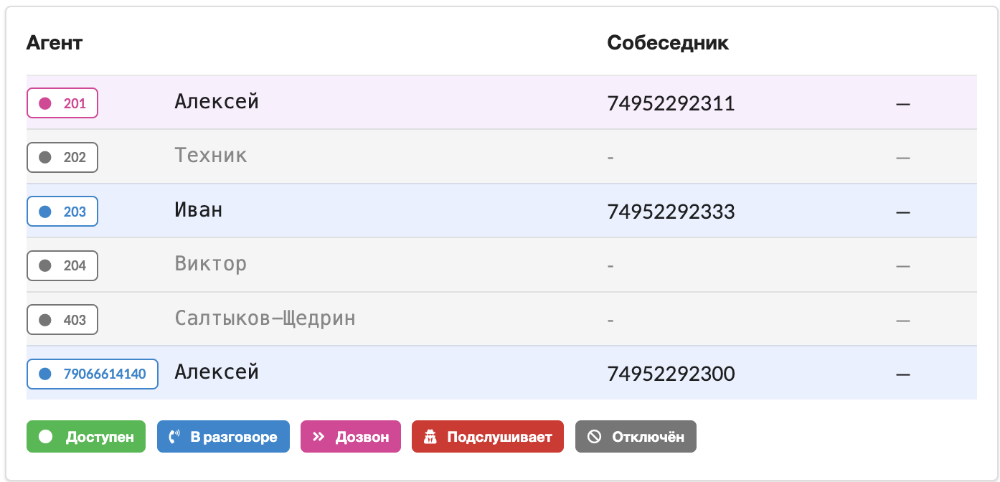
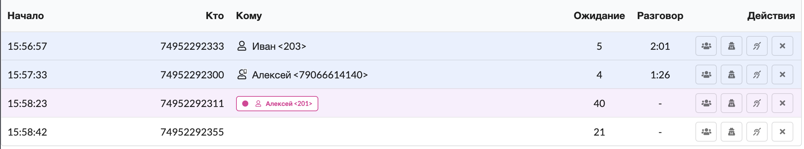

# Активные вызовы

### Основные возможности

* Отображает активные вызовы&#x20;
* Позволяет выполнить действия над активным звонком - подключиться к разговору/ завершить вызов
* Отображает состояние выбранной очереди

<figure><figcaption></figcaption></figure>

### Интерфейс модуля

#### Настройка текущего сотрудника

Модуль поддерживает работу в многопользовательском режиме, может работать в связке с модулем "[Управление доступом в систему](module-users-u-i.md)".

Если модуль запускается под ограниченными правами, то "`Сотрудник`" и "`Внутренний номер`" заполняются автоматически.

Если модуль открыт под правами администратора, то выбрать "`Сотрудника`" можно кликом по полю "`Имя пользователя`".&#x20;

От имени выбранного пользователя будут выполняться функции супервизора "`Подключиться к разговору`".&#x20;

<figure><figcaption></figcaption></figure>

#### Настройка отображаемой очереди

В левой колонке отображаются `вызовы в ожидании` - это вызовы, которые поступили в очередь и на которые пока не было ответа. Отображается номер телефона звонящего и время ожидания ответа:

<figure><figcaption></figcaption></figure>

Кликнув по заголовку можно выбрать для отображения другую очередь.&#x20;

В правой колонке отображается состояние сотрудников очереди:

<figure><figcaption></figcaption></figure>

В таблице доступна следующая информация:

* **`Внутренний номер`** сотрудника
* **`Имя`** сотрудника
* **`Собеседник`** - в этой колонке отображается собеседник, либо номер, с которым выполняется попытка&#x20;
* соединения
* Цветом подсвечивается статус сотрудника, описание статусов доступно в "легенде"

#### Все активные звонки

Все вызовы отображаются в отдельной таблице:

<figure><figcaption></figcaption></figure>

Цветом подсвечивается статус звонка. Одна строка отображает один звонок. В рамках одого звонка может быть множество активных каналов, связанных с сотрудником.&#x20;

Колонки:

* `Начало` - время начала звонка в формате `час:минуты:секунды`
* `Кто` - инициатор вызова
* `Кому` - вызываемый номер телефона
* `Ожидание` - длительность ожидания ответа в формате `час:минуты:секунды`
* `Разговор` - длительность разговора ответа в формате `час:минуты:секунды`

Действия:

* `Завершить` - завершает выбранны разговор
* &#x20;`Подслушать` - инициирует вызов с "`Внутреннего номера`"  текущего сотрудника. Вызов подключается к разговору. Сотрудник сможет слышать разговор, но его никто из собеседников слышать не будет.&#x20;
* `Шепнуть` - инициирует вызов с "`Внутреннего номера`"  текущего сотрудника. Вызов подключается к разговору. Сотрудник сможет слышать разговор и подсказывать коллеге, клиент его слышать не будет.&#x20;
* `Присоединиться` - инициирует вызов с "`Внутреннего номера`"  текущего сотрудника. Вызов подключается к разговору. Сотрудник сможет слышать разговор и полноценно участвовать в звонке.&#x20;
