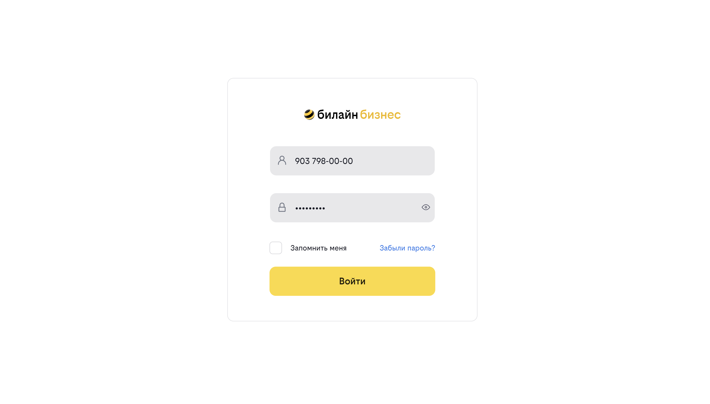
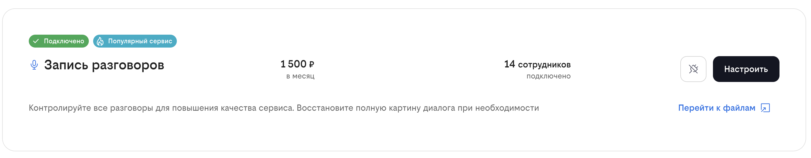
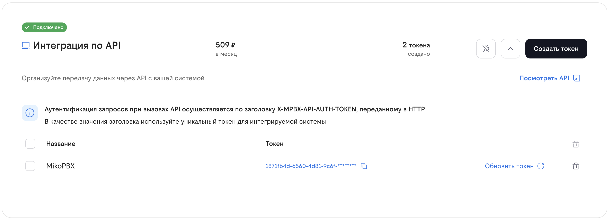
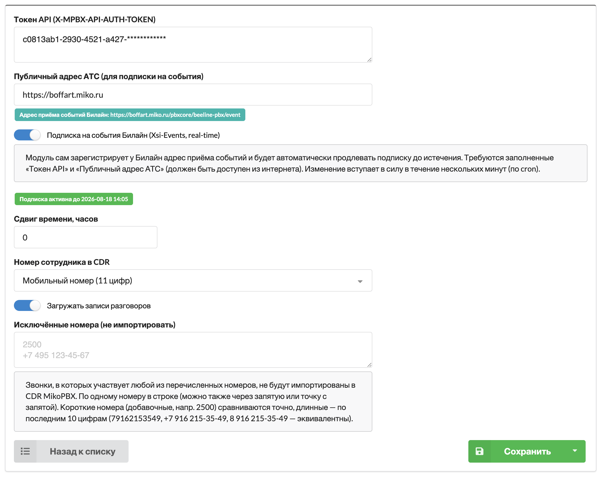

# Beeline Cloud PBX integration

The module automatically imports calls from Beeline Cloud PBX into the standard MikoPBX **Telephony → Call history** section. If call recording is enabled in Beeline, recordings will also be available from the MikoPBX call history.

The integration is read-only with respect to Beeline calls: it does not place or control calls in Beeline Cloud PBX.

### Who is this module for?

The module is intended for companies whose employees use Beeline mobile numbers or FMC SIM cards. It provides a consolidated call history and access to recordings in MikoPBX and can also import call history into 1C:Enterprise.

### Preparing Beeline Cloud PBX

Open the [Beeline Cloud PBX sign-in page](https://cloudpbx.beeline.ru/new/#/login) and sign in with an administrator account.

<figure><figcaption>Signing in to Beeline Cloud PBX</figcaption></figure>

#### Enabling call recording

In the services section, enable and configure **Запись разговоров** (Call recording) for each employee whose calls must be recorded.

<figure><figcaption>The Call recording service</figcaption></figure>


If the service is not enabled for an employee, their call history will still be imported, but no audio recordings will be available.


#### Obtaining an API token

1. In the services section, enable **Интеграция по API** (API integration).
2. Expand the service settings and click **Создать токен** (Create token).
3. Enter a descriptive name, such as `MikoPBX`.
4. Copy the generated token. You will need it in the MikoPBX module settings.

<figure><figcaption>Creating a REST API access token</figcaption></figure>


The API token grants access to your Cloud PBX data. Store it like a password and do not publish it.


### Configuring the MikoPBX module

Install and open **Beeline Cloud PBX integration** under **Modules → Module management**.

<figure><figcaption>Module settings (shown in Russian)</figcaption></figure>

Configure every option as follows:

* **API token (X-MPBX-API-AUTH-TOKEN)** — the token created under **API integration**. It is required for importing call history and recordings and for subscribing to events.
* **Public PBX address (for event subscription)** — the public HTTPS base URL of MikoPBX without an additional path, for example `https://pbx.example.com`. This field is only required for real-time call events. The address must be reachable from the internet. The module displays the resulting Beeline callback URL below the field.
* **Subscribe to Beeline events (Xsi-Events, real-time)** — registers the event callback and renews the subscription automatically. Enable it to send call states to **Telephony Panel 4.0 for 1C:Enterprise**. A valid API token, a public MikoPBX URL, and a configured Telephony Panel module are required. Activation can take several minutes after saving; the current state and expiration time are shown below the switch.
* **Time shift, hours** — compensates for a constant difference between timestamps in Beeline and MikoPBX. Start with `0` and change it only if imported calls consistently have the wrong time.
* **Employee number in CDR** — selects which employee number appears in call history: the internal extension or the 11-digit mobile number.
* **Download call recordings** — downloads audio for answered calls. The **Call recording** service must be enabled and configured in Beeline Cloud PBX.
* **Excluded numbers (do not import)** — calls involving any listed number are omitted from MikoPBX call history. Enter one number per line; commas and semicolons are also supported. Short extensions are matched exactly, while long numbers are matched by their last 10 digits. For example, `79162153549`, `+7 916 215-35-49`, and `8 916 215-35-49` are treated as the same number.

Click **Save**. New calls will start appearing in MikoPBX automatically. A recording may become available several minutes after the call ends.

### Importing call history into 1C:Enterprise

To import calls into **Telephony Panel 4.0 for 1C:Enterprise**, use `ЗагрузкаИсторииЗвонковBeelinePBX.epf`, which is included in the module archive.

1. Add the file to 1C:Enterprise as an external data processor.
2. Enter the MikoPBX server address in the processor settings.
3. Set the initial `offset` to `0` during the first setup.
4. Run the processor manually and confirm that call history is imported.
5. Configure a schedule that runs the processor automatically at an interval appropriate for your organization.


Install and configure **Telephony Panel 4.0 for 1C:Enterprise**, including its required published 1C web services, before configuring the external processor.


### Real-time call events in 1C:Enterprise

Scheduled history import through the EPF file and real-time call events are independent features. To receive call states in 1C:Enterprise without waiting for the next scheduled import:

1. Make sure **Telephony Panel 4.0 for 1C:Enterprise** is installed, enabled, and configured in MikoPBX.
2. Enter the public HTTPS address of MikoPBX.
3. Enable **Subscribe to Beeline events** and save the settings.
4. Wait until the module reports that the subscription is active.

The module matches a Beeline employee to a 1C:Enterprise user by mobile number. Make sure the mobile number is present in 1C:Enterprise and uniquely identifies that employee.
