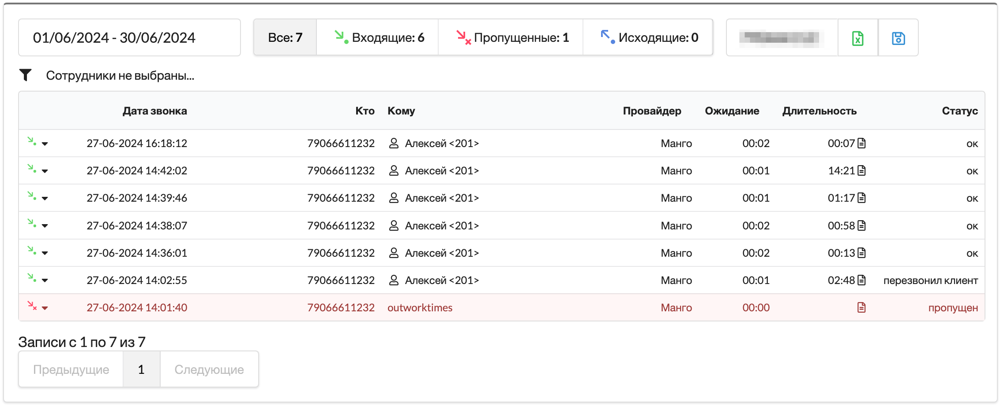
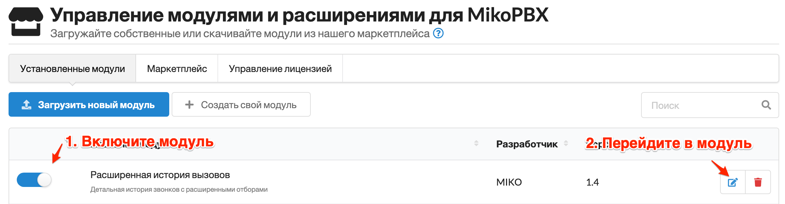

# Extended call history

### Purpose

* Display call history
* Filter call history by groups or employees
* Export call history for a selected period to Excel
* Display the line through which the call was made

<figure><figcaption></figcaption></figure>

### Module setup

1. Install the module from the Module Management section.
2. Enable the module and go to its page.

<figure><figcaption></figcaption></figure>


Once enabled, the module will create a new, optimized table in its own database and begin populating it based on the original call history table.\
This new table allows for high-speed queries without overloading the original call history database.\
This process takes some time—please wait until it completes.


### Licensing

To use the module, a license is required for the host where it will run.

You can purchase a license in our store.

The license key has the format MIKOUPD-00000-00000-00000-00000 and must be activated in the Module Marketplace → License Management section.

### Using the module

Filter panel

* Allows you to set a date range for filtering
* Shows the total number of calls for the selected period
* Quick filter buttons: Incoming, Missed, and Outgoing
* The Search field allows manual entry of a phone number for filtering
* Export to Excel button downloads data matching the current filters
* Save button saves the current filter settings, restoring them next time you open the page

#### Additional filter

* Filter by employee groups (from the Phone Group Management module)
* Filter by specific employees

#### Call table

Each row provides general call details: direction, start time, caller, and callee.

Call status can be one of the following:

* ok – successful call
* transfer – forwarded call
* missed – unanswered incoming call
* no answer – unanswered outgoing call
* client called back – successful incoming call after a missed one
* called back – successful outgoing call to a client after a missed one
* application – call to a dialplan application or service number

Clicking a number in the From or To columns sets a filter in the Search field.

Call Details (Transcript) displays more detailed information:

* Who missed the call
* Who answered the call
* Link to listen or download the recording
* Ring time duration
* Talk time duration
